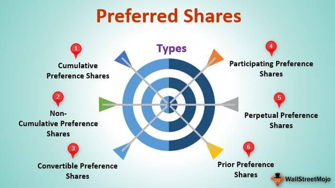

The world of investment offers a myriad of opportunities, with preferred stocks being one of them. Preferred stocks, also known as preference shares, combine features of both equity and debt, providing investors with unique benefits. Unlike common stocks, preferred stocks typically offer fixed dividend payments and have a higher claim on assets in the event of company liquidation, making them an attractive option for investors seeking a hybrid investment vehicle. Their dual nature allows investors to enjoy the benefit of receiving regular income from dividends while having potential upside tied to the equity markets.

In parallel, the advent of algorithmic trading has revolutionized the way investments are conducted. Algorithmic trading has harnessed advances in technology to execute trades with efficiency and precision, often utilizing complex mathematical models and high-speed computations. This method has dramatically increased market liquidity and introduced a new paradigm in investment strategies, impacting how trading decisions are made across various asset classes, including preferred stocks. Through algorithmic trading, investors can now optimize, automate, and refine trading strategies in ways that were not feasible with traditional trading methods, enhancing decision-making processes in today's dynamic financial markets.



This article seeks to explore the different types of preferred stocks and how algorithmic trading impacts investment strategies. By understanding these key components, investors can better navigate the evolving investment landscape and leverage the benefits of algorithmic processes in preferred stock investments.

## Table of Contents

## Understanding Preferred Stocks

Preferred stocks, a unique category of equity securities, are characterized by features that distinguish them from common stocks. Fundamentally, they represent a hybrid form of investment, embodying elements of both equity and debt instruments. One of the key defining attributes of preferred stocks is their provision of fixed dividend payments. These payments take precedence over dividends distributed to common stockholders. This preferential treatment makes them an attractive option for income-focused investors seeking stability in dividend income.

In addition to prioritized dividends, preferred stockholders hold superior claims over a company's assets compared to common shareholders if the company undergoes liquidation. This enhanced claim elevates the security of preferred stocks in scenarios where a company faces financial distress, thus providing investors with an added layer of protection.

However, preferred stocks typically come with a trade-off: limited or non-existent voting rights. Unlike common stockholders, who possess voting privileges and can influence corporate decisions, holders of preferred stocks often find themselves without such influence in matters of corporate governance. This diminished voting power could be a drawback for investors who prioritize active engagement in a company's strategic direction.

Overall, preferred stocks present a distinct investment avenue, offering a blend of fixed-income-like stability through dividends and equity-like traits through potential appreciation, albeit with constraints on shareholder influence.

## Types of Preferred Stocks

Preferred stocks can be categorized into several types, each offering distinct features that cater to different investment goals and risk appetites. These variations in preferred stocks primarily revolve around their dividend and conversion characteristics.

**Cumulative Preferred Stock**

Cumulative preferred stock is a type of preferred share where dividends are guaranteed, even if they are not declared in a particular year. If a company fails to pay the promised dividends, these unpaid dividends accumulate and must be paid out before any dividends can be distributed to common shareholders in the future. This feature provides a degree of protection for investors, ensuring that they receive their expected income over time.

**Non-Cumulative Preferred Stock**

In contrast, non-cumulative preferred stock does not come with this accumulation benefit. If a company chooses not to pay dividends in a given period, shareholders of non-cumulative preferred stocks do not have the right to claim these missed payments in the future. As such, these shares present a higher risk in terms of dividend income, though they might be preferable for companies aiming to maintain more flexible cash flows during financially challenging times.

**Participating Preferred Stock**

Participating preferred stock grants holders the opportunity to receive extra dividends beyond the fixed rate if the issuing company achieves certain profitability targets. Under typical circumstances, shareholders receive regular dividend payments, but if company profits surpass a specified threshold, participating shareholders may gain additional dividend income. This feature aligns investor interests with company success, providing potential upside corresponding with corporate performance.

**Convertible Preferred Stock**

Convertible preferred stock offers investors the option, but not the obligation, to convert their preferred shares into a predetermined number of common shares. This conversion might be advantageous if the company's common share price appreciates significantly, allowing investors to benefit from capital appreciation while initially enjoying the fixed dividend income common to preferred stocks. The conversion ratio is typically defined beforehand, allowing investors to calculate potential upside gains from converting their shares.

```python
# Example code to calculate potential gains from conversion
# Assuming one convertible preferred share can be converted to 'conversion_ratio' common shares
current_common_price = 50  # current price per common share
conversion_ratio = 1.2  # number of common shares per convertible preferred share
preferred_purchase_price = 45  # initial price paid per preferred share

# Calculate the market value of common shares after conversion
market_value_after_conversion = conversion_ratio * current_common_price

# Calculate potential gain from conversion
potential_gain = market_value_after_conversion - preferred_purchase_price
print("Potential Gain from Conversion:", potential_gain)
```

By understanding these different types of preferred stocks, investors can make informed decisions that align with their financial goals and risk tolerance, optimizing their investment portfolio accordingly.

## Algorithmic Trading and Its Role in Preferred Stocks Investment

Algorithmic trading, a modern approach to executing trades, relies on pre-defined algorithms to [carry](/wiki/carry-trading) out trade orders with remarkable speed and efficiency. This method has drastically transformed investment strategies by utilizing complex mathematical models and historical data analysis, providing traders with an edge in the financial markets.

The integration of [algorithmic trading](/wiki/algorithmic-trading) enhances [liquidity](/wiki/liquidity-risk-premium) in both common and preferred stock markets. By enabling rapid execution of trades, algorithms reduce the bid-ask spread and foster a more fluid market environment. This increased liquidity is particularly beneficial for preferred stocks, often characterized by lower trading volumes compared to common stocks. The enhanced market dynamics result in better price discovery and reduced transaction costs for investors.

For preferred stocks, algorithmic trading systems can leverage the fixed income-like nature of dividends to optimize entry and [exit](/wiki/exit-strategy) points. Algorithms can be programmed to consider factors such as dividend yield, call provisions, and [interest rate](/wiki/interest-rate-trading-strategies) outlooks, allowing for precise timing of trades to maximize returns. Algorithms can also incorporate technical indicators and statistical models to select optimal trade positions.

Risk management is another crucial aspect handled by algorithmic trading systems. Algorithms can automatically implement stop-loss and take-profit levels, minimizing potential losses and securing gains. For instance, a Python code snippet for a simple stop-loss mechanism might look like this:

```python
def stop_loss(current_price, stop_loss_price):
    if current_price <= stop_loss_price:
        execute_sell_order()

def take_profit(current_price, take_profit_price):
    if current_price >= take_profit_price:
        execute_sell_order()

# Example usage
current_price = 105
stop_loss_price = 95
take_profit_price = 110

stop_loss(current_price, stop_loss_price)
take_profit(current_price, take_profit_price)
```

This automated approach not only enhances efficiency but also aids in adhering to a disciplined trading strategy, thus reducing emotional bias and human error.

Overall, algorithmic trading serves as a powerful tool in preferred stock investments by boosting liquidity, optimizing trade decisions based on dividends, and implementing robust risk management protocols. These capabilities allow investors to handle complex market conditions with greater confidence and precision.

## Benefits and Drawbacks of Preferred Stocks

Preferred stocks offer several benefits, foremost among them stable income, achieved through fixed dividends. This feature is particularly attractive for risk-averse investors seeking predictable returns. The fixed dividend payments ensure that preferred shareholders receive their dividends before any are distributed to common shareholders, thus providing a reliable income stream. Additionally, in the event of a company's liquidation, preferred shareholders enjoy prioritization in claims over the company's assets before common shareholders. This aspect adds a layer of security to the investment, enhancing its appeal as a safer option compared to common stocks.

On the downside, preferred stocks come with certain drawbacks. A notable disadvantage is the limited voting rights typically afforded to preferred shareholders. Unlike common shareholders, they generally do not have the right to vote on corporate matters such as mergers or electing board members, limiting their influence on the company's governance and strategic direction. This can be a significant consideration for investors who prioritize having a say in company decisions.

Furthermore, the growth potential of preferred stocks might be capped. Unlike common stocks, which can provide substantial capital appreciation as the company's value increases, preferred stocks usually lack significant growth prospects. The nature of their fixed dividends means that they do not benefit directly from increases in a company’s profits beyond what might be specified in the terms of the preferred stock. Consequently, investors seeking significant capital gains might find preferred stocks less attractive compared to common stocks.

In summary, preferred stocks provide stability and reduced risk with predictable income and priority in asset claims, but at the cost of limited voting power and restrained growth potential. These attributes make them an optimal choice for certain investor profiles, especially those prioritizing income and security over control and high returns.

## Conclusion

Preferred stocks represent a distinctive category of securities, effectively merging the characteristics of both debt and equity. They offer investors a fixed dividend income, a feature commonly found in debt instruments, while providing some equity-like potential for capital gains, though typically less than common stocks. This hybrid nature makes them an appealing option for risk-averse investors seeking a stable income stream with lower [volatility](/wiki/volatility-trading-strategies) compared to common stocks.

Investing in preferred stocks necessitates a comprehensive understanding of the various types, such as cumulative, non-cumulative, participating, and convertible preferred stocks. Each type has specific characteristics that affect dividend payments, conversion options, and economic participation in the company's growth. Recognizing these distinctions is crucial in aligning investment choices with financial goals and risk tolerance.

Algorithmic trading has become an integral enhancement in the investment landscape, offering increased efficiency and precision in executing trades. By leveraging complex algorithms, investors are able to capitalize on optimal entry and exit points, thus maximizing the income potential inherent in preferred stocks. Algorithms also support risk management strategies through automated stop-loss and take-profit triggers, providing additional protective measures for investors.

As technology continues to advance, innovations in trading systems perpetually transform investment strategies. These developments introduce new opportunities and challenges, necessitating continuous learning and adaptation among investors. The confluence of preferred stocks' stable income features and algorithmic trading's operational efficiencies presents a synergistic approach that can optimize investment portfolios in an ever-evolving financial market.

## References & Further Reading

[1]: ["Preferred Stock Investing"](https://www.investopedia.com/terms/p/preferredstock.asp) by Doug K. Le Du

[2]: Pace, J. M. (2012). ["Preferred Stock: A Beginner's Guide"](https://www.heartrhythmjournal.com/article/S1547-5271(19)30573-9/fulltext) 

[3]: Fabozzi, Frank J. (2008). ["Handbook of Finance, Financial Markets and Instruments"](https://archive.org/details/handbookoffinanc0003unse) Wiley & Sons.

[4]: Chincarini, Ludwig B., and Kim, Daehwan. (2006). ["Quantitative Equity Portfolio Management: An Active Approach to Portfolio Construction and Management"](https://www.amazon.com/Quantitative-Equity-Portfolio-Management-Construction/dp/0071459391) 

[5]: Hackel, Kenneth S., Livnat, Joshua, & Rai, Atul. (2000). ["A Preference for Preferreds: The Blank Slate"](https://journals.sagepub.com/doi/10.1177/0148558X0001500101) Financial Analysts Journal, 56(5), 50-60.

[6]: ["Algorithmic and High-Frequency Trading Books Collection"](https://www.cambridge.org/us/universitypress/subjects/mathematics/mathematical-finance/algorithmic-and-high-frequency-trading?format=HB&isbn=9781107091146) QuantInsti.

[7]: Aldridge, Irene. (2010). ["High-Frequency Trading: A Practical Guide to Algorithmic Strategies and Trading Systems"](https://www.ahmetbeyefendi.com/wp-content/uploads/2020/07/High-Frequency-Trading-Irene-Aldridge.pdf)