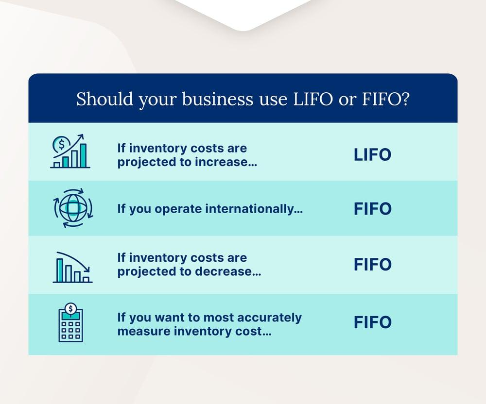

## Table of Contents

## What is FIFO accounting?

FIFO accounting, which stands for "First In, First Out," is a method used to keep track of inventory costs. It assumes that the first items added to inventory are the first ones to be sold. This means that the cost of the oldest inventory is used to calculate the cost of goods sold on the income statement. For example, if you bought 10 items at $10 each and then another 10 at $12 each, when you sell 10 items, you would use the cost of the first 10 items ($10 each) to calculate the cost of goods sold.

Using FIFO can be helpful during times when prices are rising because it results in a lower cost of goods sold, which can lead to higher reported profits. This is because you are selling the older, cheaper inventory first. However, it also means that the remaining inventory on the balance sheet will be valued at the higher, more recent prices. This method is popular because it often reflects the actual flow of goods in many businesses and can provide a more accurate picture of profit during periods of inflation.

## What is LIFO accounting?

LIFO accounting, which stands for "Last In, First Out," is another way to keep track of inventory costs. It's the opposite of FIFO. With LIFO, you assume that the last items you added to your inventory are the first ones you sell. So, when you need to figure out the cost of goods sold, you use the price of the newest items in your inventory. For example, if you bought 10 items at $10 each and then another 10 at $12 each, when you sell 10 items, you would use the cost of the last 10 items ($12 each) to calculate the cost of goods sold.

Using LIFO can be helpful when prices are going up because it results in a higher cost of goods sold, which can lead to lower reported profits. This is because you're selling the newer, more expensive inventory first. However, it also means that the remaining inventory on your balance sheet will be valued at the older, lower prices. LIFO is less common than FIFO in many countries because it can make profits look lower during times of inflation, but it's still used in some places, especially in the United States.

## How do FIFO and LIFO affect the cost of goods sold?

FIFO and LIFO affect the cost of goods sold in opposite ways. With FIFO, you use the cost of the oldest items in your inventory to figure out the cost of goods sold. If prices are going up, this means you're selling the cheaper items first, so your cost of goods sold will be lower. This can make your profits look higher because you're not counting the newer, more expensive items as sold yet.

On the other hand, with LIFO, you use the cost of the newest items in your inventory to figure out the cost of goods sold. If prices are going up, this means you're selling the more expensive items first, so your cost of goods sold will be higher. This can make your profits look lower because you're counting the newer, more expensive items as sold first. So, FIFO usually leads to a lower cost of goods sold and higher profits during inflation, while LIFO leads to a higher cost of goods sold and lower profits.

## What are the main differences between FIFO and LIFO?

FIFO and LIFO are two different ways to keep track of inventory costs. FIFO stands for "First In, First Out," which means you sell the oldest items in your inventory first. LIFO stands for "Last In, First Out," which means you sell the newest items first. When prices are going up, FIFO makes the cost of goods sold lower because you're selling the older, cheaper items first. LIFO makes the cost of goods sold higher because you're selling the newer, more expensive items first.

These methods can affect how much profit you report. With FIFO, your profits might look higher because the cost of goods sold is lower. This is good when prices are rising because it shows more profit. With LIFO, your profits might look lower because the cost of goods sold is higher. This can be helpful for tax purposes because lower profits mean you pay less in taxes. But, LIFO is not allowed in some countries, like many in Europe, so companies there have to use FIFO or another method.

Both methods have their uses, but they can also change how your business looks on paper. FIFO is more common because it often matches the actual flow of goods and can give a clearer picture of profit during inflation. LIFO is used more in the United States, where it's allowed, and can be useful for businesses that want to show lower profits and pay less in taxes. Choosing between FIFO and LIFO depends on your business needs and the rules in your country.

## Why might a company choose FIFO over LIFO?

A company might choose FIFO over LIFO because it often matches how goods actually move in and out of a business. When you use FIFO, you assume that the first items you buy are the first ones you sell. This makes sense for many businesses, like grocery stores or car dealerships, where older items need to be sold before they go bad or become outdated. Using FIFO can also make it easier to keep track of inventory and can give a clearer picture of how much profit the business is making, especially when prices are going up.

Another reason a company might choose FIFO is that it can show higher profits when prices are rising. With FIFO, the cost of goods sold is lower because you're selling the older, cheaper items first. This means the profit on the income statement looks bigger. Also, FIFO is required in many countries, like those in the European Union, where LIFO isn't allowed. So, if a company wants to do business in these places, they have to use FIFO. It's a simpler and more straightforward method that can help a business look better on paper and stay within the rules.

## Why might a company choose LIFO over FIFO?

A company might choose LIFO over FIFO because it can help them pay less in taxes when prices are going up. With LIFO, the cost of goods sold is higher because you're selling the newer, more expensive items first. This makes the profit on the income statement look smaller. When profits are lower, the company has to pay less in taxes. This can be a big help for businesses that want to keep more of their money, especially in the United States where LIFO is allowed.

Another reason a company might choose LIFO is to match the current cost of goods with the current revenue. This can give a more accurate picture of how the business is doing right now. For example, if the cost of materials is going up, using LIFO means the cost of goods sold will be closer to what the company is paying for those materials now. This can be important for businesses that want to show how inflation is affecting their costs and profits.

## What is U.S. GAAP and how does it relate to inventory accounting methods?

U.S. GAAP, which stands for Generally Accepted Accounting Principles, is a set of rules that companies in the United States have to follow when they keep their financial records. These rules make sure that everyone is doing their accounting the same way, so it's easier to compare different companies. U.S. GAAP covers a lot of things, including how companies should keep track of their inventory.

When it comes to inventory, U.S. GAAP lets companies choose between different methods like FIFO (First In, First Out) and LIFO (Last In, First Out). FIFO means you sell the oldest items in your inventory first, while LIFO means you sell the newest items first. U.S. GAAP allows both methods, but companies have to stick with the one they choose and use it consistently. This helps make sure the financial statements are fair and accurate. But, if a company uses LIFO, they also have to show what their inventory would look like if they used FIFO, in a note to their financial statements. This is called the LIFO reserve, and it helps people see how using LIFO changes the company's reported profits and inventory value.

## Under U.S. GAAP, are there any restrictions on using FIFO or LIFO?

Under U.S. GAAP, companies can choose to use either FIFO or LIFO for their inventory accounting, but they have to stick with the method they pick. Once a company chooses FIFO or LIFO, it needs to keep using that method every year. This rule helps make sure the financial reports are consistent and easy to understand. If a company wants to switch from one method to another, it has to explain why and show how the change affects their financial statements.

If a company decides to use LIFO, there's an extra rule they need to follow. They have to show what their inventory would look like if they used FIFO instead. This is called the LIFO reserve. It's important because it helps people see how using LIFO changes the company's reported profits and inventory value. Even though LIFO is allowed under U.S. GAAP, it's not allowed in some other countries, like those in the European Union, so companies that do business there might have to use FIFO.

## How does the choice between FIFO and LIFO impact financial statements under U.S. GAAP?

The choice between FIFO and LIFO can make a big difference in a company's financial statements under U.S. GAAP. If a company uses FIFO, it means they are selling the oldest items in their inventory first. When prices are going up, this leads to a lower cost of goods sold because the older items were cheaper. This makes the company's profits look higher on the income statement. On the other hand, the inventory on the balance sheet will be valued at the newer, higher prices, making it look more valuable.

If a company uses LIFO, they are selling the newest items first. When prices are going up, this leads to a higher cost of goods sold because the newer items are more expensive. This makes the company's profits look lower on the income statement. However, the inventory on the balance sheet will be valued at the older, lower prices, making it look less valuable. Companies using LIFO also have to show what their inventory would look like if they used FIFO, called the LIFO reserve, to help people understand the impact of their choice.

## What are the tax implications of using FIFO versus LIFO under U.S. GAAP?

Using FIFO or LIFO can affect how much a company pays in taxes. With FIFO, the cost of goods sold is lower because you're selling the older, cheaper items first. This means your profits look higher, and when your profits are higher, you have to pay more in taxes. So, using FIFO can mean paying more taxes, especially when prices are going up.

On the other hand, with LIFO, the cost of goods sold is higher because you're selling the newer, more expensive items first. This makes your profits look lower, and when your profits are lower, you pay less in taxes. So, using LIFO can help a company save on taxes, especially in the United States where LIFO is allowed. This can be a big reason why some companies choose LIFO, even though it might make their financial statements look less profitable.

## How do international accounting standards differ from U.S. GAAP regarding FIFO and LIFO?

International accounting standards, known as IFRS (International Financial Reporting Standards), are different from U.S. GAAP when it comes to using FIFO and LIFO. Under IFRS, companies can use FIFO or another method called the weighted average cost method, but they are not allowed to use LIFO. This means that if a company wants to follow IFRS, they have to use FIFO or the weighted average cost method to keep track of their inventory costs. This rule helps make sure that financial statements from different countries are easier to compare because everyone is using the same methods.

The main reason IFRS doesn't allow LIFO is because it can make profits look lower during times when prices are going up. Many people think that using LIFO doesn't give a good picture of how much a company is really worth. By not allowing LIFO, IFRS tries to make sure that companies show their profits and inventory values in a way that's more fair and clear. This can be important for businesses that work in many different countries, because they have to follow the same rules everywhere.

## What are some advanced strategies for managing inventory under U.S. GAAP using FIFO or LIFO?

One advanced strategy for managing inventory under U.S. GAAP using FIFO or LIFO is to carefully time your purchases and sales. If you use FIFO and expect prices to keep going up, you might want to buy more inventory now. This way, when you sell it later, you'll still be selling the older, cheaper items first, which keeps your cost of goods sold low and your profits high. If you use LIFO and prices are going up, you might want to buy just enough to cover your sales. This way, you're always selling the newer, more expensive items, which keeps your cost of goods sold high and your taxes low. By thinking about when to buy and sell, you can make the most of the method you choose.

Another strategy is to keep a close eye on your inventory levels and adjust your method if it makes sense. Under U.S. GAAP, you can switch from FIFO to LIFO or the other way around, but you have to explain why and show how it changes your financial statements. If you think switching methods will help your business, you might want to do it. For example, if you've been using FIFO but now prices are really high and you want to lower your taxes, switching to LIFO could help. Or if you've been using LIFO but want to show higher profits to get a loan, switching to FIFO might be better. By staying flexible and understanding how FIFO and LIFO work, you can manage your inventory in a way that helps your business grow.

## What is the understanding of LIFO and FIFO in U.S. GAAP?

Under U.S. Generally Accepted Accounting Principles (U.S. GAAP), businesses have the flexibility to choose between the First-In, First-Out (FIFO) and Last-In, First-Out (LIFO) methods for accounting inventory. Each method carries distinct assumptions and consequences on a company's financial reporting, particularly affecting the cost of goods sold (COGS) and ultimately influencing taxable income.

The FIFO method operates under the assumption that the earliest goods purchased are the first to be sold. This approach generally results in a lower cost of goods sold during periods of rising prices, as older, lower-cost inventory is matched against current revenues. Consequently, this produces a higher ending inventory value on the balance sheet and can lead to increased taxable income. The formula for calculating COGS using FIFO can be expressed as:

$$
\text{COGS}_{\text{FIFO}} = \sum_{k=1}^{n} \text{cost of item}_k - \text{cost of ending inventory}
$$

Conversely, the LIFO method assumes that the most recently acquired goods are sold first. In an inflationary environment, this results in a higher cost of goods sold because the latest, more expensive inventory costs are recorded against revenue. This method often leads to reduced taxable income, presenting potential tax benefits. The corresponding formula for LIFO can be outlined as:

$$
\text{COGS}_{\text{LIFO}} = \sum_{k=1}^{n} \text{cost of item}_k_{\text{(recent)}} - \text{cost of ending inventory}
$$

Both methods significantly impact the financial statements. The choice between FIFO and LIFO affects an organization's profitability, tax obligations, and financial metrics such as gross profit and net income. While FIFO may inflate reported profits due to lower COGS, LIFO can help manage cash flows by reducing tax liabilities in specific economic conditions. These implications underscore the importance of selecting an appropriate inventory accounting method aligned with a company's strategic financial objectives and regulatory environment.

## References & Further Reading

[1]: ["Accounting for Inventory"](https://www.accountingtools.com/articles/accounting-for-inventory.html) (FASB Accounting Standards Codification)

[2]: ["Financial Accounting Standards Board (FASB) - LIFO Vs. FIFO"](https://accountinginsights.org/fifo-vs-lifo-accounting-methods-and-their-impacts/)

[3]: ["Algorithmic Trading and DMA"](https://www.amazon.com/Algorithmic-Trading-DMA-introduction-strategies/dp/0956399207) by Barry Johnson

[4]: ["U.S. Generally Accepted Accounting Principles (GAAP)"](https://en.wikipedia.org/wiki/Generally_Accepted_Accounting_Principles_(United_States)) - IFRS Foundation

[5]: ["Automating the Alpha: Algorithmic Trading and Artificial Intelligence"](https://www.researchgate.net/publication/378548435_Algorithmic_Trading_and_AI_A_Review_of_Strategies_and_Market_Impact) by Igor Tulchinsky

[6]: ["Inventory Valuation and Management"](https://www.zoho.com/inventory/academy/inventory-management/inventory-valuation-methods-fifo-lifo-wac.html) by William C. Hu

[7]: ["Python for Data Analysis"](https://wesmckinney.com/book/) by Wes McKinney