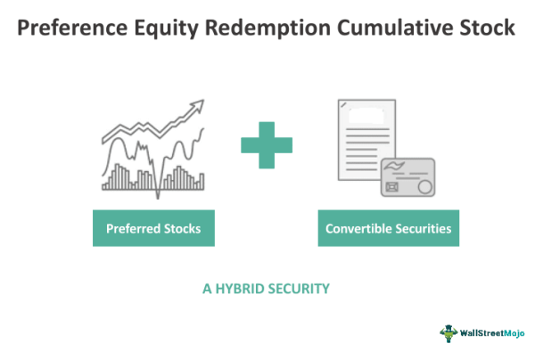

Preference Equity Redemption Cumulative Stock (PERCS) is a complex financial instrument designed to offer investors enhanced dividends alongside certain conversion features. It embodies a hybrid form of investment, blending characteristics of both equity and fixed income securities. At its core, PERCS is a type of preferred stock that, unlike standard shares, provides cumulative dividends which accrue over time and are prioritized over common stock dividends in the distribution process. The "redemption" aspect refers to the issuer's obligation or ability to buy back the stock from the investors after a specific period or under predetermined conditions.

In algorithmic trading, PERCS present unique opportunities and challenges. Algorithmic trading, which utilizes computer programs to execute trades at speeds and frequencies untenable for human traders, can exploit specific features of PERCS, such as their capped price and conversion potential. By integrating PERCS into their models, algorithmic traders aim to maximize returns while minimizing risks through precision timing. For instance, the conversion feature latent in PERCS enables algorithms to anticipate conversion opportunities, optimizing buying and selling decisions without human intervention.



Key financial terms encompass "equity," referring to ownership shares in a company, which confer residual claims to assets upon dissolution; "redemption," denoting the process by which an issuer repurchases its securities; and "cumulative stocks," a category of preferred stock where missed dividend payments accumulate and must be paid prior to common stock dividends. Understanding these terms is crucial to grasping the financial innovation behind PERCS.

This article intends to explore the concept of PERCS, explaining its foundational properties and how it fits within modern trading paradigms. By analyzing how algorithmic trading strategies incorporate PERCS, it aims to illuminate the nuances of these securities, providing insights into their potential within diversified investment approaches.

## Table of Contents

## Understanding PERCS

Preference Equity Redemption Cumulative Stock (PERCS) represents a type of financial instrument that blends characteristics of both equity and fixed income securities. Essentially, PERCS are hybrid securities that provide the holder the potential for an enhanced dividend yield compared to regular equity, while also containing mechanisms for conversion into common stock at a predetermined date.

PERCS are issued by companies as a means to raise capital while offering investors a unique instrument that is less risky than traditional stocks but still offers equity-like benefits. One of the defining characteristics of PERCS is their mandatory conversion feature. At maturity, these instruments are automatically converted into a predetermined number of common shares of the issuing company. This conversion provides the potential for equity appreciation, albeit typically capped, which brings us to another important feature of PERCS—the capped price.

The capped price is a predefined maximum value at which the PERCS can be converted into common stock. If the market price of the common stock exceeds this cap at conversion time, the holder will not benefit from the appreciation beyond the capped price. This feature effectively limits the upside potential for investors. Mathematically, if $S_T$ is the market price of the stock at time $T$, and $C$ is the capped price, then the value of the shares upon conversion is typically:

$$
\text{Value} = \min(S_T, C) \times \text{Conversion Ratio}
$$

Moreover, PERCS distinguish themselves with cumulative dividends. This means that if the company decides not to pay dividends at any point, it accumulates the amount, and arrears are settled when dividends are resumed, offering a form of security for investors seeking income.

To summarize, PERCS are a distinct financial instrument that caters to the need for income with potential equity conversion, featuring enhanced dividends and a cap on upside potential. This balance of fixed income-like assured returns and equity-like growth prospects makes PERCS a compelling choice for specific investor profiles.

## Characteristics of PERCS

Preference Equity Redemption Cumulative Stock (PERCS) is an investment instrument designed to offer unique characteristics to investors. One primary feature of PERCS is convertibility. Upon reaching certain conditions, holders can convert PERCS into a predetermined number of common shares. This conversion ability makes PERCS a hybrid security — part equity, part fixed income — providing investors with flexible outcomes based on market conditions.

Another defining characteristic of PERCS is their enhanced dividend payments. Issuers typically offer higher dividend yields compared to traditional common stocks. This increase in yield serves as compensation for the capped appreciation potential. Enhanced dividends attract investors looking for regular income streams, akin to high-yield bonds, while retaining some equity exposure.

PERCS generally come with capped prices, limiting the maximum return investors can achieve upon conversion or redemption. The cap is predetermined and expressed as a price ceiling. For instance, if the cap is set at $50 and the stock exceeds this value, investors will not benefit from additional appreciation. This feature makes PERCS akin to covered call options, where the premium income is exchanged for a limitation on upside potential. 

Investors might find PERCS appealing due to these features. The convertibility and enhanced dividends offer a balanced risk-return ratio, attracting those seeking regular income with a safety net of equity participation. However, the capped price remains a crucial consideration, providing limited upside beyond the set threshold. This structure suits investors with a conservative risk profile, prioritizing income over potential capital gains.

Moreover, the structure of PERCS reflects a strategic design similar to options trading, particularly covered call strategies. A covered call involves holding a long position in an asset and selling call options on that same asset. The income from selling options provides an immediate return, while the obligation caps potential profits if the asset’s value exceeds the strike price. Similarly, PERCS enhance dividends while setting a cap on capital appreciation, leading to stable but restricted performance outcomes.

In conclusion, the unique blend of convertibility, enhanced dividends, and capped price features make PERCS an attractive option for specific investor segments. The combination mirrors covered call options, offering regular income and structured risk exposure, but with capped growth in value. Understanding these characteristics helps investors assess the suitability of PERCS in their portfolios, balancing income generation and potential capital appreciation.

## Algorithmic Trading with PERCS

Algorithmic trading strategies serve as powerful tools by automating the execution of trades through pre-defined instructions, often harnessing the computational power of computers to optimize trading outcomes. Preference Equity Redemption Cumulative Stocks (PERCS) can be integrated into these systems due to their distinct features, providing unique opportunities for algorithmic traders to exploit.

**Leveraging PERCS in Algorithmic Trading**

The distinctive features of PERCS—convertibility into common equity, enhanced dividends, and capped price—make them suitable candidates for [algorithmic trading](/wiki/algorithmic-trading). One significant aspect of PERCS is their hybrid nature, combining elements of both equity and fixed income securities. This allows algorithmic strategies to design trades that capitalize on these hybrid characteristics, such as capturing dividend payouts while maintaining the potential for equity conversion.

Algorithmic trading systems can utilize the conversion feature of PERCS within [arbitrage](/wiki/arbitrage) strategies. The opportunity to convert PERCS into common shares is a key element for algorithms that seek to exploit price discrepancies between PERCS and their underlying stocks. If the market misprices PERCS relative to their conversion value, trading algorithms can identify and execute arbitrage trades to secure risk-free profits.

**Role of PERCS in Automated Trading Systems**

PERCS can play a significant role in diversified automated trading systems that require dynamic management of risk and reward. Automated systems can continuously analyze market data, performing real-time calculations to ascertain optimal entry and [exit](/wiki/exit-strategy) points based on PERCS' pricing models. Algorithms can dynamically adjust positions in response to changes in the dividend yields or impending conversion thresholds, ensuring maximum value extraction.

Moreover, PERCS' capped price feature, which limits the maximum return achievable at maturity, introduces a risk control mechanism for trading systems. This capped price can be strategically utilized as part of a hedging strategy. For instance, algorithms can construct synthetic positions with PERCS to lock in returns or limit potential losses, aligning with broader portfolio objectives.

**Algorithm-Driven Trading of PERCS**

To trade PERCS effectively using algorithms, traders can implement strategies like [statistical arbitrage](/wiki/statistical-arbitrage), mean reversion, and [machine learning](/wiki/machine-learning)-based prediction models. Statistical arbitrage involves capitalizing on statistical mispricing in PERCS and related securities, whereas mean reversion strategies exploit the tendency of PERCS prices to revert to their historical means.

Implementing a Python-based algorithm for trading PERCS might involve the following steps:

```python
import numpy as np
import pandas as pd

# Example pseudocode for a mean reversion strategy
def mean_reversion_signal(percs_price, lookback_period):
    # Calculate moving averages
    moving_avg = percs_price.rolling(window=lookback_period).mean()
    std_dev = percs_price.rolling(window=lookback_period).std()

    # Generate signal (1 = buy/sell, 0 = hold)
    z_score = (percs_price - moving_avg) / std_dev
    return np.where(z_score <= -1.0, 1, np.where(z_score >= 1.0, -1, 0))

# Example market data with PERCS prices
market_data = pd.DataFrame({
    'PERCS_Price': [10, 10.2, 9.8, 10.5, 10.1, 10.9, 9.7, 10.3, 10]
})
signals = mean_reversion_signal(market_data['PERCS_Price'], lookback_period=3)
print(signals)
```

This pseudocode illustrates a basic mean reversion strategy where the algorithm identifies periods when PERCS are undervalued or overvalued relative to their historical averages, suggesting buying or selling actions accordingly.

In conclusion, algorithmic trading with PERCS provides a sophisticated approach for traders seeking to leverage their unique features within automated systems. By tailoring algorithms to exploit the nuances of PERCS, traders can enhance strategy performance and optimize risk-adjusted returns.

## Example Scenarios

Preference Equity Redemption Cumulative Stock (PERCS) can provide significant value to investors by offering enhanced dividends and conversion options while also positing investment limitations like capped stock prices. To better illustrate the potential outcomes of investing in PERCS, we can explore a series of scenarios that demonstrate how varying stock prices at maturity can affect these financial instruments.

### Illustrative Example: Varying Stock Prices at Maturity

Consider an investor who holds PERCS with the following characteristics:
- Face value: $100
- Annual dividend yield: 8%
- Maturity in 2 years
- Conversion into common stock at a capped price of $120

**Scenario 1: Stock Price Below Face Value at Maturity**
If at maturity, the common stock price is $90, the investor benefits as follows:
- The conversion is not exercised because the stock price is lower than the face value. 
- The investor receives enhanced dividends totaling $16 ($8 annually for 2 years).
- The total return is less optimal, limited to dividends because the PECRS are not converted.

**Scenario 2: Stock Price Equal to Capped Price at Maturity**
Suppose the stock price is $120 at maturity:
- Conversion is exercised, and the investor can convert their PERCS to common stock at $120.
- The investor receives enhanced dividends totaling $16 ($8 annually for 2 years).
- The investor realizes the capped total stock value increase to $120 plus dividends, maximizing potential returns under the PERCS' constraints.

**Scenario 3: Stock Price Exceeds Capped Price at Maturity**
If the stock price reaches $150 at maturity:
- The conversion is exercised at the capped price of $120, limiting the conversion benefit.
- The enhanced dividends totaling $16 are still received.
- Despite a higher market price, the investor effectively caps their stock's value at $120, missing potential appreciation above the cap but benefiting from stable gain and dividend income over the term.

### Case Study: Enhanced Dividends Compared to Regular Stocks

To compare how PERCS might deliver enhanced dividends relative to regular stocks, analyze an equivalent investment in common stock:
- Investment amount in common stock: $100
- Dividend yield of common stock: 3%

Over the same 2-year period, the dividends from common stock would be $3 per annum, totaling $6. With PERCS, the investor receives significantly higher dividends of $16, demonstrating an attractive advantage in stable dividend generation despite the capped upside potential.

In all scenarios, PERCS offer a strategic blend of high dividends and protective features against stock price decline, albeit with a trade-off of limited upside participation. Investors can use these calculations to assess the appropriateness of PERCS in their investment strategies, particularly when a balance of income and reduced [volatility](/wiki/volatility-trading-strategies) is desired.

## Synthetic PERCS

Synthetic Preference Equity Redemption Cumulative Stock (PERCS) are financial instruments designed to mirror the characteristics of traditional PERCS, leveraging the use of derivatives and structured products. Their creation stems from a desire to replicate the desirable features of traditional PERCS, such as enhanced dividends and conversion options, while potentially offering alternative risk profiles and flexibility.

### Construction of Synthetic PERCS

Synthetic PERCS are typically constructed using a combination of options, futures, and other derivative contracts. By strategically combining these instruments, financial engineers can replicate the payoff structure of traditional PERCS. For instance, a synthetic PERCS might be created by coupling a long position in the underlying stock with an options strategy that mimics the capped price and conversion features of a traditional PERCS.

A basic example involves using call options to replicate the capped return feature. Suppose an investor owns a stock and sells a call option with a strike price equal to the cap of a traditional PERCS. This setup limits the upside potential, similar to the capped price in traditional PERCS, while the investor can still earn dividends from the underlying stock.

```python
import numpy as np

# Example parameters for a synthetic PERCS
stock_price = 100  # Current price of the underlying stock
strike_price = 120  # Strike price of the call option (cap for synthetic PERCS)
premium_received = 5  # Premium received from selling the option

# Payoff calculation for the synthetic PERCS at different stock prices
def payoff(stock_prices):
    intrinsic_value = np.maximum(stock_prices - strike_price, 0)
    return np.minimum(stock_prices, strike_price) + premium_received - intrinsic_value

stock_prices = np.array([80, 100, 120, 140, 160])
payoffs = payoff(stock_prices)

for sp, payoff in zip(stock_prices, payoffs):
    print(f'Stock Price: {sp}, Synthetic PERCS Payoff: {payoff}')
```

### Replicating Traditional Features

Synthetic PERCS aim to replicate traditional features by providing investors with similar cash flow patterns and risk exposures. The use of derivatives can enhance dividend yields through strategies that include the periodic collection of option premiums. By selling options, such as covered calls, investors can simulate the dividend-like payments of traditional PERCS.

### Advantages of Synthetic PERCS

One of the primary advantages of synthetic PERCS is their flexibility and customization. Investors can tailor these instruments to fit specific risk and return preferences by adjusting the parameters of the options and underlying assets used. This customization can potentially offer a more favorable risk-return profile compared to traditional PERCS.

Moreover, synthetic PERCS can provide enhanced [liquidity](/wiki/liquidity-risk-premium) compared to some traditional instruments, as they rely on more commonly traded derivatives rather than potentially less liquid underlying stocks.

### Differences in Risk Profiles

Synthetic PERCS inherently [carry](/wiki/carry-trading) different risks compared to traditional PERCS. While they can replicate many desirable features, the reliance on derivatives introduces additional risks such as counterparty risk and the need for active management to adjust positions according to market conditions. Additionally, pricing and execution complexities may arise due to the nature of the derivatives market.

In conclusion, synthetic PERCS offer a promising avenue for replicating the benefits of traditional PERCS with added flexibility, albeit with distinct risks that investors must carefully consider. These instruments provide an innovative way to align investment strategies with specific financial goals, particularly for those leveraging algorithmic and structured investment approaches.

## Benefits and Limitations of PERCS

Equity Redemption Cumulative Stock (PERCS) brings a unique set of advantages and challenges to investors, making them a distinctive investment option in the financial market. Understanding these benefits and limitations is crucial for investors looking to optimize their investment strategies.

### Advantages of Investing in PERCS

**1. Dividend Yield:**
PERCS typically offer enhanced dividend yields compared to regular common stocks. This feature makes them attractive to income-focused investors seeking a stable income stream. The dividends paid on PERCS can provide a higher yield due to the cumulative nature, ensuring that missed dividend payments are accumulated and paid out in the future.

**2. Conversion Options:**
One of the most significant features of PERCS is the conversion option. At maturity, these securities can be converted into a predetermined number of common stocks. This feature provides investors a pathway to potentially benefit from the equity appreciation, making them a hybrid tool that combines the features of both fixed-income and equity securities.

**3. Customization:**
PERCS can be tailored to fit specific investment strategies by adjusting factors like dividend rates and conversion ratios. This customization ability allows for a flexible approach in portfolio management, meeting diverse investor needs.

### Potential Limitations

**1. Price Cap Constraints:**
PERCS are often characterized by a capped price. This cap limits the maximum capital appreciation that an investor can achieve from holding the security. Once the underlying stock reaches a certain price, no further appreciation in the value of PERCS is realized, thus limiting potential upside gains.

**2. Risk Factors:**
While PERCS offer higher dividend yields, there is an inherent risk associated with market volatility and the financial health of the issuing company. The eventual conversion to equity at maturity means that the investor is exposed to the market risk associated with the underlying stock, which might not always be favorable.

**3. Complexity in Understanding:**
Given their hybrid nature, PERCS can be complex and might require a deeper understanding of financial instruments. Investors need to consider various factors like dividend accruals, conversion criteria, and market conditions, which could make them less appealing to novice investors.

### Considerations for Different Types of Investors

Different types of investors may approach PERCS with varying objectives:

- **Income Investors:** Those seeking regular income might find PERCS attractive due to their high dividend yield. The cumulative dividend feature provides an additional layer of security for income continuity.

- **Growth Investors:** The capped price and eventual conversion to equity may not align with the goals of growth-focused investors, who might prefer unlimited upside potential.

- **Risk-Averse Investors:** The potential risks and complexities associated with PERCS require careful consideration by risk-averse investors. While they might appreciate the dividend yield, the investment's inherent volatility and limitations on price appreciation might be deterrents.

In summary, PERCS offer a blend of benefits and challenges, making them suitable for a wide range of investment strategies, albeit with cautious consideration of their limitations. As with any financial instrument, thorough analysis and understanding are critical for optimizing the potential benefits of investing in PERCS.

## FAQs

### FAQs

#### What are Preference Equity Redemption Cumulative Stocks (PERCS)?

Preference Equity Redemption Cumulative Stocks (PERCS) are hybrid financial instruments combining features of both equity and debt securities. They are issued with enhanced dividend rates and offer the possibility of converting into common stock, subject to specific terms. PERCS come with a capped price at which they can be redeemed, providing a structured investment approach with both growth and income components.

#### How do PERCS differ from regular stocks in terms of investment?

The primary distinction between PERCS and regular stocks lies in their structured features. While regular stocks offer dividends and capital appreciation based on market performance, PERCS provide higher dividend yields and pre-determined conversion and redemption terms. This makes them attractive to investors seeking stable income with limited risk exposure beyond a certain threshold, thanks to their capped price.

#### Can PERCS be used in algorithmic trading?

Yes, PERCS can be integrated into algorithmic trading strategies. Algorithims can be designed to exploit their predictable features like convertibility and enhanced dividends. This introduces an added layer of strategy, focusing on the hybrid nature of PERCS that may involve factors like timing conversions or capitalizing on dividend payments while accounting for their capped price.

#### What are the common misconceptions about PERCS?

A prevalent misconception about PERCS is that they offer unlimited upside potential akin to regular stocks. However, PERCS have a capped price, meaning their value is limited beyond a certain threshold. Another misunderstanding is that PERCS carry the same risk level as bonds due to their fixed dividend feature; however, they are susceptible to stock market volatility upon conversion.

#### How can investors incorporate PERCS into a diversified investment portfolio?

Investors can integrate PERCS into a diversified portfolio by leveraging their unique features for income generation and risk management. For instance, investors can use PERCS for their enhanced dividend yields while investing in traditional stocks and bonds for growth and stability. The capped conversion feature can act as a mitigating [factor](/wiki/factor-investing) against extreme volatility, providing a balanced approach to portfolio diversification.

#### What are the potential risks associated with investing in PERCS?

While PERCS provide enhanced dividends and conversion options, they come with limitations like capped price constraints, which can restrict capital appreciation potential compared to regular stocks. Investors may also face [interest rate](/wiki/interest-rate-trading-strategies) risk since rising rates could make the fixed dividend less attractive relative to newer issues. Additionally, upon conversion, the holder becomes exposed to regular stock volatility, necessitating careful consideration of market conditions.

## Conclusion

Equity Redemption Cumulative Stock (PERCS) have emerged as a significant instrument in the landscape of modern trading, providing investors with a complex blend of equity and fixed income characteristics. These hybrid securities offer a unique avenue for those looking to diversify their portfolios beyond traditional stocks and bonds. By offering enhanced dividends and capital appreciation through equity conversion, PERCS stand out as a versatile financial product.

The incorporation of PERCS into algorithmic trading strategies underscores their potential in enhancing portfolio performance. Algorithms can effectively manage the complex dynamics of PERCS transactions, such as tracking conversion ratios and optimizing the timing of trades, to capitalize on market opportunities while mitigating risks. By leveraging technology, traders can systematically exploit the capped price feature of PERCS, akin to covered call options, creating tailored strategies that cater to different market conditions.

Investing in PERCS, while promising, calls for cautious engagement. The capped price feature imposes a limit on potential gains, requiring investors to weigh the trade-offs between high dividend yields and restricted capital appreciation. Furthermore, the risk associated with the underlying stock remains a critical consideration. Prospective investors are encouraged to deepen their understanding of PERCS, perhaps through simulated trading or consultation with financial advisors, to effectively integrate them into a broader investment strategy. As the financial landscape evolves, PERCS continue to represent a notable opportunity for both individual and institutional investors, provided they are navigated with informed foresight and strategic prudence.

## References & Further Reading

[1]: Bergstra, J., Bardenet, R., Bengio, Y., & Kégl, B. (2011). ["Algorithms for Hyper-Parameter Optimization."](https://dl.acm.org/doi/10.5555/2986459.2986743) Advances in Neural Information Processing Systems 24.

[2]: ["Advances in Financial Machine Learning"](https://www.amazon.com/Advances-Financial-Machine-Learning-Marcos/dp/1119482089) by Marcos Lopez de Prado

[3]: ["Evidence-Based Technical Analysis: Applying the Scientific Method and Statistical Inference to Trading Signals"](https://www.amazon.com/Evidence-Based-Technical-Analysis-Scientific-Statistical/dp/0470008741) by David Aronson

[4]: ["Machine Learning for Algorithmic Trading"](https://github.com/stefan-jansen/machine-learning-for-trading) by Stefan Jansen

[5]: ["Quantitative Trading: How to Build Your Own Algorithmic Trading Business"](https://www.amazon.com/Quantitative-Trading-Build-Algorithmic-Business/dp/1119800064) by Ernest P. Chan