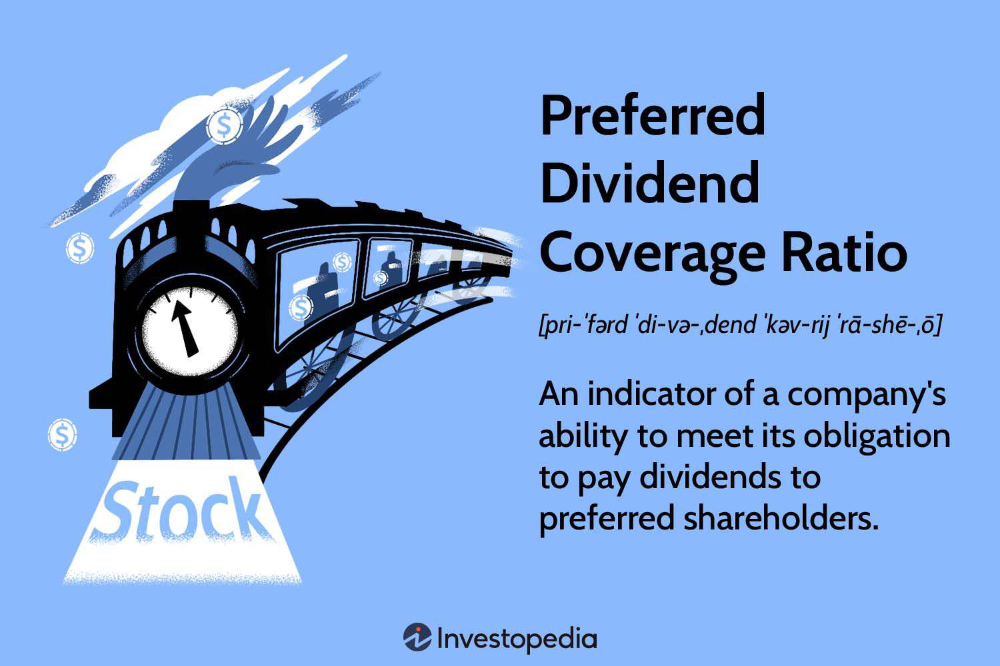

In today's volatile financial markets, understanding critical financial metrics becomes imperative for investors seeking to navigate the complexities of modern investment landscapes. Among the myriad of financial metrics available, the Preferred Dividend Coverage Ratio stands out as a vital tool for assessing a company's capability to fulfill its dividend commitments to preferred shareholders. This ratio provides a measure of financial stability by examining the extent to which a company's net income can cover its preferred dividend obligations.

Algorithmic trading has fundamentally transformed the investment approach towards dividend stocks. By employing data-driven techniques, algorithmic trading allows for more precise, objective, and timely investment decisions, minimizing the potential biases inherent in human decision-making. The integration of financial metrics, such as the Preferred Dividend Coverage Ratio, into algorithmic trading strategies enables investors not only to evaluate but also to optimize investment portfolios based on quantitative data analysis.



By combining the insights from financial metrics with the advanced capabilities of algorithmic trading systems, investors can significantly enhance their investment strategies and outcomes. This fusion of traditional financial analysis with cutting-edge technology creates a robust framework for strategic decision-making, assisting investors in achieving improved financial performance and resilience amidst market fluctuations.

## Table of Contents

## Understanding Preferred Dividend Coverage Ratio

The Preferred Dividend Coverage Ratio is a financial metric that assesses a company's ability to fulfill its preferred dividend obligations using its net income. This ratio is calculated by dividing the net income by the total preferred dividend payments:

$$
\text{Preferred Dividend Coverage Ratio} = \frac{\text{Net Income}}{\text{Preferred Dividend Payments}}
$$

A high Preferred Dividend Coverage Ratio is indicative of a company’s robust capacity to meet its preferred dividend commitments, reflecting financial health and stability. Preferred dividends are prioritized over common dividends, akin to fixed-income securities, as they provide a stable income stream to investors. This fixed nature offers less risk compared to common stock dividends, which can be more variable due to the company's profitability and strategic decisions.

The measurement of a company's ability to cover preferred dividend payments is crucial for assessing both the risk and appeal of preferred stock investments. Investors often use this ratio to evaluate the safety and reliability of their dividend income from preferred shares, thus influencing their investment decisions. An adequate ratio suggests that the company can handle its financial obligations to preferred shareholders without compromising its financial standing, enhancing the stock's attractiveness to risk-averse investors seeking steady returns.

## Importance and Implications of Preferred Dividend Coverage Ratio

The Preferred Dividend Coverage Ratio is a crucial indicator for investors assessing a company's financial health and its ability to sustain dividend payments to preferred shareholders. A ratio greater than 1 indicates that the company is generating sufficient net income to cover its preferred dividend obligations, thus reflecting robust financial stability. This financial metric serves as a reassurance for investors, demonstrating that the company can meet its dividend commitments without exerting undue financial stress.

For common shareholders, the preferred dividend coverage ratio acts as a vital signal for understanding the hierarchy and security of dividend payments. Since preferred dividends take precedence over common dividends, a favorable ratio implies that common shareholders are more likely to receive their dividends only after the preferred obligations are sufficiently met. Therefore, a high ratio not only indicates the security of preferred dividends but also provides insights into the potential for distributing dividends to common shareholders.

Moreover, the preferred dividend coverage ratio significantly impacts investor sentiment and confidence. A company consistently maintaining a high ratio is typically perceived as lower risk, attracting more investors interested in preferred stocks. Conversely, a ratio near or below 1 might raise concerns about the company's ability to reliably make dividend payments, potentially leading to decreased investor confidence and increased perceived risk. This could result in a higher cost of capital for the company due to the additional risk premium demanded by investors. 

In conclusion, the preferred dividend coverage ratio is a foundational tool for investors when evaluating the reliability and security of dividend payments, influencing investment decisions in preferred and common equity stocks.

## Algorithmic Trading and Financial Ratios

Algorithmic trading utilizes automated systems to execute trades based on predefined parameters, significantly reducing human error. These sophisticated systems are programmed to perform trading decisions at high speed and consistency, allowing them to capitalize on fleeting market opportunities that human traders might miss. 

The integration of complex algorithms with financial ratios, such as the preferred dividend coverage ratio, provides comprehensive insights into stock performance. This metric specifically assesses a company's ability to cover its preferred dividend commitments, directly impacting the reliability of dividend income. By incorporating such ratios into [algorithmic trading](/wiki/algorithmic-trading) models, traders can develop strategies that prioritize financial stability and yield potential, thus enhancing the effectiveness of their trading decisions.

Algorithms excel at quickly analyzing large datasets, making them adept at identifying patterns, trends, and opportunities in dividend stocks. This capability is particularly advantageous when dealing with high-frequency trading environments where rapid data processing and decision-making are crucial. For example, an algorithm can instantly parse through historical and real-time data to ascertain a company's dividend payment history, preferred dividend coverage ratio, and other relevant financial metrics. Consequently, it can make buy or sell decisions within fractions of a second, optimizing the timing and profitability of trades.

Machine learning further augments algorithmic trading models by allowing them to learn and adapt over time. These models can identify subtle market changes and adjust their trading strategies accordingly. For instance, a [machine learning](/wiki/machine-learning) algorithm might uncover a correlation between a decline in a company's net income and a reduction in its preferred dividend coverage ratio, prompting a reevaluation of its investment desirability. By continuously refining decision-making processes through learning, algorithmic systems can not only react to current market conditions but also anticipate future trends, thus providing a strategic edge.

Python is a popular language for implementing algorithmic trading strategies, offering libraries and frameworks that facilitate data analysis and machine learning. A simple Python implementation to track and evaluate the preferred dividend coverage ratio could look like this:

```python
import pandas as pd

# Sample data: company net income and preferred dividends
data = {
    'Company': ['A', 'B', 'C'],
    'Net Income': [100000, 150000, 200000],
    'Preferred Dividends': [25000, 50000, 20000],
}

# Create DataFrame
df = pd.DataFrame(data)

# Calculate Preferred Dividend Coverage Ratio
df['PDC_Ratio'] = df['Net Income'] / df['Preferred Dividends']

# Determine investment attractiveness
df['Investment Attractiveness'] = df['PDC_Ratio'].apply(lambda x: 'Attractive' if x > 1 else 'Risky')

print(df)
```

This script evaluates the preferred dividend coverage ratio for a set of companies, providing insights into their ability to sustain preferred dividend payments. Investors and traders can expand upon this foundation, integrating it into broader algorithmic systems that incorporate additional financial metrics and corporate indicators. By leveraging these tools, they can make more timely and informed investment decisions, capitalizing on data-driven insights to improve portfolio performance.

## Integrating Financial Metrics with Algorithmic Trading

Integrating financial metrics with algorithmic trading revolutionizes the way investors approach stock selection and portfolio management. The marriage of these elements allows for a more systematic and data-driven approach, enhancing decision-making efficiency and accuracy.

Financial ratios serve as crucial inputs for algorithmic strategies, enabling the filtration and selection of dividend stocks with precision. Ratios such as the preferred dividend coverage ratio offer insights into a company's financial health and its ability to sustain dividend payments, thereby acting as significant indicators of its investment potential. When integrated into algorithmic trading systems, these metrics help automate the selection process, reducing manual effort and the potential for human error.

The reliability and effectiveness of these algorithms are ensured through back-testing, a process where historical data is utilized to simulate how a trading strategy would have performed in past markets. Back-testing is a vital step, as it verifies the robustness of a strategy before its application in live trading scenarios. For example, using Python, investors can script back-testing models that run through extensive historical datasets, optimizing strategies to handle various market conditions.

```python
import pandas as pd
import numpy as np
import backtrader as bt

class Strategy(bt.Strategy):
    def __init__(self):
        self.ma = bt.indicators.SimpleMovingAverage(self.data.close, period=15)

    def next(self):
        if self.data.close > self.ma:
            self.buy(size=10)
        elif self.data.close < self.ma:
            self.sell(size=10)

cerebro = bt.Cerebro()
data = bt.feeds.PandasData(dataname=pd.read_csv('historical_data.csv'))
cerebro.adddata(data)
cerebro.addstrategy(Strategy)
cerebro.run()
```

Moreover, algorithmic trading enables dynamic portfolio adjustments based on real-time financial data. This agility ensures that investment strategies remain aligned with current market conditions and investor objectives. Algorithms can instantly analyze incoming data, making necessary portfolio adjustments to mitigate risks or capitalize on emerging opportunities.

The integration of financial metrics like the preferred dividend coverage ratio with algorithmic trading results in more strategic and profitable investment decisions. By systematically analyzing quantitative data, algorithms identify stocks exhibiting strong financial health, optimizing the balance between risk and return. This synergy facilitates investors in navigating complex markets with confidence, potentially leading to enhanced returns and more resilient investment portfolios. Through the strategic incorporation of algorithms, investors harness technology to execute disciplined, data-informed strategies effectively.

## Advantages of Combining Dividend Stocks, Financial Ratios, and Algo Trading

Combining dividend stocks with strong financial ratios and algorithmic trading offers a strategic advantage in today's market environment. Integrating these components reduces exposure to market [volatility](/wiki/volatility-trading-strategies), thereby offering a safer investment approach. Diversifying portfolios with dividend stocks ensures a steady income stream, which is crucial in times of economic uncertainty. These stocks, often characterized by consistent dividends and robust financial metrics, provide a buffer against market fluctuations. 

Algorithmic trading further enhances investment strategies by minimizing human bias and implementing systematic risk management. Algorithms can swiftly analyze vast amounts of financial data, generating insights that are free from human emotion or error. This approach ensures more accurate predictions and optimized trading strategies. Employing real-time market monitoring, algorithms execute trades based on current market conditions and predefined parameters, ensuring that strategies are not only timely but also adaptive to market changes.

Predictive analysis through algorithms facilitates disciplined investment approaches. By analyzing historical data, algorithms help in identifying patterns and trends that might not be apparent to human traders. This capability enables the anticipation of market movements and the adjustment of strategies accordingly. With predictive analysis, investors can maximize their potential for income generation and capital appreciation, aligning their portfolios with their financial goals.

Python, a preferred programming language in finance, can be leveraged to build such algorithms. Simplified code can demonstrate how algorithms might incorporate financial ratios in trading decisions:

```python
def calculate_preferred_dividend_coverage_ratio(net_income, preferred_dividends):
    return net_income / preferred_dividends

def trading_signal(dividend_coverage_ratio, threshold=1.5):
    return "Buy" if dividend_coverage_ratio > threshold else "Sell"

net_income = 5000000
preferred_dividends = 3000000

ratio = calculate_preferred_dividend_coverage_ratio(net_income, preferred_dividends)
signal = trading_signal(ratio)

print(f"Dividend Coverage Ratio: {ratio:.2f}")
print(f"Trading Signal: {signal}")
```

This code calculates the preferred dividend coverage ratio and generates a trading signal based on a predefined threshold, demonstrating a basic form of algorithmic decision-making using financial ratios. By integrating dividend stocks, financial ratios, and algorithmic trading, investors can achieve more informed, strategic decisions, leading to greater portfolio resilience and growth.

## Conclusion

The conclusion of this article underscores the profound synergy achieved by combining financial metrics, dividend stocks, and algorithmic trading. This triad provides a solid framework for modern investing, empowering investors to make well-informed and strategic decisions. When investors integrate algorithmic trading techniques with traditional financial analyses, they can exploit a technological edge in contemporary dynamic markets.

Utilizing algorithmic trading allows for the real-time analysis and execution of investment strategies based on evolving market conditions. This technological sophistication helps investors to react promptly and accurately to market shifts, minimizing human error and bias. By systematically incorporating financial metrics, such as the preferred dividend coverage ratio, algorithms can discern beneficial investment opportunities, optimizing the potential for income generation through dividend stocks.

Such an integrated approach results in more strategic investment decisions, ultimately leading to significant portfolio growth. The enhanced analytical capability achieved through the use of algorithms helps ensure that dividend-income streams are maximized and investment risks are managed more effectively. Moreover, combining financial metrics and algorithmic trading fosters a more resilient investment strategy, capable of withstanding market volatility and delivering consistent returns. Therefore, this intersection not only enhances financial outcomes but also ensures sustainable investment success in the evolving financial landscape.

## References & Further Reading

[1]: ["Corporate Finance: Theory and Practice"](https://onlinelibrary.wiley.com/doi/book/10.1002/9781119208372) by Aswath Damodaran

[2]: ["Algorithmic Trading: Winning Strategies and Their Rationale"](https://books.google.com/books/about/Algorithmic_Trading.html?id=WAlFDwAAQBAJ) by Ernie Chan

[3]: Shah, D., & Zhang, Z. (2021). ["An Overview and Survey of Algorithmic Trading"](https://www.aimspress.com/article/doi/10.3934/DSFE.2021019?viewType=HTML) from arXiv.org

[4]: ["Security Analysis"](https://hedgefundalpha.com/what-is-security-analysis/) by Benjamin Graham and David Dodd

[5]: ["Python for Finance: Mastering Data-Driven Finance"](https://www.amazon.com/Python-Finance-Mastering-Data-Driven/dp/1492024333) by Yves Hilpisch