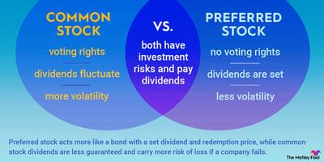

## Table of Contents

## What are preferred dividends?

Preferred dividends are payments that a company makes to its preferred shareholders. Preferred shareholders are a special type of investors who own preferred stock. This type of stock usually comes with a fixed dividend rate, which means they get paid a certain amount of money regularly, no matter how well the company is doing.

These dividends are often paid out before any dividends are given to common shareholders. This is because preferred shareholders have priority over common shareholders when it comes to receiving dividends. If a company is struggling and can't pay all its dividends, preferred shareholders will still get their payments before common shareholders get anything. This makes preferred stock a bit safer than common stock, but it usually doesn't grow in value as much.

## How do preferred dividends differ from common dividends?

Preferred dividends and common dividends are payments that companies make to their shareholders, but they are different in a few ways. Preferred dividends are paid to people who own preferred stock. These dividends usually have a fixed rate, which means the amount of money paid stays the same. This makes it easier for preferred shareholders to know how much money they will get. Preferred dividends are also paid before common dividends. If a company doesn't have enough money to pay all its dividends, it will pay the preferred shareholders first.

Common dividends, on the other hand, are paid to people who own common stock. The amount of these dividends can change and is decided by the company's board of directors. It depends on how well the company is doing. If the company is doing great, the board might decide to pay more dividends to common shareholders. But if the company is struggling, they might pay less or nothing at all. Common shareholders get their dividends only after the preferred shareholders have been paid.

## Who typically receives preferred dividends?

Preferred dividends are usually received by people who own preferred stock in a company. These people are called preferred shareholders. They get these dividends because they bought a special type of stock that comes with a promise of regular payments. The amount of money they get stays the same, no matter how the company is doing.

Preferred shareholders are different from common shareholders. Common shareholders get dividends too, but only after the preferred shareholders have been paid. This makes preferred stock a bit safer because preferred shareholders are paid first. But, preferred stock usually doesn't grow in value as much as common stock.

## What are the advantages of investing in stocks with preferred dividends?

Investing in stocks with preferred dividends can be a good choice for people who want a steady income. Preferred dividends are usually paid at a fixed rate, which means you know exactly how much money you will get. This can be helpful if you need a regular amount of money coming in, like for paying bills or saving up. It's like getting a regular paycheck from the company, no matter how well it's doing.

Another advantage is that preferred shareholders get paid before common shareholders. If the company is having a tough time and can't pay all its dividends, preferred shareholders still get their money first. This makes preferred stocks a bit safer than common stocks. It's like having a safety net because you know you'll be taken care of before others.

## Can preferred dividends be suspended or skipped?

Yes, preferred dividends can be suspended or skipped, but it depends on the type of preferred stock. Some preferred stocks are "cumulative," which means if the company skips a dividend payment, it has to pay it later. The missed payments add up and must be paid before any dividends go to common shareholders. This makes cumulative preferred stocks a bit safer because you know you'll get your money eventually, even if it's late.

Other preferred stocks are "non-cumulative." If the company skips a dividend with these stocks, it doesn't have to pay it later. The missed payment is gone for good. This makes non-cumulative preferred stocks riskier because you might not get all the money you were expecting. Companies usually decide to skip dividends if they're having money problems and need to save cash.

## How are preferred dividends taxed?

Preferred dividends are usually taxed as regular income for the person who gets them. This means they are added to your other income, like your salary, and you pay taxes on the total amount. The tax rate depends on how much money you make in a year. If you make a lot of money, you might pay a higher tax rate on your dividends.

Sometimes, preferred dividends can be taxed at a lower rate if they are qualified dividends. To be a qualified dividend, the stock has to be held for a certain amount of time, usually more than 60 days during a 121-day period around the ex-dividend date. If the dividends are qualified, they are taxed at the capital gains rate, which is usually lower than the regular income tax rate. But not all preferred dividends can be qualified dividends, so it's important to check the rules for the specific stock you own.

## What is the impact of preferred dividends on a company's financial health?

Preferred dividends can affect a company's financial health in a few ways. When a company pays preferred dividends, it uses up some of its cash. This can be good for the company's reputation because it shows that it can pay its shareholders regularly. But if the company is not making enough money, paying these dividends can make its cash reserves smaller. This might make it harder for the company to pay for other important things like growing the business or paying off debts.

If a company skips or suspends preferred dividends, it can save cash in the short term. This can help the company if it is going through a tough time and needs money to keep running. But skipping dividends can also make investors worried. They might think the company is in trouble and decide to sell their stocks, which can lower the stock price. This can hurt the company's financial health because it might be harder for the company to raise money in the future.

## How do preferred dividends affect the stock's market value?

Preferred dividends can affect a stock's market value in different ways. When a company pays its preferred dividends regularly, it can make investors feel good about the company. They might think the company is doing well and is stable. This can make more people want to buy the stock, which can push the stock's market value up. But if the company is using a lot of its money to pay these dividends, it might not have enough left to grow the business or pay off debts. This can make some investors worried and might make the stock's market value go down.

If a company decides to skip or suspend preferred dividends, it can also affect the stock's market value. Skipping dividends can save the company money in the short term, which might be good if the company is having a tough time. But it can also make investors think the company is in trouble. They might start selling their stocks, which can lower the stock's market value. So, whether paying or skipping preferred dividends, it's all about how investors feel about the company's future.

## What are cumulative and non-cumulative preferred dividends?

Cumulative preferred dividends are a type of dividend where if a company misses a payment, it has to pay it later. This means if the company can't pay the dividend one year, it adds up and the company has to pay it before any dividends go to common shareholders. This makes cumulative preferred stocks safer because you know you'll get your money eventually, even if it's late. It's like the company owes you the money and has to pay it back when it can.

Non-cumulative preferred dividends are different. If a company misses a payment with these stocks, it doesn't have to pay it later. The missed payment is gone for good. This makes non-cumulative preferred stocks riskier because you might not get all the money you were expecting. Companies might decide to skip these dividends if they're having money problems and need to save cash. So, it's important to know if your preferred stock is cumulative or non-cumulative before you buy it.

## How do preferred dividends fit into a diversified investment portfolio?

Preferred dividends can be a good part of a diversified investment portfolio because they offer a steady income. When you own preferred stocks, you get paid a fixed amount of money regularly, no matter how the company is doing. This can be helpful if you need a regular amount of money coming in, like for paying bills or saving up. It's like getting a regular paycheck from the company. Adding preferred stocks to your portfolio can help balance out riskier investments like common stocks, which can go up and down a lot.

But, it's important to think about the whole picture. Preferred stocks usually don't grow in value as much as common stocks, so they might not help your money grow as fast. Also, if the company is having money problems, it might skip paying preferred dividends, especially if they are non-cumulative. So, while preferred dividends can add stability to your portfolio, you should mix them with other types of investments to spread out the risk and make sure your money is working hard for you.

## What are the risks associated with investing in preferred dividend stocks?

Investing in preferred dividend stocks can be risky because the company might not always pay the dividends. If the company is having money problems, it might skip paying preferred dividends, especially if they are non-cumulative. This means you might not get the money you were expecting. Even if the dividends are cumulative, you might have to wait a long time to get your missed payments. This can be a problem if you need the money right away.

Another risk is that preferred stocks usually don't grow in value as much as common stocks. If the company does really well, the price of preferred stocks might not go up as much as common stocks. This means you might miss out on making more money if the company grows a lot. Also, if the company is doing badly, the price of preferred stocks can go down, just like common stocks. So, while preferred stocks can give you a steady income, they might not help your money grow as fast as other investments.

## How can investors evaluate the sustainability of preferred dividends from a company?

Investors can evaluate the sustainability of preferred dividends by looking at the company's financial health. They should check if the company is making enough money to pay its dividends. This means looking at the company's earnings and cash flow. If the company's earnings are higher than the dividends it needs to pay, it's more likely to keep paying them. Investors can also look at the company's debt. If the company has a lot of debt, it might have to use its money to pay off the debt instead of paying dividends. So, a company with less debt and good earnings is more likely to keep paying its preferred dividends.

Another way to evaluate the sustainability of preferred dividends is to look at the company's history. If the company has been paying its dividends regularly for a long time, it's a good sign that it will keep doing so. Investors can also look at what the company says about its future plans. If the company is planning to grow and make more money, it's more likely to keep paying its dividends. But if the company is planning to spend a lot of money on new projects or if it's in an industry that's not doing well, it might have a harder time paying its dividends. So, looking at the company's past and future can help investors decide if the preferred dividends are sustainable.

## References & Further Reading

[1]: Graham, B., & Zweig, J. (2003). ["The Intelligent Investor: The Definitive Book on Value Investing."](https://www.amazon.com/Intelligent-Investor-Definitive-Investing-Essentials/dp/0060555661) Harper Business.

[2]: Murphy, J. J. (1999). ["Technical Analysis of the Financial Markets."](https://archive.org/details/technicalanalysi0000murp) New York Institute of Finance.

[3]: Chan, E. P. (2009). ["Quantitative Trading: How to Build Your Own Algorithmic Trading Business."](https://github.com/ftvision/quant_trading_echan_book) Wiley.

[4]: Lopez de Prado, M. (2018). ["Advances in Financial Machine Learning."](https://www.amazon.com/Advances-Financial-Machine-Learning-Marcos/dp/1119482089) Wiley.

[5]: Jansen, S. (2020). ["Machine Learning for Algorithmic Trading: Predictive models to extract signals from market and alternative data for systematic trading strategies with Python."](https://www.amazon.com/Machine-Learning-Algorithmic-Trading-alternative/dp/1839217715) Packt Publishing.

[6]: Hull, J. (2014). ["Options, Futures, and Other Derivatives."](https://elibrary.pearson.de/book/99.150005/9781292410623) Pearson.