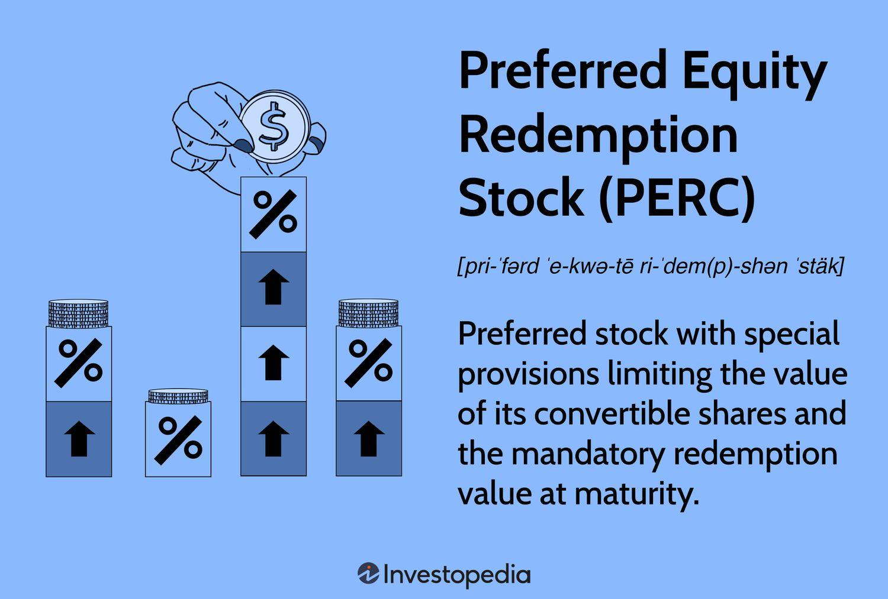

The financial world is filled with intricate instruments that cater to diverse investment requirements, offering a blend of both equity and debt characteristics. Among these, Preferred Equity Redemption Stock (PERC) and Preference Equity Redemption Cumulative Stock (PERCS) emerge as notable options for both investors and issuers. These instruments are uniquely structured to combine the benefits of preferred stocks with the security features typically associated with debt instruments. 

Preferred Equity Redemption Stock (PERC) offers investors a preferred stock with specific provisions limiting its conversion value while fixing a mandatory redemption value at maturity. This hybrid instrument is compelling for those seeking higher yields compared to common stocks, with the added flexibility of redemption in either cash or underlying shares at maturity. Initially introduced in the early 1990s by investment firm Morgan Stanley, PERCs have gained attention for their strategic appeal to both conservative investors and those focused on long-term growth.



Similarly, Preference Equity Redemption Cumulative Stock (PERCS) integrates the stability of fixed income with the potential for capital appreciation found in equities. These convertible preferred stocks provide regular dividend income and an opportunity for conversion into common stock under predetermined conditions, thus appealing to investors who seek both income and growth. For companies, PERCS represent a balanced mechanism for raising capital without incurring traditional debt, making them a versatile component for corporate finance strategies.

Beyond understanding their basic structures, investors interested in PERCs and PERCS must consider algorithmic trading opportunities to enhance their portfolio performance. Algorithmic trading allows for the automation of trading strategies based on market dynamics, leveraging speed and precision that surpass human capabilities. These advanced trading techniques can be particularly effective with hybrid financial instruments like PERCs and PERCS, helping investors identify price discrepancies and optimize trade execution.

This comprehensive guide will provide insights into how these sophisticated financial tools work, their advantages, potential drawbacks, and how investors can strategically incorporate them into their portfolios. By exploring both the traditional aspects of PERCs and PERCS and the innovative realm of algorithmic trading, we endeavor to arm investors with the knowledge needed to navigate and capitalize on the complexities of modern financial markets.

## Table of Contents

## Understanding Preferred Equity Redemption Stock (PERC)

Preferred Equity Redemption Stock (PERC) is a form of preferred stock characterized by special provisions that limit its conversion value and set a mandatory redemption value at maturity. These provisions distinguish PERCs from other types of preferred stocks, offering a blend of equity and debt characteristics.

The primary feature of PERCs is their higher yield compared to common stocks, making them an attractive option for income-seeking investors. This higher yield is a result of their structured nature, which includes a fixed dividend payment schedule. At maturity, PERCs provide the flexibility of redemption either in cash or in shares of the underlying stock, based on predetermined terms. This flexibility offers investors options depending on market conditions and individual investment strategies.

PERCs were introduced by Morgan Stanley in the early 1990s as a means to provide investors with a security that offered both predictable income and the potential for equity conversion. These instruments typically include agreed-upon terms for mandatory conversions. Such terms are designed to align the interests of both the issuer and investors, while ensuring certainty regarding the eventual redemption of the security.

This mandatory conversion feature is pivotal, as it reduces the uncertainty that might otherwise accompany the timing and terms of the stock's redemption or conversion. For conservative investors, this provides a measure of security and predictability. More strategic investors might find value in the potential for capital appreciation upon conversion to common stock, alongside regular dividend income.

The structured nature of PERCs often results in a capped conversion value, which means the conversion from preferred to common stock is predetermined and limited according to the terms set at issuance. This cap ensures that the issuer can manage potential dilution of equity while providing a mechanism for investors to participate in the company's equity under specified conditions.

In summary, Preferred Equity Redemption Stock serves as a versatile investment tool, offering higher income potential compared to common equity, alongside structured conversion and redemption terms that cater to a range of investment strategies.

## Understanding Preference Equity Redemption Cumulative Stock (PERCS)

Preference Equity Redemption Cumulative Stock (PERCS) represents a specialized form of financial instrument that merges the attributes of fixed-income securities with the potential for equity appreciation. As a convertible preferred stock, PERCS typically guarantee holders a steady stream of dividends similar to fixed-income products, ensuring predictable income. This characteristic makes them appealing for investors seeking both stability and income.

The conversion feature embedded within PERCS allows these instruments to be converted into common stocks at specific, predetermined terms upon reaching maturity. This aspect introduces a dynamic growth opportunity, enabling investors to participate in the capital appreciation of the company's common stock should it perform well. This blend of fixed income and potential equity growth makes PERCS a strategic investment, especially for those looking to diversify their portfolios while maintaining some degree of financial security.

From an issuer's perspective, PERCS play a crucial role in capital management strategies by offering a balanced approach to raising funds. Companies can access necessary capital without assuming traditional debt, thereby preserving their debt-to-equity ratios. This balance helps in maintaining the company's financial health while providing a mechanism to attract investors seeking higher yield investments relative to traditional bonds or debentures. The structured dividends and potential equity appreciation options make them particularly appealing during periods of market uncertainty, where traditional equity investments might seem riskier.

Furthermore, the ability to convert PERCS into common stock is predetermined by terms set forth at issuance. These terms typically define the conversion ratio, which is critical for investors to understand as it impacts their potential returns significantly. This conversion ratio specifies the number of common shares that each unit of PERCS will convert into, which can be influenced by factors such as the company's financial performance and the prevailing market conditions at the time of maturity.

In summary, PERCS offer a nuanced financial tool that combines the best of fixed-income dependability with the growth prospects of equity. For companies and investors alike, they serve as a versatile instrument for capital management and investment strategy, providing both parties with beneficial financial options in dynamic market environments.

## Characteristics and Examples of PERCs and PERCS

Preferred Equity Redemption Stock (PERC) and Preference Equity Redemption Cumulative Stock (PERCS) are hybrid financial instruments offering both equity and debt features, and they play a vital role in diverse investment strategies. These instruments are characterized primarily by their capped values, which are predetermined limitations on the maximum share conversion value based on current market prices. This cap is crucial as it defines the extent to which an investor can benefit from favorable market movements when converting preferred shares to common equity.

**Capped Values:**

For both PERCs and PERCS, the capped value imposes a ceiling on the conversion rate, ensuring that even if the market prices rise beyond a certain point, the maximum conversion rate remains fixed. This feature provides a measure of risk control for the issuer, as it limits their liability in terms of equity dilution or financial output.

**Examples and Conversion Mechanism:**

Consider a hypothetical example of Company XYZ issuing PERCS to mobilize capital without increasing traditional debt levels. By doing so, XYZ offers investors an attractive pathway to engage with the company's growth while still securing the potential for dividend earnings. Investors gain the right, at maturity or another specified date, to convert their PERCS holdings into common shares if market dynamics are favorable—i.e., if the value of the common shares exceeds what has been specified by the cap.

The conversion mechanism involves predetermined terms outlined in the initial issuance agreement, specifying how many common shares a holder of PERCS can receive and under what conditions. These details are critical to investors who need a comprehensive understanding of both the upside potential and limitations of their investment. 

**Dividend Structures:**

The dividend structure for PERCs and PERCS is another essential characteristic, providing fixed income akin to bonds, while also offering potential for capital gains. Although the exact dividend rate can vary based on the issuing company's policy and prevailing financial circumstances, the combined offering of income through dividends and potential equity-based returns makes these instruments attractive. The decision to invest often hinges on understanding these dividend yields in the context of the broader market movements and the specific financial health of the issuer.

In summary, the unique structure of PERCs and PERCS, whether through their capped value limitations, conversion opportunities, or dividend promises, provides strategic benefits to investors. The decision to invest requires a careful analysis of these factors, balanced against market conditions and the investor's own financial goals.

## Synthetic PERCs: An Innovative Approach

Synthetic PERCs are structured financial instruments designed to mimic the characteristics of traditional Preferred Equity Redemption Stocks (PERCs), without being directly tied to the corporations from which they derive their characteristics. This innovative approach allows for greater flexibility and diversification in investment strategies, as they can be designed and issued by entities that are not directly affiliated with the underlying stock's issuer.

One of the primary methodologies employed in the creation of synthetic PERCs involves the use of a "buy-write" strategy. This strategy is an options trading technique that involves buying the underlying stock and simultaneously writing (selling) call options on the same stock. The main advantage of this approach is that it allows the investor to generate income from the premiums received for selling the call options, in addition to any dividends that the underlying stock may provide.

For example, consider an investor who owns shares of a particular stock. By writing call options on those shares, the investor earns a premium. If the stock's market price remains below the strike price of the options, the options expire worthless, allowing the investor to retain the premium as profit. Conversely, if the stock's price exceeds the strike price, the investor may be required to sell the shares at the strike price, which could limit potential capital gains.

The distinct nature of synthetic PERCs also introduces unique risk and reward profiles. Given that they are not directly tied to the issuing corporation, the securities might expose investors to counterparty risk, which pertains to the potential that the entity issuing the synthetic instrument may default on its obligations. Additionally, tax implications can differ significantly from traditional PERCs. Investors could face various treatment scenarios under prevailing tax laws, depending on the jurisdiction and the specific structuring of the synthetic product.

Overall, synthetic PERCs offer a compelling alternative for investors seeking to replicate PERC-like features while accommodating differing risk appetites and return expectations. With their ability to provide income through strategies such as covered calls and potential diversification, they can be a valuable addition to a well-rounded investment portfolio. However, investors should conduct comprehensive due diligence to understand the specific characteristics and potential implications of these innovative financial instruments.

## Algorithmic Trading with PERCs and PERCS

Algorithmic trading has revolutionized the way financial instruments such as Preferred Equity Redemption Stock (PERC) and Preference Equity Redemption Cumulative Stock (PERCS) are traded. This form of trading utilizes computer algorithms to execute orders at high speeds and volumes, optimizing transactions by capitalizing on market trends and predefined conditions. Unlike traditional trading, [algorithmic trading](/wiki/algorithmic-trading) can analyze and react to market data in real time, offering significant advantages in trading PERCs and PERCS.

The primary objective of algorithmic trading with these instruments is to exploit price disparities, which occur due to the hybrid nature of PERCs and PERCS, combining elements of both equity and debt. For instance, fluctuations in interest rates or dividend announcements can create temporary mispricing. Algorithms can detect these opportunities and execute trades with precision, generating returns that might be unattainable through manual trading.

These algorithms are built using sophisticated models and statistical techniques that assess historical data and predict future movements. The algorithms execute trades when certain market conditions are met, following strategies that may include market-making, statistical [arbitrage](/wiki/arbitrage), and [trend following](/wiki/trend-following). For example, in [statistical arbitrage](/wiki/statistical-arbitrage), the algorithm might utilize a strategy that involves a set of mathematical equations to predict price movements and take advantage of the temporary inefficiencies in pricing relative to the broader market.

Here is a basic example of how one might implement a simple strategy in Python to trade PERCS using the `pandas` library for data manipulation and `numpy` for numerical computations:

```python
import pandas as pd
import numpy as np

# Load historical PERCS data
data = pd.read_csv('PERCS_data.csv')
data['Return'] = data['Close'].pct_change()

# Define a simple moving average strategy
def moving_average_strategy(data, short_window=20, long_window=50):
    data['Short_MA'] = data['Close'].rolling(window=short_window, min_periods=1).mean()
    data['Long_MA'] = data['Close'].rolling(window=long_window, min_periods=1).mean()
    data['Signal'] = np.where(data['Short_MA'] > data['Long_MA'], 1, 0)
    data['Positions'] = data['Signal'].diff()

moving_average_strategy(data)

# Execute trades based on the generated signals
for index, row in data.iterrows():
    if row['Positions'] == 1:
        print(f"Buy PERCS on {row['Date']}")
    elif row['Positions'] == -1:
        print(f"Sell PERCS on {row['Date']}")
```

Algorithmic trading with PERCs and PERCS offers the potential for maximizing returns through the deployment of automated strategies that consider these instruments' unique characteristics. However, this approach is not without risk. High-frequency trading and reliance on algorithms can occasionally lead to significant market disruptions or unintended outcomes. Hence, a deep understanding of both algorithmic trading strategies and the intricacies of PERCs and PERCS is crucial for investors aiming to employ these methods effectively. Proper risk management and continuous monitoring of the employed algorithms are essential elements that complement and enhance the profitability potential inherent to algorithmic trading in these hybrid securities.

## Benefits and Risks

Investing in Preferred Equity Redemption Stock (PERC) and Preference Equity Redemption Cumulative Stock (PERCS) provides several potential benefits and entails certain risks, which should be carefully evaluated by investors as part of their overall portfolio strategies.

**Benefits**:

1. **Enhanced Dividend Yields**: One of the primary attractions of PERCs and PERCS is their ability to provide enhanced dividend yields compared to common equity. This characteristic is particularly appealing to income-focused investors seeking steady cash flows. The fixed-income nature of these instruments, coupled with preferred status in the dividend distribution hierarchy, often results in a higher priority for dividend payments.

2. **Potential for Capital Gains**: These instruments offer the possibility of capital appreciation, especially since they can often be converted into common stock upon maturity. Investors who anticipate a rise in the value of the underlying common shares can benefit significantly once conversion occurs. This feature is valuable in dynamic markets where the growth potential of a company's common stock is perceived as strong.

**Risks**:

1. **Capped Value**: A notable risk is the capped value inherent in these instruments, which limits the maximum potential gain upon conversion. The conversion terms are predefined, which could result in reduced upside potential if the market value of the underlying common stock significantly exceeds the capped conversion level.

2. **Early Redemption Conditions**: These stocks often come with early redemption clauses, which allow the issuer to redeem the stocks before maturity. This feature can limit the time over which investors can earn higher-than-average dividends and potential capital gains, thereby affecting overall returns. It introduces an uncertainty factor that investors need to consider, especially if they rely on these instruments for income.

Investors should thoroughly assess these factors, incorporating market conditions and personal risk tolerance into their decision-making process. Balancing the attractive yields and conversion potentials of PERCs and PERCS against their capped value and redemption risks is crucial for optimizing investment outcomes. This calculation can be complex, and financial models might aid in deciding the allocation and timing for investing in these hybrid financial instruments.

## Conclusion

PERCs and PERCS provide investors with a sophisticated blend of features inherent in preferred stocks while incorporating the added advantage of conversion benefits. These hybrid instruments effectively bridge the gap between the fixed income characteristics of debt and the capital appreciation potential of equity, thus making them attractive to a wide range of investment strategies. Their ability to offer predictable dividend yields combined with the option to partake in equity gains through conversion at maturity makes them a compelling choice for investors seeking both income stability and growth potential.

Algorithmic trading can enhance the application of PERCs and PERCS by enabling investors to deploy automated strategies that respond to market shifts with precision and speed. The ability of algorithms to execute trades based on pre-defined criteria facilitates the optimization of portfolios containing these hybrid securities. As a result, algorithmic trading not only improves the efficiency of managing investments in PERCs and PERCS but also enables sophisticated investors to capitalize on short-term opportunities and market efficiencies that might otherwise be challenging to exploit.

However, utilizing PERCs and PERCS effectively requires thorough understanding and strategic planning. Investors must navigate the complexities of capped values and potential early redemption clauses that could affect returns. A comprehensive analysis of these factors within the framework of individual investment goals and risk tolerance is essential to harnessing the full potential of these financial products. As with any investment, diligent research and a well-considered approach are paramount in integrating PERCs and PERCS into a diversified investment portfolio.

## References & Further Reading

[1]: ["Advances in Financial Machine Learning"](https://www.amazon.com/Advances-Financial-Machine-Learning-Marcos/dp/1119482089) by Marcos Lopez de Prado

[2]: ["Machine Learning for Algorithmic Trading"](https://www.amazon.com/Machine-Learning-Algorithmic-Trading-alternative/dp/1839217715) by Stefan Jansen

[3]: ["Quantitative Trading: How to Build Your Own Algorithmic Trading Business"](https://github.com/LucindaYa/quant-resources/blob/master/Quantitative%20Trading%20How%20to%20Build%20Your%20Own%20Algorithmic%20Trading%20Business.pdf) by Ernest P. Chan

[4]: Estevez, K. (2001). ["Preferred Stock: The New Paradigm."](https://stockanalysis.com/term/preferred-stock/) Journal of Applied Corporate Finance.

[5]: ["Evidence-Based Technical Analysis: Applying the Scientific Method and Statistical Inference to Trading Signals"](https://www.amazon.com/Evidence-Based-Technical-Analysis-Scientific-Statistical/dp/0470008741) by David Aronson