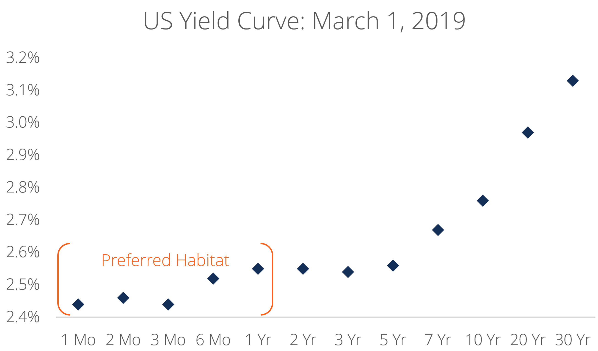

## Table of Contents

## What is the Preferred Habitat Theory?

The Preferred Habitat Theory is an idea about how the bond market works. It says that investors have certain types of bonds they like best, called their "preferred habitat." These could be short-term bonds, long-term bonds, or bonds from certain places or companies. Even though investors have their favorites, they might buy other types of bonds if the price is right. This theory helps explain why interest rates for different bonds can be different.

For example, if investors really want short-term bonds, they might not buy long-term bonds unless the interest rate on long-term bonds is much higher. This can make the interest rates on long-term bonds go up. On the other hand, if lots of people want to buy long-term bonds, the interest rates on those bonds might go down. The Preferred Habitat Theory shows that the bond market can be influenced by what investors prefer and how much they are willing to move away from their favorite types of bonds.

## How does the Preferred Habitat Theory differ from other interest rate theories?

The Preferred Habitat Theory differs from other interest rate theories, like the Expectations Theory and the Liquidity Preference Theory, in how it explains why interest rates for different bonds can be different. The Expectations Theory says that long-term interest rates are just an average of what people expect short-term interest rates to be in the future. So, if people think short-term rates will go up, long-term rates will go up too. On the other hand, the Preferred Habitat Theory says that investors have favorite types of bonds and will only buy other types if the price is good enough. This can make long-term rates different from what people expect short-term rates to be.

The Liquidity Preference Theory, another different idea, says that people want to hold onto cash because it's safe and easy to use. This means they need a higher interest rate to be willing to buy long-term bonds, which are less liquid. The Preferred Habitat Theory doesn't focus on liquidity as much. Instead, it focuses on the idea that investors have certain bonds they like best and are willing to switch only if the reward is big enough. So, while the Liquidity Preference Theory explains interest rate differences based on how easy it is to turn bonds into cash, the Preferred Habitat Theory explains it based on what types of bonds investors prefer.

## What are the key assumptions of the Preferred Habitat Theory?

The Preferred Habitat Theory assumes that investors have a favorite type of bond they like to invest in, which they call their "preferred habitat." This could be short-term bonds, long-term bonds, or bonds from certain places or companies. The theory says that investors are happy to stick with their favorite bonds as long as they can. But, if the price or interest rate on other types of bonds is good enough, investors might be willing to move away from their preferred habitat.

Another key assumption is that the bond market is influenced by what investors prefer and how much they are willing to switch to other types of bonds. If investors really want short-term bonds, they might not buy long-term bonds unless the interest rate on long-term bonds is much higher. This can make the interest rates on long-term bonds go up. On the other hand, if lots of people want to buy long-term bonds, the interest rates on those bonds might go down. So, the Preferred Habitat Theory shows that the bond market can be affected by what investors like and how much they are willing to change their minds.

## Can you explain the concept of 'habitat' in the context of this theory?

In the Preferred Habitat Theory, the word 'habitat' means the type of bond that an investor likes best. It could be short-term bonds, long-term bonds, or bonds from certain places or companies. Investors feel most comfortable and happy when they can invest in their favorite type of bond, which is their 'habitat.'

But sometimes, the price or interest rate on other types of bonds might be so good that investors are willing to leave their favorite habitat. They might buy a different type of bond if it offers a much better deal. This idea helps explain why interest rates for different bonds can be different, based on what investors prefer and how much they are willing to switch to other types of bonds.

## How does the Preferred Habitat Theory explain the term structure of interest rates?

The Preferred Habitat Theory explains the term structure of interest rates by saying that investors have favorite types of bonds they like to invest in, called their "habitat." These could be short-term bonds, long-term bonds, or bonds from certain places or companies. Investors are happy to stick with their favorite bonds as long as they can. But if the interest rate on other types of bonds is good enough, investors might be willing to move away from their preferred habitat. This means they might buy a different type of bond if it offers a much better deal.

When lots of investors want to stay in their preferred habitat, it can affect the interest rates on different bonds. For example, if many investors really want short-term bonds, they might not buy long-term bonds unless the interest rate on long-term bonds is much higher. This can make the interest rates on long-term bonds go up. On the other hand, if lots of people want to buy long-term bonds, the interest rates on those bonds might go down. So, the Preferred Habitat Theory shows that the term structure of interest rates can be influenced by what investors prefer and how much they are willing to switch to other types of bonds.

## What role do investors play in the Preferred Habitat Theory?

In the Preferred Habitat Theory, investors are really important because they have favorite types of bonds they like to invest in. These favorites are called their "habitat." It could be short-term bonds, long-term bonds, or bonds from certain places or companies. Investors feel most comfortable and happy when they can invest in their favorite type of bond. But sometimes, the price or interest rate on other types of bonds might be so good that investors are willing to leave their favorite habitat. They might buy a different type of bond if it offers a much better deal.

When lots of investors want to stay in their preferred habitat, it can affect the interest rates on different bonds. For example, if many investors really want short-term bonds, they might not buy long-term bonds unless the interest rate on long-term bonds is much higher. This can make the interest rates on long-term bonds go up. On the other hand, if lots of people want to buy long-term bonds, the interest rates on those bonds might go down. So, the Preferred Habitat Theory shows that what investors like and how much they are willing to switch to other types of bonds can change the interest rates in the bond market.

## How do market imperfections affect the Preferred Habitat Theory?

Market imperfections can make the Preferred Habitat Theory more important. In a perfect market, everyone would know everything and could easily buy and sell any bond they want. But in real life, markets are not perfect. There are things like transaction costs, taxes, and rules that can make it hard for investors to move between different types of bonds. Because of these imperfections, investors might stick to their favorite types of bonds even more. They might not want to leave their preferred habitat unless the reward is really big.

These market imperfections can also make the interest rates on different bonds different. If it's hard or expensive to switch from short-term bonds to long-term bonds, investors might need a higher interest rate to be willing to make the switch. This can make the interest rates on long-term bonds go up. On the other hand, if it's easier to switch to long-term bonds, the interest rates on those bonds might go down. So, market imperfections can make the Preferred Habitat Theory more important in explaining why interest rates are different for different bonds.

## What are some empirical tests that have been conducted to validate the Preferred Habitat Theory?

Researchers have done different tests to see if the Preferred Habitat Theory is true. One way they test it is by looking at how interest rates change when there are big changes in the bond market. For example, they might look at what happens when the government sells a lot of long-term bonds. If the Preferred Habitat Theory is right, the interest rates on long-term bonds should go up because investors who like short-term bonds might not want to buy long-term bonds unless the interest rate is higher.

Another test is to see if the interest rates on different types of bonds move together in a way that the Preferred Habitat Theory says they should. If investors have favorite types of bonds and only switch if the reward is big enough, then the interest rates on different bonds should not always move together. Instead, they should move in a way that shows investors are sticking to their favorite bonds unless the price is right. These tests help show if the Preferred Habitat Theory can explain what happens in the real bond market.

## How does the Preferred Habitat Theory account for risk premiums across different maturities?

The Preferred Habitat Theory says that investors have favorite types of bonds they like to invest in, called their "habitat." These could be short-term bonds, long-term bonds, or bonds from certain places or companies. Investors feel most comfortable and happy when they can invest in their favorite type of bond. But sometimes, the price or interest rate on other types of bonds might be so good that investors are willing to leave their favorite habitat. They might buy a different type of bond if it offers a much better deal, but they will want a higher interest rate to make up for the risk of moving away from their preferred habitat.

When lots of investors want to stay in their preferred habitat, it can affect the interest rates on different bonds. For example, if many investors really want short-term bonds, they might not buy long-term bonds unless the interest rate on long-term bonds is much higher. This higher interest rate is like a risk premium that investors need to be willing to take on the risk of long-term bonds. On the other hand, if lots of people want to buy long-term bonds, the interest rates on those bonds might go down because investors don't need as much of a risk premium to be willing to buy them. So, the Preferred Habitat Theory shows that the risk premiums across different maturities can be influenced by what investors prefer and how much they are willing to switch to other types of bonds.

## Can you discuss any criticisms or limitations of the Preferred Habitat Theory?

The Preferred Habitat Theory has some criticisms and limitations. One big problem is that it can be hard to test if the theory is right. It's tough to know for sure what investors' favorite types of bonds are and how much they are willing to switch to other types of bonds. This makes it hard to prove if the theory really explains why interest rates are different for different bonds. Also, the theory doesn't say exactly how much of a reward investors need to leave their favorite habitat. This makes it hard to use the theory to predict what will happen in the bond market.

Another limitation is that the Preferred Habitat Theory doesn't take into account all the things that can affect the bond market. For example, it doesn't talk about how inflation or the economy can change what investors want to do. It also doesn't say much about how investors might change their minds over time. So, while the theory can help explain some things about the bond market, it might not be able to explain everything. This means that other theories or ideas might be needed to fully understand how the bond market works.

## How has the Preferred Habitat Theory evolved since its inception?

Since it was first thought of, the Preferred Habitat Theory has changed a bit as people learned more about how the bond market works. At first, the theory said that investors have favorite types of bonds they like to invest in, and they only switch to other types if the reward is big enough. Over time, researchers have tried to make the theory better by looking at more things that can affect the bond market. They have looked at how things like inflation, the economy, and even what investors expect to happen in the future can change what investors want to do. This has helped make the theory more useful for understanding the bond market.

Even though the theory has changed, it still has some problems. It can be hard to test if the theory is right because it's tough to know exactly what investors' favorite types of bonds are and how much they are willing to switch. Also, the theory doesn't say exactly how much of a reward investors need to leave their favorite habitat. This makes it hard to use the theory to predict what will happen in the bond market. But, the Preferred Habitat Theory is still an important idea that helps explain why interest rates for different bonds can be different.

## What are the practical implications of the Preferred Habitat Theory for bond portfolio management?

The Preferred Habitat Theory has important practical implications for bond portfolio managers. It suggests that investors have favorite types of bonds they like to invest in, and they might only switch to other types if the reward is big enough. For bond portfolio managers, this means they need to think about what types of bonds their investors like best. If they want to get investors to buy different types of bonds, they might need to offer a higher interest rate to make it worth it for investors to leave their favorite bonds. This can help managers decide which bonds to buy and sell to make their portfolio more attractive to investors.

Another practical implication is that bond portfolio managers need to pay attention to how interest rates on different bonds can change. If lots of investors want to stay in their preferred habitat, it can make the interest rates on other types of bonds go up or down. For example, if many investors really want short-term bonds, the interest rates on long-term bonds might need to be higher to get investors to buy them. By understanding this, bond portfolio managers can make better decisions about when to buy or sell different types of bonds. This can help them manage their portfolio in a way that takes advantage of what investors prefer and how much they are willing to switch.

## References & Further Reading

#