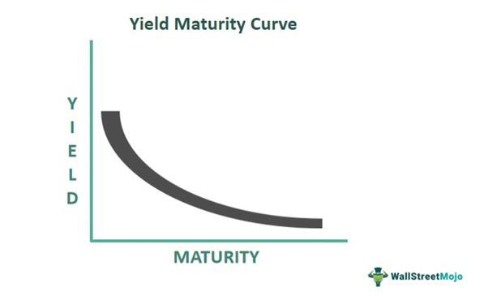

Financial markets play a crucial role in the global economy by facilitating the exchange of capital and resources among various entities. These markets comprise diverse components, including stocks, bonds, commodities, and foreign exchange, each with distinct characteristics and functions. Interconnections within financial markets are driven by participants such as investors, institutions, and traders, who operate across different market segments, thereby influencing pricing and liquidity.

Interest rates are fundamental to financial markets, acting as a compass that guides economic and financial decision-making. They affect how consumer behavior and business investments unfold, with central banks' monetary policies significantly shaping these rates. The ripple effect of interest rate changes is far-reaching, influencing everything from personal savings to corporate financing and overall economic growth. Interest rates affect the cost of borrowing and the yield on savings, shaping consumer spending and business expansion plans.



Bond yields, expressed as the return an investor can expect from holding a bond, serve as another critical indicator within financial markets. These yields reflect investor confidence and broader economic expectations. When bond yields rise, it often signals anticipated economic growth or inflation pressures. Conversely, falling yields may indicate economic uncertainty. The yield curve, which plots the yields of bonds with similar credit quality but differing maturity dates, is an essential tool for interpreting market signals and forming economic forecasts.

The advent of algorithmic trading has transformed how markets operate. Algorithmic trading involves the use of computer algorithms to execute trades based on predetermined criteria, enhancing speed, efficiency, and accuracy compared to manual trading methods. This form of trading significantly impacts market liquidity and volatility, offering both advantages and challenges to investors. Algorithmic strategies often incorporate sophisticated data analysis and predictive modeling, allowing traders to capitalize on market opportunities with precision.

This article aims to explore the dynamics between these elements—interest rates, bond yields, and algorithmic trading—and their combined impact on financial markets. By understanding these interconnected factors, investors and traders can develop strategies to navigate the complex landscape of modern financial markets effectively. The integration of technology and traditional financial principles highlights the evolving nature of market operations, emphasizing the need for both innovation and robust risk management.

## Table of Contents

## Understanding Financial Markets

Financial markets are structured systems where various financial instruments are traded, allowing for efficient exchange between buyers and sellers. These markets are fundamental to the functioning of capitalism because they allocate resources, provide liquidity, and facilitate economic growth and stability.

**Definition and Components of Financial Markets**

A financial market is any marketplace where trading of securities including stocks, bonds, currencies, and derivatives occurs. Essential components of financial markets include:

1. **Securities**: These are tradable financial assets. The primary categories are equities (stocks), debt (bonds), derivatives (futures and options), and currencies (forex).

2. **Exchanges**: Organized and regulated platforms where securities are bought and sold. Examples include the New York Stock Exchange (NYSE) and NASDAQ.

3. **Price Mechanism**: Determines the price at which securities are bought and sold, based fundamentally on supply and demand dynamics.

4. **Participants**: Include a range of entities such as investors, traders, financial institutions, and regulatory bodies that ensure market integrity and transparency.

**Role of Financial Markets in Economic Growth and Stability**

Financial markets play a critical role in economic development by:

- **Capital Formation**: By facilitating capital raising for businesses through the sale of equities or bonds, financial markets enable companies to finance expansions and new projects, driving economic growth.

- **Liquidity**: Markets provide a mechanism for converting securities into cash quickly, thus ensuring investors can effectively manage their portfolios and cover their capital needs.

- **Risk Management**: Derivatives markets allow participants to hedge against potential losses due to market volatility, currency fluctuations, or interest rate changes.

- **Price Discovery**: Through the interactions of all market participants, financial markets establish prices that are essential signals for economic decisions.

**Key Players: Investors, Institutions, and Traders**

Participants in financial markets include:

- **Investors**: Individuals or entities that provide capital with the expectation of receiving financial returns. They may include retail investors, institutional investors (such as pension funds and mutual funds), and hedge funds.

- **Institutions**: Banks, insurance companies, and investment firms that play a critical role in financial intermediation by facilitating transactions, offering financial products, and managing risk.

- **Traders**: Market participants who buy and sell securities for short-term gains. They may operate independently or within institutions like investment banks or specialized trading firms.

**Categories of Financial Markets**

1. **Equity Markets**: Platforms where stocks or shares of ownership in corporations are bought and sold. They provide companies access to capital in exchange for giving investors a slice of ownership.

2. **Debt Markets**: Markets for trading debt instruments, primarily bonds. These are used by governments and corporations to borrow money, with investors receiving fixed interest payments as returns.

3. **Derivatives Markets**: Financial markets for derivatives like futures, options, and swaps. These complex instruments derive their value from underlying assets and are used for hedging or speculative purposes.

4. **Forex Markets**: Also known as the foreign exchange market, it is where currencies are traded. Given its global nature, it's the largest and most liquid market in the world.

Understanding financial markets is crucial for making informed investment decisions and grasping the intricate dynamics that drive economic growth and stability.

## Interest Rates: The Economic Compass

Interest rates serve as a fundamental indicator and driver of economic activity, often being likened to an economic compass due to their influence on numerous financial and economic processes. Determined primarily by central banks through monetary policy, interest rates dictate the cost of borrowing and the return on savings, thus playing a crucial role in shaping consumer and business behavior.

The determination of interest rates is influenced by a range of factors, including inflation expectations, economic growth, and unemployment levels. Central banks, such as the Federal Reserve in the United States or the European Central Bank in the Eurozone, set benchmark interest rates—such as the federal funds rate or the main refinancing operations rate—using these economic indicators. These decisions aim to achieve macroeconomic objectives like price stability and full employment.

Central bank policies directly impact interest rates by adjusting benchmark rates and employing tools such as open market operations and reserve requirements. For example, during an economic downturn, a central bank might lower interest rates to stimulate economic activity by making borrowing cheaper, encouraging both consumer spending and business investment. Conversely, to combat inflationary pressures, a central bank might raise interest rates to reduce spending and cool off an overheating economy.

Interest rates have a direct connection to consumer behavior and business investment. Lower interest rates typically decrease the cost of loans and credit, prompting consumers to increase spending on items such as houses, cars, and other goods and services that are often financed through borrowing. Similarly, businesses may take advantage of lower rates to invest in new projects, expand operations, or upgrade technology, leading to increased demand for goods and services.

The broader economic growth is heavily influenced by interest rates through the mechanisms of consumption and investment. Over time, reduced interest rates tend to lead to higher aggregate demand, thus stimulating economic growth. Conversely, higher interest rates can restrain economic growth by increasing the cost of borrowing, reducing both consumer spending and business investments.

This delicate balancing act underscores the importance of interest rates as a tool for central banks to navigate economic complexities, providing a foundational framework for economic stability and growth. Understanding how interest rates affect various sectors is essential for both policymakers and investors who must adjust their strategies in response to these dynamic financial signals.

## Bond Yields and Their Importance

Bond yields, or the returns on investment for fixed-income securities like government and corporate bonds, are crucial indicators in financial markets. They directly influence investor decisions and reflect broader economic conditions. A bond yield typically comprises the interest payments received from the bond relative to its market price, and it is expressed as a percentage. This percentage offers insight into how much an investor can expect to earn if the bond is held to maturity. 

### How Bond Yields Reflect Investor Confidence and Economic Expectations

Bond yields are fundamentally linked to investor confidence and economic forecasts. When investor confidence is high, demand for bonds often decreases in favor of riskier assets with potentially higher returns, thus driving bond prices down and yields up. Conversely, in times of economic uncertainty or market turbulence, bonds are perceived as safer investments. Increased demand for bonds leads to higher prices and consequently lower yields.

Economic expectations regarding inflation and interest rates also heavily influence bond yields. When inflation expectations rise, so do bond yields, as investors demand higher returns to compensate for the decrease in purchasing power of future cash flows. Similarly, anticipated [interest rate](/wiki/interest-rate-trading-strategies) hikes can increase yields, as newer bonds issued will likely offer higher returns, making existing bonds with lower yields less attractive.

### Bond Yield as a Benchmark for Other Financial Instruments

Bond yields serve as vital benchmarks for other financial instruments. For instance, the yield on government bonds, particularly the U.S. Treasury bonds, is often referred to as the "risk-free" rate. This serves as a foundational measure for the cost of borrowing across various financial markets. Financial instruments such as mortgages, auto loans, and corporate bonds typically have interest rates that are set relative to the yield of government securities. A change in benchmark yields can thus ripple throughout the economy, affecting borrowing costs and investment decisions.

### Understanding the Yield Curve and Its Implications

The yield curve is a graphical representation of bond yields across different maturities. It provides investors insight into future interest rate changes and economic activity. A typical yield curve slopes upward, indicating that longer-term interest rates are higher than short-term rates due to the risk premium associated with time and uncertainty. 

However, when the yield curve becomes inverted (short-term yields are higher than long-term yields), it often indicates market expectation of an economic downturn. Historically, an inverted yield curve has preceded several recessions, making it a closely watched indicator by investors and policymakers alike.

Python can be employed to plot yield curves and analyze bond yields. The following simple Python script can use libraries like `matplotlib` and `numpy` to plot a yield curve:

```python
import matplotlib.pyplot as plt
import numpy as np

# Example maturity years and corresponding yields
maturities = np.array([1, 2, 5, 10, 20])
yields = np.array([0.5, 0.6, 1.0, 1.5, 2.0])

# Plotting the yield curve
plt.figure(figsize=(10, 6))
plt.plot(maturities, yields, marker='o')
plt.title('Bond Yield Curve')
plt.xlabel('Maturity (Years)')
plt.ylabel('Yield (%)')
plt.grid(True)
plt.show()
```

This code visually represents how investors perceive risk and return over different time horizons, aiding in the understanding of current economic expectations and informing future investment strategies. Understanding bond yields, therefore, is paramount for navigating financial markets and making informed investment decisions.

 to Algorithmic Trading

Algorithmic trading, often referred to as algo trading, refers to the use of computer algorithms to manage trading decisions, execute orders, and manage trades in financial markets. It has evolved significantly since its inception in the late 20th century, with profound implications for how trading is conducted globally.

Initially developed to facilitate efficient order execution, [algorithmic trading](/wiki/algorithmic-trading) uses complex mathematical models and formulas to execute trades at optimal prices. Over time, it has expanded to include a variety of strategies that aim to exploit inefficiencies, price movements, and other market anomalies. Algo trading now encompasses a wide range of activities, from simple rule-based strategies to sophisticated [machine learning](/wiki/machine-learning) models that predict market trends.

The advantages of algorithmic trading are manifold. Firstly, it enhances speed – algorithms can execute transactions in milliseconds, far quicker than any human trader. This speed advantage is crucial in markets where prices can fluctuate rapidly. Secondly, algorithmic trading increases efficiency by automating repetitive tasks, thus freeing human traders to focus on strategy development. Algorithms also enhance accuracy by minimizing human errors that might occur during the trading process. With pre-defined rules, algorithms can execute trades precisely as intended, reducing the likelihood of mistakes due to emotional or irrational thinking.

Algorithmic trading influences market [liquidity](/wiki/liquidity-risk-premium) and [volatility](/wiki/volatility-trading-strategies) in significant ways. By providing a large number of buy and sell orders, algorithms often increase liquidity, making it easier for other market participants to enter or [exit](/wiki/exit-strategy) positions. However, the high-speed nature of algo trading can contribute to volatility, especially in times of market stress, as algorithms rapidly react to price changes and economic news, occasionally leading to events like flash crashes.

A variety of algorithmic trading strategies and tools are employed by traders. Common strategies include [trend following](/wiki/trend-following), [arbitrage](/wiki/arbitrage), and mean reversion. Trend following strategies use algorithms to identify and capitalize on market trends. Arbitrage strategies seek to profit from price differentials of the same asset in different markets or forms. Meanwhile, mean reversion strategies operate on the premise that prices will revert to their historical mean over time. 

The toolkit for algorithmic trading has also advanced considerably with the advent of programming languages tailored for [quantitative trading](/wiki/quantitative-trading). Python, known for its readability and comprehensive libraries like Pandas, NumPy, and SciPy, is a popular choice for developing trading algorithms. Python's popularity is further supported by its machine learning capabilities through libraries such as TensorFlow and scikit-learn, which enable traders to incorporate predictive models into their strategies.

```python
# Example of a simple moving average crossover strategy
import pandas as pd

def moving_average_strategy(prices, short_window=40, long_window=100):
    signals = pd.DataFrame(index=prices.index)
    signals['price'] = prices
    signals['short_mavg'] = prices.rolling(window=short_window, min_periods=1, center=False).mean()
    signals['long_mavg'] = prices.rolling(window=long_window, min_periods=1, center=False).mean()
    signals['signal'] = 0.0
    signals['signal'][short_window:] = \
        np.where(signals['short_mavg'][short_window:] > signals['long_mavg'][short_window:], 1.0, 0.0)   
    signals['positions'] = signals['signal'].diff()
    return signals

# Assume 'data' is a DataFrame with a 'Close' column representing closing prices
signals = moving_average_strategy(data['Close'])
```

In conclusion, algorithmic trading has transformed financial markets by improving execution efficiency, trading accuracy, and market liquidity. Nonetheless, it has also brought challenges such as increased volatility and systematic risk associated with high-frequency trading. Understanding these dynamics is critical for both institutional and individual traders aiming to harness the potential of algorithmic trading.

## Interconnections Between Interest Rates, Bond Yields, and Algo Trading

Changes in interest rates can have profound effects on bond yields. When central banks adjust interest rates, typically to control inflation or spur economic growth, bond yields react accordingly. For instance, when interest rates rise, newly issued bonds offer higher yields to become attractive compared to existing bonds, leading to a decrease in the prices of existing lower-yield bonds in the secondary market. Conversely, if interest rates fall, existing bonds with higher yields become more valuable, increasing their prices. This inverse relationship between bond prices and yields is a fundamental concept in financial markets.

Algorithmic trading plays a significant role in the modern financial ecosystem by analyzing and predicting market movements. Algorithms, equipped with advanced computational capabilities, process vast amounts of financial data, including interest rate announcements and historical bond yield data, to make informed predictions about future market trends. These algorithms utilize various statistical and machine learning models to extract patterns from data, enabling the anticipation of market shifts driven by changes in interest rates.

Integrating bond yield data into trading algorithms enhances their accuracy and robustness. Algorithms can incorporate real-time bond yield information into their trading strategies, adjusting positions instantly as market conditions change. This integration allows traders to exploit arbitrage opportunities and optimize their portfolios dynamically. For example, an algorithm might execute a strategy that involves buying bonds ahead of an expected interest rate cut, aiming to capitalize on the subsequent rise in bond prices.

Market behavior influenced by algorithmic trading often exhibits characteristics such as feedback loops and increased volatility. Feedback loops occur when the actions of algorithms amplify market trends, leading to sharper movements. For instance, a sudden rise in bond yields may trigger automated selling by algorithms that recognize potential losses in bond portfolios, further driving yields higher. This self-reinforcing cycle can create volatile market conditions, as witnessed during flash crashes, where rapid, steep declines in asset prices occur in a brief period.

Overall, the interconnections between interest rates, bond yields, and algorithmic trading highlight the intricate dynamics of modern financial markets, where technology plays a crucial role in shaping investment strategies and market outcomes. Understanding these relationships is essential for investors and traders seeking to navigate the complexities of today's global markets.

## Implications for Investors and Traders

Strategies for leveraging interest rate changes and bond yields are crucial for investors and traders aiming to maximize returns and mitigate risks in financial markets. Interest rates, dictated by central bank policies, play a pivotal role in influencing bond prices and yields. Understanding this relationship allows investors to anticipate market movements. When interest rates rise, bond prices typically fall, leading to higher yields, which could make equities less attractive due to increased borrowing costs. Conversely, falling interest rates usually result in rising bond prices and lower yields, boosting equities.

Algorithmic tools have become indispensable in modern investment decision-making. These tools enable the processing of vast amounts of data at unprecedented speeds, allowing traders to identify trends and opportunities that might be invisible through manual analysis. For instance, algorithms can be programmed to exploit interest rate changes by automatically adjusting portfolios based on pre-defined criteria, such as yield thresholds or economic indicators. A simple Python script might involve using libraries like NumPy or Pandas to analyze economic data and perform operations contingent on specific interest rate patterns:

```python
import numpy as np
import pandas as pd

# Sample data for bond yields and interest rates
data = {
    'interest_rate': [1.5, 1.7, 1.6, 1.8, 2.0],
    'bond_yield': [2.0, 2.3, 2.1, 2.4, 2.7]
}

df = pd.DataFrame(data)

# Calculate the correlation between interest rate changes and bond yields
correlation = df['interest_rate'].corr(df['bond_yield'])

print(f"Correlation between interest rates and bond yields: {correlation}")
```

Staying informed on economic and market trends is essential for both investors and traders. Financial markets react quickly to economic indicators, geopolitical events, and policy changes, necessitating constant vigilance. Access to reliable data sources, economic forecasts, and market analysis enables investors to make informed decisions. Professional platforms and news services like Bloomberg, Reuters, and economic forums provide timely information crucial for understanding market dynamics.

Risk management is paramount in mitigating potential market volatility. Techniques such as diversification, hedging, and stop-loss orders can protect portfolios against unexpected market swings. Diversification involves spreading investments across various asset classes to reduce exposure to any single investment's risk. Hedging, using derivatives such as options or futures, allows investors to lock in prices or protect against adverse price movements. Stop-loss orders automatically sell assets when they reach a certain price threshold, thereby limiting potential losses. These strategies help manage risk and ensure portfolio stability amid market fluctuations.

In conclusion, by understanding interest rate changes, leveraging bond yield insights, and employing algorithmic trading tools, investors and traders can craft strategies that capitalize on shifting economic landscapes. Staying informed and applying robust risk management techniques further enhance their ability to navigate the complexities of financial markets effectively.

## Conclusion

The interplay between financial markets, interest rates, bond yields, and algorithmic trading creates a complex but essential framework for investors and traders. These elements are critical in shaping investment strategies and ensuring economic growth and stability. As interest rates influence the cost of borrowing and the level of economic activity, they also have a ripple effect on bond yields, which serve as indicators of investor confidence and expectations about future economic conditions.

Algorithmic trading, with its reliance on speed, efficiency, and precision, has emerged as a transformative force in financial markets. Its capacity to process vast datasets in real-time and execute trades within milliseconds provides traders with unprecedented opportunities to capitalize on market movements driven by fluctuating interest rates and bond yields. The integration of bond yield data into trading algorithms exemplifies how technological advancements are reshaping the landscape of financial decision-making.

As we look to the future, the integration of technology in financial markets is bound to increase. The rise of [artificial intelligence](/wiki/ai-artificial-intelligence) and machine learning will further enhance the capabilities of algorithmic trading, allowing for more sophisticated analysis and prediction of market behaviors. This increased technological integration necessitates a thorough understanding of the dynamics between interest rates, bond yields, and algorithmic trading for developing robust investment strategies.

Balancing innovation and risk management is vital for market participants. While algorithmic trading provides significant advantages, it also introduces potential risks, such as feedback loops and increased volatility, which must be managed carefully. Investors and traders must remain well-informed to navigate these challenges, employing risk management techniques that mitigate potential market disturbances while leveraging technological advancements for more informed decision-making.

In conclusion, the intersection of these financial elements underlines the importance of adaptive strategies in an evolving market landscape. A comprehensive understanding of these dynamics not only positions investors and traders to maximize returns but also safeguards their portfolios against unforeseen risks, promoting sustainable long-term growth in financial markets.

## References & Further Reading

### References & Further Reading

#### Key Books
- **"Options, Futures, and Other Derivatives" by John C. Hull**  
  This book is a comprehensive guide to derivatives markets, offering detailed explanations of financial instruments and the mathematical models that govern them. It's an essential read for understanding complex securities like derivatives and their role in financial markets.

- **"Algorithmic Trading: Winning Strategies and Their Rationale" by Ernie Chan**  
  This book provides insights into how algorithmic trading strategies are developed, tested, and implemented. It offers practical examples and includes Python code to illustrate algorithmic strategies.

- **"The Bond Book" by Annette Thau**  
  A detailed introduction to bonds, focusing on various aspects, including bond yields, the yield curve, and how they affect financial markets. It's suitable for both novice and seasoned investors seeking to understand fixed-income securities.

#### Articles
- **"The Dynamics of Interest Rates, Inflation, and Bond Yields" in The Journal of Finance**  
  This article explores the complex interactions between interest rates, inflation, and bond yields, offering insights into how these factors influence each other and impact the broader economy.

- **"Algorithmic Trading and the Role of AI in Finance" in Financial Analysts Journal**  
  A detailed analysis of how algorithmic trading, combined with artificial intelligence, is transforming financial markets, affecting liquidity, and increasing the velocity of trading.

#### Online Resources
- **Investopedia (www.investopedia.com)**  
  Provides a wide range of articles and tutorials on financial markets, trading strategies, and investment principles.

- **Khan Academy: Finance and Capital Markets (www.khanacademy.org)**  
  Offers free courses and video tutorials covering the basics of finance, including interest rates and bonds.

- **QuantConnect (www.quantconnect.com)**  
  A cloud-based algorithmic trading platform where users can develop and backtest strategies using C# and Python code.

#### Recommendations for Further Learning
- **Coursera: Courses in Financial Markets and Trading Strategies**  
  Platforms like Coursera offer specialized courses from universities on financial markets, allowing learners to understand trading strategies and the economic principles underlying market behavior.

- **Udemy: Algorithmic Trading Courses with Python**  
  Udemy offers a range of courses focusing specifically on algorithmic trading using Python, covering everything from basic to advanced levels of trading strategy design.

#### External Links to Financial Software and Tools
- **NinjaTrader (www.ninjatrader.com)**  
  A popular trading platform offering advanced charting, automated strategy development, and [backtesting](/wiki/backtesting) functionality for traders involved in [forex](/wiki/forex-system), futures, and equities.

- **MetaTrader 4/5 (www.metatrader4.com)**  
  Widely used software for trading and technical analysis in financial markets, providing tools for charting and executing trading strategies.

These resources offer extensive insights and tools for individuals looking to deepen their understanding of financial markets and trading strategies, leveraging algorithmic tools and software for practical application.

