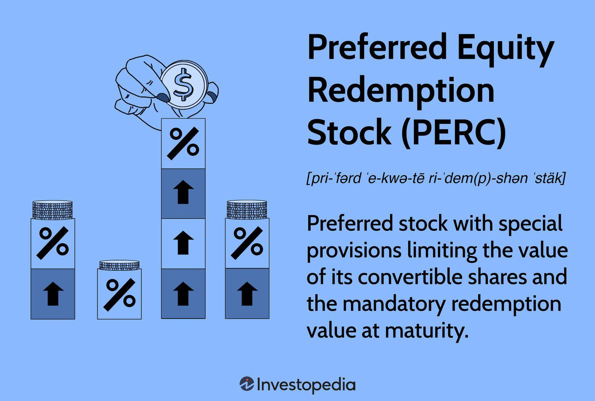

In the evolving landscape of financial instruments, Preferred Redeemable Increased Dividend Equity Securities (PRIDES) have emerged as a novel investment tool. These securities are synthetic in nature, designed to offer a blend of equity and fixed income characteristics. This unique combination makes PRIDES particularly attractive to investors who are in search of both capital appreciation and steady income streams.

PRIDES are structured to include both a forward contract for the purchase of the issuer’s underlying security and an interest-bearing component. This duality allows them to provide stable cash flows through interest payments while also enabling investors to participate in the capital gains that may arise upon conversion into common stock. As such, PRIDES serve as a hybrid investment vehicle, incorporating features typically associated with both debt and equity instruments.



The financial benefits of investing in PRIDES are amplified by their higher dividend yield compared to traditional common stocks, positioning them as a reliable source of income. Additionally, the securities’ mandatory conversion feature ensures that investors will eventually hold common stock, thus participating in any potential capital gains that may result from an increase in the stock's market value.

A further layer of sophistication in the management of these securities is introduced through algorithmic trading, which has revolutionized the market for complex financial instruments like PRIDES. Algorithms help in efficiently managing the timing and execution of trades, thereby optimizing the balance between income and capital appreciation for investors.

However, like all financial products, PRIDES come with certain risks. These include sensitivity to interest rate fluctuations and reliance on the issuer's financial stability. Investors must also be cognizant of the compulsory conversion process and any potential changes to dividend policies that could impact their investment.

This article will explore the intricacies of PRIDES, focusing on their dividends and examining the role of algorithmic trading in their management. Through this discussion, it aims to provide a comprehensive understanding of PRIDES as a compelling investment vehicle in today's dynamic financial environment.

## Table of Contents

## Understanding PRIDES

Preferred Redeemable Increased Dividend Equity Securities (PRIDES) are innovative financial instruments designed to offer a blend of characteristics from both equity and fixed-income investments. These securities are composed of two main components: a forward contract and an interest-bearing element. The forward contract component obligates the holder to purchase the issuer's underlying equity security, which typically results in eventual conversion into the company’s common stock. This conversion feature allows investors to benefit from any potential appreciation in the underlying shares, mirroring the potential for capital gains common to equity investments.

The interest-bearing component of PRIDES is structured to provide investors with a regular income stream, offering stable cash flows reminiscent of traditional fixed-income products, such as bonds. This component can take the form of periodic coupon payments that offer a predetermined rate of return, thus compensating investors during the period leading to the conversion into common equity. This dual-structure allows PRIDES to appeal to investors looking for both income stability and growth potential.

Mathematically, if the value of the PRIDES security at maturity is split into these two components, the present value of the expected cash flows from interest payments can be expressed as:

$$
PV = \sum_{t=1}^{T} \frac{C}{(1 + r)^t}
$$

where:
- $PV$ is the present value of the interest payments,
- $C$ is the cash flow from the periodic interest payment,
- $r$ is the discount rate (which may reflect the yield on similar risk assets),
- $t$ is the time period of the cash flow, and
- $T$ is the total number of periods until maturity.

Through PRIDES, investors have the opportunity to secure returns from the dividend-like income, along with participating in the equity upside when the securities convert into common stock. This combination tailors a more diversified risk-return profile that attempts to capture benefits from both sides of the investment spectrum, offering a compelling choice for those seeking to balance income generation with capital appreciation potential.

## PRIDES Dividend Benefits

Preferred Redeemable Increased Dividend Equity Securities (PRIDES) present a compelling advantage over common stocks through their ability to deliver higher dividend yields. This characteristic offers investors a dependable income stream, which can be particularly attractive in periods of market [volatility](/wiki/volatility-trading-strategies) or low interest rates. The structure of PRIDES combines elements of preferred shares, emphasizing dividend payouts, and convertible securities, which provide a pathway to equity ownership.

A key feature of PRIDES is the mandatory conversion into common stock. This conversion ensures that investors, while enjoying higher dividends initially, eventually gain equity exposure. The conversion mechanism is designed to align with the maturity or a predetermined date outlined in the security's terms, facilitating a transition from a fixed-income focus to equity participation. This transition potentially enables investors to capitalize on any appreciation in the issuer's common stock.

The benefit of higher dividend yields is tied to the PRIDES' designed intent to offer above-average income relative to common stocks. By doing so, they provide a balance between the reliability of fixed interest-like payments and the opportunity for capital gains upon the conversion to common stock. As a result, investors can utilize PRIDES as a strategic tool in their portfolio to achieve a desired balance of income and growth.

The elevated dividend yield of PRIDES is typically calculated by assessing the fixed income component of the security. If we denote the dividend yield by $Y_d$, the formula is:

$$
Y_d = \frac{\text{Annual Dividend}}{\text{Market Price of PRIDES}}
$$

This yield is monitored against potential capital appreciation from the future holding of common stock. Investors should assess both yields when deciding on the long-term placement of PRIDES within their portfolio. By integrating the benefits of stable income and mandatory conversion, PRIDES can effectively satisfy the diverse objectives of income-seeking and growth-oriented investors.

## Algorithmic Trading in PRIDES

Algorithmic trading has become a crucial component in the management of Preferred Redeemable Increased Dividend Equity Securities (PRIDES). This automated trading strategy uses advanced mathematical models and data analysis to make superior investment decisions rapidly, minimizing the role of human intervention.

Algorithms optimize trading strategies by handling complex calculations and large datasets efficiently, which is particularly beneficial for securities like PRIDES. These securities have multiple components, including a forward contract and an interest-bearing element, necessitating sophisticated systems to manage them effectively.

One of the significant advantages of using [algorithmic trading](/wiki/algorithmic-trading) for PRIDES is the timing and precision in executing trades. Algorithms can process a vast array of market data to determine the optimal moments for buying or selling. This capability is instrumental in balancing income from interest payments and potential capital gains from converting PRIDES into common stock. The complexity of PRIDES requires pinpoint accuracy, which is where algorithmic trading truly excels.

For instance, a basic algorithmic trading strategy can be executed using Python as follows:

```python
import pandas as pd
import numpy as np

def moving_average_strategy(prices, window_short, window_long):
    short_ma = prices.rolling(window=window_short).mean()
    long_ma = prices.rolling(window=window_long).mean()
    signal = (short_ma > long_ma).astype(int).diff()
    return signal

prices = pd.Series([100, 102, 104, 103, 107, 110, 115, 118])
signal = moving_average_strategy(prices, window_short=3, window_long=5)

print("Trading Signals:\n", signal)
```

This simple moving average crossover strategy detects trading signals by analyzing short and long-term price trends. Such strategies can be adapted and enhanced with more sophisticated techniques to suit the specific requirements of trading PRIDES.

The automation allows traders to react instantly to market changes, thereby maximizing opportunities for returns or minimizing potential losses. Additionally, algorithms can adjust the timing of trades to optimize the income from interest payments, ensuring a steady cash flow while still positioning for capital growth.

In conclusion, algorithmic trading facilitates efficient management of PRIDES by executing trades that optimize both income and potential for capital appreciation. Its ability to process and act on vast amounts of data in a short period provides a key edge in managing complex securities.

## Considerations and Risks

Preferred Redeemable Increased Dividend Equity Securities (PRIDES) offer a unique blend of equity and income features, but investing in these instruments is not without its challenges and risks. One of the primary concerns involves [interest rate](/wiki/interest-rate-trading-strategies) fluctuations. PRIDES, like many fixed-income investments, are sensitive to changes in interest rates. When interest rates rise, the present value of future cash flows from PRIDES can decrease, potentially leading to a decline in their market value. This sensitivity necessitates a consideration of the current interest rate environment and future expectations.

Another significant risk is the financial stability of the issuer. PRIDES are typically issued by corporations, and their value is inherently tied to the company's financial health. An issuer's deteriorating financial condition could lead to issues such as reduced dividend payments or even default. Investors must therefore conduct thorough due diligence on the issuer's financial statements, credit ratings, and industry position to assess the likelihood of continued financial stability.

Compulsory conversion is a feature of PRIDES that can present both opportunities and risks. Upon maturity, PRIDES are converted into shares of the issuing company's common stock, mandatorily. This conversion means that investors must transition from a fixed-income investment to a direct equity stake, which may involve increased volatility and exposure to market risks. The precise conversion terms are outlined in the issuance agreement, and these can significantly impact the investment outcome. Additionally, factors such as market conditions at the time of conversion and the potential for dilution should be considered.

Potential changes in dividend policies also pose a risk to PRIDES investors. While PRIDES may initially offer attractive dividend yields, these are not guaranteed and can be altered if the issuer faces financial difficulties or changes its capital allocation strategy. Investors should remain vigilant regarding announcements or indications of potential changes to dividend policies to mitigate unforeseen impacts on their income stream.

In summary, while PRIDES provide valuable investment opportunities through their dual characteristics of income and equity participation, understanding these associated risks and maintaining informed oversight are crucial for managing potential downsides.

## Conclusion

Preferred Redeemable Increased Dividend Equity Securities (PRIDES) provide investors with a unique investment opportunity by combining the features of both debt and equity instruments. These hybrid securities are designed to cater to investors who seek the dual benefits of stable income through dividends and the potential for capital appreciation. The structured nature of PRIDES allows them to offer a higher dividend yield compared to traditional common stocks, alongside the prospect of benefitting from the issuer's growth upon mandatory conversion into common equity.

The advent of algorithmic trading has enhanced the investment value of PRIDES by enabling precise management and execution of trades. Algorithms are capable of processing vast amounts of market data to make informed trading decisions, thereby optimizing the timing of trade executions to align with the investor's desired balance between income generation and capital gain potential. This integration allows for a more informed approach in managing the inherent risks associated with PRIDES, such as interest rate sensitivity and the financial health of the issuing entity.

In conclusion, PRIDES stand as a notable investment option for those looking to diversify their portfolio with a security that offers predictable income while retaining equity-like growth potential. The strategic use of algorithmic trading can further augment the effectiveness of investing in PRIDES, allowing investors to potentially enhance their returns by efficiently navigating the complexities of income and risk management. As financial markets continue to evolve, PRIDES and similar hybrid investment vehicles may play an increasingly important role in a diversified investment strategy.

## References & Further Reading

[1]: Bergstra, J., Bardenet, R., Bengio, Y., & Kégl, B. (2011). ["Algorithms for Hyper-Parameter Optimization."](https://dl.acm.org/doi/10.5555/2986459.2986743) Advances in Neural Information Processing Systems 24.

[2]: ["Advances in Financial Machine Learning"](https://www.amazon.com/Advances-Financial-Machine-Learning-Marcos/dp/1119482089) by Marcos Lopez de Prado

[3]: ["Evidence-Based Technical Analysis: Applying the Scientific Method and Statistical Inference to Trading Signals"](https://www.amazon.com/Evidence-Based-Technical-Analysis-Scientific-Statistical/dp/0470008741) by David Aronson

[4]: ["Machine Learning for Algorithmic Trading"](https://github.com/stefan-jansen/machine-learning-for-trading) by Stefan Jansen

[5]: ["Quantitative Trading: How to Build Your Own Algorithmic Trading Business"](https://github.com/LucindaYa/quant-resources/blob/master/Quantitative%20Trading%20How%20to%20Build%20Your%20Own%20Algorithmic%20Trading%20Business.pdf) by Ernest P. Chan