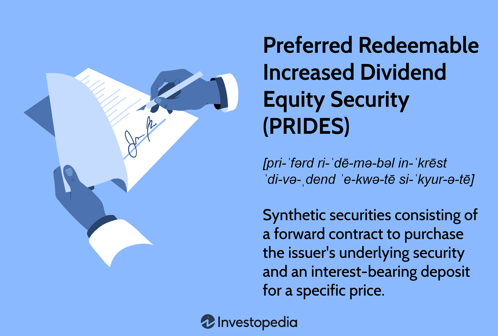

## Table of Contents

## What is a Preferred Redeemable Increased Dividend Equity Security (PRIDES)?

A Preferred Redeemable Increased Dividend Equity Security, or PRIDES, is a type of investment that combines features of both stocks and bonds. It is designed to give investors a steady income through dividends, which are payments made by the company to its shareholders. PRIDES are special because they promise to increase these dividend payments over time, making them attractive to investors looking for growing income.

PRIDES also have a feature called redeemability, which means that the issuing company can buy them back from investors at a set price after a certain period. This gives the company flexibility in managing its finances. For investors, PRIDES can be a good option if they want a more predictable income stream compared to regular stocks, while still having the potential for the value of their investment to grow.

## How does a PRIDES differ from a regular preferred stock?

A PRIDES is different from regular preferred stock mainly because of its increasing dividends and the option for the company to buy it back. With regular preferred stock, the dividends usually stay the same and don't increase over time. But with PRIDES, the dividends go up, which means investors can get more money as time goes on. This makes PRIDES a good choice for people who want their income to grow.

Another big difference is that PRIDES can be redeemed by the company. This means the company can choose to buy back the PRIDES from investors at a set price after a certain time. Regular preferred stock usually doesn't have this feature. So, if you own PRIDES, the company might decide to redeem them, giving you your money back plus any dividends you've earned. This gives the company more control over its finances but can also affect investors' plans.

## What are the key features of a PRIDES?

A PRIDES is a special kind of investment that mixes parts of stocks and bonds. It promises to pay investors more money over time through dividends, which are like regular payments from the company to the people who own its stock. This means if you buy a PRIDES, you can expect your income from it to grow as time goes on. This is different from regular preferred stock, where the dividends usually stay the same.

Another important feature of a PRIDES is that the company can buy it back from investors. This is called redemption, and it happens at a set price after a certain time. This gives the company a way to manage its money better because they can decide when to buy back the PRIDES. For investors, this means they might get their money back sooner than expected, along with the dividends they've earned. So, PRIDES can be a good choice if you want your income to increase and are okay with the possibility that the company might redeem it early.

## Who typically issues PRIDES and why?

Companies that need money to grow or to pay off debts often issue PRIDES. These companies might be looking for a way to raise money that is different from just borrowing from a bank or issuing regular stocks. By issuing PRIDES, they can attract investors who are looking for a steady and growing income. This is because PRIDES promise to increase the dividends over time, which means investors get more money as the years go by.

Another reason companies issue PRIDES is that they can buy them back later if they want. This gives the company flexibility. If the company's financial situation changes and they have extra money, they can redeem the PRIDES at a set price. This helps the company manage its finances better. So, PRIDES are a good choice for companies that want to raise money now but also keep control over their financial future.

## What are the benefits of investing in PRIDES for an individual investor?

Investing in PRIDES can be a good choice for an individual investor who wants a steady and growing income. PRIDES promise to increase the dividends over time, which means you get more money as the years go by. This can be really helpful if you're planning for retirement or just want your investment to pay you more each year. It's like getting a raise on your investment, which can help you keep up with inflation or just have more money to spend.

Another benefit of PRIDES is that they offer a bit of security. Since the company can buy back the PRIDES at a set price after a certain time, you know you might get your money back sooner than expected. This can be comforting if you're worried about the ups and downs of the stock market. Plus, even if the company decides to redeem the PRIDES, you'll still get the dividends you've earned up to that point. So, PRIDES can be a good middle ground between the steady income of bonds and the potential growth of stocks.

## What are the risks associated with PRIDES?

One risk of investing in PRIDES is that the company might not be able to keep paying the increasing dividends. If the company runs into financial trouble, it might have to cut or stop the dividends altogether. This means your expected growing income could suddenly stop or shrink, which can be a big problem if you were counting on that money.

Another risk is that the company might decide to redeem the PRIDES earlier than you expected. If you were planning to hold onto the PRIDES for a long time to get those increasing dividends, you might be disappointed if the company buys them back. Also, if the redemption happens when the stock market is doing well, you might miss out on potential gains from other investments.

Lastly, like any investment, PRIDES can lose value if the company's overall performance declines. If the company's stock price goes down, the value of your PRIDES could also drop. This means you might not be able to sell them for as much as you hoped if you need to get your money out quickly. So, it's important to think about these risks before deciding to invest in PRIDES.

## How is the dividend structure of a PRIDES determined?

The dividend structure of a PRIDES is set when the company issues it. It's like a promise from the company to pay you more money over time. The company decides how much the dividends will start at and how much they will increase each year. This plan is written down in the terms of the PRIDES, so everyone knows what to expect.

For example, a company might say the dividends will start at $1 per share and go up by 5% each year. So, the next year you would get $1.05 per share, and the year after that $1.1025 per share, and so on. This way, the investors can see their income grow over time. But, the company has to make sure it can keep up with these payments, or it might have to change the plan if it runs into money trouble.

## Can you explain the redemption process of PRIDES?

The redemption process of PRIDES is when the company decides to buy back the investment from the investors. This happens at a set price that was decided when the PRIDES were first issued. The company can choose to redeem the PRIDES after a certain time, which is also set at the beginning. When the company decides to do this, they will tell the investors, and then they will pay them the set price for each PRIDES they own.

This redemption can be good or bad for investors. On the good side, it means you get your money back, plus any dividends you've earned up to that point. But on the bad side, if you were hoping to keep getting those increasing dividends for a long time, you might be disappointed. Also, if the stock market is doing well when the company redeems the PRIDES, you might miss out on bigger gains you could have made with other investments. So, it's a bit of a mixed bag for investors when the company decides to redeem the PRIDES.

## How do PRIDES fit into a diversified investment portfolio?

PRIDES can be a good addition to a diversified investment portfolio because they offer a mix of income and potential growth. They are like a middle ground between stocks and bonds. With PRIDES, you get regular dividends that increase over time, which means your income grows. This can be really helpful if you want a steady income that also goes up, unlike regular bonds where the payments stay the same. Plus, since PRIDES are tied to the company's stock, there's a chance their value could go up, giving you the growth potential that comes with stocks.

However, it's important to think about how PRIDES fit with the rest of your investments. They can help balance out riskier investments like regular stocks because they offer more predictable income. But, they also come with their own risks, like the chance that the company might not be able to keep paying those increasing dividends or might decide to buy back the PRIDES sooner than you expect. So, adding PRIDES to your portfolio can help you spread out your risks and rewards, but you need to keep an eye on how they work with everything else you're investing in.

## What are the tax implications of holding PRIDES?

When you hold PRIDES, you have to think about taxes on the dividends you get. The dividends are usually taxed as regular income, just like the money you earn from a job. This means the tax rate could be higher than if you were getting dividends from regular stocks, which might be taxed at a lower rate. So, it's important to know that the growing dividends from PRIDES could mean you owe more in taxes each year as those dividends increase.

If the company decides to redeem the PRIDES, there could be taxes on any profit you make. If you bought the PRIDES for less than the price the company pays to redeem them, the difference is a capital gain. Capital gains are usually taxed at a lower rate than regular income, but it depends on how long you held the PRIDES. If you held them for more than a year, you might pay a lower long-term capital gains tax. If it was less than a year, you'll pay a higher short-term capital gains tax, which is the same as your regular income tax rate. So, understanding these tax rules can help you plan better when investing in PRIDES.

## How do market conditions affect the performance of PRIDES?

Market conditions can have a big impact on how well PRIDES do. If the stock market is doing well, the value of the company that issued the PRIDES might go up. This can make the PRIDES more valuable because they are tied to the company's stock. Also, if the economy is strong, the company might have more money to pay those growing dividends, which is good for investors. But if the market goes down, the value of the PRIDES could drop too. And if the company is having a hard time because of the economy, it might not be able to keep paying those increasing dividends, which could be bad for investors.

Another way market conditions affect PRIDES is through interest rates. If interest rates go up, other investments like bonds might start to look more attractive because they offer higher returns. This could make PRIDES less popular, and their value might go down. On the other hand, if interest rates are low, PRIDES could be more appealing because their growing dividends might be better than what you can get from bonds. So, it's important to keep an eye on the market and interest rates when you're thinking about investing in PRIDES.

## What advanced strategies can be used when trading PRIDES?

One advanced strategy for trading PRIDES is to use them as part of a hedging strategy. If you own a lot of regular stocks, you might be worried about the market going down. You can buy PRIDES to help balance out that risk. Since PRIDES give you growing dividends, they can provide a steady income even if the stock market is not doing well. This way, if your regular stocks lose value, the income from PRIDES can help cushion the blow. It's like having a safety net that also grows over time.

Another strategy is to trade PRIDES based on [interest rate](/wiki/interest-rate-trading-strategies) predictions. If you think interest rates are going to go down, PRIDES might become more valuable because their growing dividends will be more attractive than the lower returns from bonds. You could buy PRIDES before the interest rates drop and then sell them when their value goes up. On the other hand, if you think interest rates will go up, you might want to sell your PRIDES before that happens because their value could go down as people move their money to bonds with higher returns. This way, you can try to make money by predicting how interest rates will change.

## What is Understanding PRIDES?

Preferred Redeemable Increased Dividend Equity Securities (PRIDES) are innovative financial instruments designed to offer a blend of characteristics from both equity and fixed-income investments. These securities are composed of two main components: a forward contract and an interest-bearing element. The forward contract component obligates the holder to purchase the issuer's underlying equity security, which typically results in eventual conversion into the company’s common stock. This conversion feature allows investors to benefit from any potential appreciation in the underlying shares, mirroring the potential for capital gains common to equity investments.

The interest-bearing component of PRIDES is structured to provide investors with a regular income stream, offering stable cash flows reminiscent of traditional fixed-income products, such as bonds. This component can take the form of periodic coupon payments that offer a predetermined rate of return, thus compensating investors during the period leading to the conversion into common equity. This dual-structure allows PRIDES to appeal to investors looking for both income stability and growth potential.

Mathematically, if the value of the PRIDES security at maturity is split into these two components, the present value of the expected cash flows from interest payments can be expressed as:

$$
PV = \sum_{t=1}^{T} \frac{C}{(1 + r)^t}
$$

where:
- $PV$ is the present value of the interest payments,
- $C$ is the cash flow from the periodic interest payment,
- $r$ is the discount rate (which may reflect the yield on similar risk assets),
- $t$ is the time period of the cash flow, and
- $T$ is the total number of periods until maturity.

Through PRIDES, investors have the opportunity to secure returns from the dividend-like income, along with participating in the equity upside when the securities convert into common stock. This combination tailors a more diversified risk-return profile that attempts to capture benefits from both sides of the investment spectrum, offering a compelling choice for those seeking to balance income generation with capital appreciation potential.

## What are the benefits of PRIDES dividends?

Preferred Redeemable Increased Dividend Equity Securities (PRIDES) present a compelling advantage over common stocks through their ability to deliver higher dividend yields. This characteristic offers investors a dependable income stream, which can be particularly attractive in periods of market [volatility](/wiki/volatility-trading-strategies) or low interest rates. The structure of PRIDES combines elements of preferred shares, emphasizing dividend payouts, and convertible securities, which provide a pathway to equity ownership.

A key feature of PRIDES is the mandatory conversion into common stock. This conversion ensures that investors, while enjoying higher dividends initially, eventually gain equity exposure. The conversion mechanism is designed to align with the maturity or a predetermined date outlined in the security's terms, facilitating a transition from a fixed-income focus to equity participation. This transition potentially enables investors to capitalize on any appreciation in the issuer's common stock.

The benefit of higher dividend yields is tied to the PRIDES' designed intent to offer above-average income relative to common stocks. By doing so, they provide a balance between the reliability of fixed interest-like payments and the opportunity for capital gains upon the conversion to common stock. As a result, investors can utilize PRIDES as a strategic tool in their portfolio to achieve a desired balance of income and growth.

The elevated dividend yield of PRIDES is typically calculated by assessing the fixed income component of the security. If we denote the dividend yield by $Y_d$, the formula is:

$$
Y_d = \frac{\text{Annual Dividend}}{\text{Market Price of PRIDES}}
$$

This yield is monitored against potential capital appreciation from the future holding of common stock. Investors should assess both yields when deciding on the long-term placement of PRIDES within their portfolio. By integrating the benefits of stable income and mandatory conversion, PRIDES can effectively satisfy the diverse objectives of income-seeking and growth-oriented investors.

## References & Further Reading

[1]: Bergstra, J., Bardenet, R., Bengio, Y., & Kégl, B. (2011). ["Algorithms for Hyper-Parameter Optimization."](https://dl.acm.org/doi/10.5555/2986459.2986743) Advances in Neural Information Processing Systems 24.

[2]: ["Advances in Financial Machine Learning"](https://www.amazon.com/Advances-Financial-Machine-Learning-Marcos/dp/1119482089) by Marcos Lopez de Prado

[3]: ["Evidence-Based Technical Analysis: Applying the Scientific Method and Statistical Inference to Trading Signals"](https://www.amazon.com/Evidence-Based-Technical-Analysis-Scientific-Statistical/dp/0470008741) by David Aronson

[4]: ["Machine Learning for Algorithmic Trading"](https://github.com/stefan-jansen/machine-learning-for-trading) by Stefan Jansen

[5]: ["Quantitative Trading: How to Build Your Own Algorithmic Trading Business"](https://github.com/LucindaYa/quant-resources/blob/master/Quantitative%20Trading%20How%20to%20Build%20Your%20Own%20Algorithmic%20Trading%20Business.pdf) by Ernest P. Chan