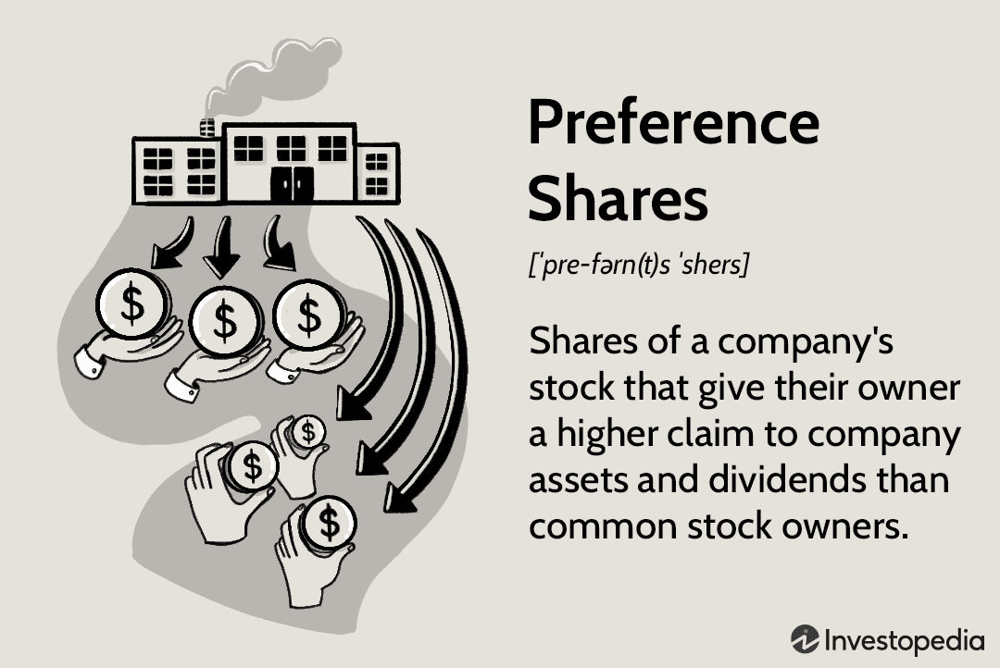

In today's financial landscape, technological advancements and innovation are fundamentally altering investment strategies. Among the prominent developments, preferred stock and algorithmic trading have emerged as areas of significant focus. Preferred stock represents a unique class of equity securities that offer holders advantageous claims on dividends and assets compared to common shareholders. This blend of features situates preferred stock between common equity and debt instruments, providing investors with both stable income and reduced risk exposure.

Algorithmic trading, often referred to as algo trading, employs computer algorithms to automate and execute trades at speeds and frequencies that human traders cannot match. By leveraging large datasets and sophisticated algorithms, it allows for higher precision in trading decisions, minimizes the influence of human emotions, and aims to enhance market efficiency. This technique is particularly valuable in managing high volumes of transactions and optimizing execution timing to achieve favorable pricing.



The intersection of preferred stock investment and algorithmic trading introduces compelling opportunities for modern investors. By integrating algorithmic strategies, investors can effectively enhance the management of preferred stock portfolios. This synergy promises to maximize returns through improved timing and execution of trades, optimizing dividend income and capital appreciation potential.

Understanding both preferred stock and algorithmic trading is crucial for investors aiming to optimize their portfolios in a rapidly evolving financial ecosystem. The exploration of how these elements interact offers insights into the future of investment strategies, ensuring competitiveness and adaptability in a dynamic market environment.

## Table of Contents

## What is Preferred Stock?

Preferred stock is a distinct category of equity that combines features of both common stock and debt instruments, providing unique advantages to investors. Unlike common stock, preferred stockholders typically do not possess voting rights, meaning they cannot vote on corporate matters like electing board members. However, they gain priority over common stockholders regarding dividend payments and claim to assets in the event of company liquidation. This priority makes preferred stocks an appealing option for investors seeking stable income.

Preferred stock can take various forms, each with specific characteristics tailored to different investment goals. Cumulative preferred stock ensures that if a company misses dividend payments, these unpaid dividends accumulate and must be paid out before any dividends can be distributed to common shareholders. This feature provides an additional layer of security for income-seeking investors.

Convertible preferred stock offers the possibility to convert these shares into a predetermined number of common shares, often at the shareholder's discretion. This provides the potential to benefit from the company's capital growth while still enjoying the relatively stable dividends associated with preferred stock. Participating preferred stock goes a step further by allowing holders to receive extra dividends if the company achieves certain financial goals, providing additional income opportunities aligned with company performance.

In comparison to common stock and bonds, preferred stock serves a hybrid role within an investment portfolio. Like bonds, preferred stocks offer fixed dividend payments, providing predictable income streams similar to bond interest. However, unlike bonds, the dividends from preferred stocks are generally not obligations the company must meet, meaning they can be suspended without placing the company in default. This gives corporations flexibility in cash flow management while positioning preferred stock as riskier than bonds but often less volatile than common stocks.

Overall, the inclusion of preferred stock in an investment portfolio can contribute to a balanced and diversified approach, offering both income stability and the potential for growth characteristics. Investors analyzing preferred stock should consider the specific attributes of the preferred shares offered, their conversion options, dividend yield, and their role in context with broader market conditions and investment goals.

## Understanding Algorithmic Trading

Algorithmic trading, commonly referred to as algo trading, is a sophisticated form of financial trading that utilizes algorithms, or complex sets of rules, to make trading decisions. These algorithms are implemented through computer programs to execute trades automatically, often at speeds and frequencies beyond human capability.

A fundamental advantage of [algorithmic trading](/wiki/algorithmic-trading) is its ability to process and analyze substantial volumes of data quickly and execute orders with minimal latency. This results in high-speed trading, which is critical in markets where price rapidly changes, offering the potential for profits through instantaneous trading decisions. A typical trading algorithm might monitor numerous variables, such as price, [volume](/wiki/volume-trading-strategy), and timing, to determine optimal trading opportunities and execute trades electronically without human intervention.

One primary benefit of algo trading is the reduction of human emotions in trading activities. Emotional biases, such as fear or greed, can lead to irrational trading decisions that negatively impact portfolio performance. By automating the trading process, algorithmic strategies adhere strictly to predefined rules, promoting consistency and discipline over time.

Efficiency in executing trades is another considerable advantage. Algo trading systems can place orders in fractions of a second, far quicker than human traders. This increased efficiency further translates into reduced transaction costs. For instance, optimizing the timing of a trade to occur when [liquidity](/wiki/liquidity-risk-premium) is abundant minimizes the market impact and slippage costs.

**Technical Requirements**

Successful algorithmic trading requires a robust technological framework. A high-speed internet connection and direct access to trading exchanges are essential to capitalize on minute market movements. Additionally, powerful computing resources are necessary to analyze data and implement algorithms in real-time. Traders must also have access to high-quality data feeds to ensure that trading decisions are based on current, accurate information.

Building an algorithmic trading system involves several components:

1. **Data Analysis and Modeling**: This includes developing mathematical models to identify profitable trading opportunities.

2. **Strategy Implementation**: Writing algorithms that translate trading models into actions using programming languages such as Python or C++.

3. **Backtesting**: Testing algorithms on historical data to evaluate performance without risking actual capital.

4. **Execution Systems**: Interfacing with trading platforms to execute buy/sell orders as determined by the algorithm.

**Common Strategies**

Two prevalent algorithmic trading strategies are trend-following and [arbitrage](/wiki/arbitrage). 

- **Trend-following Strategies**: These strategies capitalize on market trends and patterns, such as moving averages, channel breakouts, price level movements, etc. A simple example is using a crossover of short-term and long-term moving averages. For instance, a buy signal might be triggered when a short-term moving average crosses above a long-term moving average.

   ```python
   # Example of a simple moving average crossover strategy
   import numpy as np
   import pandas as pd

   def moving_average_crossover(data, short_window, long_window):
       signals = pd.DataFrame(index=data.index)
       signals['price'] = data['price']
       signals['short_mavg'] = data['price'].rolling(window=short_window, min_periods=1, center=False).mean()
       signals['long_mavg'] = data['price'].rolling(window=long_window, min_periods=1, center=False).mean()
       signals['signal'] = 0.0
       signals['signal'][short_window:] = np.where(signals['short_mavg'][short_window:] >
                                                   signals['long_mavg'][short_window:], 1.0, 0.0)   
       return signals
   ```

- **Arbitrage Strategies**: Exploit price differences across different markets or instruments to lock in risk-free profits. Statistical arbitrage strategies, for instance, utilize mathematical models to identify and exploit pricing inefficiencies. A common example is trading a stock on different exchanges where it is listed when there are price discrepancies.

In summary, algorithmic trading represents a significant advancement in modern trading, leveraging technology to conduct transactions with speed and precision that is unattainable by human traders alone. While it enhances trading efficiency and reduces costs, the success of any algorithmic strategy is predicated on the soundness of the underlying model and the robustness of the technology employed.

## Integrating Preferred Stock with Algo Trading

Combining preferred stock investments with algorithmic trading strategies can provide unique advantages to investors looking to maximize their portfolio's performance. Algorithmic trading, through its automation and high-speed execution, allows traders to optimize the timing and execution of preferred stock trades, which is crucial for capitalizing on dividend distributions and price movements.

One of the primary benefits of integrating algorithmic trading with preferred stock investments is the ability to execute trades swiftly when specific market conditions are met. For example, trading algorithms can be programmed to monitor certain indicators—such as price trends, volume changes, or economic announcements—and execute trades when pre-defined criteria are satisfied. This capability ensures that preferred stock trades are performed with minimal delay, potentially capturing more favorable price points and enhancing dividend yields.

To optimize preferred stock trades, algorithms can assess market conditions using a variety of strategies including [momentum](/wiki/momentum) trading, mean reversion, or arbitrage opportunities. Momentum trading, which capitalizes on existing market trends, can help identify when a preferred stock is gaining in value. Conversely, mean reversion strategies might be employed to purchase preferred stock when prices are perceived to have deviated temporarily from their intrinsic values.

Consider a case study where a [hedge fund](/wiki/hedge-fund-trading-strategies) utilizes algorithmic trading to manage a portfolio of preferred stocks. By employing a trend-following algorithm, the fund can automatically capture dividends and occasional capital gains by predicting upward trends in preferred stock prices and executing trades accordingly. This strategy could have been particularly effective during recent market conditions characterized by rapid information dissemination and [volatility](/wiki/volatility-trading-strategies), demonstrating enhanced returns compared to manual trading alone.

The integration of preferred stocks and algorithmic trading charts a [course](/wiki/best-algorithmic-trading-courses) towards the future of hybrid, technology-driven investment strategies. Enhanced by advancements in [machine learning](/wiki/machine-learning) and big data analytics, these approaches offer investors the tools to analyze massive datasets swiftly, identify opportunities, and make informed, timely decisions.

The risks associated with this integration cannot be overlooked. Algorithmic trading systems are subject to failures stemming from programming errors or unforeseen market conditions. Nevertheless, robust risk management frameworks and continual monitoring of algorithmic performance help mitigate these risks, ensuring the execution of trades aligns with the broader investment objectives.

Ultimately, marrying preferred stock investments with algorithmic trading represents a compelling avenue for sophisticated investors aiming to leverage technology for superior returns. As this integration evolves, its role in reshaping traditional investment approaches is likely to expand, driven by a continual quest for greater efficiency and effectiveness in financial markets.

## Advantages and Risks

Preferred stock and algorithmic trading each bring distinct benefits to the investment landscape, along with inherent risks that warrant careful consideration by investors.

Preferred stock is known for offering more predictable dividends compared to common stock, providing a level of income stability. This makes it appealing to risk-averse investors seeking a reliable yield. However, the absence of voting rights limits shareholder influence over company decisions, which can be a significant drawback for some investors. Additionally, preferred stock holds a hybrid position between common stock and bonds, often leading to price sensitivity based on [interest rate](/wiki/interest-rate-trading-strategies) movements, akin to bond investments.

Algorithmic trading, on the other hand, introduces a technological edge allowing for high-frequency trading with precision and reduced human emotional interference. The potential for substantial profits through rapid execution and data-driven strategies makes it an attractive tool for traders. Nonetheless, it is not without risks. Market volatility can be exacerbated by algorithmic systems, particularly when multiple algorithms act simultaneously based on similar signals. Additionally, technical failures, such as software bugs or hardware malfunctions, can lead to unintended trading outcomes and financial losses.

When integrating these two facets of investing, investors must be astute in managing risks. First, they should ensure a robust understanding of the algorithms being deployed. Assessing algorithms for [backtesting](/wiki/backtesting) data, stress testing under various market conditions, and continuous monitoring are critical components of risk management. Diversification remains a key strategy, reducing exposure to any single investment vehicle or algorithm.

Moreover, clear contingency plans should be established to mitigate the impact of technical failures. This includes having fail-safes such as algorithm kill switches, backup systems, and manual intervention protocols. Investors are advised to stay informed of regulatory changes, as these can impact the deployment and operation of trading algorithms.

The synergy of preferred stock with algorithmic trading presents opportunities for optimizing portfolio performance, yet demands heightened vigilance. By acknowledging and planning for the potential pitfalls, investors can better position themselves to harness the benefits of both strategies effectively.

## Conclusion

Investing in preferred stock with the aid of algorithmic trading offers a dynamic approach to modern finance, bridging traditional investment strategies with cutting-edge technology. By understanding both concepts and their complementary nature, investors can gain a competitive edge in today’s fast-paced markets. Preferred stock provides stable dividend income and a higher claim on assets compared to common stock, offering a reliable component for diversified portfolios. On the other hand, algorithmic trading enhances the precision and speed of executing trades, utilizing vast datasets and automated strategies to optimize investment returns.

The integration of these two elements is becoming increasingly relevant as technological advancements continue to reshape the financial landscape. Algorithmic trading, with its ability to analyze market conditions and execute trades with minimal human error, complements the reliability of preferred stock by ensuring optimal timing and execution of trades. This synergy not only maximizes potential returns but also provides a robust framework for risk management.

As technology continues to evolve, it is crucial for investors to stay informed and adapt to these changes. Understanding how preferred stock and algorithmic trading work together is essential for financial success. The exploration of these key elements underscores their potential in enhancing investment strategies, offering investors tools to navigate the complexities of modern finance. By incorporating these strategies, investors can enhance their portfolios and remain agile in an ever-changing market environment.

## References & Further Reading

[1]: Bergstra, J., Bardenet, R., Bengio, Y., & Kégl, B. (2011). ["Algorithms for Hyper-Parameter Optimization."](https://papers.nips.cc/paper/4443-algorithms-for-hyper-parameter-optimization) Advances in Neural Information Processing Systems 24.

[2]: ["Advances in Financial Machine Learning"](https://www.amazon.com/Advances-Financial-Machine-Learning-Marcos/dp/1119482089) by Marcos Lopez de Prado

[3]: ["Evidence-Based Technical Analysis: Applying the Scientific Method and Statistical Inference to Trading Signals"](https://www.amazon.com/Evidence-Based-Technical-Analysis-Scientific-Statistical/dp/0470008741) by David Aronson

[4]: ["Machine Learning for Algorithmic Trading"](https://github.com/stefan-jansen/machine-learning-for-trading) by Stefan Jansen

[5]: ["Quantitative Trading: How to Build Your Own Algorithmic Trading Business"](https://www.amazon.com/Quantitative-Trading-Build-Algorithmic-Business/dp/1119800064) by Ernest P. Chan