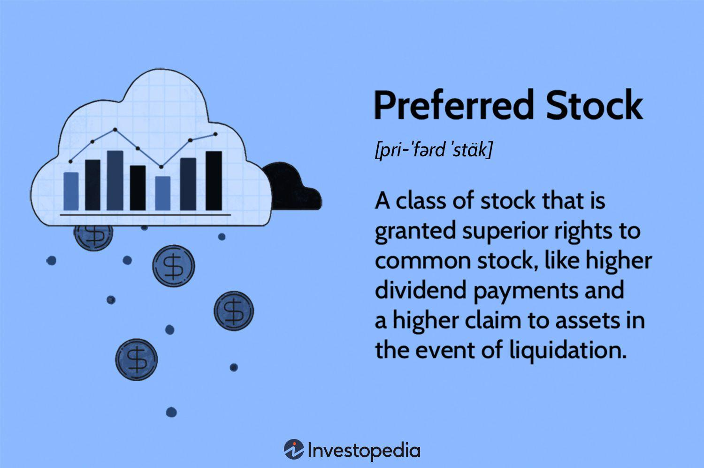

## Table of Contents

## What is preferred stock?

Preferred stock is a type of stock that companies issue to investors. It is different from common stock because it usually gives investors a fixed dividend, which is like a regular payment. This dividend is paid before any dividends are given to common stockholders. Preferred stockholders also have a higher claim on the company's assets if the company goes bankrupt, which means they get paid back before common stockholders.

However, preferred stockholders usually don't have voting rights, so they can't vote on company decisions like common stockholders can. This means they have less say in how the company is run. Because of the fixed dividends and higher claim on assets, preferred stock is often seen as less risky than common stock, but it also usually offers less potential for big gains. Companies might issue preferred stock to raise money without giving up control, since they don't have to give voting rights to these investors.

## How does preferred stock differ from common stock?

Preferred stock and common stock are two types of stocks that companies can issue to investors. The main difference is that preferred stock usually gives investors a fixed dividend, which is like a regular payment. This dividend is paid before any dividends are given to common stockholders. So, if a company is doing well and can pay dividends, preferred stockholders get their money first. On the other hand, common stock dividends can change and are only paid if the company decides to do so after paying preferred dividends.

Another big difference is what happens if the company goes bankrupt. Preferred stockholders have a higher claim on the company's assets, which means they get paid back before common stockholders. This makes preferred stock less risky. However, preferred stockholders usually don't get to vote on company decisions, while common stockholders do. This means common stockholders have more say in how the company is run. So, preferred stock can be seen as safer but with less potential for big gains, while common stock might be riskier but offers more voting power and potential for growth.

## What are the main types of preferred stock?

There are several types of preferred stock, but the main ones are cumulative and non-cumulative preferred stock. Cumulative preferred stock means that if a company misses a dividend payment, it has to pay it later before paying any dividends to common stockholders. This makes it safer for investors because they are sure to get their missed dividends eventually. On the other hand, non-cumulative preferred stock means that if a company misses a dividend payment, it doesn't have to pay it later. This type of stock is riskier for investors because they might not get their dividends if the company has a tough time.

Another type is convertible preferred stock. This kind of stock can be changed into a certain number of common stock shares. This can be good for investors because if the company does well, they can convert their preferred stock into common stock and maybe make more money. There's also callable preferred stock, which means the company can buy it back from investors at a certain price after a set time. This can be risky for investors because the company might call the stock back when it's not a good time for them.

## What are the advantages of investing in preferred stock?

One big advantage of investing in preferred stock is that it usually gives you a fixed dividend. This means you get a regular payment that doesn't change, which can be really helpful if you want steady income. Plus, you get your dividend before people who own common stock. So, if the company has money to pay dividends, you get paid first. This makes preferred stock less risky than common stock because you're more likely to get your money.

Another advantage is that if the company goes bankrupt, preferred stockholders get paid back before common stockholders. This higher claim on the company's assets makes preferred stock safer. Also, some types of preferred stock, like cumulative preferred stock, make sure you get any missed dividends later. This adds another layer of safety. So, if you want a safer investment with regular income, preferred stock can be a good choice.

## What are the risks associated with preferred stock?

One risk of investing in preferred stock is that it usually doesn't give you voting rights. This means you can't vote on important company decisions like common stockholders can. So, you have less say in how the company is run. Another risk is that if the company is doing really badly, it might not be able to pay the fixed dividends that preferred stockholders are supposed to get. This can be a problem if you're counting on that regular income.

Also, some types of preferred stock, like callable preferred stock, can be bought back by the company at a certain price after a set time. This can be risky because the company might decide to call the stock back when it's not a good time for you. For example, if interest rates go down, the company might call back the stock and issue new stock at a lower rate, leaving you with less income. So, while preferred stock can be safer than common stock in some ways, it still has its own set of risks.

## How does preferred stock affect a company's capital structure?

When a company issues preferred stock, it changes its capital structure by adding a type of financing that is different from debt or common stock. Preferred stock is like a middle ground between the two. It's not debt because it doesn't have to be paid back, but it's also not common stock because it usually doesn't give voting rights. By issuing preferred stock, a company can raise money without taking on more debt or giving up control to common stockholders. This can be good for the company because it keeps the debt level low and doesn't dilute the voting power of existing common stockholders.

However, adding preferred stock to the capital structure can also affect how the company manages its finances. Preferred stockholders get their dividends before common stockholders, so the company has to make sure it can pay these dividends regularly. This can limit the amount of money the company has left over for other things, like growing the business or paying common stock dividends. Also, if the company has a lot of preferred stock, it might make it harder to get loans because lenders might see the fixed dividend payments as a risk. So, while preferred stock can be a useful way to raise money, it needs to be managed carefully to keep the company's finances healthy.

## What are the tax implications of owning preferred stock?

When you own preferred stock, the tax implications can be different from owning common stock. The dividends you get from preferred stock are usually taxed as regular income. This means you pay taxes on them at the same rate as your salary or wages. This can be higher than the tax rate for qualified dividends from common stock, which are often taxed at a lower rate. So, if you're in a high tax bracket, the taxes on your preferred stock dividends might be more than what you'd pay on common stock dividends.

Another thing to think about is that if you sell your preferred stock for more than you paid for it, you might have to pay capital gains tax. This tax depends on how long you held the stock. If you held it for less than a year, it's a short-term capital gain, and you pay taxes on it at your regular income tax rate. If you held it for more than a year, it's a long-term capital gain, and you pay a lower tax rate. So, the tax you pay on preferred stock can depend on how long you keep it and how much money you make from selling it.

## How is the dividend of preferred stock determined?

The dividend of preferred stock is usually set when the stock is issued. It's often a fixed amount, which means it doesn't change. This fixed amount is usually given as a percentage of the stock's par value, which is like the stock's face value. For example, if a preferred stock has a par value of $100 and a dividend rate of 5%, the dividend would be $5 per year for each share. Companies like to set the dividend this way because it makes it easier for investors to know what they'll get.

Sometimes, the dividend can be set as a floating rate instead of a fixed rate. This means the dividend can change based on something like interest rates. For example, the dividend might be set to be a certain percentage above a benchmark rate, like the federal funds rate. This can be good for investors if interest rates go up because their dividends will go up too. But it can also be riskier because if interest rates go down, their dividends will go down as well. So, the way the dividend is determined can affect how safe or risky the preferred stock is for investors.

## Can preferred stock be converted into common stock? If so, how?

Yes, some preferred stock can be converted into common stock. This type of preferred stock is called convertible preferred stock. When you own convertible preferred stock, you have the option to change it into a certain number of common stock shares. The company decides how many common shares you get for each preferred share when they issue the stock. This can be good for you because if the company does well, you might make more money by converting your preferred stock into common stock.

The conversion usually happens at a set price, called the conversion price. For example, if the conversion price is $50 and you have one preferred share, you might be able to convert it into two common shares if the common stock is trading at $25 per share. You can choose when to convert your stock, but there might be a time limit or other rules set by the company. So, if you think the company will do well and the common stock price will go up, converting your preferred stock could be a smart move.

## What role does preferred stock play in corporate finance and restructuring?

Preferred stock plays an important role in corporate finance because it helps companies raise money without taking on more debt or giving up control. When a company issues preferred stock, it gets money from investors who want a steady income from fixed dividends. This can be really helpful for the company because it doesn't have to pay back the money like a loan, and it doesn't have to give voting rights to these investors like it would with common stock. So, the company can use this money to grow or pay off other debts without worrying about losing control or having to make big interest payments.

In corporate restructuring, preferred stock can be used to change the way a company is set up financially. For example, if a company is going through a tough time and needs to reorganize, it might issue preferred stock to get new money. This can help the company pay off some of its debts or invest in new projects without adding more risk. Also, if the company is merging with another company or going through a big change, preferred stock can be a way to keep things stable because the fixed dividends give investors a sense of security. So, preferred stock can be a useful tool for companies trying to manage their finances during big changes.

## How do market conditions influence the pricing of preferred stock?

Market conditions can really change how much people are willing to pay for preferred stock. When interest rates go up, the price of preferred stock usually goes down. This happens because new preferred stocks might offer higher dividends to match the higher interest rates, making the older ones with lower dividends less attractive. Also, if the economy is doing badly, people might not want to buy preferred stock because they're worried the company won't be able to pay the dividends. On the other hand, if the economy is doing well, more people might want to buy preferred stock because they think the company will keep paying the dividends.

Another thing that can affect the price of preferred stock is how the stock market is doing overall. If the stock market is going up, people might feel more confident and be willing to pay more for preferred stock. But if the stock market is going down, people might be scared and not want to buy preferred stock, which can make the price go down. So, the price of preferred stock can go up and down based on what's happening in the economy and the stock market.

## What are some advanced strategies for trading preferred stock?

One advanced strategy for trading preferred stock is to use convertible [arbitrage](/wiki/arbitrage). This means you buy the convertible preferred stock and at the same time, you sell short the common stock that the preferred stock can be converted into. The idea is to make money from the difference in price between the two. If the price of the common stock goes down, you make money from the short sale. If the price goes up, you can convert your preferred stock into common stock and make money that way. This strategy can be tricky because it involves understanding how the prices of both stocks move and how they relate to each other.

Another strategy is to trade preferred stock based on [interest rate](/wiki/interest-rate-trading-strategies) changes. When interest rates go up, the price of preferred stock usually goes down because new preferred stocks might offer higher dividends. So, you could sell your preferred stock before interest rates go up and buy it back when the price goes down. On the other hand, if you think interest rates will go down, you could buy preferred stock because the price might go up. This strategy needs you to keep a close eye on what's happening with interest rates and be ready to act quickly.

A third strategy is to use preferred stock in a dividend capture strategy. This means you buy the preferred stock just before the dividend is paid and then sell it right after you get the dividend. The goal is to make money from the dividend without holding onto the stock for a long time. This can work well if the stock price doesn't drop too much after the dividend is paid. But it's important to think about the costs of buying and selling the stock, like trading fees, because they can eat into your profits.

## References & Further Reading

[1]: Bergstra, J., Bardenet, R., Bengio, Y., & Kégl, B. (2011). ["Algorithms for Hyper-Parameter Optimization."](https://papers.nips.cc/paper/4443-algorithms-for-hyper-parameter-optimization) Advances in Neural Information Processing Systems 24.

[2]: ["Advances in Financial Machine Learning"](https://www.amazon.com/Advances-Financial-Machine-Learning-Marcos/dp/1119482089) by Marcos Lopez de Prado

[3]: ["Evidence-Based Technical Analysis: Applying the Scientific Method and Statistical Inference to Trading Signals"](https://www.amazon.com/Evidence-Based-Technical-Analysis-Scientific-Statistical/dp/0470008741) by David Aronson

[4]: ["Machine Learning for Algorithmic Trading"](https://github.com/stefan-jansen/machine-learning-for-trading) by Stefan Jansen

[5]: ["Quantitative Trading: How to Build Your Own Algorithmic Trading Business"](https://www.amazon.com/Quantitative-Trading-Build-Algorithmic-Business/dp/1119800064) by Ernest P. Chan