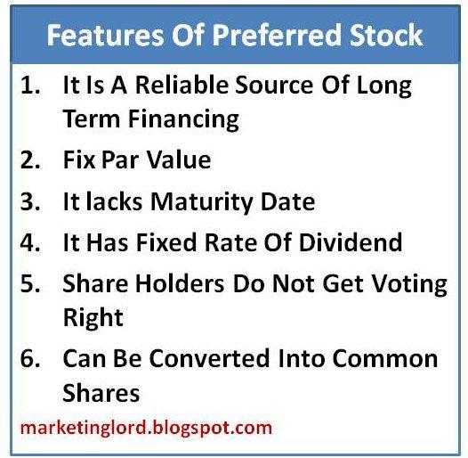

## Table of Contents

## What is preferred stock?

Preferred stock is a type of stock that companies issue to investors. It is different from common stock because it usually gives shareholders a fixed dividend, which is like a regular payment. This dividend is paid before any dividends are given to common stockholders. Preferred stockholders also have a higher claim on the company's assets if the company goes bankrupt.

However, preferred stockholders usually don't get to vote on company matters like common stockholders do. This means they have less say in how the company is run. Because of the fixed dividends and higher claim on assets, preferred stock is often seen as less risky than common stock. But, it might not grow in value as much as common stock over time.

## How does preferred stock differ from common stock?

Preferred stock and common stock are two different types of stocks that companies can issue. Preferred stock usually gives shareholders a fixed dividend, which is like a regular payment. This dividend is paid before any dividends are given to common stockholders. Also, if a company goes bankrupt, preferred stockholders have a higher claim on the company's assets than common stockholders. This means they get paid back before common stockholders if the company has to sell off its assets.

On the other hand, common stockholders usually have the right to vote on important company decisions, like who should be on the board of directors. Preferred stockholders typically don't get to vote. Because of the fixed dividends and higher claim on assets, preferred stock is often seen as less risky than common stock. However, common stock might grow in value more over time, which could mean bigger rewards for common stockholders if the company does well.

## What are the main types of preferred stock?

There are several types of preferred stock, but the main ones are cumulative and non-cumulative preferred stock. Cumulative preferred stock means that if a company misses a dividend payment, it has to pay it later before paying dividends to common stockholders. This makes it safer for investors because they know they will get their missed payments eventually. Non-cumulative preferred stock, on the other hand, does not have this feature. If a company misses a dividend payment, it does not have to pay it later. This makes non-cumulative preferred stock riskier for investors because they might not get all the dividends they were expecting.

Another type of preferred stock is convertible preferred stock. This type of stock can be turned into common stock at a set price. This can be good for investors because if the company does well, they can convert their preferred stock into common stock and possibly make more money. There is also participating preferred stock, which can get extra dividends if the company does really well. This type of stock can give investors a chance to earn more money if the company is successful.

## What are the benefits of investing in preferred stock?

Investing in preferred stock can be a good choice for people who want a steady income. Preferred stock usually pays a fixed dividend, which means you get a regular payment. This can be helpful if you need money coming in every month or quarter. Also, if a company has trouble paying dividends, preferred stockholders get paid before common stockholders. This makes preferred stock less risky because you are more likely to get your dividend payments.

Another benefit of preferred stock is that it gives you a higher claim on a company's assets if the company goes bankrupt. This means if the company has to sell off its things to pay back investors, preferred stockholders get paid back before common stockholders. This can make preferred stock a safer investment. However, preferred stock usually does not grow in value as much as common stock, so you might not make as much money if the company does really well.

## How does preferred stock impact a company's financial structure?

Preferred stock can change a company's financial structure by adding a layer of fixed costs. When a company issues preferred stock, it promises to pay a fixed dividend to the preferred stockholders before paying any dividends to common stockholders. This is like taking on a new kind of debt because the company has to make these payments regularly, no matter how it is doing. This can make the company's finances more stable because it knows exactly how much it has to pay out, but it can also make it harder for the company to grow if it has to use a lot of its money to pay these dividends.

Another way preferred stock impacts a company's financial structure is by affecting its balance sheet. Preferred stock is usually shown as a separate item on the balance sheet, between debt and common equity. This can make the company look less risky to investors because preferred stock is seen as less risky than common stock. However, it can also make the company's equity look smaller because preferred stock is not considered part of the common equity. This can affect how investors see the company and how much they are willing to pay for its stock.

## What are the voting rights associated with preferred stock?

Preferred stock usually does not come with voting rights. This means that people who own preferred stock cannot vote on important company decisions, like who should be on the board of directors or whether the company should merge with another company. This is different from common stock, where shareholders often get to vote on these things. The reason preferred stock does not have voting rights is because it is meant to be a safer investment, and the fixed dividends and higher claim on assets are seen as enough of a benefit.

However, there are some cases where preferred stock can have voting rights. For example, if the company misses a certain number of dividend payments, preferred stockholders might get the right to vote. This is a way to protect their investment and make sure the company does not ignore their needs. But even in these cases, the voting rights are usually limited and do not give preferred stockholders as much say in the company as common stockholders.

## How is the dividend payment process for preferred stock?

When a company issues preferred stock, it promises to pay a fixed dividend to the preferred stockholders. This dividend is usually paid out regularly, like every month or every three months. The company has to pay this dividend before it pays any dividends to common stockholders. This makes preferred stock a bit safer because you know you will get your payment before others.

If the company cannot pay the dividend on time, it depends on the type of preferred stock. For cumulative preferred stock, if the company misses a payment, it has to pay it later before paying dividends to common stockholders. This means the missed payments add up and have to be paid eventually. For non-cumulative preferred stock, if the company misses a payment, it does not have to pay it later. This makes non-cumulative preferred stock riskier because you might not get all the dividends you were expecting.

## What is the role of preferred stock in corporate financing?

Preferred stock plays an important role in how a company raises money. When a company needs money to grow or pay for things, it can sell preferred stock to investors. This is different from borrowing money because the company does not have to pay back the money it gets from selling preferred stock. Instead, it promises to pay a fixed dividend to the people who buy the preferred stock. This can be a good way for a company to get money without taking on more debt.

Another way preferred stock helps with corporate financing is by making the company's finances more stable. The fixed dividends that come with preferred stock are like a regular cost for the company, similar to paying rent or a loan. This can make it easier for the company to plan its money because it knows exactly how much it has to pay out. However, it can also make it harder for the company to grow if it has to use a lot of its money to pay these dividends. Overall, preferred stock can be a useful tool for companies to manage their money and grow.

## How can preferred stock be converted into common stock?

Preferred stock can be converted into common stock if it is a type called convertible preferred stock. This means that the people who own the preferred stock can choose to turn it into common stock at a certain price. The company decides this price when it issues the preferred stock. This can be good for investors because if the company does well, they can convert their preferred stock into common stock and possibly make more money.

The process of converting preferred stock into common stock is usually simple. The investor tells the company they want to convert their shares, and the company gives them the same number of common stock shares based on the conversion rate. For example, if the conversion rate is 2:1, the investor would get 2 common stock shares for every 1 preferred stock share they convert. This can be a good way for investors to take advantage of a company's success and possibly earn more money.

## What are the tax implications of holding preferred stock?

When you own preferred stock, you need to think about taxes. The dividends you get from preferred stock are usually taxed as regular income. This means they are taxed at your normal income tax rate, which can be higher than the tax rate for dividends from common stock. Sometimes, companies can pay "qualified dividends" which are taxed at a lower rate, but this is less common with preferred stock.

Another tax thing to know is that if you sell your preferred stock for more money than you paid for it, you might have to pay capital gains tax. This tax is on the profit you made from selling the stock. The rate for this tax depends on how long you held the stock. If you held it for more than a year, it's a long-term capital gain, which usually has a lower tax rate. If you held it for a year or less, it's a short-term capital gain, which is taxed at your regular income tax rate.

## How do market conditions affect the value of preferred stock?

Market conditions can change the value of preferred stock a lot. When interest rates go up, the value of preferred stock usually goes down. This is because preferred stock pays a fixed dividend, and when interest rates are higher, new investments might offer better returns. So, people might sell their preferred stock to buy these new investments, which makes the price of preferred stock drop. On the other hand, when interest rates go down, the value of preferred stock can go up because the fixed dividend looks more attractive compared to other investments.

The overall health of the economy also affects preferred stock. In good economic times, companies are more likely to pay their dividends on time, which makes preferred stock more valuable. But in bad economic times, if a company struggles to pay its dividends, the value of its preferred stock can drop. Also, if people think the economy is going to get worse, they might sell their preferred stock to buy safer investments, which can lower the price of preferred stock even more.

## What are the advanced strategies for trading preferred stock?

When trading preferred stock, one advanced strategy is to use convertible arbitrage. This means buying the preferred stock and at the same time, selling short the common stock that the preferred stock can be converted into. The idea is to make money from the difference in price between the two. If the price of the common stock goes down, you make money from the short sale. If the price of the preferred stock goes up, you make money from that too. This can be a good way to make money if you think the price of the common stock will not go up much, but the preferred stock will.

Another strategy is to trade preferred stock based on interest rate changes. Since preferred stock pays a fixed dividend, its value goes down when interest rates go up. So, if you think interest rates are going to go up, you might want to sell your preferred stock before it loses value. On the other hand, if you think interest rates are going to go down, you might want to buy preferred stock because its value will go up. This can be a good way to make money if you are good at predicting interest rate changes.

## References & Further Reading

[1]: Bergstra, J., Bardenet, R., Bengio, Y., & Kégl, B. (2011). ["Algorithms for Hyper-Parameter Optimization."](https://dl.acm.org/doi/10.5555/2986459.2986743) Advances in Neural Information Processing Systems 24.

[2]: ["Advances in Financial Machine Learning"](https://www.amazon.com/Advances-Financial-Machine-Learning-Marcos/dp/1119482089) by Marcos Lopez de Prado

[3]: ["Evidence-Based Technical Analysis: Applying the Scientific Method and Statistical Inference to Trading Signals"](https://www.amazon.com/Evidence-Based-Technical-Analysis-Scientific-Statistical/dp/0470008741) by David Aronson

[4]: ["Machine Learning for Algorithmic Trading"](https://github.com/stefan-jansen/machine-learning-for-trading) by Stefan Jansen

[5]: ["Quantitative Trading: How to Build Your Own Algorithmic Trading Business"](https://github.com/LucindaYa/quant-resources/blob/master/Quantitative%20Trading%20How%20to%20Build%20Your%20Own%20Algorithmic%20Trading%20Business.pdf) by Ernest P. Chan