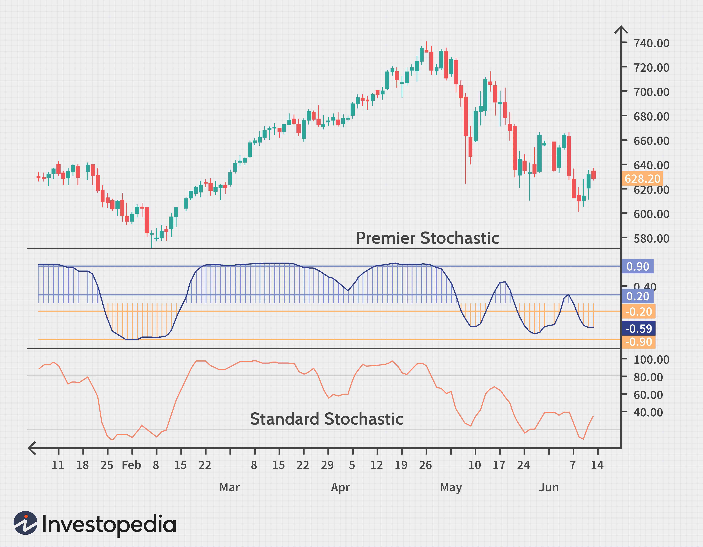

The stochastic oscillator is a fundamental component of technical analysis, serving as a valuable tool for traders seeking to identify potential market reversal points. Introduced by George Lane in the 1950s, this momentum indicator has maintained its importance in the arsenal of traders aiming to discern overbought and oversold market conditions. This article provides an in-depth exploration of the stochastic oscillator's mechanics, historical context, and its applications within both traditional trading settings and algorithmic trading frameworks.

The stochastic oscillator operates on the principle of price momentum, comparing a security's closing price to its price range over a specified period. It generates readings between 0 and 100, with values above 80 indicating overbought conditions and those below 20 suggesting oversold conditions. These insights are instrumental for traders as they develop strategies to optimize their trading approaches and enhance decision-making processes.



By comparing the stochastic oscillator with other indicators such as the Relative Strength Index (RSI), traders can better understand the nuances of market behavior and refine their strategies accordingly. This introduction outlines the critical role of the stochastic oscillator in improving trade precision and efficiency, emphasizing its utility in both manual and automated trading environments. Understanding its implications is essential for traders devoted to navigating the complexities of evolving markets.

## Table of Contents

## Understanding the Stochastic Oscillator

The stochastic oscillator is a widely-used momentum indicator that compares a security's closing price to its price range over a specified period. It is designed to predict potential market reversals by signaling overbought and oversold conditions, proving invaluable for traders in their decision-making processes. Operating within a scale of 0 to 100, the oscillator indicates overbought conditions when values exceed 80 and oversold conditions when they fall below 20.

Central to the stochastic oscillator are its two components: the %K and %D lines. The %K line, often referred to as the fast line, is calculated using the formula:

$$

\%K = \left( \frac{C - L}{H - L} \right) \times 100 
$$

where $C$ represents the latest closing price, $L$ is the lowest price over the look-back period, and $H$ is the highest price over the same period. The %D line, known as the signal line, is a simple moving average of the %K values, typically over three periods, providing a smoother representation of recent momentum.

The oscillator's core function is to gauge price [momentum](/wiki/momentum), allowing traders to anticipate potential market reversals by observing the speed and change of price movements. This can help traders to enter or [exit](/wiki/exit-strategy) trades more strategically by identifying when markets may be ready for a turn.

This indicator was developed by George Lane in the 1950s, and his contribution has left a lasting impact on technical analysis. Lane emphasized the importance of understanding market momentum and how prices tend to close near their highs in an upward trend and near their lows in a downward trend before a reversal occurs. This historical context underscores the stochastic oscillator's enduring significance in market analysis, where it continues to serve as a fundamental tool for traders globally.

## How the Stochastic Oscillator Works

The stochastic oscillator is a technical analysis tool used to evaluate price momentum by analyzing a security's closing price in relation to its price range over a specific period. This momentum indicator is particularly useful for identifying potential price reversals by signaling when an asset may be overbought or oversold.

The primary calculation of the stochastic oscillator involves two lines: %K and %D. The %K line, known as the fast line, is calculated using the formula:

$$
\%K = \frac{(C - L)}{(H - L)} \times 100
$$

where $C$ represents the current closing price, $L$ is the lowest price over the specified period, and $H$ is the highest price over the same period. This formula highlights the position of the current closing price relative to the chosen high-low range.

The %D line, or the signal line, is typically a three-period simple moving average of %K. This line serves to smooth out the [volatility](/wiki/volatility-trading-strategies) of %K and helps traders identify significant trends more clearly through crossovers and divergences.

Signal crossovers occur when %K crosses above or below %D, indicating potential buy or sell signals, respectively. Additionally, divergences between the stochastic oscillator and the actual price trend can offer valuable insights. For instance, if the price is making new highs while the stochastic oscillator fails to do so, it may be indicative of a pending reversal.

The sensitivity of the stochastic oscillator can be adjusted by varying the number of periods used in its calculation. Shorter periods produce a more sensitive oscillator that catches more price movements, albeit with increased noise, while longer periods result in a smoother but less responsive indicator.

To enhance the efficacy of the stochastic oscillator, it can be combined with other technical analysis tools like the Moving Average Convergence Divergence (MACD) or the Relative Strength Index (RSI). This combination allows traders to cross-verify signals and helps to reduce false signals, particularly in volatile or trending markets. By leveraging these tools together, traders aim to enhance their decision-making accuracy and improve overall trading strategies.

## Implementing Stochastic Oscillator in Algorithmic Trading

Algorithmic trading incorporates the stochastic oscillator to automate decisions based on predefined criteria. This integration allows traders to systematically calculate and utilize %K and %D lines to generate trading signals. Python, along with libraries such as Pandas and TA-Lib, plays a pivotal role in enhancing the functionality and ease of implementing these strategies. 

Python's Pandas library offers powerful data manipulation capabilities essential for organizing and processing large datasets common in trading. TA-Lib, a technical analysis library, provides functions to compute the stochastic oscillator’s values effortlessly. Using these tools, traders can set up their trading algorithms to automatically initiate buy signals when the %K line crosses above the %D line in an oversold region and sell signals when the %K line crosses below the %D line in an overbought area.

Here is a brief Python code example that showcases how to calculate and utilize the stochastic oscillator with Pandas and TA-Lib:

```python
import talib
import pandas as pd

# Assume df is a pandas DataFrame with 'high', 'low', 'close' columns
high = df['high']
low = df['low']
close = df['close']

# Calculate Stochastic %K and %D
df['%K'], df['%D'] = talib.STOCHF(high, low, close, fastk_period=14, fastd_period=3, fastd_matype=0)

# Define a buy signal
df['Buy_Signal'] = ((df['%K'] < 20) & (df['%K'].shift() < df['%D'].shift()) & (df['%K'] > df['%D'])).astype(int)

# Define a sell signal
df['Sell_Signal'] = ((df['%K'] > 80) & (df['%K'].shift() > df['%D'].shift()) & (df['%K'] < df['%D'])).astype(int)
```

Backtesting this strategy entails simulating trades using historical data to measure profitability and refine parameters such as the length of the lookback period for %K and %D calculations. These simulations help evaluate the effectiveness of different configurations and market conditions.

Moreover, integrating stochastic signals with complementary indicators like Moving Average Convergence Divergence (MACD) or Relative Strength Index (RSI) increases the reliability of trading decisions. This combination reduces the probability of false signals, particularly in volatile market environments, by providing additional layers of confirmation before executing trades. As such, [algorithmic trading](/wiki/algorithmic-trading) using the stochastic oscillator can be optimized to adapt to diverse market scenarios, enhancing traders' decision-making processes.

## Comparing Stochastic Oscillator with RSI

The stochastic oscillator and the Relative Strength Index (RSI) are both widely used momentum indicators in technical analysis, yet they serve different purposes based on their distinct calculation methods and applications. Understanding how each indicator functions can help traders optimize their strategies.

The calculation of the RSI is centered on the magnitude of recent price changes, using the formula:

$$
\text{RSI} = 100 - \frac{100}{1 + \text{RS}}
$$

where RS (Relative Strength) is the average of x days' up closes divided by the average of x days' down closes. The RSI values range between 0 to 100, usually identifying overbought conditions when above 70 and oversold conditions when below 30. This makes RSI particularly effective in trending markets, as it helps indicate whether an asset is either overbought or oversold, thereby hinting at potential trend reversals.

In contrast, the stochastic oscillator evaluates a security's current closing price relative to its price range over a certain period using the formula for %K:

$$
\%K = \frac{(C - L)}{(H - L)} \times 100
$$

where $C$ is the latest closing price, $L$ is the lowest price over the period, and $H$ is the highest price over the period. The stochastic oscillator's calculation involves looking at how the current closing price stacks up against the high-low range. This aspect makes it particularly useful in identifying turning points in range-bound markets, as opposed to trending markets.

When combined, the stochastic oscillator and RSI provide a more comprehensive analysis that minimizes false signals and enhances decision-making accuracy. The stochastic oscillator excels in more static, range-bound conditions by identifying price action trends near support and resistance levels, whereas the RSI highlights the momentum and strength of recent price movements, pinpointing potential shifts in existing trends.

Traders often use both indicators together for cross-validation of signals. For instance, if both indicators signal an overbought or oversold condition at the same time, it enhances the reliability of the trading signal. This synergy allows traders to bolster their trading strategies by confirming signals across different types of market analyses, thus improving their decision-making process.

## Addressing the Limitations of Stochastic Oscillator

Despite being a valuable tool in technical analysis, the stochastic oscillator faces certain limitations that can hinder its effectiveness, especially in volatile markets. One of the primary challenges is the potential for generating false signals. In highly fluctuating markets, the stochastic oscillator can frequently move into overbought or oversold territories without any substantial price reversals, potentially misleading traders into making premature or incorrect decisions. This tendency is further exacerbated by prolonged periods during which indicators remain static in these zones, even when prices do not exhibit the anticipated directional changes.

To enhance the reliability of the stochastic oscillator, it is advisable to pair it with complementary indicators. Combining it with other tools, such as Moving Average Convergence Divergence (MACD) or the Relative Strength Index (RSI), can filter out false signals and provide a more robust analysis of market conditions. Adjusting the period lengths is another method to refine the oscillator’s sensitivity to price changes. A longer period might smooth out some of the noise and reduce the frequency of false signals, while a shorter period can make the oscillator more responsive to quick price fluctuations.

Regular [backtesting](/wiki/backtesting) of strategies based on the stochastic oscillator is critical for adapting to varying market dynamics. This involves using historical data to simulate how these strategies would have performed in the past. By analyzing past performance, traders can tweak their algorithms to improve their effectiveness in real-time trading environments.

Python scripting provides an efficient way to develop and test these frameworks. Libraries such as Pandas for data manipulation and TA-Lib for technical analysis offer a versatile toolkit for creating backtesting scripts and refining trading strategies. Here is an example of a simple Python function to calculate the stochastic oscillator using these libraries:

```python
import pandas as pd
import talib

# Assuming 'data' is a DataFrame with columns 'High', 'Low', and 'Close'
def calculate_stochastic(data, period=14, k_period=3, d_period=3):
    high = data['High']
    low = data['Low']
    close = data['Close']

    # Calculate %K and %D using TA-Lib
    k, d = talib.STOCH(high, low, close, fastk_period=period, slowk_period=k_period, slowk_matype=0, slowd_period=d_period, slowd_matype=0)

    return k, d

# Example usage
data = pd.DataFrame({'High': [...], 'Low': [...], 'Close': [...]})  # Replace with actual data
k_values, d_values = calculate_stochastic(data)
```

This approach facilitates systematic refinement of stochastic oscillator-based strategies, helping traders mitigate the risks associated with its limitations while capitalizing on its strengths in identifying momentum shifts.

## Conclusion

The stochastic oscillator is a key tool for analyzing market momentum and identifying potential price reversals. By incorporating this indicator into both traditional and automated trading strategies, traders can enhance the precision and efficiency of their trade decisions. The stochastic oscillator excels in gauging the relationship between a security's closing price and its price range over a chosen time period, providing valuable insights into potential buy and sell points.

Despite its significant advantages, it is crucial to recognize the oscillator's limitations. In highly volatile markets, the stochastic oscillator may produce false signals, and prolonged market trends can lead to the oscillator remaining in the overbought or oversold zones without a price reversal. Thus, it is prudent for traders to use it in conjunction with other indicators like the RSI or MACD to improve the reliability of trading signals.

Continuous learning and rigorous backtesting of strategies that incorporate the stochastic oscillator are essential. Backtesting helps traders understand how their strategies would have performed in historical contexts, thereby allowing them to refine their approach and adapt to changing market dynamics. Python libraries such as Pandas and TA-Lib can be instrumental in developing such backtesting frameworks, providing traders the tools to optimize their strategies.

Ultimately, by combining technical indicators like the stochastic oscillator with a robust understanding of market dynamics, traders can improve their overall trading outcomes. This combination not only mitigates the risk of false signals but also enhances the trader's ability to make informed decisions, navigating the complexities of evolving markets more effectively.

## References & Further Reading

[1]: Lane, George C. (1978). "Lane's Stochastics." Technical Analysis of Stocks & Commodities. This article discusses the fundamentals of the stochastic oscillator as introduced by its creator, George Lane.

[2]: Murphy, John J. (1999). ["Technical Analysis of the Financial Markets: A Comprehensive Guide to Trading Methods and Applications."](https://archive.org/details/technicalanalysi0000murp) New York Institute of Finance. A seminal book providing an overview of technical analysis tools, including the stochastic oscillator.

[3]: Wilder, J. Welles (1978). ["New Concepts in Technical Trading Systems."](https://archive.org/details/newconceptsintec00wild) Trend Research. Describes the Relative Strength Index (RSI), which is often used alongside the stochastic oscillator.

[4]: Aronson, David R. (2007). ["Evidence-Based Technical Analysis: Applying the Scientific Method and Statistical Inference to Trading Signals."](https://www.amazon.com/Evidence-Based-Technical-Analysis-Scientific-Statistical/dp/0470008741) Wiley. Provides a scientific approach to evaluating technical trading signals, relevant for traders using the stochastic oscillator.

[5]: Patel, J., Shah, S., & Thakkar, P. (2015). ["Predicting Stock and Stock Price Index Movement Using Trend Deterministic Data Preparation and Machine Learning Techniques."](https://www.sciencedirect.com/science/article/abs/pii/S0957417414004473) Procedia Computer Science. Examines the use of technical indicators in algorithmic trading strategies, including the stochastic oscillator.

