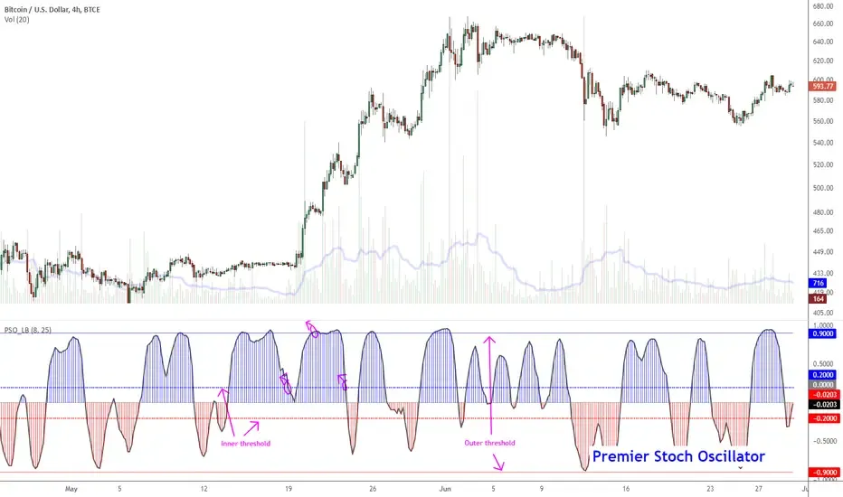

## Table of Contents

## What is the Premier Stochastic Oscillator?

The Premier Stochastic Oscillator is a technical analysis tool used by traders to predict price movements in financial markets. It helps traders understand whether a market is overbought or oversold. The oscillator works by comparing a security's closing price to its price range over a certain period of time. This comparison is then used to generate a value between 0 and 100, which traders use to make decisions about buying or selling.

Traders often use the Premier Stochastic Oscillator to spot potential trend reversals. When the oscillator's value is above 80, it suggests that the market might be overbought, meaning the price might soon fall. On the other hand, if the value is below 20, it indicates that the market could be oversold, suggesting that the price might rise soon. By watching these levels, traders can better time their trades to take advantage of these potential shifts in market direction.

## How does the Premier Stochastic Oscillator differ from the standard Stochastic Oscillator?

The Premier Stochastic Oscillator and the standard Stochastic Oscillator are both used to help traders see if a market is overbought or oversold. The main difference between them is how they calculate their values. The standard Stochastic Oscillator uses a simple formula that compares the current closing price to the price range over a set period. On the other hand, the Premier Stochastic Oscillator uses a more complex formula that takes into account additional factors like volume and price momentum. This makes the Premier version more sensitive to market changes.

Because of its more complex formula, the Premier Stochastic Oscillator can give traders more detailed signals about when to buy or sell. It might pick up on market trends that the standard version misses. However, this also means it can be harder to use and might give more false signals. Traders who use the Premier version need to be careful and might need more experience to understand its signals correctly.

## What are the key components of the Premier Stochastic Oscillator?

The Premier Stochastic Oscillator has a few main parts that help traders make decisions. The first part is the %K line, which shows where the current price is compared to the highest and lowest prices over a certain time. This line moves up and down and helps traders see if the market might be overbought or oversold. The second part is the %D line, which is a moving average of the %K line. It helps smooth out the %K line and makes the signals easier to read. Together, these lines help traders spot trends and possible changes in the market.

Another important part of the Premier Stochastic Oscillator is how it uses [volume](/wiki/volume-trading-strategy) and price momentum in its calculations. This makes it different from the standard Stochastic Oscillator, which only looks at price. By including volume and momentum, the Premier version can give more detailed signals about the market. This can help traders see smaller changes that they might miss with the standard version. However, because it's more complex, it can also be harder to use and might give more false signals if not interpreted correctly.

## How is the Premier Stochastic Oscillator calculated?

The Premier Stochastic Oscillator is calculated using a special formula that looks at the current price, the highest and lowest prices over a set time, and also includes volume and price momentum. First, it finds the %K value. This is done by taking the current closing price and subtracting the lowest price over the set time, then dividing that by the highest price over the set time minus the lowest price. This gives a number between 0 and 100 that shows where the current price is in the range of highs and lows.

Next, the %D value is calculated. This is a moving average of the %K value, usually over three periods. The %D line smooths out the %K line and makes the signals easier to read. The Premier Stochastic Oscillator adds volume and price momentum to these calculations, making it more sensitive to market changes. This means it can pick up on smaller shifts in the market, but it also means traders need to be careful because it might give more false signals if not used right.

## What is the typical time frame used for the Premier Stochastic Oscillator?

The Premier Stochastic Oscillator is often used with a time frame of 14 periods. This means it looks at the last 14 periods of price data to calculate its values. Traders can choose shorter or longer time frames, but 14 periods is common because it gives a good balance between being sensitive to price changes and not giving too many false signals.

Using a shorter time frame, like 5 or 10 periods, can make the oscillator react more quickly to price changes. This can be good for traders who want to catch quick moves in the market. But it can also lead to more false signals, so traders need to be careful. On the other hand, using a longer time frame, like 20 or 30 periods, makes the oscillator slower to react. This can be better for traders who want to see bigger trends and are not as interested in quick moves.

## How can beginners interpret the signals from the Premier Stochastic Oscillator?

Beginners can start using the Premier Stochastic Oscillator by looking at the %K and %D lines. These lines move between 0 and 100. When the lines go above 80, it means the market might be overbought, and the price could go down soon. If the lines drop below 20, it means the market might be oversold, and the price could go up. Beginners should watch for when the %K line crosses the %D line. If the %K line crosses above the %D line while both are below 20, it's a good sign to buy. If the %K line crosses below the %D line while both are above 80, it's a good sign to sell.

It's also important for beginners to understand that the Premier Stochastic Oscillator can sometimes give false signals. This means the lines might suggest a buy or sell, but the price doesn't move as expected. To avoid this, beginners should use the oscillator along with other tools, like looking at the overall trend of the market or using other indicators. By combining the Premier Stochastic Oscillator with other methods, beginners can make better trading decisions and reduce the risk of making a mistake based on a single signal.

## What are the common trading strategies involving the Premier Stochastic Oscillator?

One common trading strategy using the Premier Stochastic Oscillator is the overbought/oversold strategy. Traders look at the %K and %D lines to see when they go above 80 or below 20. If both lines are above 80, it means the market might be overbought, so traders might decide to sell their assets, expecting the price to go down. On the other hand, if both lines are below 20, the market might be oversold, and traders might buy, hoping the price will go up soon. This strategy helps traders catch big moves in the market, but they need to be careful because the oscillator can sometimes give false signals.

Another strategy is the crossover strategy. In this approach, traders watch for when the %K line crosses the %D line. If the %K line crosses above the %D line while both are below 20, it's a strong buy signal. Traders might buy their assets at this point, expecting the price to rise. If the %K line crosses below the %D line while both are above 80, it's a strong sell signal, and traders might sell, expecting the price to fall. This strategy can help traders enter and exit trades at good times, but like with the overbought/oversold strategy, it's important to use other tools to confirm the signals and avoid false moves.

## How can the Premier Stochastic Oscillator be used in conjunction with other technical indicators?

Traders often use the Premier Stochastic Oscillator with other technical indicators to make better trading decisions. One common combination is with the Moving Average Convergence Divergence (MACD). The MACD helps traders see the strength and direction of a trend. When the Premier Stochastic Oscillator shows an overbought or oversold signal, traders can check the MACD to see if the trend is strong. If both indicators agree, it's a stronger signal to buy or sell. This can help traders avoid false signals from the oscillator alone.

Another useful combination is with the Relative Strength Index (RSI). The RSI also measures if a market is overbought or oversold, but it does it differently from the Premier Stochastic Oscillator. When both the RSI and the Premier Stochastic Oscillator show the market is overbought or oversold at the same time, it's a more reliable signal. Traders can feel more confident about their decisions. Using these indicators together helps traders see the market from different angles and make smarter trades.

## What are the limitations and potential pitfalls of using the Premier Stochastic Oscillator?

The Premier Stochastic Oscillator can sometimes give false signals. This means it might tell you to buy or sell when the market doesn't actually move that way. It's because the oscillator reacts quickly to price changes, and sometimes these changes don't lead to big moves in the market. Traders need to be careful and not rely only on the oscillator. They should use other tools and look at the bigger picture of the market to make better decisions.

Another limitation is that the Premier Stochastic Oscillator can be hard to use for beginners. It uses a more complex formula than the standard version, which includes volume and price momentum. This makes it more sensitive to market changes, but it also means there's more to learn. Beginners might find it confusing and might make mistakes if they don't understand how to read the signals correctly. It's important for them to practice and use it along with simpler tools until they get the hang of it.

## How does the Premier Stochastic Oscillator perform in different market conditions?

The Premier Stochastic Oscillator works well in trending markets, where prices are moving in a clear direction. When the market is going up or down steadily, the oscillator can help traders spot good times to buy or sell. It does this by showing when the market might be overbought or oversold. If the market is going up and the oscillator shows it's overbought, traders might sell their assets, expecting the price to drop soon. If the market is going down and the oscillator shows it's oversold, traders might buy, hoping for a price increase.

However, the Premier Stochastic Oscillator can struggle in sideways or choppy markets, where prices move up and down without a clear trend. In these conditions, the oscillator might give a lot of false signals, telling traders to buy or sell when the market doesn't actually move much. This can lead to traders making bad decisions and losing money. To use the oscillator effectively in these markets, traders need to be careful and use other tools to check the signals before making a move.

## Can the settings of the Premier Stochastic Oscillator be optimized for specific assets or markets?

Yes, the settings of the Premier Stochastic Oscillator can be changed to work better with different assets or markets. The usual setting is 14 periods, but traders can make it shorter or longer. For example, if you're trading something that moves fast, like a stock, you might want to use fewer periods, like 5 or 10. This makes the oscillator react quicker to price changes. But if you're trading something that moves slower, like a commodity, you might use more periods, like 20 or 30. This makes the oscillator less likely to give false signals.

To find the best settings, traders often try different numbers and see which ones work best for their specific asset or market. They might use past data to test the settings and see how well the oscillator would have worked. This is called [backtesting](/wiki/backtesting). By doing this, traders can fine-tune the oscillator to match the way their chosen asset or market moves. But remember, even with the best settings, the oscillator can still give false signals, so it's important to use other tools too.

## What advanced techniques can experts use to enhance the effectiveness of the Premier Stochastic Oscillator?

Experts can use a technique called divergence to make the Premier Stochastic Oscillator more effective. Divergence happens when the price of an asset moves one way, but the oscillator moves the other way. For example, if the price is going up but the oscillator is going down, it might mean the price will soon change direction. Experts watch for these differences to find good times to buy or sell. They might also use different time frames, like looking at both a short-term and a long-term chart, to see if the signals match up. If the signals agree on both time frames, it's a stronger sign that the market might move as expected.

Another advanced technique is to use the Premier Stochastic Oscillator with other indicators, like the Moving Average Convergence Divergence (MACD) or the Relative Strength Index (RSI). Experts look at these indicators together to get a fuller picture of the market. For example, if the Premier Stochastic Oscillator says the market is overbought and the MACD also shows a strong trend, it's a more reliable signal to sell. Experts also might change the settings of the oscillator to fit the specific asset or market they're trading. By trying different settings and testing them with past data, they can find the best way to use the oscillator for their trading.

## What is the Stochastic Oscillator and how does it work?

The stochastic oscillator is a widely-used momentum indicator that compares a security's closing price to its price range over a specified period. It is designed to predict potential market reversals by signaling overbought and oversold conditions, proving invaluable for traders in their decision-making processes. Operating within a scale of 0 to 100, the oscillator indicates overbought conditions when values exceed 80 and oversold conditions when they fall below 20.

Central to the stochastic oscillator are its two components: the %K and %D lines. The %K line, often referred to as the fast line, is calculated using the formula:

$$

\%K = \left( \frac{C - L}{H - L} \right) \times 100 
$$

where $C$ represents the latest closing price, $L$ is the lowest price over the look-back period, and $H$ is the highest price over the same period. The %D line, known as the signal line, is a simple moving average of the %K values, typically over three periods, providing a smoother representation of recent momentum.

The oscillator's core function is to gauge price [momentum](/wiki/momentum), allowing traders to anticipate potential market reversals by observing the speed and change of price movements. This can help traders to enter or [exit](/wiki/exit-strategy) trades more strategically by identifying when markets may be ready for a turn.

This indicator was developed by George Lane in the 1950s, and his contribution has left a lasting impact on technical analysis. Lane emphasized the importance of understanding market momentum and how prices tend to close near their highs in an upward trend and near their lows in a downward trend before a reversal occurs. This historical context underscores the stochastic oscillator's enduring significance in market analysis, where it continues to serve as a fundamental tool for traders globally.

## How does the Stochastic Oscillator work?

The stochastic oscillator is a technical analysis tool used to evaluate price momentum by analyzing a security's closing price in relation to its price range over a specific period. This momentum indicator is particularly useful for identifying potential price reversals by signaling when an asset may be overbought or oversold.

The primary calculation of the stochastic oscillator involves two lines: %K and %D. The %K line, known as the fast line, is calculated using the formula:

$$
\%K = \frac{(C - L)}{(H - L)} \times 100
$$

where $C$ represents the current closing price, $L$ is the lowest price over the specified period, and $H$ is the highest price over the same period. This formula highlights the position of the current closing price relative to the chosen high-low range.

The %D line, or the signal line, is typically a three-period simple moving average of %K. This line serves to smooth out the [volatility](/wiki/volatility-trading-strategies) of %K and helps traders identify significant trends more clearly through crossovers and divergences.

Signal crossovers occur when %K crosses above or below %D, indicating potential buy or sell signals, respectively. Additionally, divergences between the stochastic oscillator and the actual price trend can offer valuable insights. For instance, if the price is making new highs while the stochastic oscillator fails to do so, it may be indicative of a pending reversal.

The sensitivity of the stochastic oscillator can be adjusted by varying the number of periods used in its calculation. Shorter periods produce a more sensitive oscillator that catches more price movements, albeit with increased noise, while longer periods result in a smoother but less responsive indicator.

To enhance the efficacy of the stochastic oscillator, it can be combined with other technical analysis tools like the Moving Average Convergence Divergence (MACD) or the Relative Strength Index (RSI). This combination allows traders to cross-verify signals and helps to reduce false signals, particularly in volatile or trending markets. By leveraging these tools together, traders aim to enhance their decision-making accuracy and improve overall trading strategies.

## How do the Stochastic Oscillator and RSI compare?

The stochastic oscillator and the Relative Strength Index (RSI) are both widely used momentum indicators in technical analysis, yet they serve different purposes based on their distinct calculation methods and applications. Understanding how each indicator functions can help traders optimize their strategies.

The calculation of the RSI is centered on the magnitude of recent price changes, using the formula:

$$
\text{RSI} = 100 - \frac{100}{1 + \text{RS}}
$$

where RS (Relative Strength) is the average of x days' up closes divided by the average of x days' down closes. The RSI values range between 0 to 100, usually identifying overbought conditions when above 70 and oversold conditions when below 30. This makes RSI particularly effective in trending markets, as it helps indicate whether an asset is either overbought or oversold, thereby hinting at potential trend reversals.

In contrast, the stochastic oscillator evaluates a security's current closing price relative to its price range over a certain period using the formula for %K:

$$
\%K = \frac{(C - L)}{(H - L)} \times 100
$$

where $C$ is the latest closing price, $L$ is the lowest price over the period, and $H$ is the highest price over the period. The stochastic oscillator's calculation involves looking at how the current closing price stacks up against the high-low range. This aspect makes it particularly useful in identifying turning points in range-bound markets, as opposed to trending markets.

When combined, the stochastic oscillator and RSI provide a more comprehensive analysis that minimizes false signals and enhances decision-making accuracy. The stochastic oscillator excels in more static, range-bound conditions by identifying price action trends near support and resistance levels, whereas the RSI highlights the momentum and strength of recent price movements, pinpointing potential shifts in existing trends.

Traders often use both indicators together for cross-validation of signals. For instance, if both indicators signal an overbought or oversold condition at the same time, it enhances the reliability of the trading signal. This synergy allows traders to bolster their trading strategies by confirming signals across different types of market analyses, thus improving their decision-making process.

## References & Further Reading

[1]: Lane, George C. (1978). "Lane's Stochastics." Technical Analysis of Stocks & Commodities. This article discusses the fundamentals of the stochastic oscillator as introduced by its creator, George Lane.

[2]: Murphy, John J. (1999). ["Technical Analysis of the Financial Markets: A Comprehensive Guide to Trading Methods and Applications."](https://archive.org/details/technicalanalysi0000murp) New York Institute of Finance. A seminal book providing an overview of technical analysis tools, including the stochastic oscillator.

[3]: Wilder, J. Welles (1978). ["New Concepts in Technical Trading Systems."](https://archive.org/details/newconceptsintec00wild) Trend Research. Describes the Relative Strength Index (RSI), which is often used alongside the stochastic oscillator.

[4]: Aronson, David R. (2007). ["Evidence-Based Technical Analysis: Applying the Scientific Method and Statistical Inference to Trading Signals."](https://www.amazon.com/Evidence-Based-Technical-Analysis-Scientific-Statistical/dp/0470008741) Wiley. Provides a scientific approach to evaluating technical trading signals, relevant for traders using the stochastic oscillator.

[5]: Patel, J., Shah, S., & Thakkar, P. (2015). ["Predicting Stock and Stock Price Index Movement Using Trend Deterministic Data Preparation and Machine Learning Techniques."](https://www.sciencedirect.com/science/article/abs/pii/S0957417414004473) Procedia Computer Science. Examines the use of technical indicators in algorithmic trading strategies, including the stochastic oscillator.

