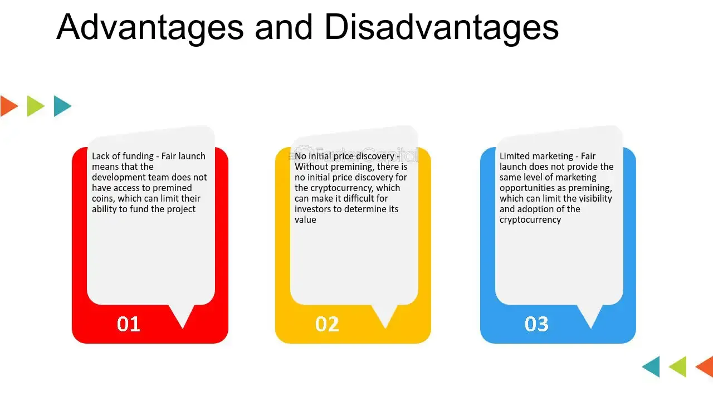

## Table of Contents

## What is premining in the context of cryptocurrencies?

Premining is when a group of people, usually the creators of a new cryptocurrency, mine or create a bunch of coins before the cryptocurrency is released to the public. They do this before anyone else can start mining. This means they end up with a lot of the total supply of the cryptocurrency right from the start.

Sometimes, premining is done to help fund the development of the cryptocurrency. The creators might use these premined coins to pay for things like marketing or to reward early supporters. But, it can also be controversial because it might give the creators an unfair advantage, making it seem less fair to everyone else who starts mining later.

## How does the premining process work?

Premining happens when the people who make a new cryptocurrency start mining coins before they let everyone else know about it. They use their own computers to mine these coins before the cryptocurrency goes live on the internet. This means they can get a big chunk of the total number of coins that will ever exist, sometimes even before anyone else can start mining.

The reason they do this can be to help pay for things like making the [cryptocurrency](/wiki/cryptocurrency) better or telling people about it. They might sell these coins or give them to people who helped them early on. But, some people don't like premining because it can seem unfair. It's like the creators are giving themselves a head start, which might make the cryptocurrency less fair for everyone else who wants to mine it later.

## Why do some cryptocurrencies engage in premining?

Some cryptocurrencies engage in premining to help fund their projects. When a new cryptocurrency is created, it needs money to pay for things like development, marketing, and other costs. By premining coins, the creators can use these coins to cover these expenses. They might sell the premined coins to raise money or give them to early supporters and developers as a reward for their help.

However, premining can be controversial because it gives the creators a big advantage right from the start. They end up with a lot of the total supply of the cryptocurrency before anyone else can even start mining. This can make the cryptocurrency seem unfair to others who want to mine it later. Some people worry that premining might be used to make money for the creators rather than to help the cryptocurrency grow and succeed.

## What are the potential advantages of premining for a cryptocurrency project?

Premining can help a new cryptocurrency project get the money it needs to grow. When the creators mine coins before anyone else, they can use those coins to pay for things like making the cryptocurrency better or telling people about it. This can be really helpful because starting a new cryptocurrency can be expensive, and premining gives the creators a way to cover these costs without having to borrow money or find investors right away.

Another advantage is that premining can help reward the people who worked hard on the project from the beginning. The creators might give some of the premined coins to early supporters or developers. This can make these people feel appreciated and motivate them to keep helping the project. It's like a thank you for their hard work and belief in the cryptocurrency from the start.

## What are the disadvantages or risks associated with premining?

Premining can make people feel like the cryptocurrency is not fair. When the creators mine a lot of coins before anyone else can, it gives them a big advantage. They end up with a lot of the total supply of the cryptocurrency right from the start. This can make other people who want to mine the cryptocurrency feel like they are at a disadvantage. They might think that the creators are just trying to make money for themselves instead of making the cryptocurrency better for everyone.

Another risk is that premining can hurt the trust people have in the cryptocurrency. If people find out that the creators mined a lot of coins before telling anyone else, they might think the creators are not being honest. This can make people less likely to want to use or invest in the cryptocurrency. If people don't trust the creators, it can be hard for the cryptocurrency to grow and succeed.

## Can you give examples of cryptocurrencies that have used premining?

One example of a cryptocurrency that used premining is Ripple (XRP). The people who made Ripple premined all of the XRP coins before they let anyone else start mining. They did this to help pay for making Ripple better and to give some coins to early supporters. But, some people didn't like it because they thought it gave the creators too much control over the total supply of XRP.

Another example is Ethereum (ETH). When Ethereum was first made, the creators did a premining event called "The DAO." They premined a lot of ETH to help fund a project that was supposed to help the Ethereum community. But, it ended up causing problems because some people thought it was unfair. This led to a big argument in the Ethereum community and even caused a split, creating a new cryptocurrency called Ethereum Classic.

## How does premining affect the initial distribution of a cryptocurrency?

Premining can change how a new cryptocurrency is shared among people at the start. When the creators mine coins before anyone else, they end up with a big part of the total supply right away. This means that when the cryptocurrency is released to the public, the creators already have a lot of the coins. This can make the initial distribution seem unfair to others because the creators have a head start and a lot more coins than anyone else who starts mining later.

This big share of coins in the hands of the creators can also affect how the cryptocurrency grows. If the creators use the premined coins to pay for things like making the cryptocurrency better or telling people about it, it might help the project. But, if people think the creators are just trying to make money for themselves, it can hurt the trust people have in the cryptocurrency. This can make it harder for the cryptocurrency to become popular and succeed because people might not want to use or invest in something they think is unfair.

## What are the ethical considerations surrounding premining?

Premining raises some big questions about what is fair and right. When the people who make a new cryptocurrency mine a lot of coins before anyone else can, it can seem like they are giving themselves an unfair advantage. They end up with a big part of the total supply of the cryptocurrency right from the start. This can make other people feel like the creators are not playing by the same rules as everyone else. It's like the creators are taking a big piece of the pie before anyone else even gets a chance to sit down at the table.

Another ethical issue is about trust and honesty. If people find out that the creators premined a lot of coins without telling anyone, it can make them feel like the creators are not being open and honest. This can hurt the trust people have in the cryptocurrency. When people don't trust the creators, they might not want to use or invest in the cryptocurrency. This can make it hard for the cryptocurrency to grow and succeed. So, the creators need to think carefully about how premining might affect what people think about their project and whether it's the right thing to do.

## How can premining impact the long-term value and adoption of a cryptocurrency?

Premining can affect how much a cryptocurrency is worth over time. If people think the creators are being unfair by mining a lot of coins before anyone else, they might not want to buy or use the cryptocurrency. This can make the value go down because fewer people are interested in it. On the other hand, if the creators use the premined coins to make the cryptocurrency better or to tell more people about it, it might help the value go up. But it's a tricky balance because if people feel like the creators are just trying to make money for themselves, it can hurt the cryptocurrency's value in the long run.

Premining can also change how many people start using a cryptocurrency. If people don't trust the creators because of premining, they might not want to join the community or use the cryptocurrency. This can slow down how fast the cryptocurrency grows and becomes popular. But if the creators use the premined coins in a way that helps the project and makes people feel good about it, it might encourage more people to get involved. So, how premining is done can really affect whether a lot of people end up using the cryptocurrency over time.

## What regulatory challenges might a project face due to premining?

Premining can cause problems with the rules that governments have for cryptocurrencies. When the people who make a new cryptocurrency mine a lot of coins before anyone else, it might look like they are trying to make money in a way that breaks the law. Some countries have rules about how new cryptocurrencies can be made and sold, and premining might not follow these rules. This can make it hard for the cryptocurrency to be used in those places because the government might not let it be sold or traded.

Also, premining can make it harder for a cryptocurrency to be seen as a real and fair way to make money. If the government thinks that the creators are just trying to make money for themselves in a way that is not fair, they might decide to stop the cryptocurrency from being used. This can be a big problem for the project because it might not be able to grow and become popular if it can't be used in a lot of places. So, the people who make a new cryptocurrency need to think carefully about how premining might affect what the government thinks about their project.

## How do developers and miners view premining differently?

Developers often see premining as a way to get the money they need to make their cryptocurrency project better. They can use the premined coins to pay for things like making the cryptocurrency work well or telling people about it. They might also give some of these coins to people who helped them early on, as a way to say thank you. But, they need to be careful because if they pre-mine too many coins, it might make people think the project is not fair.

Miners, on the other hand, might not like premining because it can make them feel like they are at a disadvantage. When the developers mine a lot of coins before anyone else can, it means the miners start with less of the total supply of the cryptocurrency. This can make them feel like the developers are not playing fair. If miners think the project is not fair, they might not want to help mine the cryptocurrency, which can make it hard for the project to grow.

## What are the best practices for implementing premining in a new cryptocurrency project?

When starting a new cryptocurrency project, it's important to be open about premining. Tell everyone how many coins you are going to mine before anyone else can start. This helps people trust you more because they know what's going on. Also, use the premined coins to make the project better, like paying for development or marketing. This shows that you are trying to help the project grow, not just make money for yourself. Make sure to share some of the premined coins with early supporters and developers to thank them for their hard work.

It's also a good idea to keep the amount of premined coins fair. Don't mine too many coins before letting others start because this can make people feel like the project is not fair. Think about how premining might affect what people think about your project and try to do it in a way that makes them feel good about joining in. By being honest and fair, you can help your cryptocurrency project succeed and grow over time.

## References & Further Reading

[1]: Narayanan, A., Bonneau, J., Felten, E., Miller, A., & Goldfeder, S. (2016). ["Bitcoin and Cryptocurrency Technologies."](https://press.princeton.edu/books/hardcover/9780691171692/bitcoin-and-cryptocurrency-technologies) Princeton University Press.

[2]: Zohar, A. (2015). ["Bitcoin: under the hood."](https://dl.acm.org/doi/10.1145/2701411) Communications of the ACM, 58(9), 104-113.

[3]: Antonopoulos, A. M. (2017). ["Mastering Bitcoin: Unlocking Digital Cryptocurrencies."](https://books.google.com/books/about/Mastering_Bitcoin.html?id=IXmrBQAAQBAJ) O'Reilly Media.

[4]: Lewis, M. K. (2014). ["Understanding algorithmic trading."](https://www.investopedia.com/terms/a/algorithmictrading.asp) Review of Financial Economics, 23(1), 72-78.

[5]: Gomber, P., Sagade, S., Theissen, E., Weber, M. C., & Zimmermann, K. (2017). ["Competition between trading venues: A survey of the literature."](https://www.semanticscholar.org/paper/Competition-between-Equity-Markets%3A-A-Review-of-the-Gomber-Sagade/100f95091bffcb63d9c4ff39b841df34e05a3dba) Journal of Economic Surveys, 31(4), 792-812.

[6]: Lopez de Prado, M. (2018). ["Advances in Financial Machine Learning."](https://www.amazon.com/Advances-Financial-Machine-Learning-Marcos/dp/1119482089) Wiley.

[7]: Park, Y. J., & Park, J. W. (2017). ["The effect of blockchain-based cryptocurrency price on mining activity."](https://onlinelibrary.wiley.com/doi/full/10.1002/adma.201804690) TELKOMNIKA (Telecommunication Computing Electronics and Control), 15(1), 152-156.

[8]: Darlington, K. (2016). ["The Essence of Cryptocurrency."](https://core.ac.uk/download/pdf/268754459.pdf) Procedia Computer Science, 112, 969-978.