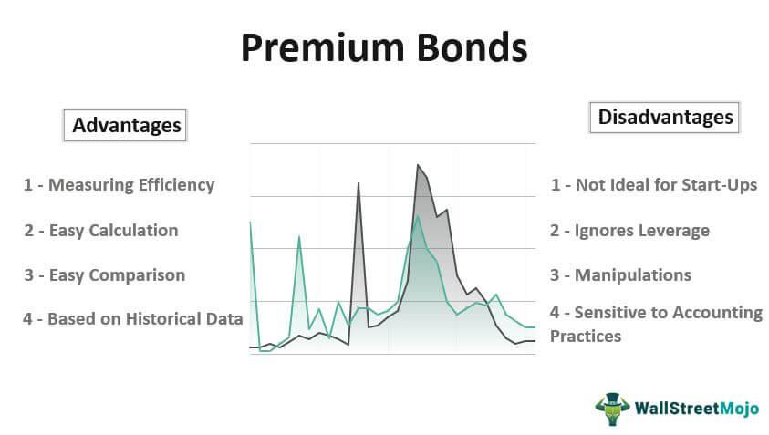

Blockchain cryptocurrency has dramatically transformed the financial sector by introducing a decentralized and secure method of transaction and asset holding. Originally devised to facilitate peer-to-peer transactions without intermediaries, blockchain technology ensures transparency, immutability, and security through its distributed ledger system. Cryptocurrencies like Bitcoin and Ethereum have emerged as digital storehouses of value, embracing broader functionalities beyond traditional fiat currencies, notably smart contracts and decentralized finance.

Premining is a practice wherein a portion of a cryptocurrency’s total supply is mined and distributed before its launch to the public. This process is often executed by developers or early adopters who retain control over a significant share of the currency. While premining can support development costs and incentivize project initiators, it is fraught with controversy. Critics argue that it contradicts the ideals of decentralization and equity, leading to issues of transparency and potential market manipulation due to the disproportionate influence of those holding premined tokens.

Algorithmic trading, or algo trading, involves using computer algorithms to execute trades in financial markets with speed and efficiency unattainable by human traders. Its significance in the cryptocurrency markets is underscored by the need to navigate the highly volatile and fragmented cryptocurrency exchanges. Algo trading is lauded for its ability to process vast datasets swiftly, react to market signals with precision, and capitalize on arbitrage opportunities, thereby enhancing market efficiency.

The purpose of this article is to examine the intersection of premining and its influence on algorithmic trading within blockchain cryptocurrency markets. By scrutinizing how premining affects market liquidity, volatility, and trading strategies, the article seeks to shed light on the broader implications of these practices for traders and investors.

Understanding these concepts is paramount for participants in the crypto ecosystem. As digital assets continue to gain traction, comprehension of how premining and algorithmic strategies interact is vital for assessing the potential risks and rewards associated with investing in or trading cryptocurrencies. Recognizing the ethical and regulatory subtleties involved will empower investors and traders to navigate the evolving landscape thoughtfully and effectively.

## Table of Contents

## Understanding Premining in Blockchain Cryptocurrency

Premining in blockchain cryptocurrency refers to the creation and allocation of a portion of a cryptocurrency's total supply before it is made available to the public. Unlike regular mining, which involves computational efforts to validate transactions and secure the network in exchange for new coins, premining allows developers to generate and distribute coins at no computational cost before releasing the cryptocurrency to the masses. This method is usually employed to compensate initial development efforts, fund future projects, or reward early contributors and founders.

The primary reason for premining is to secure early funding and incentivize the project team during the [cryptocurrency](/wiki/cryptocurrency)'s nascent stages. Premined coins can be sold or distributed to investors, providing financial backing to sustain development activities and marketing efforts. Additionally, premining serves as a method to align the interests of the development team with the success of the cryptocurrency, as their financial gain directly correlates with the project's valuation.

Premining's controversial nature arises from concerns about transparency and fairness. Critics argue that premining gives disproportionate advantages to insiders, leading to unequal distribution of wealth and potential for price manipulation. It can create a perception of centralization, which undermines the decentralized ethos of blockchain technologies. Conversely, proponents argue that premining is a legitimate strategy for promising projects requiring initial funding and can provide necessary resources to foster innovation and growth.

Examples of notable cryptocurrencies that have undergone premining are Ethereum and Ripple (XRP). Ethereum allocated approximately 12 million Ether to early contributors and developers, which helped fund its development. While this premining fortified Ethereum's foundation, it also raised questions about the concentration of wealth. In the case of Ripple, a significant portion of XRP was premined and held by the company, leading to criticisms about centralization.

Premining impacts perception and adoption mainly by influencing the narrative surrounding a cryptocurrency. If perceived as a fair distribution mechanism aiding development and aligning incentives, it can bolster trust and attract a broader community. Conversely, if perceived as unfair or manipulative, it may deter potential users and investors, hampering adoption efforts. Transparency in premining practices, including public disclosure of allocation plans and long-term intentions, is crucial to mitigate skepticism and foster a positive reception.

Understanding premining's dynamics is essential for investors and users to assess the potential risks and opportunities associated with new cryptocurrencies. The initial allocation decisions set a precedent for governance and economic policies, framing how the market values and interacts with these digital assets.

## The Role of Algo Trading in the Cryptocurrency Market

Algorithmic trading, often referred to as algo trading, involves the use of computer algorithms to execute trade orders. These algorithms can analyze numerous market variables and perform trades at speeds and frequencies impossible for human traders. In traditional financial markets, algo trading emerged as a means to enhance trading efficiency, reduce transaction costs, and exploit market conditions in real time. Algorithms are employed to implement complex strategies and execute trades based on predefined criteria such as timing, price, or market conditions.

In comparison, algo trading in the cryptocurrency market shares similar goals but presents unique challenges and opportunities. The crypto market operates 24/7, providing continuous trading opportunities, which requires algorithms to be constantly active and adaptable to rapidly changing market conditions. Moreover, the market's higher [volatility](/wiki/volatility-trading-strategies) and relatively nascent infrastructure pose distinct risks and require different considerations than traditional markets.

### Primary Strategies in Algo Trading

Several strategies are commonly employed by algorithms in both traditional and cryptocurrency markets:

1. **Arbitrage**: This strategy seeks to exploit price differences of a financial instrument across different markets or in different forms. In the cryptocurrency market, arbitrage opportunities may arise from price discrepancies between exchanges.

2. **Market Making**: Market making strategies involve simultaneously buying and selling a financial instrument, thereby profiting from the bid-ask spread. This strategy requires high-speed trading algorithms capable of placing large volumes of orders efficiently.

3. **Trend Following**: This involves buying or selling assets based on the direction of market trends. Algorithms determine entry and exit points based on historical data and statistical analysis, aiming to capitalize on upward or downward market trends.

### Advantages of Algo Trading

Algo trading offers several advantages that enhance market operations:

- **Speed and Precision**: Algorithms execute orders at a speed and accuracy unattainable by human traders, minimizing latency and maximizing trade efficiency.
- **Data Processing**: Advanced algorithms can analyze and process vast amounts of data, identifying patterns and trends that inform trading decisions.
- **Emotionless Trading**: Unlike human traders, algorithms are not influenced by emotions, ensuring consistent decision-making.

### Challenges and Risks

Despite these advantages, [algorithmic trading](/wiki/algorithmic-trading) faces notable challenges:

- **Market Volatility**: Cryptocurrencies are notorious for their volatility, which can lead to significant trading risks and rapid price fluctuations that even sophisticated algorithms might not manage effectively.
- **Technological Failures**: Algo trading relies heavily on technology, and any failure in the system—such as server outages, bugs, or connectivity issues—can lead to substantial financial losses.
- **Regulatory Concerns**: The legal landscape for crypto trading is still evolving. Algorithmic trading must navigate this uncertain regulatory environment, which varies significantly across jurisdictions.

### Algo Trading with Premined vs. Non-Premined Cryptocurrencies

When applied to premined cryptocurrencies, algo trading may face additional complexities. Premined cryptocurrencies have an initial supply distributed before market launch, potentially influencing [liquidity](/wiki/liquidity-risk-premium) levels and volatility patterns.

- **Liquidity and Volatility**: Premined cryptocurrencies might exhibit different liquidity profiles compared to non-premined ones, affecting the algorithms' ability to execute trades effectively. Lower liquidity can lead to higher slippage, increasing trading costs.

- **Market Perception and Manipulation**: The distribution method of premined coins can affect market perception, potentially impacting algorithms' trading assumptions and outcomes. Traders must be vigilant against potential price manipulations, as concentrated holdings might enable influential stakeholders to move market prices disproportionately.

Algorithmic trading is a transformative force in both traditional and cryptocurrency markets, providing speed and efficiency while introducing its own set of challenges and considerations. Understanding these dynamics is crucial for effectively navigating the crypto market, especially when dealing with premined cryptocurrencies.

## Premining and Its Impact on Algorithmic Trading

Premining refers to the allocation of a certain amount of cryptocurrency to specific parties before the public release of the cryptocurrency. This process can significantly affect the market dynamics, particularly in the context of algorithmic trading, by impacting market liquidity, volatility, and potential trading strategies.

Premining can influence market liquidity by concentrating a substantial portion of a cryptocurrency's supply in a few hands. This can lead to reduced liquidity in the early phases of market trading, as large holders may not immediately release their tokens into the market. Limited liquidity can cause significant price fluctuations, thus increasing volatility. Such an environment requires algorithmic traders to adjust their strategies to manage risks associated with unpredictable price movements. High-frequency trading ([HFT](/wiki/high-frequency-trading-strategies)) models, which thrive on stable and liquid markets, might need recalibration to adapt to these conditions, potentially affecting their profitability. 

The initial distribution of premined tokens can also affect algo trading strategies. When tokens are unevenly distributed, the scarcity in the market might lead to price inflations, providing ripe conditions for [arbitrage](/wiki/arbitrage) opportunities. Traders might employ algorithms to capitalize on these pricing inefficiencies, especially if there's a discrepancy in premined token prices across different exchanges or platforms.

Price manipulation is a significant concern in premined cryptocurrencies. Large holders of premined tokens can impact prices by releasing or withholding their tokens strategically. Traders looking to safeguard against such manipulation often deploy strategies that involve real-time data analysis and sentiment tracking across multiple platforms to detect and respond to unusual trading patterns promptly. Protective strategies might include pre-emptive stop-loss orders and diversification of trading portfolios to mitigate risk.

Transparency regarding premining can drastically impact market confidence and trading strategies. In environments where premining details are opaque, traders face increased uncertainty, potentially deterring them from engaging with such assets. Algorithmic models might need to incorporate risk assessments that [factor](/wiki/factor-investing) in a lack of transparency, employing more conservative trading tactics or limiting exposure to premined currencies.

Examples of cryptocurrencies with notable premining activities include Ripple (XRP) and Ethereum (ETH). Ripple, having a substantial amount of its tokens premined, has faced scrutiny and regulatory challenges, affecting its trading patterns. On the other hand, Ethereum, which also utilized premining, has managed to maintain a relatively stable market presence partly due to greater transparency and community engagement in its early distribution phases. These case studies highlight how premining strategies and transparency levels can markedly influence the perception and trading methodology in algorithm-driven markets.

Understanding premining's impact is crucial for participants in the crypto market, as it offers insights into the underlying factors that could govern the prices and availability of tradeable assets. This knowledge empowers traders to devise strategies that can harness or hedge against the volatility and liquidity challenges imposed by premined assets.

## Regulatory Perspectives and Ethical Considerations

The regulatory landscape surrounding premining and algorithmic trading in cryptocurrencies presents several challenges and areas of concern for authorities. Premining refers to the process where a portion of a cryptocurrency’s total supply is mined and allocated to an individual or group prior to its public release. This practice has sparked debates regarding its transparency, fairness, and impact on investor trust.

Authorities are particularly concerned about the opacity associated with premining, as it can lead to issues of market manipulation, asymmetric information, and unfair advantages for early adopters. Without clear regulations, premining can create a distorted playing field, affecting both retail and institutional investors' confidence in the market. Regulatory bodies, therefore, emphasize the need for clear disclosure of premining activities to ensure that all stakeholders have equal access to information, helping to maintain market integrity.

Algorithmic trading, which involves using complex mathematical models and sequential trading instructions to execute trades, further complicates the regulatory framework. In traditional financial markets, algo trading has already prompted regulatory scrutiny over fairness, speed, and the possibility of market crashes. When applied to cryptocurrencies, especially premined ones, the potential for algorithmic trading to exacerbate market volatility and enable sophisticated price manipulation becomes a significant concern. Regulators aim to address these issues by establishing rules that ensure fair trading practices and mitigate technological risks.

The ethical implications of premining are profound, impacting investor trust and market fairness. Premining can concentrate wealth in the hands of a few, potentially skewing the market dynamics and discouraging widespread adoption and participation. The crypto community, therefore, advocates for ethical standards that promote fairness, transparency, and equitable distribution of digital assets. This requires clear communication about premining practices and their potential impact on token distribution and value.

Regulation plays a crucial role in ensuring transparency and fairness in the use of premined cryptocurrencies and algo trading. Establishing comprehensive disclosure requirements for premining practices can help prevent insider trading and market manipulation. Moreover, setting standards for algorithmic trading applications in cryptocurrency markets can protect against erratic market behavior and preserve investor confidence.

In addition to regulatory frameworks, the industry can employ self-regulation to mitigate risks associated with premined assets and algo trading. Self-regulatory organizations can set best practices for transparency, reporting, and ethical conduct, providing guidelines that align with regulatory expectations while allowing innovation to flourish. Such efforts can contribute to a healthy blockchain and crypto ecosystem, fostering trust and stability.

Finally, ethical practices and transparency are vital for maintaining a robust blockchain and crypto ecosystem. Investors, developers, and regulators all have a shared responsibility to uphold these principles to ensure the market’s long-term sustainability. By embracing transparency and promoting fair practices, the industry can build a more inclusive and trustworthy environment that supports innovation while protecting stakeholder interests.

## Conclusion

As we conclude this exploration of premining and its implications within the blockchain and cryptocurrency domains, several key points emerge. Premining represents a fundamental aspect of cryptocurrency development, directly influencing its initial distribution and market perception. Its impact on blockchain technologies is profound, as it introduces variables that affect market liquidity, trust, and value.

Premining's role in the cryptocurrency market, particularly concerning algorithmic trading, highlights the necessity for investors to comprehend its complexities. Algorithmic trading, with its speed and precision, is uniquely affected by the premined nature of certain tokens, resulting in distinct trading strategies and potential market manipulations. Understanding these subtleties is vital for investors who wish to navigate the crypto markets effectively and wisely.

In considering both the technological and ethical facets of premined cryptocurrencies, potential investors and stakeholders should critically analyze these elements before participation. Ethical concerns, primarily related to transparency and fairness, necessitate careful consideration to maintain market integrity and trust.

Looking forward, several avenues for research and development present themselves at the intersection of premining, blockchain, and algorithmic trading. Future trends may include enhanced regulatory frameworks that address premining issues, technological advancements in trading algorithms, and more robust mechanisms for market transparency.

Finally, there is a pressing need for increased awareness and engagement within the cryptocurrency community to address the challenges posed by premining and algo trading. The call to action is clear: stakeholders must advocate for ethical practices, regulatory oversight, and continuous education to foster a transparent and fair crypto ecosystem. By doing so, the community can ensure sustained growth and innovation in the blockchain and cryptocurrency markets.

## References & Further Reading

[1]: Narayanan, A., Bonneau, J., Felten, E., Miller, A., & Goldfeder, S. (2016). ["Bitcoin and Cryptocurrency Technologies."](https://press.princeton.edu/books/hardcover/9780691171692/bitcoin-and-cryptocurrency-technologies) Princeton University Press.

[2]: Zohar, A. (2015). ["Bitcoin: under the hood."](https://dl.acm.org/doi/10.1145/2701411) Communications of the ACM, 58(9), 104-113.

[3]: Antonopoulos, A. M. (2017). ["Mastering Bitcoin: Unlocking Digital Cryptocurrencies."](https://books.google.com/books/about/Mastering_Bitcoin.html?id=IXmrBQAAQBAJ) O'Reilly Media.

[4]: Lewis, M. K. (2014). ["Understanding algorithmic trading."](https://www.investopedia.com/terms/a/algorithmictrading.asp) Review of Financial Economics, 23(1), 72-78.

[5]: Gomber, P., Sagade, S., Theissen, E., Weber, M. C., & Zimmermann, K. (2017). ["Competition between trading venues: A survey of the literature."](https://www.semanticscholar.org/paper/Competition-between-Equity-Markets%3A-A-Review-of-the-Gomber-Sagade/100f95091bffcb63d9c4ff39b841df34e05a3dba) Journal of Economic Surveys, 31(4), 792-812.

[6]: Lopez de Prado, M. (2018). ["Advances in Financial Machine Learning."](https://www.amazon.com/Advances-Financial-Machine-Learning-Marcos/dp/1119482089) Wiley.

[7]: Park, Y. J., & Park, J. W. (2017). ["The effect of blockchain-based cryptocurrency price on mining activity."](https://onlinelibrary.wiley.com/doi/full/10.1002/adma.201804690) TELKOMNIKA (Telecommunication Computing Electronics and Control), 15(1), 152-156.

[8]: Darlington, K. (2016). ["The Essence of Cryptocurrency."](https://core.ac.uk/download/pdf/268754459.pdf) Procedia Computer Science, 112, 969-978.