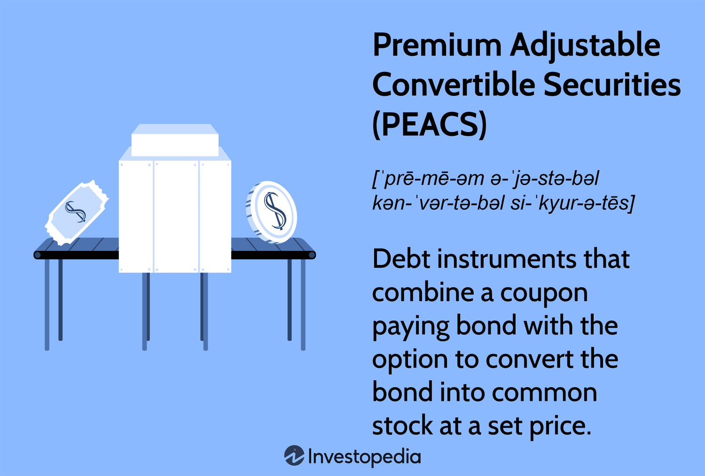

Convertible securities are complex financial instruments that combine characteristics of both debt and equity. They offer investors flexible investment options by providing the ability to convert these instruments into a specified number of shares of the issuing company. This feature allows investors to enjoy the benefits of fixed-income investment while maintaining the potential for equity appreciation.

Among the various types of convertible securities, Premium Adjustable Convertible Securities (PEACS) are notable. These are a specific form of debt instruments that grant investors the option to convert the security into common stock under pre-defined terms. The adaptability of PEACS, in integrating features of both bonds and stocks, makes them attractive for investors seeking regular interest payments complemented by the prospect of capital gains from stock price increases.



Convertible securities also pave the way for lucrative strategies, such as convertible arbitrage. This strategy capitalizes on pricing inefficiencies between convertible securities and the corresponding stocks. Specialization in this area often involves the use of algorithmic trading techniques, which optimize trading activities through the use of sophisticated algorithms and technology. These strategies are devised to exploit market volatility and mispricings, predominantly independent of prevailing market directions.

This article provides an extensive overview of convertible securities, with a particular focus on PEACS and the opportunities presented by convertible arbitrage and algorithmic trading strategies. The discussion covers important aspects such as valuation methods, risk factors, and the practical aspects of implementing these financial instruments in investment portfolios. Through a deep examination of these elements, the article aims to equip readers with a robust understanding of the mechanics and advantages of convertible securities in contemporary financial markets.

## Table of Contents

## Understanding Convertible Securities

Convertible securities represent a class of financial instruments that exhibit both debt-like and equity-like characteristics, affording investors a unique form of investment with inherent flexibility. These hybrid instruments provide the holder with the option to convert the security into a predetermined number of shares of the issuing company's stock. This dual nature allows investors to benefit from the fixed income attributes of bonds while having exposure to the potential upside of equity securities.

Premium Adjustable Convertible Securities (PEACS) exemplify a particular type of convertible debt instrument. PEACS are essentially bonds that grant the holder the option to convert into common stock of the issuer under specified terms. These securities typically offer a fixed interest payment, providing investors with regular income. Simultaneously, they offer the potential for capital appreciation through conversion if the underlying stock's market price appreciates past a certain threshold.

The mechanics of convertibility are central to understanding these instruments. Key parameters involved in this process include the conversion ratio, conversion price, and embedded options. The conversion ratio indicates the number of shares that a holder can receive upon conversion, typically at a predetermined conversion price. The conversion price is the price at which the bond can be converted into stock, which impacts the attractiveness of the conversion feature. For instance, if the market price of the stock exceeds the conversion price, it becomes financially advantageous for investors to convert, thereby realizing potential gains.

These conversion features inherently generate [arbitrage](/wiki/arbitrage) opportunities. Arbitrage arises when there is a price differential that can be exploited for profit. In the context of convertible securities, traders might capitalize on discrepancies between the bond's market value and the value derived from its convertible features. This is often executed by purchasing the convertible security while simultaneously shorting the underlying stock to lock in profits irrespective of stock price movements.

Convertible securities thus offer a compelling investment proposition by blending features of both equity and debt, presenting diverse opportunities for income generation and capital gain. Their structural flexibility coupled with potential arbitrage opportunities makes them an integral part of sophisticated investment strategies.

## Convertible Arbitrage in Algo Trading

Convertible arbitrage is a sophisticated investment strategy that involves purchasing convertible securities while simultaneously shorting the corresponding underlying stocks. The goal is to profit from the mispricing between the convertible and its underlying stock. This strategy benefits from the dual nature of convertible securities, which combine features of both debt and equity. 

### Algorithmic Trading and Technology

Algorithmic trading is integral to modern convertible arbitrage, leveraging technology to execute trades with precision and speed. By automating the decision-making process, algorithms can quickly identify and capitalize on pricing inefficiencies. High-frequency trading systems are commonly used to process vast amounts of market data, allowing traders to act on arbitrage opportunities as they arise. The precision and speed afforded by [algorithmic trading](/wiki/algorithmic-trading) are crucial in minimizing latency and optimizing trade execution.

### Delta-Neutral Strategies

A cornerstone of convertible arbitrage is the use of delta-neutral strategies to manage market risk. Delta ($\Delta$) measures the sensitivity of the convertible's price to changes in the price of the underlying stock. A delta-neutral position aims to offset the impact of these price changes, thereby minimizing risk. This is typically achieved by adjusting the ratio of convertible holdings to shorted stocks to maintain a $\Delta$ close to zero.

The Python code below illustrates how traders might calculate the delta of a convertible security and adjust their stock position to remain delta-neutral:

```python
# Hypothetical values for illustration
convertible_delta = 0.6  # Delta of the convertible security
convertible_shares = 1000  # Number of convertible shares held

# Calculate the number of shares to short for delta neutrality
shares_to_short = convertible_delta * convertible_shares

print(f"To remain delta-neutral, short {shares_to_short} shares of the underlying stock.")
```

### Exploiting Mispricings and Volatility

The essence of convertible arbitrage lies in exploiting mispricings and benefiting from market [volatility](/wiki/volatility-trading-strategies). Mispricing occurs when the market does not correctly reflect the relationship between the convertible security and its underlying stock. By identifying these discrepancies, arbitrageurs can construct profitable trades. 

Volatility is another [factor](/wiki/factor-investing) that convertible arbitrage strategies exploit. Convertibles tend to gain value with increased volatility due to the embedded option-like feature, which becomes more valuable when stock prices fluctuate. As such, traders often seek environments with higher expected volatility to enhance potential returns.

### Optimization with Sophisticated Models and Algorithms

To optimize arbitrage opportunities, traders rely on sophisticated models and algorithms. Techniques such as the Black-Scholes model, Monte Carlo simulations, and binomial trees are often applied to estimate the theoretical value of convertibles and to assess the potential impact of market variables. These models assist traders in determining appropriate entry and [exit](/wiki/exit-strategy) points for trades, as well as in evaluating potential risks.

Advanced [machine learning](/wiki/machine-learning) algorithms are increasingly employed to enhance decision-making. By processing live market data and historical trends, predictive models can better estimate future price movements, offering a competitive edge in dynamic market conditions.

Overall, convertible arbitrage in algorithmic trading represents a blend of strategic financial analysis and cutting-edge technology, aiming to exploit market inefficiencies and deliver consistent returns, while carefully managing the associated risks.

## Valuation Techniques

Valuation of convertible securities necessitates a thorough examination of their dual characteristics, encompassing both their bond-like and equity-like features. The complexity inherent in these financial instruments requires a multifaceted approach to valuation, integrating both traditional bond valuation methods and sophisticated equity derivatives techniques.

The straight bond value represents the bond-like aspect of convertible securities, reflecting the present value of its future cash flows, consisting of periodic interest payments and the principal at maturity. This valuation can be determined using standard present value formulas, discounting these cash flows by an appropriate discount rate, often derived from comparable non-convertible bonds.

On the other hand, the equity-like characteristics are captured through the conversion value, which is the value of the securities if they were to be converted into shares at the prevailing market prices. The conversion value is calculated as the current price of the stock multiplied by the conversion ratio, which specifies the number of shares the convertible security can be converted into.

A sophisticated approach to valuation requires incorporating option pricing models, such as the Black-Scholes model, to assess the embedded options within convertible securities. These models consider factors such as stock price volatility, time to expiration, risk-free interest rates, and the underlying stock's dividend yield. For instance, the Black-Scholes formula for a call option is given by:

$$
C = S_0 N(d_1) - X e^{-rT} N(d_2)
$$

where:
- $C$ is the call option price.
- $S_0$ is the current stock price.
- $X$ is the strike price.
- $r$ is the risk-free interest rate.
- $T$ is the time to expiration.
- $N()$ is the cumulative distribution function of the standard normal distribution.
- $d_1$ and $d_2$ are variables calculated by the model.

The model provides a theoretical estimate of the price of the converts' call option component, which must be added to the bond and conversion values to achieve a comprehensive appraisal.

Sharing equal importance, market conditions require vigilant consideration due to their significant impact on both the bond and equity markets. Changes in interest rates, for example, directly affect the straight bond value by altering the discount rate for cash flow calculations, while stock volatility can influence the valuation provided by option pricing models. Arbitrageurs, therefore, must adjust their valuations in real-time, continually reassessing both the intrinsic and market values as conditions change.

In sum, effective valuation of convertible securities is critical for the successful execution of strategies like convertible arbitrage. This involves maintaining a careful balance of up-to-date market assessments and reliable valuation methodologies, ensuring that these complex instruments are fairly priced, and facilitating opportunities for arbitrage trading.

## Risks and Challenges

Convertible arbitrage strategies come with a range of risks and challenges that investors must address to ensure consistent profitability. These risks stem from market volatility, [interest rate](/wiki/interest-rate-trading-strategies) fluctuations, and the creditworthiness of issuers, which can significantly affect arbitrage positions.

Managing delta, gamma, and interest rate sensitivity is crucial for maintaining balanced arbitrage positions. Delta measures the sensitivity of the convertible's price to a change in the price of the underlying stock, while gamma indicates the rate of change of delta itself. As investors aim to maintain a delta-neutral position—where the portfolio's value is insulated from small movements in the stock price—they face the challenge of constantly adjusting their holdings to remain balanced. This dynamic balancing can be modeled using Python to calculate updated positions:

```python
def adjust_positions(delta, gamma, current_shares, stock_price_change):
    new_delta = delta + gamma * stock_price_change
    shares_to_buy_or_sell = -new_delta * current_shares
    return shares_to_buy_or_sell

# Example usage:
current_delta = 0.4
current_gamma = 0.1
current_shares = 1000
stock_price_change = 0.05

shares_adjustment = adjust_positions(current_delta, current_gamma, current_shares, stock_price_change)
```

Interest rate sensitivity is equally vital, as changes in interest rates can influence both the bond and equity components of the convertible security, affecting its overall valuation and arbitrage profitability.

Liquidity risks are another significant concern, as they can hinder the ability to execute trades efficiently. In liquid markets, the spread between the bid and ask prices allows for swift entry and exit. However, in less liquid conditions, widening spreads can erode potential profits, and large positions might be hard to unwind without adverse price movements.

Market conditions play a pivotal role in the viability and success rates of convertible arbitrage. Volatile markets can create more opportunities for arbitrage by increasing pricing inefficiencies, yet they simultaneously elevate risks, requiring more robust risk management strategies. Practitioners need to develop sophisticated forecasting and hedging methodologies to navigate these conditions effectively.

Employing comprehensive risk management techniques is vital. This includes using models to anticipate potential shifts in market conditions and maintaining flexible strategies that can adapt to changing environments. Successful risk management may involve stress testing portfolios, setting stop-loss limits, and using derivatives to hedge against adverse movements.

In summary, understanding and effectively navigating the risks associated with convertible arbitrage requires a keen awareness of market dynamics and a disciplined approach to manage complex variables such as delta, gamma, and interest rates. Leveraging technology for active monitoring and adjustment of positions can help mitigate some of these challenges, allowing investors to capitalize on market inefficiencies while containing potential losses.

## Conclusion

Convertible securities and arbitrage strategies represent a sophisticated blend of equity and fixed income that offer diverse investment opportunities. These instruments, designed to transition between debt and equity forms, provide a unique mechanism for investors to secure returns on regular interest payments while taking advantage of potential stock price appreciation. Algorithmic trading plays a crucial role in effectively leveraging convertible arbitrage strategies, allowing traders to systematically profit from pricing inefficiencies within the financial markets.

The success of these strategies hinges on robust risk management and a comprehensive understanding of market dynamics. Managing delta, gamma, and other sensitivity measures ensures that the arbitrage positions remain balanced, mitigating exposure to market volatility, interest rate fluctuations, and issuer credit risks. Liquidity is another vital consideration, as efficient execution of trades is paramount to capitalize on fleeting arbitrage opportunities.

Integrating technology into the execution of these strategies enables more precise and rapid responses to market changes. High-frequency trading systems and advanced algorithms facilitate the real-time processing of vast amounts of market data, optimizing the identification and exploitation of arbitrage opportunities. This technological edge is vital for maintaining competitiveness and enhancing profitability.

Ongoing research and development continue to push the boundaries of convertible securities trading. As financial markets evolve, new models and strategies are being devised to navigate the complexities inherent in these instruments. The continued advancement in algorithmic trading technologies and valuation techniques signifies an ever-expanding horizon for practitioners in the convertible securities domain, ensuring this financial niche remains vibrant and rewarding.

## References & Further Reading

[1]: ["Convertible Securities: An Investor's Guide"](https://convertible-securities.com/) by Matthew Nicholas.

[2]: ["Convertible Arbitrage: Insights and Techniques for Successful Hedging"](https://www.amazon.com/Convertible-Arbitrage-Insights-Techniques-Successful/dp/0471423610) by Nick P. Calamos.

[3]: ["Advances in Financial Machine Learning"](https://www.amazon.com/Advances-Financial-Machine-Learning-Marcos/dp/1119482089) by Marcos Lopez de Prado.

[4]: ["Quantitative Trading: How to Build Your Own Algorithmic Trading Business"](https://www.amazon.com/Quantitative-Trading-Build-Algorithmic-Business/dp/1119800064) by Ernest P. Chan.

[5]: ["High-Frequency Trading: A Practical Guide to Algorithmic Strategies and Trading Systems"](https://www.ahmetbeyefendi.com/wp-content/uploads/2020/07/High-Frequency-Trading-Irene-Aldridge.pdf) by Irene Aldridge.

[6]: ["Options, Futures, and Other Derivatives"](https://www.amazon.com/Options-Futures-Other-Derivatives-6th/dp/0131499084) by John C. Hull. 

