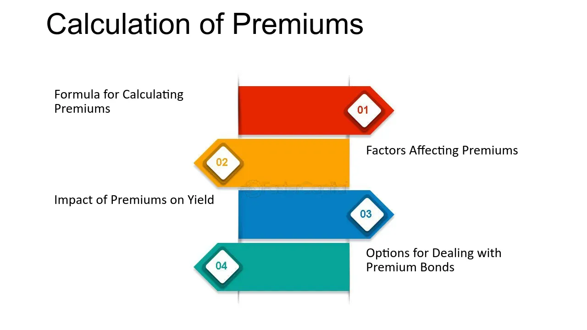

## Table of Contents

## What is a Premium Bond?

A Premium Bond is a type of investment offered by the UK government through National Savings and Investments (NS&I). Instead of earning regular interest like a savings account, Premium Bonds enter you into a monthly prize draw. You can win tax-free prizes ranging from £25 to £1 million. The more bonds you have, the better your chances of winning a prize.

You buy Premium Bonds in units of £1, and there's a minimum purchase of £25. There's no limit to how many bonds you can buy, but there's a maximum holding of £50,000 per person. The money you invest is safe because it's backed by the government, so you won't lose your investment even if you don't win any prizes. It's a popular choice for people who want a fun and potentially rewarding way to save money.

## How do Premium Bonds work?

When you buy Premium Bonds, you're not getting interest like with a normal savings account. Instead, you get entered into a monthly prize draw. Each bond you buy is worth £1, and you need at least £25 to start. The more bonds you have, the more chances you get to win. The prizes can be anything from £25 up to £1 million, and they're all tax-free. The draws are done by a machine called ERNIE, which picks the winners randomly.

Your money is safe with Premium Bonds because they're run by the UK government through National Savings and Investments (NS&I). Even if you don't win any prizes, you won't lose your money. You can cash in your bonds whenever you want, but it might take a few days to get your money back. It's a fun way to save because you might win big, but remember, it's not guaranteed, so it's good to think about other savings options too.

## Who issues Premium Bonds?

Premium Bonds are issued by the UK government through an organization called National Savings and Investments, or NS&I for short. NS&I is a government department that helps people save money in different ways. They use the money from Premium Bonds to help the government pay for things like schools and hospitals.

When you buy Premium Bonds, you're not just saving money; you're also helping the country. The money you put into Premium Bonds goes into a big pool that the government uses. It's a safe way to save because the government guarantees your money, so you know it's secure even if you don't win any prizes.

## What is the minimum and maximum investment for Premium Bonds?

The minimum amount you need to invest in Premium Bonds is £25. This means you have to buy at least 25 bonds, because each bond costs £1. So, if you want to start saving with Premium Bonds, you'll need to have at least £25 to get going.

The maximum amount you can have in Premium Bonds is £50,000. This is the most you can invest at any one time. If you already have £50,000 in Premium Bonds, you won't be able to buy any more until you take some money out.

## How are the winners of Premium Bonds selected?

The winners of Premium Bonds are picked by a special computer called ERNIE, which stands for Electronic Random Number Indicator Equipment. ERNIE picks numbers completely at random, so every bond has an equal chance of winning. It doesn't matter when you bought your bonds or how many you have; ERNIE just picks numbers and those numbers match the bonds.

Once ERNIE has picked the winning numbers, NS&I checks to see who owns those bonds. If your bond number is picked, you win a prize. The prizes can be small, like £25, or big, like £1 million. The draws happen every month, so you get a new chance to win every time.

## What are the odds of winning a prize with Premium Bonds?

The odds of winning a prize with Premium Bonds depend on how many bonds you have. Right now, the odds are about 21,000 to 1 for each £1 bond you own. So, if you have £25 in Premium Bonds, you have 25 chances to win, but the overall odds stay the same for each bond.

The more bonds you have, the more chances you get to win, but your odds of winning with each individual bond don't change. For example, if you have £50,000 in Premium Bonds, you have 50,000 chances to win, but the odds for each of those chances are still 21,000 to 1. It's all about how many bonds you own and how ERNIE picks the winners randomly every month.

## How is the prize fund rate determined for Premium Bonds?

The prize fund rate for Premium Bonds is set by National Savings and Investments (NS&I). It's the percentage of the total money in Premium Bonds that goes into the prize fund each month. This rate changes sometimes, depending on things like how much money people are putting into Premium Bonds and what's happening with interest rates in the rest of the economy.

When the prize fund rate goes up, it means more money goes into the prize fund, so there are more prizes or bigger prizes to win. When it goes down, there's less money for prizes. NS&I looks at all these things to decide what the prize fund rate should be, trying to make sure it's fair and good for people who have Premium Bonds.

## Can Premium Bonds be considered a safe investment?

Premium Bonds can be considered a safe investment because they are backed by the UK government through National Savings and Investments (NS&I). This means that your money is guaranteed to be safe, even if you don't win any prizes. You won't lose your initial investment, which makes Premium Bonds a secure choice for saving money.

However, it's important to remember that Premium Bonds are different from traditional savings accounts. Instead of [earning](/wiki/earning-announcement) regular interest, you enter a monthly prize draw where you might win prizes. This means your returns are not guaranteed, and you might not win anything at all. So, while your money is safe, the growth of your savings depends on luck, and it might not be the best choice if you're looking for steady, predictable returns.

## How do Premium Bonds compare to traditional savings accounts in terms of yield?

Premium Bonds and traditional savings accounts work differently when it comes to how much money you can make. With a traditional savings account, you get a set amount of interest every year. This interest is added to your savings, so your money grows bit by bit. The interest rate is clear, and you know exactly how much you'll earn if you leave your money in the account for a certain time.

With Premium Bonds, you don't get interest. Instead, you enter a monthly prize draw where you might win prizes from £25 up to £1 million. The more bonds you have, the more chances you get to win, but there's no guarantee you'll win anything. The prize fund rate, which is how much money goes into the prize fund, can change and affect your chances of winning. So, while Premium Bonds can be exciting because you might win big, they're not as predictable as a savings account where you know exactly what you'll earn.

## What are the tax implications of winning a Premium Bond prize?

Winning a prize with Premium Bonds is great because it's tax-free. That means you don't have to pay any tax on the money you win, no matter how big or small the prize is. This is different from other types of savings or investments where you might have to pay tax on the interest or gains you make.

So, if you win a prize, you get to keep all of it. This makes Premium Bonds a fun and potentially rewarding way to save money, especially if you're looking to avoid paying taxes on your winnings. Just remember, while the prizes are tax-free, there's no guarantee you'll win anything, so it's good to think about other savings options too.

## How can one manage and track their Premium Bonds?

You can manage and track your Premium Bonds easily using the NS&I website or their mobile app. When you sign up, you get a special holder's number. You use this number to check your account, see if you've won any prizes, and make changes like buying more bonds or cashing them in. The website and app are easy to use, so you can keep an eye on your savings whenever you want.

You can also choose how you want to get your prize money. You can have it paid straight into your bank account, or you can have it added to your Premium Bonds to buy more bonds automatically. NS&I will send you an email or a letter to let you know if you've won a prize, so you'll never miss out on your winnings.

## What strategies can be used to maximize returns from Premium Bonds?

To maximize returns from Premium Bonds, the main strategy is to buy as many bonds as you can afford, up to the maximum limit of £50,000. The more bonds you have, the more chances you get to win prizes each month. Since each bond has an equal chance of winning, having more bonds means you're more likely to win something. It's like buying more lottery tickets; the more you have, the better your odds.

Another strategy is to reinvest your winnings. If you win a prize, you can choose to have it automatically added to your Premium Bonds to buy more bonds. This way, your chances of winning keep growing over time. Just remember, while these strategies can increase your chances, there's no guarantee you'll win anything, so it's good to think about other savings options too.

## What are Premium Bonds and how do they work?

Premium bonds are debt securities that trade above their face value. This premium arises because their coupon rate, or the interest paid to bondholders, is higher than the current market interest rates. When market interest rates decline, existing bonds with higher coupon rates become more attractive, as they offer better returns than newly issued bonds with lower rates. This demand drives up the price of the existing bonds, causing them to trade at a premium.

Investors are often attracted to premium bonds due to the potential for higher yields compared to newly issued bonds of similar credit quality. Yields on premium bonds generally consist of the coupon payment and the amortization of the bond's premium over its remaining life. The yield to maturity (YTM), a common measure of a bond's return, will reflect not only the interest income but also the premium paid over the bond's face value. YTM is calculated as follows:

$$
YTM = \frac{Coupon + \frac{(Face\ Value - Price)}{Years\ to\ Maturity}}{\frac{Face\ Value + Price}{2}}
$$

This formula takes into account the total return on a bond, including interest payments and the gain or loss realized when the bond matures.

Trading at a premium has implications on the bond's callability. Issuers may call bonds if interest rates have fallen sufficiently, allowing them to refinance at a lower rate. In such cases, premium bondholders might lose the higher interest income expected over time. Comparatively, discount bonds, which trade below their face value due to a coupon rate lower than prevailing rates, may offer capital appreciation potential. As these bonds approach maturity, their prices might rise to their face value, providing an additional return apart from the periodic interest payments. 

Understanding the balance between current income, price movements, and potential for a bond to be called is crucial for making informed decisions about purchasing premium bonds. Such knowledge helps investors optimize their strategies according to their financial goals, risk appetite, and market conditions.

## What are the factors affecting bond yields?

Bond yields, a fundamental concept in finance, are influenced by several key factors, each playing a significant role in shaping the returns that investors can expect from their bond investments. The primary factors affecting bond yields include interest rates, credit ratings, and time to maturity.

**Interest Rates**

Interest rates have a direct and profound impact on bond yields, primarily due to the inverse relationship between bond prices and interest rates. When interest rates rise, the existing bonds with lower coupon rates become less attractive, causing their prices to drop and their yields to increase. Conversely, when interest rates fall, existing bonds with higher coupon rates become more attractive, increasing their prices and reducing their yields. The yield on a bond can be calculated using the formula:

$$
\text{Yield} = \frac{\text{Annual Coupon Payment}}{\text{Current Market Price}}
$$

For an investor, understanding the trajectory of [interest rate](/wiki/interest-rate-trading-strategies) movements is crucial for making informed decisions about buying or selling bonds.

**Credit Ratings**

Credit ratings, provided by agencies such as Moody's, Standard & Poor's, and Fitch, evaluate the creditworthiness of bond issuers. Bonds with higher credit ratings generally have lower yields due to their perceived lower risk of default. Lower-rated bonds, often referred to as "junk bonds," offer higher yields to compensate investors for the increased risk of default. Changes in an issuer's credit rating can lead to significant adjustments in bond yields as investors react to the perceived changes in risk.

**Time to Maturity**

The time remaining until a bond's maturity date significantly affects its yield. Bonds with longer maturities typically offer higher yields compared to shorter-term bonds, compensating investors for the increased risk associated with longer holding periods. This relationship is often depicted through a yield curve, which graphically represents the yields of bonds with differing maturities but similar credit quality.

Yield curves can take various shapes, including normal (upward-sloping), inverted (downward-sloping), and flat. Each shape implies different economic expectations, such as growth forecasts or potential recessions, which can influence investment strategies.

Investors seeking to optimize their portfolios must consider how these factors interplay to affect premium bonds' yields. Premium bonds, trading above face value due to higher coupon rates, are especially susceptible to interest rate changes. As market conditions evolve, investors must continuously assess these dynamics to achieve their investment objectives effectively.

## How do you calculate bond discounts and premiums?

Bond prices fluctuate based on various economic conditions, often trading at a premium or discount relative to their face value. Understanding how to calculate these premiums and discounts is essential for investors to evaluate bond investments accurately.

### Bond Price Calculation

The price of a bond is determined by the present value of its future cash flows, which include periodic coupon payments and the repayment of the par value at maturity. The formula to calculate the price of a bond is:

$$

P = \sum_{t=1}^{n} \frac{C}{(1 + r)^t} + \frac{F}{(1 + r)^n} 
$$

where:
- $P$ is the price of the bond,
- $C$ is the annual coupon payment,
- $r$ is the yield to maturity (YTM),
- $F$ is the face value of the bond,
- $n$ is the total number of periods until maturity.

### Trading at a Premium

A bond trades at a premium when its market price is above its face value. This often occurs when the bond's coupon rate is higher than the current market interest rates. Investors are willing to pay more for these bonds because they offer higher periodic payments. The premium is essentially the excess amount over the bond's face value.

**Example**:
Consider a bond with a face value of $1,000, a 10% annual coupon rate, and a YTM of 8%. The bond price can be calculated as follows:

- Annual Coupon Payment ($C$) = 10% of $1,000 = $100

Using the formula:

$$
P = \sum_{t=1}^{n} \frac{100}{(1 + 0.08)^t} + \frac{1000}{(1 + 0.08)^n}
$$

The price $P$ will be greater than $1,000, indicating that the bond is trading at a premium.

### Trading at a Discount

Conversely, a bond is trading at a discount if its market price is below its face value. This usually happens when the bond's coupon rate is lower than prevailing market interest rates. The discount is the difference between the bond's market price and its face value.

**Example**:
Suppose a bond has a face value of $1,000, a 5% coupon rate, and a YTM of 7%. Here, the calculations would be similar but with the rate adjusted to 7%, leading to a bond price lower than $1,000.

### Simplified Calculation with Python

Using Python, investors can simplify bond price calculations with the following script:

```python
def calculate_bond_price(face_value, coupon_rate, periods, yield_to_maturity):
    coupon_payment = face_value * coupon_rate
    price = sum([coupon_payment / (1 + yield_to_maturity) ** t for t in range(1, periods + 1)])
    price += face_value / (1 + yield_to_maturity) ** periods
    return price

face_value = 1000
coupon_rate = 0.10  # 10% coupon rate
periods = 10        # assuming 10 years to maturity
yield_to_maturity = 0.08  # 8% yield to maturity

price = calculate_bond_price(face_value, coupon_rate, periods, yield_to_maturity)
print(f"The bond price is: ${price:.2f}")
```

By understanding the mechanics behind bond pricing and utilizing tools like formulas and programming scripts, investors can better comprehend the market dynamics of premiums and discounts, enabling informed decisions in bond investments.

## What is the impact of interest rates on bonds?

Interest rates and bond prices have a well-established inverse relationship. When interest rates rise, existing bond prices typically fall, and when interest rates decline, existing bond prices generally increase. This inverse correlation is pivotal in understanding market dynamics and making informed investment decisions.

### Impact on Premium Bonds

Premium bonds are priced above their face value due to their higher coupon rates relative to current market rates. A rise in interest rates can diminish the attractiveness of these bonds, as new issues may offer higher returns in line with current rates, leading to a drop in the market price of premium bonds. Conversely, a decline in interest rates enhances the appeal of the high coupon rates of premium bonds, thereby boosting their market price. 

### Impact on Discount Bonds

Discount bonds, on the other hand, trade below par value. They can become more appealing when interest rates decrease because their lower price offers higher effective yields compared to newly issued bonds. If interest rates rise, however, their value tends to drop further, as new bonds offer competitive yields without the need for a discount.

### Illustrative Scenarios

Let's consider an example where a bond has a face value of $1,000, a coupon rate of 5%, and the prevailing market interest rate is 4%. This scenario indicates a premium bond, as the coupon rate is higher than the market rate. If the market interest rate rises to 6%, the bond's fixed coupon becomes less attractive, causing its price to drop to reflect the new rate environment.

Conversely, if the interest rate falls to 3%, the bond's price increases, as its higher coupon becomes more desirable. The change in bond price can be calculated using the present value of future cash flows, which considers the altered interest rate as the discount [factor](/wiki/factor-investing).

### Mathematical Representation

The price $P$ of a bond can be defined by the formula:

$$
P = \sum_{t=1}^{n} \frac{C}{(1 + r)^t} + \frac{F}{(1 + r)^n}
$$

where:
- $C$ is the annual coupon payment,
- $r$ is the market interest rate,
- $F$ is the face value of the bond,
- $n$ is the number of years until maturity.

In Python, this calculation can be illustrated as follows:

```python
def bond_price(face_value, coupon_rate, market_rate, years_to_maturity):
    coupon_payment = face_value * coupon_rate
    price = sum(coupon_payment / (1 + market_rate)**t for t in range(1, years_to_maturity + 1))
    price += face_value / (1 + market_rate)**years_to_maturity
    return price

# Example usage
face_value = 1000
coupon_rate = 0.05
market_rate = 0.04
years_to_maturity = 10

print(bond_price(face_value, coupon_rate, market_rate, years_to_maturity))
```

This Python function calculates the price of a bond given different market interest rates and can help investors assess the impact of interest rate fluctuations on their bond investments. Understanding these dynamics is crucial for investors to optimize bond portfolio performance and manage risk effectively.

## References & Further Reading

1. **Investing in Bonds: An Introduction to Risk and Return** by Roger G. Ibbotson and Paul D. Kaplan (Financial Analysts Journal, 1999): This paper provides a comprehensive overview of bond investment risks and returns, which is foundational for understanding premium bonds and bond yields.

2. **Algorithmic Trading in Financial Markets: A Review** by Álvaro Cartea, Sebastian Jaimungal, and José Penalva (Annual Review of Financial Economics, 2015): This review offers insights into algorithmic trading systems, their influence on bond markets, and the associated risks and benefits.

3. **The Handbook of Fixed Income Securities** by Frank J. Fabozzi: A detailed resource on fixed income securities, this book covers topics from bond pricing and valuation to the impact of interest rates on bond prices.

4. **Interest Rate Impact on Bond Pricing and Yields** by Darrell Duffie and Kenneth J. Singleton (Journal of Economic Perspectives, 1997): This article explains the relationship between interest rates and bond pricing. It's essential for understanding how rate fluctuations affect premium bonds.

5. **The Mathematics of Bonds** by John C. Hull: Provides detailed formulas and examples for calculating bond prices and yields, crucial for understanding premiums and discounts in bond trading.

6. **An Introduction to Bond Math** by Annette Thau: This book simplifies the mathematical calculations involved in bond investments, making it easier to understand their market positioning.

7. **Advanced Financial Risk Management: Tools and Techniques for Integrated Credit Risk and Interest Rate Risk Management** by Donald R. Van Deventer, Kenji Imai, and Mark Mesler: Discusses risk management strategies relevant to bonds, emphasizing the importance of understanding bond yields and pricing dynamics.

8. **The Role of Interest Rates in Investment: Evaluating the Impact on Bonds and Stocks** by Eugene F. Fama: Provides insights into interest rate movements and their implications for bond investing, crucial for understanding trends in premium and discount bonds.

9. **Quantitative Trading: How to Build Your Own Algorithmic Trading Business** by Ernie Chan: This book offers practical advice on setting up algorithmic trading systems, which are increasingly impacting bond markets.

For further exploration, readers are encouraged to engage with these materials to gain a deeper understanding of the intricate dynamics of the bond market, encompassing premium bonds, bond yields, and [algorithmic trading](/wiki/algorithmic-trading).

