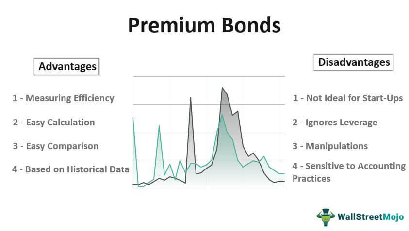

The world of finance is abundant with varied financial instruments, each offering unique opportunities and potential risks for investors. Among these, premium bonds, bond yields, and algorithmic trading play significant roles in shaping investment strategies and outcomes, particularly within the bond markets.

Premium bonds are unique debt securities that trade above their face value due to a coupon rate that surpasses current market interest rates. This phenomenon can be attractive to investors seeking higher yields compared to those offered by newly issued bonds with equivalent credit standings. Understanding premium bonds is critical for investors as it impacts their portfolio’s income stream and overall valuation.



Bond yields, a vital component in assessing bond investments, are influenced by several factors including prevailing interest rates, the issuer’s credit rating, and the time remaining until a bond's maturity. The intricate relationship between these elements aids investors in predicting bond price movements and helps in determining optimal timings for buying or selling bonds.

Algorithmic trading, a technology-driven facet of modern finance, utilizes sophisticated algorithms to execute trades with greater speed and efficiency, often exploiting minute market inefficiencies. In bond markets, algorithmic trading can significantly influence liquidity and market dynamics, providing both opportunities and challenges.

For investors, a comprehensive understanding of these components is imperative to optimizing their portfolios and successfully navigating the often volatile landscape of financial markets. This article aims to provide insights into the definitions and mechanisms of premium bonds, bond yields, and algorithmic trading, examining the factors influencing bond prices and the impacts of technological advancements on bond investing. By grasping these concepts, investors can better navigate the complexities inherent in today's financial markets.

## Table of Contents

## Understanding Premium Bonds

Premium bonds are debt securities that trade above their face value. This premium arises because their coupon rate, or the interest paid to bondholders, is higher than the current market interest rates. When market interest rates decline, existing bonds with higher coupon rates become more attractive, as they offer better returns than newly issued bonds with lower rates. This demand drives up the price of the existing bonds, causing them to trade at a premium.

Investors are often attracted to premium bonds due to the potential for higher yields compared to newly issued bonds of similar credit quality. Yields on premium bonds generally consist of the coupon payment and the amortization of the bond's premium over its remaining life. The yield to maturity (YTM), a common measure of a bond's return, will reflect not only the interest income but also the premium paid over the bond's face value. YTM is calculated as follows:

$$
YTM = \frac{Coupon + \frac{(Face\ Value - Price)}{Years\ to\ Maturity}}{\frac{Face\ Value + Price}{2}}
$$

This formula takes into account the total return on a bond, including interest payments and the gain or loss realized when the bond matures.

Trading at a premium has implications on the bond's callability. Issuers may call bonds if interest rates have fallen sufficiently, allowing them to refinance at a lower rate. In such cases, premium bondholders might lose the higher interest income expected over time. Comparatively, discount bonds, which trade below their face value due to a coupon rate lower than prevailing rates, may offer capital appreciation potential. As these bonds approach maturity, their prices might rise to their face value, providing an additional return apart from the periodic interest payments. 

Understanding the balance between current income, price movements, and potential for a bond to be called is crucial for making informed decisions about purchasing premium bonds. Such knowledge helps investors optimize their strategies according to their financial goals, risk appetite, and market conditions.

## Factors Affecting Bond Yields

Bond yields, a fundamental concept in finance, are influenced by several key factors, each playing a significant role in shaping the returns that investors can expect from their bond investments. The primary factors affecting bond yields include interest rates, credit ratings, and time to maturity.

**Interest Rates**

Interest rates have a direct and profound impact on bond yields, primarily due to the inverse relationship between bond prices and interest rates. When interest rates rise, the existing bonds with lower coupon rates become less attractive, causing their prices to drop and their yields to increase. Conversely, when interest rates fall, existing bonds with higher coupon rates become more attractive, increasing their prices and reducing their yields. The yield on a bond can be calculated using the formula:

$$
\text{Yield} = \frac{\text{Annual Coupon Payment}}{\text{Current Market Price}}
$$

For an investor, understanding the trajectory of [interest rate](/wiki/interest-rate-trading-strategies) movements is crucial for making informed decisions about buying or selling bonds.

**Credit Ratings**

Credit ratings, provided by agencies such as Moody's, Standard & Poor's, and Fitch, evaluate the creditworthiness of bond issuers. Bonds with higher credit ratings generally have lower yields due to their perceived lower risk of default. Lower-rated bonds, often referred to as "junk bonds," offer higher yields to compensate investors for the increased risk of default. Changes in an issuer's credit rating can lead to significant adjustments in bond yields as investors react to the perceived changes in risk.

**Time to Maturity**

The time remaining until a bond's maturity date significantly affects its yield. Bonds with longer maturities typically offer higher yields compared to shorter-term bonds, compensating investors for the increased risk associated with longer holding periods. This relationship is often depicted through a yield curve, which graphically represents the yields of bonds with differing maturities but similar credit quality.

Yield curves can take various shapes, including normal (upward-sloping), inverted (downward-sloping), and flat. Each shape implies different economic expectations, such as growth forecasts or potential recessions, which can influence investment strategies.

Investors seeking to optimize their portfolios must consider how these factors interplay to affect premium bonds' yields. Premium bonds, trading above face value due to higher coupon rates, are especially susceptible to interest rate changes. As market conditions evolve, investors must continuously assess these dynamics to achieve their investment objectives effectively.

## Calculating Bond Discounts and Premiums

Bond prices fluctuate based on various economic conditions, often trading at a premium or discount relative to their face value. Understanding how to calculate these premiums and discounts is essential for investors to evaluate bond investments accurately.

### Bond Price Calculation

The price of a bond is determined by the present value of its future cash flows, which include periodic coupon payments and the repayment of the par value at maturity. The formula to calculate the price of a bond is:

$$

P = \sum_{t=1}^{n} \frac{C}{(1 + r)^t} + \frac{F}{(1 + r)^n} 
$$

where:
- $P$ is the price of the bond,
- $C$ is the annual coupon payment,
- $r$ is the yield to maturity (YTM),
- $F$ is the face value of the bond,
- $n$ is the total number of periods until maturity.

### Trading at a Premium

A bond trades at a premium when its market price is above its face value. This often occurs when the bond's coupon rate is higher than the current market interest rates. Investors are willing to pay more for these bonds because they offer higher periodic payments. The premium is essentially the excess amount over the bond's face value.

**Example**:
Consider a bond with a face value of $1,000, a 10% annual coupon rate, and a YTM of 8%. The bond price can be calculated as follows:

- Annual Coupon Payment ($C$) = 10% of $1,000 = $100

Using the formula:

$$
P = \sum_{t=1}^{n} \frac{100}{(1 + 0.08)^t} + \frac{1000}{(1 + 0.08)^n}
$$

The price $P$ will be greater than $1,000, indicating that the bond is trading at a premium.

### Trading at a Discount

Conversely, a bond is trading at a discount if its market price is below its face value. This usually happens when the bond's coupon rate is lower than prevailing market interest rates. The discount is the difference between the bond's market price and its face value.

**Example**:
Suppose a bond has a face value of $1,000, a 5% coupon rate, and a YTM of 7%. Here, the calculations would be similar but with the rate adjusted to 7%, leading to a bond price lower than $1,000.

### Simplified Calculation with Python

Using Python, investors can simplify bond price calculations with the following script:

```python
def calculate_bond_price(face_value, coupon_rate, periods, yield_to_maturity):
    coupon_payment = face_value * coupon_rate
    price = sum([coupon_payment / (1 + yield_to_maturity) ** t for t in range(1, periods + 1)])
    price += face_value / (1 + yield_to_maturity) ** periods
    return price

face_value = 1000
coupon_rate = 0.10  # 10% coupon rate
periods = 10        # assuming 10 years to maturity
yield_to_maturity = 0.08  # 8% yield to maturity

price = calculate_bond_price(face_value, coupon_rate, periods, yield_to_maturity)
print(f"The bond price is: ${price:.2f}")
```

By understanding the mechanics behind bond pricing and utilizing tools like formulas and programming scripts, investors can better comprehend the market dynamics of premiums and discounts, enabling informed decisions in bond investments.

## Impact of Interest Rates on Bonds

Interest rates and bond prices have a well-established inverse relationship. When interest rates rise, existing bond prices typically fall, and when interest rates decline, existing bond prices generally increase. This inverse correlation is pivotal in understanding market dynamics and making informed investment decisions.

### Impact on Premium Bonds

Premium bonds are priced above their face value due to their higher coupon rates relative to current market rates. A rise in interest rates can diminish the attractiveness of these bonds, as new issues may offer higher returns in line with current rates, leading to a drop in the market price of premium bonds. Conversely, a decline in interest rates enhances the appeal of the high coupon rates of premium bonds, thereby boosting their market price. 

### Impact on Discount Bonds

Discount bonds, on the other hand, trade below par value. They can become more appealing when interest rates decrease because their lower price offers higher effective yields compared to newly issued bonds. If interest rates rise, however, their value tends to drop further, as new bonds offer competitive yields without the need for a discount.

### Illustrative Scenarios

Let's consider an example where a bond has a face value of $1,000, a coupon rate of 5%, and the prevailing market interest rate is 4%. This scenario indicates a premium bond, as the coupon rate is higher than the market rate. If the market interest rate rises to 6%, the bond's fixed coupon becomes less attractive, causing its price to drop to reflect the new rate environment.

Conversely, if the interest rate falls to 3%, the bond's price increases, as its higher coupon becomes more desirable. The change in bond price can be calculated using the present value of future cash flows, which considers the altered interest rate as the discount [factor](/wiki/factor-investing).

### Mathematical Representation

The price $P$ of a bond can be defined by the formula:

$$
P = \sum_{t=1}^{n} \frac{C}{(1 + r)^t} + \frac{F}{(1 + r)^n}
$$

where:
- $C$ is the annual coupon payment,
- $r$ is the market interest rate,
- $F$ is the face value of the bond,
- $n$ is the number of years until maturity.

In Python, this calculation can be illustrated as follows:

```python
def bond_price(face_value, coupon_rate, market_rate, years_to_maturity):
    coupon_payment = face_value * coupon_rate
    price = sum(coupon_payment / (1 + market_rate)**t for t in range(1, years_to_maturity + 1))
    price += face_value / (1 + market_rate)**years_to_maturity
    return price

# Example usage
face_value = 1000
coupon_rate = 0.05
market_rate = 0.04
years_to_maturity = 10

print(bond_price(face_value, coupon_rate, market_rate, years_to_maturity))
```

This Python function calculates the price of a bond given different market interest rates and can help investors assess the impact of interest rate fluctuations on their bond investments. Understanding these dynamics is crucial for investors to optimize bond portfolio performance and manage risk effectively.

## Algorithmic Trading in Bond Markets

Algorithmic trading in bond markets involves the utilization of sophisticated algorithms to automatically execute trades based on predefined criteria and market conditions. These systems are designed to enhance trading efficiency, reduce transaction costs, and capitalize on short-term market inefficiencies.

### Components of Algorithmic Trading Systems

Algorithmic trading systems in bond markets consist of several key components:

1. **Data Acquisition and Processing**: High-frequency data feeds are crucial for algorithmic trading. These systems rely on real-time data from various sources, including market exchanges, economic indicators, and news feeds, to make informed trading decisions.

2. **Trading Algorithms**: The core of any algorithmic system is the set of algorithms that determine trading strategies. These can include statistical arbitrage, trend-following, and mean reversion strategies. Algorithms use this data to identify opportunities and execute trades at optimal prices.

3. **Execution Platforms**: Once an opportunity is identified, the execution platform is responsible for placing orders with the market. This involves managing order types, execution speed, and minimizing market impact, often through smart order routing technologies.

4. **Risk Management Systems**: Effective risk management is crucial in algorithmic trading. These systems continuously monitor market positions to manage exposure and ensure compliance with regulatory mandates and risk thresholds.

5. **Machine Learning and Artificial Intelligence**: Modern algorithmic systems often incorporate AI and machine learning to adapt trading strategies based on historical performance and evolving market conditions.

### Benefits of Algorithmic Trading in Bond Markets

Algorithmic trading in bond markets provides various advantages:

- **Speed and Efficiency**: Algorithms can process and react to market information at speeds unattainable by human traders, enabling the exploitation of fleeting trading opportunities.

- **Cost Reduction**: By optimizing trade execution and reducing market impact, algorithmic trading can lower transaction costs.

- **Consistency and Discipline**: Algorithms execute trades based on data and predefined rules, eliminating emotional decision-making and allowing for consistent execution.

- **Access to Complex Strategies**: Algorithmic systems can process large datasets to implement complex trading strategies that would be cumbersome manually.

### Risks of Algorithmic Trading in Bond Markets

Despite its benefits, [algorithmic trading](/wiki/algorithmic-trading) also presents several risks:

- **Systemic Risks**: High-frequency trading can contribute to market volatility and systemic risks, as seen during events like the Flash Crash of 2010.

- **Technological Failures**: Given their reliance on technology, algorithmic systems are vulnerable to glitches, coding errors, and infrastructure failures, which can lead to significant financial losses.

- **Regulatory Challenges**: The use of algorithmic trading has prompted regulatory bodies to impose strict compliance requirements to prevent market manipulation and ensure fair trading practices.

### Conclusion

Algorithmic trading has transformed bond markets, offering increased efficiency and strategic advantages. However, it is imperative for participants to understand the associated risks and implement robust risk management strategies. By harnessing the capabilities of advanced technologies, investors can effectively navigate and optimize their involvement in the dynamic landscape of bond trading.

## Conclusion and Key Takeaways

Understanding the dynamics of premium bonds, bond yields, and algorithmic trading is essential for modern investors striving to enhance their portfolio performance. Premium bonds, which trade above their face value due to higher coupon rates, present unique opportunities and challenges. They offer higher yields than newer issues, making them attractive in stable or declining interest rate environments where their lucrative coupons retain value. However, accurately assessing the future trajectory of interest rates is crucial since rising rates can erode the premium of these bonds.

Bond yields are intricately linked to broader economic indicators such as interest rates, credit quality, and maturity periods. Changes in these factors affect not only individual bond prices but also overall market sentiment. For example, a rise in interest rates typically leads to lower bond prices, negatively impacting premium bonds. Hence, investors must continuously assess these variables to determine optimal buying and selling points, ensuring they remain responsive to economic shifts.

Algorithmic trading introduces another dimension to bond market investments. By leveraging sophisticated algorithms, investors can execute trades with increased speed and precision, maximizing returns through market inefficiencies. While algorithmic trading offers benefits such as reduced transaction costs and minimized human error, it also presents risks, including potential market [volatility](/wiki/volatility-trading-strategies) and systemic issues arising from automated operations. Investors must weigh these factors carefully, utilizing technology judiciously to complement traditional market strategies.

In summary, gaining a thorough comprehension of premium bonds, bond yields, and algorithmic trading empowers investors to make informed decisions. Strategically managing bond investments and effectively leveraging technological advancements can help navigate the complexities of today's financial markets, enhancing returns and managing risks efficiently.

## References & Further Reading

1. **Investing in Bonds: An Introduction to Risk and Return** by Roger G. Ibbotson and Paul D. Kaplan (Financial Analysts Journal, 1999): This paper provides a comprehensive overview of bond investment risks and returns, which is foundational for understanding premium bonds and bond yields.

2. **Algorithmic Trading in Financial Markets: A Review** by Álvaro Cartea, Sebastian Jaimungal, and José Penalva (Annual Review of Financial Economics, 2015): This review offers insights into algorithmic trading systems, their influence on bond markets, and the associated risks and benefits.

3. **The Handbook of Fixed Income Securities** by Frank J. Fabozzi: A detailed resource on fixed income securities, this book covers topics from bond pricing and valuation to the impact of interest rates on bond prices.

4. **Interest Rate Impact on Bond Pricing and Yields** by Darrell Duffie and Kenneth J. Singleton (Journal of Economic Perspectives, 1997): This article explains the relationship between interest rates and bond pricing. It's essential for understanding how rate fluctuations affect premium bonds.

5. **The Mathematics of Bonds** by John C. Hull: Provides detailed formulas and examples for calculating bond prices and yields, crucial for understanding premiums and discounts in bond trading.

6. **An Introduction to Bond Math** by Annette Thau: This book simplifies the mathematical calculations involved in bond investments, making it easier to understand their market positioning.

7. **Advanced Financial Risk Management: Tools and Techniques for Integrated Credit Risk and Interest Rate Risk Management** by Donald R. Van Deventer, Kenji Imai, and Mark Mesler: Discusses risk management strategies relevant to bonds, emphasizing the importance of understanding bond yields and pricing dynamics.

8. **The Role of Interest Rates in Investment: Evaluating the Impact on Bonds and Stocks** by Eugene F. Fama: Provides insights into interest rate movements and their implications for bond investing, crucial for understanding trends in premium and discount bonds.

9. **Quantitative Trading: How to Build Your Own Algorithmic Trading Business** by Ernie Chan: This book offers practical advice on setting up algorithmic trading systems, which are increasingly impacting bond markets.

For further exploration, readers are encouraged to engage with these materials to gain a deeper understanding of the intricate dynamics of the bond market, encompassing premium bonds, bond yields, and algorithmic trading.

