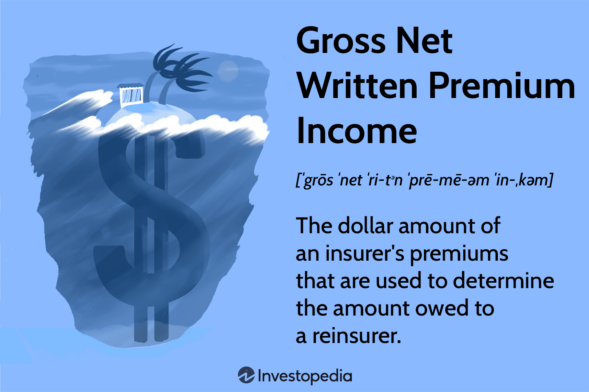

The financial world is vast and intricate, with various terms and concepts interwoven to create a complex tapestry of understanding and opportunity. At the heart of this complexity lies the interplay between financial mechanisms, premium income, insurance premiums, and algorithmic trading. Each element serves a unique function yet can converge to create both challenges and opportunities for investors and businesses alike.

Financial mechanisms encompass the tools and processes that facilitate the movement and management of capital. These include instruments such as options contracts, which provide the seller with premium income and play a role in risk mitigation and investment strategies. Insurance premiums, on the other hand, represent regular payments made to insurers to hedge against specific risks, ensuring financial stability for policyholders while generating crucial revenue for insurance companies.



Algorithmic trading stands out as a revolutionary approach within this interconnected framework, utilizing sophisticated algorithms to execute trades at high speed and volume, thereby providing efficiency and precision in capturing fleeting market opportunities. This method attracts those who strive to refine their market strategies, particularly by leveraging historical data and predictive analytics.

Together, these components can lead to enhanced financial performance when intelligently integrated. As we look to understand their definitions, applications, and implications across the broader financial landscape, it is clear that mastery of these elements can offer a significant competitive edge. In a world where financial technology rapidly evolves, continuous learning and adaptation remain critical to harnessing the full potential of these financial instruments.

## Table of Contents

## Understanding Financial Mechanisms

Financial mechanisms are the integral processes and tools that enable the efficient movement and management of money across markets and institutions. They embody the frameworks through which financial activities are conducted and encompass a wide range of instruments and strategies. Primarily, these include options, insurance, and algorithmic trading systems, each fulfilling distinct roles in the financial markets.

Options are financial derivatives that grant the holder the right, but not the obligation, to buy or sell an underlying asset at a predetermined price within a specified time frame. These instruments are pivotal in risk management strategies, as they can be used to hedge against potential losses in an investment portfolio. For example, purchasing a put option can protect an investor against a decline in the price of a stock they own, thereby limiting downside risk.

Insurance, another key mechanism, operates by pooling risk among various policyholders. Individuals or entities pay premiums in exchange for coverage against specific risks, such as health issues, property damage, or business interruptions. This mechanism not only provides financial protection but also facilitates capital allocation within the economy. By transferring risk, insurance enables businesses to undertake ventures that might otherwise be considered too risky.

Algorithmic trading systems leverage complex mathematical models and high-speed computing to execute trades automatically. These systems are capable of processing vast amounts of data and making rapid decisions that are impossible for human traders to match. Algorithmic trading enhances market efficiency and [liquidity](/wiki/liquidity-risk-premium), as it allows for the quick execution of large volumes of trades with minimal impact on market prices. Furthermore, it aids in optimizing returns by capitalizing on fleeting market opportunities through strategies like statistical [arbitrage](/wiki/arbitrage) or [trend following](/wiki/trend-following).

The significance of understanding these financial mechanisms cannot be overstated for investors and businesses aiming to succeed in today's financial landscape. Not only do they present opportunities for maximizing returns and managing risk, but they also underpin the stability and fluidity of financial markets. A comprehensive grasp of how these instruments operate and interact is instrumental in navigating the complexities of modern finance, enabling informed decision-making that can lead to sustained economic growth and resilience.

## The Concept of Premium Income

Premium income represents a vital component in the finance sector, embodying the cash inflows that emerge from offering risk protection through various financial instruments, specifically options contracts and insurance policies. These mechanisms, while differing in their structures and functions, share the commonality of generating premium income, which serves as a critical element in both investing and risk management strategies.

In the context of options trading, premium income is acquired through the act of selling options contracts. In this transactional framework, the seller, often referred to as the "writer," is compensated with a premium for assuming the potential obligation to deliver an underlying asset, should the buyer decide to exercise the option. This process involves a sophisticated interplay between risk and reward, with writers leveraging their market expertise to determine appropriate pricing for the premium. The seller is obligated to fulfill the contract terms if the specified conditions are met, such as the option being exercised within a given time frame. The collected premiums can serve as a steady source of income, often utilized to hedge other investment exposures or to speculate on market movements.

In the insurance industry, premium income derives from the regular payments made by policyholders. These payments are crucial for insurance companies as they provide the necessary funds to manage and settle claims while enabling investment into future liabilities. The income from premiums is a primary revenue stream for insurers, allowing them to construct reserves and invest in diverse portfolios, enhancing their capacity to handle large-scale claims. Effective management of this income involves balancing coverage offerings with the risks associated with potential claims, necessitating actuarially sound pricing models and risk assessments.

The dual role of premium income in options and insurance delineates its significant position in the finance landscape. It not only supports investment endeavors but also underpins comprehensive risk mitigation strategies. The successful management and utilization of premium income empower businesses and investors alike to navigate the complexities of financial markets with greater confidence and precision.

## Insurance Premiums: Significance and Calculation

Insurance premiums serve as the lifeblood of the insurance industry, representing a primary revenue stream for insurers. These payments are made by policyholders to secure financial protection against potential risks, ranging from health and property damage to liability risks. The calculation of insurance premiums is a meticulous process, designed to accurately reflect the potential risk an insurer takes on by providing coverage. 

Calculating insurance premiums involves various critical factors:

1. **Risk Level**: The fundamental basis of premium calculation is the assessment of the risk being insured. Higher risk scenarios typically necessitate higher premiums. For instance, an individual with a history of health issues might pay more for health insurance than someone without such a history. Risk assessment tools and models help insurance companies estimate the likelihood and potential cost of claims.

2. **Policyholder’s Profile**: This includes personal information about the insured, such as age, gender, occupation, and location, which can influence the probability of a claim. For example, younger drivers might face higher car insurance premiums due to statistically higher accident rates among their age group.

3. **Claim History**: A policyholder's past behavior in filing claims also impacts the premium calculation. A record of frequent claims usually results in higher premiums, as it indicates a higher likelihood of future claims. 

These components are integral for consumers to understand, as they directly influence the cost and terms of their insurance policies. By analyzing these factors, consumers can make informed decisions that best suit their financial capabilities and protection needs.

For insurers, balancing premium income is crucial to maintain profitability while ensuring they hold adequate reserves to meet potential claims. Sound financial management involves modeling techniques to predict claim costs and reserve setting based on statistical analysis. Here is a simple Python script emphasizing how insurers might use data to analyze risk levels and calculate potential premium ranges:

```python
def calculate_premium(base_rate, risk_factor, profile_factor, claim_history_factor):
    premium = base_rate * (1 + risk_factor + profile_factor + claim_history_factor)
    return premium

# Example usage:
base_rate = 1000  # base rate for simplicity
risk_factor = 0.2  # 20% added for assessed risk
profile_factor = 0.1  # 10% based on profile (age, occupation, etc.)
claim_history_factor = 0.15  # 15% due to past claim history

calculated_premium = calculate_premium(base_rate, risk_factor, profile_factor, claim_history_factor)
print("Calculated Premium:", calculated_premium)
```

Ultimately, sound premium calculation is not just about assessing risk accurately but also about achieving a balance that satisfies policyholders while maintaining the financial health of the insurance provider. This balance underscores the strategic importance of financial management within the insurance industry.

## Algorithmic Trading: Revolutionizing Financial Markets

Algorithmic trading represents a transformative approach in financial markets, leveraging the power of computer algorithms to execute trades at remarkable speeds and volumes. These pre-set instructions are designed to optimize efficiency and precision, enabling traders to exploit market movements that may elude human perception.

The foundation of [algorithmic trading](/wiki/algorithmic-trading) lies in its dependence on data, speed, and advanced technology. Traders utilize historical and real-time data to inform their algorithms, which rely on robust computational resources to execute trades within fractions of a second. This method requires thorough testing and iterative refinement to maintain effectiveness in dynamic market environments. Traders often employ [backtesting](/wiki/backtesting), a technique that involves using historical data to assess the viability of a trading strategy before applying it to live markets. This ensures that the algorithm performs as expected under various market conditions.

Algorithmic trading significantly affects market dynamics, primarily impacting liquidity, price discovery, and [volatility](/wiki/volatility-trading-strategies). Liquidity refers to the ease with which an asset can be bought or sold without affecting its price. With algorithmic trading, the rapid execution of large trade volumes can enhance liquidity, making it easier for other market participants to execute their trades. However, this also introduces complexity as algorithms may react to each other, potentially leading to heightened volatility.

Price discovery—the process through which markets set asset prices—benefits from the increased efficiency and speed of algorithmic trading. Algorithms can quickly process vast amounts of information, reacting to news or changes in market conditions faster than human traders. This ability helps in adjusting asset prices more accurately and in real-time, ultimately supporting better-informed investment decisions.

Nevertheless, the reliance on algorithms necessitates vigilant oversight to mitigate risks associated with potential erroneous trades or the cascading effects of high-frequency trading. Instances such as the "flash crash" of 2010 demonstrate how algorithmic trading can contribute to significant, albeit temporary, market disruptions.

Algorithmic trading continues to revolutionize financial markets, representing both substantial opportunities and challenges. As technology evolves, so too will the strategies and tools used in this domain, shaping the future landscape of trading and investment.

## The Intersection of Premium Income and Algorithmic Trading

Innovative strategies in finance have recently emphasized the use of algorithmic trading to optimize premium income, largely impacting options trading. At the core of this approach is the ability of algorithms to swiftly analyze market data, identify favorable trading conditions, execute orders, and manage risk exposure effectively. 

Algorithmic trading systems utilize complex mathematical models to process massive datasets and detect patterns or anomalies that signify advantageous trading opportunities. This is particularly beneficial in options trading, where generating premium income involves selling options contracts and managing the associated risks. By incorporating algorithms, traders can optimize the selection of options to write, thus maximizing the premiums received while minimizing potential downsides. 

For instance, algorithms can be programmed to monitor implied volatility levels in options markets, which influence options pricing. A trader might set up an algorithm to enter sell orders for options when implied volatility spikes, assuming these periods often result in overpricing of options. The algorithm could then automatically execute trades based on predetermined criteria, such as selling call or put options when the implied volatility percentile exceeds a certain threshold, thereby collecting higher premiums.

The ability of algorithms to backtest strategies is another critical advantage. With historical market data, traders can evaluate their strategies' past performance, making adjustments to enhance profitability. Here is a simple Python snippet demonstrating how a trader might backtest an options selling strategy using historical volatility data:

```python
import pandas as pd
import numpy as np

# Load historical options data
data = pd.read_csv('options_data.csv')  # implied volatility data, for example

# Define a simple strategy: Sell options when implied volatility > 75th percentile
vol_threshold = np.percentile(data['implied_volatility'], 75)

# Simulate strategy
data['signal'] = np.where(data['implied_volatility'] > vol_threshold, 'sell', 'hold')

# Calculate cumulative premium income from selling options
premium_income = (data['signal'] == 'sell').sum() * average_premium_per_option
print('Total Premium Income:', premium_income)
```

While the confluence of algorithmic trading and premium income strategies holds great promise, it requires expertise to manage effectively. The complexity and speed at which algorithms operate necessitate continuous monitoring and refinement to adapt to changing market conditions. Errors in algorithm design or implementation can expose traders to significant risks, underscoring the importance of diligent oversight. 

This symbiotic relationship between algorithmically managed trading and premium income optimization offers potential for improved financial performance. Yet, it is not without challenges, as it demands both technical expertise and a nuanced understanding of market dynamics. Traders and analysts alike must maintain a vigilant approach to harness the full benefits of these advanced strategies.

## Conclusion

In today’s rapidly evolving financial ecosystem, understanding the interplay between premium income, insurance premiums, and algorithmic trading is imperative. Each of these elements brings unique advantages and challenges, offering pathways to competitive advantage in the market. Mastery of these financial components is crucial for investors and businesses aiming to optimize their strategies and enhance their returns.

Premium income, whether derived from selling options or collecting insurance premiums, serves as a cornerstone of both risk management and income generation. The ability to navigate this area effectively requires a deep understanding of market dynamics, contract specifics, and risk assessment. Insurance premiums, as a revenue stream for insurers, require careful calculation and management to balance profitability with the capacity to cover claims.

Algorithmic trading, on the other hand, has revolutionized the efficiency and precision of financial markets. By leveraging technology and data-driven strategies, traders can capitalize on fleeting market opportunities that may elude human perception. The evolution of algorithmic trading continues to reshape market dynamics, influencing liquidity, price discovery, and volatility.

Continuing education and adaptability are crucial in this context, as financial technology and market conditions frequently change. As the integration of premium income strategies and algorithmic trading becomes more sophisticated, the potential for these mechanisms to reshape investment strategies and contribute to economic stability grows. Those who remain informed and agile will be well-positioned to harness these tools in navigating the complexities of modern financial landscapes. As such, these financial mechanisms are not only integral to current market practices but also central to future developments in investment and economic policy.

## References & Further Reading

[1]: Bergstra, J., Bardenet, R., Bengio, Y., & Kégl, B. (2011). ["Algorithms for Hyper-Parameter Optimization."](https://dl.acm.org/doi/10.5555/2986459.2986743) Advances in Neural Information Processing Systems 24.

[2]: ["Advances in Financial Machine Learning"](https://www.amazon.com/Advances-Financial-Machine-Learning-Marcos/dp/1119482089) by Marcos Lopez de Prado

[3]: ["Evidence-Based Technical Analysis: Applying the Scientific Method and Statistical Inference to Trading Signals"](https://www.amazon.com/Evidence-Based-Technical-Analysis-Scientific-Statistical/dp/0470008741) by David Aronson

[4]: ["Machine Learning for Algorithmic Trading"](https://github.com/stefan-jansen/machine-learning-for-trading) by Stefan Jansen

[5]: ["Quantitative Trading: How to Build Your Own Algorithmic Trading Business"](https://www.amazon.com/Quantitative-Trading-Build-Algorithmic-Business/dp/1119800064) by Ernest P. Chan