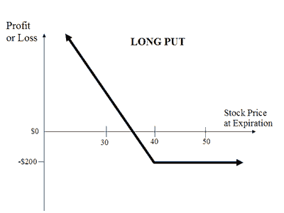

Convertible securities are a dynamic financial instrument, offering a hybrid investment option that blends features of both debt and equity. Predominantly, they take the form of convertible bonds, which can be converted into a predetermined number of shares of the issuing company. This dual nature provides investors with the potential for steady income from the bond's interest payments and the opportunity for capital appreciation through equity conversion.

In contemporary investment portfolios, convertible securities play a critical role due to their flexibility and potential for enhanced returns. They allow investors to participate in the equity upside while offering downside protection typically associated with fixed-income securities. This makes them particularly appealing in volatile markets or when investors seek to balance growth potential with income generation.

Understanding diverse investment strategies is crucial in today's financial landscape, where market conditions can shift rapidly. With interest rates fluctuating and economic uncertainties looming, investors must be equipped with a range of options to optimize their portfolios. Convertible securities stand out by offering a strategic advantage, allowing for adaptability across different investment climates.

The integration of convertible securities with algorithmic trading strategies presents an innovative approach to optimizing investment outcomes. Algorithmic trading, the use of automated, complex models to execute trades, can enhance the management and trading of these instruments. By leveraging data analytics and machine learning, algorithmic strategies can identify optimal conversion timings and execution efficiencies that human traders might overlook.

In summary, convertible securities are versatile instruments that can enhance investment portfolios by combining the benefits of debt and equity. The understanding of these financial instruments, alongside advanced trading strategies, is increasingly important for investors navigating contemporary financial markets.

## Table of Contents

## Understanding Convertible Securities

Convertible securities are hybrid financial instruments that provide the holder the option to convert the security into a predetermined amount of another security, typically the issuing company’s equity. This unique feature allows convertible securities to combine the characteristics of both debt and equity, offering investors a potential balance between risk management and growth opportunities.

### Types of Convertible Securities

**Convertible Bonds**  
One of the most common types of convertible securities is the convertible bond. These are fixed-income debt instruments that can be converted into a specified number of shares of the issuing company. Convertible bonds generally pay lower interest rates compared to traditional bonds due to their conversion feature. However, they offer potential price appreciation linked to the company’s stock performance. 

The conversion process typically involves a conversion ratio, which is the number of shares that can be obtained upon conversion, and a conversion price, which is the price per share at which conversion is allowed. For example, if a convertible bond has a face value of $1,000 and a conversion ratio of 20, the conversion price would be $1,000 / 20 = $50 per share.

**Premium Put Convertibles**  
Another variant is the premium put convertible bond, which includes an additional feature allowing the investor to 'put' or sell the bond back to the issuer at a pre-specified price before maturity. This characteristic helps shield investors from downside risk if the market value of the underlying stock declines. The put option typically causes these securities to offer a premium price compared to standard convertible bonds.

### Comparison with Traditional Bonds and Equities

**Traditional Bonds**  
When compared to traditional bonds, convertible securities tend to offer lower yields due to the added potential for capital gain through conversion into stock. Traditional bonds provide regular interest payments and return the principal at maturity, offering predictability and lower risk for income-focused investors. In contrast, the value of convertible bonds can be influenced by the price performance of the underlying stock, thus introducing an element of equity risk.

**Equities**  
Convertible securities provide less direct exposure to stock market [volatility](/wiki/volatility-trading-strategies) compared to holding equities outright. While equities offer dividends (if applicable) and potential capital gains, they also introduce significant risk due to price fluctuations. Convertible securities sidestep some of this volatility by assuring interest income and the prospect of capital preservation through the debt component.

Overall, convertible securities represent a compelling investment choice for those seeking exposure to equity upside while retaining the defensive attributes of fixed-income instruments. This makes them particularly attractive in volatile market environments where balancing growth and protection is prioritized.

## Investment Options with Convertible Securities

Convertible securities provide a unique set of investment options, allowing investors to navigate various market conditions with potentially balanced risk and return. These financial instruments, which can be converted into a predetermined number of shares, offer a hybrid approach that can be advantageous in both bullish and bearish markets. The strategic use of convertible securities can help investors achieve diversification, potential capital appreciation, and income generation.

One of the core offerings of convertible securities is the balance they provide between debt and equity characteristics. For instance, in a bullish market, when equity prices are rising, investors can convert their securities into shares to benefit from capital appreciation. Conversely, during bearish or volatile market conditions, the fixed income component of convertibles provides a safety net by ensuring regular income, much like traditional bonds. This dual nature helps in managing the risk-return profile of an investment portfolio effectively.

Consider an example of a convertible bond with a conversion ratio of 50, implying that for each bond, it can be exchanged for 50 shares of the underlying stock. If the market value of these shares appreciates beyond a certain level, converting can significantly enhance returns compared to holding the bond to maturity.

Furthermore, convertible securities can be tailored to fit specific investment goals and market scenarios. Investors seeking growth can focus on the conversion potential while those preferring stability can benefit from the bond-like features. Given their hybrid nature, these securities also tend to have lower volatility compared to direct equity investments, potentially mitigating downside risks in uncertain markets.

Case studies demonstrate the practical advantages of convertibles. For instance, during the market downturn of 2008-2009, convertible securities offered investors a means to participate in the later recovery more safely than equities alone. Similarly, in 2020, convertibles were pivotal for companies like Tesla and Square, enabling them to raise capital at attractive terms while offering investment opportunities to investors seeking growth with downside protection.

In summary, convertible securities afford flexibility in adjusting strategies according to market conditions, making them valuable tools in portfolio management. They allow investors to calibrate their exposure to market volatility while maintaining the prospect for gains, epitomizing a sophisticated mechanism to enhance investment outcomes across different economic cycles.

## The Role of Premium Put Convertible Bonds

Premium put convertible bonds are a distinctive form of convertible securities that combine the features of bonds and equity options, offering investors a unique set of benefits and challenges. These financial instruments provide the holder with the right, but not the obligation, to convert the bond into a predetermined number of the issuer's common stock shares, usually at a premium price compared to the market value. Additionally, these bonds incorporate a put option, granting the investor the right to sell the bond back to the issuer at a specific price before maturity, thereby adding a layer of security and reducing downside risk.

### Unique Features

Premium put convertibles are characterized by their dual function as both an income-generating bond and a potential equity investment. The bond aspect ensures a fixed-income return through periodic interest payments, typically at rates lower than those of traditional bonds due to the convertible feature. This dual nature allows investors to benefit from underlying equity appreciation while still providing a degree of capital protection through the put option, which can be exercised if the stock performs poorly.

1. **Conversion Feature**: This feature allows the bondholder to convert the security into a set number of shares of the issuer's stock, enabling participation in potential upside equity gains if the company's stock price surpasses the conversion price.

2. **Put Option**: The inclusion of a put option grants investors the ability to sell the bond back to the issuer, typically at par value, at specific intervals. This added feature provides downside protection, thereby reducing the risk of loss if the issuer's credit quality declines or market conditions deteriorate.

### Pros and Cons

**Pros:**

- **Limited Downside Risk**: The put option embedded within the bond provides a safeguard against significant losses, offering price stability particularly appealing in volatile markets.
- **Equity Upside**: Investors can gain from stock price appreciation while enjoying fixed interest income, balancing potential high returns with steady income.
- **Diversification**: Investing in premium put convertibles allows for diversification across equity and fixed income assets, potentially enhancing a portfolio's risk-adjusted return.

**Cons:**

- **Lower Interest Rates**: Interest payments on premium put convertibles are generally lower than those on standard corporate bonds, reflecting the added value of conversion and put features.
- **Complex Valuation**: The intricacies of their dual attributes can make them challenging to value and manage, often requiring sophisticated financial expertise.
- **Liquidity Concerns**: These securities may be less liquid than conventional bonds or equities, potentially complicating entry and exit strategies for investors.

### Real-World Applications

In practice, portfolio managers utilize premium put convertibles to achieve a balance between growth and income, notably in hedged portfolios where the emphasis on risk management is critical. For instance, during periods of economic uncertainty, the put feature serves as an effective risk mitigator while allowing potential equity gains during economic recovery phases.

In a diversified investment strategy, premium put convertibles can be employed to cushion against market downturns without forgoing the opportunity for equity-linked returns. Portfolio managers might use them in combination with other asset classes to enhance the overall risk-return profile. Historical case studies have demonstrated their efficacy, where investors who incorporated these securities experienced reduced portfolio volatility and preserved capital even amidst market turbulence.

## Algorithmic Trading and Convertible Securities

Algorithmic trading, also known as algo trading, is a method of executing orders using automated and pre-programmed trading instructions to account for variables such as time, price, and [volume](/wiki/volume-trading-strategy). This approach leverages the computational power of modern technology to engage in high-frequency trading and manage large amounts of data far more efficiently and swiftly than would be possible manually. In today's fast-paced financial markets, [algorithmic trading](/wiki/algorithmic-trading) has become increasingly important, not only streamlining operations but also minimizing the impact of human error.

Convertible securities, such as convertible bonds, present unique opportunities for traders due to their hybrid nature—they possess features of both debt and equity. Algorithmic trading plays a significant role in optimizing the trading and management of these securities. By utilizing algorithmic strategies, traders can exploit the volatility and price movements inherent in convertible securities, thus improving execution quality and reducing transaction costs.

The integration of algorithmic trading with the management of convertible securities can be understood through two primary mechanisms: market-making and [arbitrage](/wiki/arbitrage). Market-making algorithms facilitate the provision of [liquidity](/wiki/liquidity-risk-premium) by quoting both buy and sell prices for convertible securities, profiting from the bid-ask spread. This dynamic is particularly beneficial as it helps stabilize the market and ensure smoother trade execution.

Arbitrage strategies, on the other hand, capitalize on price discrepancies between convertible securities and their underlying equities. These strategies are designed to identify and exploit mispricings rapidly, capturing profits from temporary inefficiencies. With the help of advanced algorithms, traders can perform these operations across global markets simultaneously, ensuring optimal pricing of convertibles in relation to their underlying assets.

When integrating algorithmic trading with convertible securities investments, several strategic considerations must be taken into account. Effective execution requires not only sophisticated algorithms but also accurate and timely market data. High-quality data feeds are crucial for informed decision-making and optimal trade timing. Additionally, it's essential to regularly backtest and update algorithms to maintain their effectiveness in changing market conditions.

Another consideration is the risk management framework, which should be robust enough to handle the unique risks associated with convertible securities, such as credit risk, [interest rate](/wiki/interest-rate-trading-strategies) sensitivity, and underlying equity volatility. Algorithms can incorporate risk management protocols, such as stop-loss orders and dynamic hedging strategies, to mitigate potential downsides.

The integration of algorithmic trading into convertible securities portfolios not only maximizes returns through enhanced market timing and efficient pricing but also enables traders to implement sophisticated risk management strategies. This dual advantage highlights the growing importance of algorithmic trading in optimizing convertible securities trading and management in the modern financial landscape.

## Risk and Reward Analysis

Convertible securities represent a unique class of investment instruments that offer a balance between risk and reward by incorporating features of both debt and equity. As such, they exhibit distinct risk factors that investors should comprehend thoroughly.

**Risk Factors Involved with Convertible Securities**

1. **Interest Rate Risk**: Similar to traditional bonds, convertible securities are susceptible to interest rate fluctuations. An increase in interest rates can reduce the market value of these fixed-income instruments.

2. **Equity Market Risk**: Since convertible securities can be converted into the issuer's equity, their performance is partially tied to the underlying stock's volatility. A decline in the issuer's stock price can diminish the convertible's value.

3. **Credit Risk**: Being a form of corporate debt, convertible securities carry the risk of the issuer defaulting on its obligations. Credit rating downgrades can significantly affect their value.

4. **Conversion Risk**: The decision to convert the security into shares must be timed well to avoid potential losses, as market conditions can fluctuate between the time of purchase and conversion.

**Maximizing Gains While Minimizing Risk Exposure**

Convertible securities offer potential rewards by combining predictable income with the possibility of capital appreciation. To optimize returns while mitigating risks:

- **Diversification**: Incorporating convertibles within a diversified portfolio can offset specific risks associated with equity and pure fixed-income investments. Through diversification, risk is spread across various assets, aligning the portfolio with market performance instead of specific securities' volatility.

- **Active Management**: Employing an active management strategy allows investors to make informed decisions on when to convert the security. This involves continual assessment of market trends, issuer performance, and interest rates to select the optimal conversion time.

- **Hedging**: Investors can use hedging strategies, such as purchasing put options on the underlying stock, to protect against stock price declines while retaining convertible bond benefits.

**Algorithmic Trading in Risk Management**

Algorithmic trading, which involves using computer algorithms to execute trades at optimal times and prices, plays a crucial role in enhancing the management of convertible securities:

- **Real-Time Analysis**: Algorithms can process vast amounts of market data in real-time, identifying patterns, pricing inefficiencies, and trading opportunities that human traders might miss. This constant market surveillance allows for more informed decision-making when managing convertible securities.

- **Optimized Execution**: By swiftly executing trades at the most favorable prices, algorithmic trading reduces cost slippage and enhances investment returns. This efficiency is particularly beneficial in volatile markets where rapid price movements can affect trading outcomes.

- **Risk Management Models**: Algorithms can be programmed with sophisticated risk management models that continuously assess portfolio exposure and adjust holdings to maintain desired risk levels. These models can automatically rebalance portfolios and hedge against adverse market conditions, thus safeguarding investors' capital.

Through a comprehensive understanding of the risks and potential rewards offered by convertible securities and the strategic integration of algorithmic trading, investors can craft a robust investment approach. This approach not only leverages the unique features of convertibles but also aligns with broader market dynamics to optimize financial outcomes.

## Conclusion

Convertible securities represent a strategic diversification option for modern investors. Their dual nature, blending characteristics of both equities and bonds, offers unique advantages in balancing risk and reward within investment portfolios. These securities, including convertible bonds and premium put convertibles, enable investors to capitalize on equity market gains while providing downside protection akin to fixed-income investments.

The strategic integration of convertible securities with algorithmic trading further enhances their attractiveness. Algorithmic trading, by leveraging advanced computational techniques and real-time market data, can optimize the trading and management of these securities. This integration allows for more precise and efficient execution, reducing transaction costs, minimizing errors, and potentially enhancing returns through the strategic timing of trades.

Investors are encouraged to consider convertible securities as a valuable component in diversified portfolios. By understanding their distinctive features and benefits, and employing algorithmic strategies where applicable, investors can better navigate volatile markets. This approach not only provides a buffer against market downturns but also offers the potential for substantial returns, therein reinforcing the suitability of convertible securities in an investment strategy aimed at achieving both stability and growth.

## References & Further Reading

[1]: Nyborg, K. G. (2013). ["Collateral Frameworks: The Open Secret of Central Banks"](https://books.google.com/books/about/Collateral_Frameworks.html?id=ou-SDQAAQBAJ). Cambridge University Press.

[2]: Stein, J. C. (1992). ["Convertible bonds as backdoor equity financing"](https://www.sciencedirect.com/science/article/pii/0304405X9290022P). Journal of Financial Economics, 32(1), 3-21.

[3]: Brennan, M. J., & Schwartz, E. S. (1980). ["Analyzing convertible bonds"](https://www.jstor.org/stable/2330567). Journal of Financial and Quantitative Analysis, 15(4), 907-929.

[4]: Ammann, M., Kind, A., & Wilde, C. (2003). ["Are convertible bonds underpriced? An analysis of the French market"](https://www.sciencedirect.com/science/article/pii/S0378426601002564). The European Journal of Finance, 9(3), 227-242.

[5]: de Prado, M. L. (2018). ["Advances in Financial Machine Learning."](https://www.amazon.com/Advances-Financial-Machine-Learning-Marcos/dp/1119482089) Wiley.

[6]: Chan, E. P. (2009). ["Quantitative Trading: How to Build Your Own Algorithmic Trading Business."](https://github.com/ftvision/quant_trading_echan_book) Wiley. 

[7]: Jansen, S. (2018). ["Machine Learning for Algorithmic Trading."](https://github.com/stefan-jansen/machine-learning-for-trading) Packt Publishing.