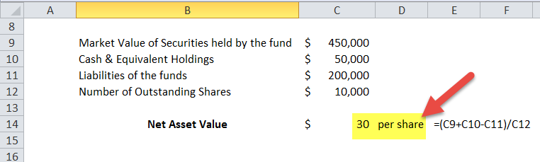

The investment landscape is continuously evolving, with technological advancements reshaping traditional approaches. Investors and traders are increasingly leveraging sophisticated tools and methods to optimize returns and manage risk. One of the significant shifts is the fusion of premium investment, net asset value (NAV) calculations, and algorithmic trading.

Premium investment refers to strategies where funds trade at a higher value than their intrinsic worth. This phenomenon is often quantified through net asset value (NAV), which serves as a benchmark for evaluating a fund's true value. NAV calculations are pivotal, enabling investors to assess whether a fund is trading at a premium or discount in relation to its assets. A deeper understanding of NAV is essential for investment decisions, as it provides insights into fund performance and management efficiency.



Algorithmic trading, on the other hand, has revolutionized how trading activities are conducted. By utilizing computer algorithms to make trading decisions, investors can efficiently capitalize on market trends and discrepancies. These algorithms are particularly advantageous in quickly responding to fluctuations in NAV and identifying lucrative arbitrage opportunities.

This article explores the intersection of these three components, offering a comprehensive understanding of how they influence investment strategies. In an era where technology plays a crucial role, understanding this synergy is vital for investors and traders aiming to navigate the modern investment landscape effectively.

## Table of Contents

## Understanding Premium to Net Asset Value (NAV)

Premium to Net Asset Value (NAV) is a concept that identifies when the market price of a fund is higher than the value of its underlying assets. To better comprehend this, it is essential to first understand how NAV is calculated. NAV is essentially the total value of a fund's assets minus its liabilities, divided by the number of outstanding shares. Mathematically, it can be expressed as:

$$
\text{NAV} = \frac{\text{Total Assets} - \text{Total Liabilities}}{\text{Number of Outstanding Shares}}
$$

Funds may trade at a premium due to several reasons. One significant [factor](/wiki/factor-investing) is market sentiment. A fund may gain investor favor due to expectations of strong future performance, leading to increased demand and higher trading prices. For instance, positive economic forecasts or desirable sectoral growth may enhance investor confidence, resulting in a premium over NAV.

Another influencing factor is the dynamics of fund management. Skilled management teams renowned for their ability to consistently generate returns above the market average can attract investors willing to pay a premium. Their decision-making process, reputation, and historical performance can all incrementally add to a fund's perceived value.

Sector-specific trends also impact the premium. Certain sectors might experience high demand due to anticipated growth, innovation, or regulatory changes. Funds heavily invested in such sectors may see their market prices rise above NAV as investors are keen on accessing these high-growth areas.

In summary, while the NAV provides a snapshot of a fund’s value at a given time based on its assets and liabilities, premiums arise from the collective sentiment and expectations of investors regarding future performance, the credibility of fund management, and prevailing sector trends. Understanding these factors is vital for investors looking to make informed decisions.

## The Role of NAV in Investment Decision-Making

Net Asset Value (NAV) is a foundational concept in investment decision-making, particularly within the context of mutual funds and exchange-traded funds (ETFs). It provides a transparent measure of a fund’s value calculated by subtracting the total liabilities of the fund from its total assets. The resulting figure is then divided by the number of shares outstanding:

$$
\text{NAV} = \frac{\text{Total Assets} - \text{Total Liabilities}}{\text{Shares Outstanding}}
$$

This metric serves a dual function in the investment ecosystem as both a performance tracker and a pricing tool.

### Performance Tracker

NAV acts as a critical performance indicator for investors, reflecting the value of each share of the fund. Through regular NAV evaluations, investors can gauge changes in the underlying asset values, thereby assessing the overall fund performance over time. Regular tracking of NAV helps investors determine whether a fund is achieving its stated objectives and how it is performing relative to its benchmarks and peers.

### Pricing Tool

For mutual funds, NAV is used as a pricing mechanism at the end of each trading day. The price at which investors buy or sell mutual fund shares is determined based on the NAV per share. This ensures that share prices accurately reflect the value of the fund’s holdings, facilitating fair and transparent transactions. This pricing method contrasts with ETFs, which can trade at prices above or below their NAV throughout the trading day.

### Fund Management Efficiency

Regular fluctuations in NAV can provide insights into the efficiency of fund management. Investors often assess the [volatility](/wiki/volatility-trading-strategies) of NAV in response to market movements, thereby evaluating the strategic decisions made by the fund managers. A stable or growing NAV over time generally indicates effective management and robust asset selection.

### Market Response

Understanding NAV fluctuations also aids investors in interpreting market responses to external conditions, such as economic changes or sector-specific events. By analyzing these fluctuations, investors can make informed predictions about potential future movements and adjust their portfolios accordingly. 

In summary, NAV is more than just a static figure; it is an essential tool for investors seeking to make informed decisions. Regular analysis of NAV data supports investors in evaluating fund performance, determining appropriate entry and [exit](/wiki/exit-strategy) points, and understanding market dynamics in relation to their investment objectives.

## Algorithmic Trading: Revolutionizing Investment Strategies

Algorithmic trading has transformed investment strategies by utilizing sophisticated algorithms to automate trading decisions based on intricate market data analysis. By processing vast amounts of information quickly, algorithmic traders can identify inefficiencies and capitalize on them, such as discrepancies in Net Asset Value (NAV). These discrepancies present [arbitrage](/wiki/arbitrage) opportunities that can be exploited to realize significant profits.

One advantage of [algorithmic trading](/wiki/algorithmic-trading) is its ability to handle the complexities involved in NAV calculations. NAV represents the total value of a fund's assets minus its liabilities, divided by the number of outstanding shares. Real-time NAV provides a crucial benchmark against which market prices are compared. When a security trades away from its NAV, it often indicates a temporary anomaly that can be leveraged for arbitrage. For example, if a mutual fund’s shares are trading at a discount relative to its NAV, an algorithm might be programmed to detect this mispricing and execute buy orders to profit from the expected correction.

Integrating NAV calculations into trading algorithms requires accurately calculating and updating NAV in real-time. Algorithms need to incorporate various factors that can influence NAV, such as [interest rate](/wiki/interest-rate-trading-strategies) changes, foreign exchange rates, and overall market sentiment. This involves applying financial models that assess both historical and real-time data to project potential movements.

Furthermore, algorithmic trading models benefit from dynamic strategies that assess the probability of NAV convergence towards the market price. Python programming can facilitate this through the use of libraries such as NumPy and Pandas for data manipulation and analysis. As an example, a basic algorithm designed to exploit NAV anomalies might look like this:

```python
import numpy as np
import pandas as pd

# Sample data for NAV and market prices
nav_data = pd.Series([100, 102, 101, 103, 104])
market_data = pd.Series([99, 101, 100, 105, 107])

# Calculate discrepancies
discrepancies = market_data - nav_data

# Detect arbitrage opportunities
threshold = 1  # threshold for executing trades
trade_signals = discrepancies.abs() > threshold

# Execute trades based on signals
def execute_trade(signal, index):
    if signal:
        print(f"Arbitrage opportunity detected at index {index}: Execute trade.")

# Analyze the data
for idx, signal in enumerate(trade_signals):
    execute_trade(signal, idx)
```

This code identifies when the price difference between market data and NAV crosses a certain threshold, triggering a trade. It is a simplified representation, and in practice, algorithms involve more complex statistical methods and risk management strategies. 

By incorporating real-time NAV calculations, algorithmic trading not only leverages market inefficiencies but also enhances decision-making precision for sophisticated investors. This integration is essential for modern strategies, helping traders execute high-frequency trades that can substantially outperform traditional methods. Thus, algorithmic trading, coupled with precise NAV analysis, empowers investors to navigate and thrive in today’s highly competitive financial markets.

## Real-Time NAV and Arbitrage Opportunities

Real-time net asset value (NAV) data plays a pivotal role in the identification and exploitation of arbitrage opportunities within financial markets. Traditionally, NAV calculations were updated at the end of each trading day. However, the advancement of technology has enabled the transition to real-time NAV updates, offering traders the ability to make more accurate and timely investment decisions.

Arbitrage opportunities arise when discrepancies exist between the market price of a fund's shares and its NAV. Such discrepancies can occur due to market inefficiencies or timing issues in NAV calculations. When a fund trades at a price lower than its NAV, it presents a potential buying opportunity; conversely, a higher market price can indicate a selling opportunity. Algorithmic traders, equipped with real-time NAV data, can swiftly act on these discrepancies, capitalizing on short-lived opportunities before the market corrects itself.

Technological advancements have significantly facilitated the process of identifying and executing profitable trades based on real-time NAV data. High-frequency trading systems and sophisticated algorithms are capable of processing large volumes of data and executing trades within milliseconds. This immediacy allows traders to respond quickly to even minimal NAV discrepancies, optimizing the potential for profit.

The use of algorithmic trading models involves the integration of NAV data into decision-making processes. A typical algorithmic trading strategy may include the following basic Python-based approach to detect arbitrage opportunities using real-time data:

```python
def detect_arbitrage(nav_real_time, market_price):
    # Calculate the discrepancy between the NAV and the market price
    discrepancy = nav_real_time - market_price

    # Define thresholds for potential arbitrage opportunities
    buy_threshold = -0.01  # Example threshold for buying
    sell_threshold = 0.01  # Example threshold for selling

    if discrepancy <= buy_threshold:
        return "Buy", discrepancy
    elif discrepancy >= sell_threshold:
        return "Sell", discrepancy
    else:
        return "Hold", discrepancy

# Example real-time data
nav_real_time = 100.05
market_price = 99.95

decision, discrepancy = detect_arbitrage(nav_real_time, market_price)
print(f"Decision: {decision}, Discrepancy: {discrepancy}")
```

In this example, the function `detect_arbitrage` evaluates the discrepancy between the real-time NAV and the market price to identify if a buying or selling opportunity exists. The thresholds for buying or selling are arbitrary and should be adjusted based on specific trading strategies and market conditions.

Moreover, the importance of technology in executing these trades cannot be overstated. Algorithmic systems must not only identify opportunities but also execute transactions across various platforms effectively. The implementation of APIs and direct market access platforms streamlines this process, reducing latency and increasing the probability of successful arbitrage.

In conclusion, the integration of real-time NAV data into trading strategies provides a decisive edge in exploiting arbitrage opportunities. As technology continues to evolve, the efficiency and precision in trade execution will enhance, thus solidifying the role of real-time NAV in modern financial markets.

## Challenges in NAV-Based Algo Trading

Accurate asset valuation and timely updates of the Net Asset Value (NAV) are critical for effective algorithmic trading strategies, yet they present complex challenges. One of the primary difficulties lies in obtaining precise valuations of assets within a fund, as asset prices can fluctuate due to a variety of factors such as market volatility, geopolitical events, and economic indicators. These fluctuations necessitate constant recalibration of the algorithms used in trading to ensure that NAV reflects true market conditions at any given time.

Frequent NAV updates are essential for responding to these changes promptly. However, achieving such regularity is hindered by the need for constant data input and processing, which involves large volumes of information across multiple asset classes and markets. This requirement demands robust data management solutions that can handle massive datasets efficiently and provide real-time insights. Advanced software infrastructure and sophisticated algorithms are needed to manage, process, and analyze this information swiftly.

Currency fluctuations add another layer of complexity to NAV calculations, particularly for global funds that deal in multiple currencies. Exchange rate variations can significantly impact the valuation of fund assets, especially in volatile foreign exchange markets. Algorithms must be capable of incorporating real-time currency data to adjust NAV estimates dynamically. This could involve sophisticated financial models that account for factors like interest rate differentials, inflation rates, and macroeconomic indicators. 

Additionally, market variations such as price swings due to unforeseen events can disrupt NAV calculations, causing a mismatch between the perceived and actual value of a fund. To overcome these challenges, algorithmic trading systems need to incorporate adaptive learning mechanisms that can adjust for sudden market shifts. Machine learning models could be employed to predict market trends and adjust trading strategies accordingly.

Solutions to these challenges involve integrating state-of-the-art technologies such as [artificial intelligence](/wiki/ai-artificial-intelligence), [machine learning](/wiki/machine-learning), and blockchain. AI and machine learning can enhance the precision of model predictions and the adaptability of trading algorithms. For instance, machine learning algorithms can analyze historical market data to forecast future NAV movements, allowing traders to react proactively.

Moreover, blockchain technology can offer enhanced transparency and security in data management, ensuring that NAV updates are both accurate and tamper-proof. The decentralized nature of blockchain ensures that all stakeholders have access to the most current data, which aids in making informed trading decisions.

In summary, while NAV-based algorithmic trading poses significant challenges in terms of data accuracy, currency fluctuation, and market variability, leveraging cutting-edge technologies provides viable solutions to enhance trading efficacy. Ensuring robust data management, utilizing adaptive algorithms, and employing advanced technologies are key to overcoming these hurdles and optimizing trading strategies.

## Conclusion

The intersection of premium investments, net asset value (NAV) calculations, and algorithmic trading reshapes the landscape of modern investment strategies. These concepts, when harmonized, provide investors with advanced tools and methodologies for optimizing their portfolios.

Understanding premium investments is essential, as they indicate the market's valuation above the inherent value, creating potential opportunities for those who can effectively analyze trend indicators and investor sentiment. NAV calculations serve as a crucial baseline for assessing a fund's valuation, offering a transparent measure to investors seeking to understand a fund's performance in relation to its trading price. This transparency aids in making informed decisions, especially in markets characterized by volatility and rapid changes in asset values.

Algorithmic trading introduces a level of sophistication by employing mathematical models and real-time data analytics to identify and act upon market inefficiencies. The combination of NAV calculations with algorithmic trading allows for a methodical approach to exploiting these inefficiencies. For instance, algorithms can be designed to continuously monitor trading prices against NAVs, identifying arbitrage opportunities that arise from discrepancies. Such strategies necessitate a robust framework for data management and algorithmic accuracy, considering the challenges of asset valuation and fluctuating market conditions.

By integrating these components, investors can enhance their decision-making processes, leveraging technologies that not only increase efficiency but also uncover opportunities previously inaccessible through traditional means. The synergy between these techniques empowers investors to respond dynamically to market shifts, thereby potentially improving investment outcomes and enabling the pursuit of diversified and resilient portfolio strategies. Overall, embracing the technological advancements in investment is imperative for those aspiring to navigate and succeed in the rapidly evolving financial markets.

## References & Further Reading

[1]: Bergstra, J., Bardenet, R., Bengio, Y., & Kégl, B. (2011). ["Algorithms for Hyper-Parameter Optimization."](https://dl.acm.org/doi/10.5555/2986459.2986743) Advances in Neural Information Processing Systems 24.

[2]: ["Advances in Financial Machine Learning"](https://www.amazon.com/Advances-Financial-Machine-Learning-Marcos/dp/1119482089) by Marcos Lopez de Prado

[3]: ["Evidence-Based Technical Analysis: Applying the Scientific Method and Statistical Inference to Trading Signals"](https://www.amazon.com/Evidence-Based-Technical-Analysis-Scientific-Statistical/dp/0470008741) by David Aronson

[4]: ["Machine Learning for Algorithmic Trading"](https://github.com/stefan-jansen/machine-learning-for-trading) by Stefan Jansen

[5]: ["Quantitative Trading: How to Build Your Own Algorithmic Trading Business"](https://www.amazon.com/Quantitative-Trading-Build-Algorithmic-Business/dp/1119800064) by Ernest P. Chan