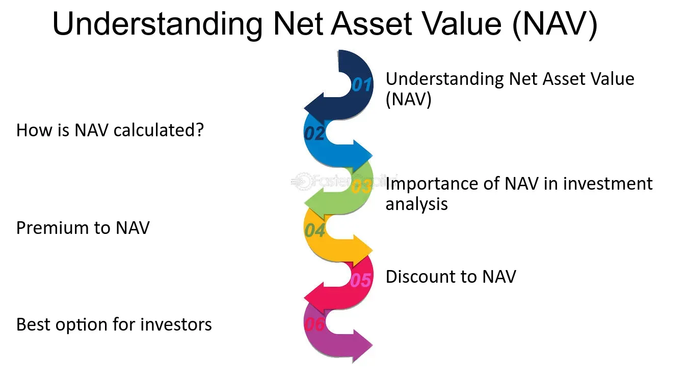

## Table of Contents

## What is Net Asset Value (NAV)?

Net Asset Value, or NAV, is a term often used in the world of investing, particularly with mutual funds and exchange-traded funds (ETFs). It represents the per-share value of a fund and is calculated by taking the total value of all the assets in the fund, subtracting any liabilities, and then dividing that number by the total number of shares outstanding. This gives investors a clear picture of what each share in the fund is worth at the end of each trading day.

NAV is important because it helps investors understand the value of their investment. For example, if you are thinking about buying shares in a mutual fund, knowing the NAV can help you decide if it's a good time to buy. It's like checking the price tag before you buy something. Also, if you already own shares in a fund, watching the NAV can help you see how your investment is doing over time. It's a useful tool for making informed decisions about buying, selling, or holding onto your investments.

## What does Premium to Net Asset Value mean?

When people talk about a "premium to Net Asset Value" (NAV), they mean that a fund or investment is trading at a price that is higher than its actual NAV. Think of it like buying a used car. If the car's book value (similar to NAV) is $10,000 but someone is selling it for $12,000, you're paying a $2,000 premium over its book value. In the world of investments, if a fund's NAV is $20 per share but it's trading at $22 per share, you're paying a $2 premium for each share.

This situation can happen for many reasons. Sometimes, investors might believe that the fund's assets are worth more than what the NAV shows, or they might think the fund's manager is really good at [picking](/wiki/asset-class-picking) investments. Other times, it could just be because a lot of people want to buy the fund, which pushes the price up. It's important for investors to understand why a fund might be trading at a premium so they can decide if it's a good investment or not.

## How is the Premium to Net Asset Value calculated?

To find out the Premium to Net Asset Value, you need to know two things: the current market price of the fund and its Net Asset Value (NAV). The premium is calculated by taking the market price and subtracting the NAV. Then, you divide that difference by the NAV and multiply by 100 to get a percentage. For example, if a fund's market price is $22 and its NAV is $20, you subtract $20 from $22 to get $2. Then, you divide $2 by $20 to get 0.1, and multiply by 100 to get a 10% premium.

Understanding why a fund trades at a premium can help you make better investment choices. Sometimes, investors might think the fund's assets are worth more than the NAV shows, or they might trust the fund manager's skills. Other times, it could be because many people want to buy the fund, which pushes the price up. Knowing the premium helps you see if you're paying more than the fund's actual value and decide if it's worth it.

## Why is it important to understand Premium to Net Asset Value for investors?

Understanding the Premium to Net Asset Value (NAV) is important for investors because it helps them see if they are paying more for a fund than what its actual assets are worth. Imagine you're buying a used car. If the car's book value is $10,000 but someone is selling it for $12,000, you're paying a $2,000 premium. In the same way, if a fund's NAV is $20 per share but it's trading at $22 per share, you're paying a $2 premium for each share. Knowing this can help you decide if the fund is a good deal or if you should look for a better price.

Also, understanding why a fund might be trading at a premium can help investors make smarter choices. Sometimes, investors might believe the fund's assets are worth more than the NAV shows, or they might trust the fund manager's skills. Other times, it could just be because a lot of people want to buy the fund, which pushes the price up. By understanding the premium, investors can figure out if they're getting a good investment or if they should wait for a better time to buy.

## Can you give an example of a stock trading at a premium to its NAV?

Imagine you are looking at a company called "Green Energy Inc." that makes solar panels. The Net Asset Value (NAV) of Green Energy Inc. is calculated by adding up the value of all its factories, equipment, and money in the bank, then subtracting any debts it owes. Let's say this comes out to $50 per share. But when you look at the stock market, you see that Green Energy Inc.'s shares are trading at $60 each. This means the stock is trading at a $10 premium over its NAV.

Why might this happen? Well, investors might think that Green Energy Inc. is going to grow a lot in the future because more people are using solar energy. They might believe that the company's factories and equipment will be worth more in the future than they are now. So, they're willing to pay $60 for a share that's only worth $50 based on today's numbers. This shows how understanding the premium to NAV can help you see if people are betting on the company's future growth.

## What factors can cause a stock to trade at a premium to its NAV?

A stock might trade at a premium to its Net Asset Value (NAV) because investors think the company will do better in the future. For example, if a company is in a growing industry like technology or renewable energy, people might believe its value will go up. They might see the company's current assets, like factories or patents, as more valuable in the future. So, they're willing to pay more for the stock now, hoping to make money later.

Another reason could be that the company has a good reputation or a strong management team. If investors trust the people running the company to make smart decisions, they might be willing to pay more for the stock. Also, if a lot of people want to buy the stock, the demand can push the price up, even if the NAV stays the same. This can happen if the company gets good news or if it's popular among investors.

## How does Premium to Net Asset Value differ between industries?

The Premium to Net Asset Value can be different for companies in different industries because each industry has its own special things that make it more or less valuable. For example, in the tech industry, a company might have a high premium because investors think its new technology or software will be worth a lot more in the future. They might see the company's patents or research as super valuable, even if the current NAV doesn't show it yet. On the other hand, in industries like manufacturing, where the value comes more from physical stuff like factories and machines, the premium might be smaller because those things are easier to value and don't change as much over time.

Another thing that can make the Premium to Net Asset Value different between industries is how much people trust the companies in that industry. For example, in the pharmaceutical industry, if a company is working on a new drug that could make a lot of money, investors might pay a big premium because they believe in the company's future success. But in industries like utilities, where companies provide services like electricity or water, the premiums might be lower because these companies are seen as more stable and less likely to grow quickly. So, understanding the industry can help you see why some stocks have bigger premiums than others.

## What are the risks associated with investing in assets trading at a high premium to NAV?

Investing in assets that are trading at a high premium to their Net Asset Value (NAV) can be risky. When you pay a lot more for a stock than its actual value, you're betting that the company will do really well in the future. If the company doesn't grow as much as people thought, the stock price could go down. This means you might lose money if you have to sell the stock for less than you paid for it. It's like buying a toy that everyone wants right now, but if the hype goes away, the toy won't be worth as much.

Another risk is that the market's feelings can change quickly. If something bad happens, like a new competitor coming in or the company not meeting its goals, the stock price can drop fast. When you're paying a high premium, there's more room for the price to fall. It's important to think about why the stock is trading at a high premium and if those reasons will still be true in the future. If you're not sure, it might be safer to wait or look for other investments that don't have such a big gap between their price and their NAV.

## How can an investor use Premium to Net Asset Value to make investment decisions?

An investor can use the Premium to Net Asset Value to make smart choices about buying or selling stocks. When a stock is trading at a high premium to its NAV, it means people are willing to pay more for it than what its actual assets are worth. This might be because they think the company will do really well in the future. But it's risky because if the company doesn't grow as much as expected, the stock price could drop, and the investor might lose money. So, an investor needs to think about why the stock has a high premium and if those reasons will still be true in the future. If the investor believes the company will keep doing well, the high premium might be worth it. But if they're not sure, it might be better to wait or look for other investments with a smaller premium.

On the other hand, if a stock is trading at a low premium or even a discount to its NAV, it might be a good time to buy. This means the stock is cheaper than its actual value, and it could be a bargain. Investors might see this as a chance to buy a stock that could go up in value if the company does well. But they also need to understand why the stock is trading at a low premium. Maybe the company is having problems, or maybe people just don't see its potential yet. By looking at the Premium to Net Asset Value, investors can get a better idea of whether a stock is a good deal or if it's too risky. This helps them make decisions that match their goals and how much risk they're willing to take.

## What historical trends can be observed in Premium to Net Asset Value across different market cycles?

When you look at how the Premium to Net Asset Value changes over time, you can see some patterns that happen during different market cycles. During bull markets, when the economy is doing well and stock prices are going up, you often see higher premiums. This is because investors are feeling good and willing to pay more for stocks because they think companies will keep growing. For example, in the late 1990s during the dot-com boom, tech stocks traded at very high premiums because everyone thought the internet would change everything. But when the bubble burst, those premiums came crashing down.

In bear markets, when the economy is struggling and stock prices are falling, premiums to NAV usually get smaller. Investors become more cautious and less willing to pay extra for stocks. They might even look for stocks trading at a discount to their NAV, hoping to buy them cheap and sell them later for a profit. During the 2008 financial crisis, many stocks traded at low premiums or discounts because people were worried about the economy. So, understanding these trends can help investors know when to buy and when to sell, depending on what the market is doing.

## How do analysts forecast future changes in Premium to Net Asset Value?

Analysts use different ways to guess how the Premium to Net Asset Value might change in the future. They look at things like the company's growth plans, how the industry is doing, and what's happening in the economy. For example, if a company says it's going to start making a new product that could make a lot of money, analysts might think the premium will go up because investors will want to buy the stock. They also look at past trends to see how premiums have changed during different times, like during a bull market when stocks are going up or a bear market when they're going down. By putting all this information together, analysts can make a guess about where the premium might go next.

Another thing analysts do is watch what other people are saying and doing. They pay attention to news about the company, what other analysts are predicting, and how investors are feeling about the stock. If a lot of people are excited about a company and think it will do well, the premium might go up. But if there's bad news or if people start to worry, the premium could go down. Analysts also use math models to help them predict changes. These models take in a lot of numbers and data to come up with a guess about the future. By using all these different ways, analysts can make the best prediction they can about how the Premium to Net Asset Value might change.

## What advanced valuation models incorporate Premium to Net Asset Value in their assessments?

Some advanced valuation models that include Premium to Net Asset Value are the Discounted Cash Flow (DCF) model and the Residual Income Model. In the DCF model, analysts look at how much money a company will make in the future and then figure out what that money is worth today. They might add a premium to the NAV if they think the company's future earnings will be higher than what the current assets show. This helps them decide if the stock is a good buy or not. The Residual Income Model is another way to value a company. It looks at the money the company makes after paying for its costs and compares it to what investors expect to earn. If the company is doing better than expected, it might have a higher premium to NAV.

Both of these models use the Premium to Net Asset Value to help investors see if a stock is priced right. If the premium is high, it means investors are betting on the company doing well in the future. But if the premium is low or the stock is trading at a discount, it might mean the stock is a good deal. By using these models, investors can get a better idea of whether the stock's price makes sense based on what the company is really worth.

## What is the Understanding of Premium to Net Asset Value (NAV)?

Premium to Net Asset Value (NAV) is a concept that identifies when the market price of a fund is higher than the value of its underlying assets. To better comprehend this, it is essential to first understand how NAV is calculated. NAV is essentially the total value of a fund's assets minus its liabilities, divided by the number of outstanding shares. Mathematically, it can be expressed as:

$$
\text{NAV} = \frac{\text{Total Assets} - \text{Total Liabilities}}{\text{Number of Outstanding Shares}}
$$

Funds may trade at a premium due to several reasons. One significant [factor](/wiki/factor-investing) is market sentiment. A fund may gain investor favor due to expectations of strong future performance, leading to increased demand and higher trading prices. For instance, positive economic forecasts or desirable sectoral growth may enhance investor confidence, resulting in a premium over NAV.

Another influencing factor is the dynamics of fund management. Skilled management teams renowned for their ability to consistently generate returns above the market average can attract investors willing to pay a premium. Their decision-making process, reputation, and historical performance can all incrementally add to a fund's perceived value.

Sector-specific trends also impact the premium. Certain sectors might experience high demand due to anticipated growth, innovation, or regulatory changes. Funds heavily invested in such sectors may see their market prices rise above NAV as investors are keen on accessing these high-growth areas.

In summary, while the NAV provides a snapshot of a fund’s value at a given time based on its assets and liabilities, premiums arise from the collective sentiment and expectations of investors regarding future performance, the credibility of fund management, and prevailing sector trends. Understanding these factors is vital for investors looking to make informed decisions.

## What is the Role of NAV in Investment Decision-Making?

Net Asset Value (NAV) is a foundational concept in investment decision-making, particularly within the context of mutual funds and exchange-traded funds (ETFs). It provides a transparent measure of a fund’s value calculated by subtracting the total liabilities of the fund from its total assets. The resulting figure is then divided by the number of shares outstanding:

$$
\text{NAV} = \frac{\text{Total Assets} - \text{Total Liabilities}}{\text{Shares Outstanding}}
$$

This metric serves a dual function in the investment ecosystem as both a performance tracker and a pricing tool.

### Performance Tracker

NAV acts as a critical performance indicator for investors, reflecting the value of each share of the fund. Through regular NAV evaluations, investors can gauge changes in the underlying asset values, thereby assessing the overall fund performance over time. Regular tracking of NAV helps investors determine whether a fund is achieving its stated objectives and how it is performing relative to its benchmarks and peers.

### Pricing Tool

For mutual funds, NAV is used as a pricing mechanism at the end of each trading day. The price at which investors buy or sell mutual fund shares is determined based on the NAV per share. This ensures that share prices accurately reflect the value of the fund’s holdings, facilitating fair and transparent transactions. This pricing method contrasts with ETFs, which can trade at prices above or below their NAV throughout the trading day.

### Fund Management Efficiency

Regular fluctuations in NAV can provide insights into the efficiency of fund management. Investors often assess the [volatility](/wiki/volatility-trading-strategies) of NAV in response to market movements, thereby evaluating the strategic decisions made by the fund managers. A stable or growing NAV over time generally indicates effective management and robust asset selection.

### Market Response

Understanding NAV fluctuations also aids investors in interpreting market responses to external conditions, such as economic changes or sector-specific events. By analyzing these fluctuations, investors can make informed predictions about potential future movements and adjust their portfolios accordingly. 

In summary, NAV is more than just a static figure; it is an essential tool for investors seeking to make informed decisions. Regular analysis of NAV data supports investors in evaluating fund performance, determining appropriate entry and [exit](/wiki/exit-strategy) points, and understanding market dynamics in relation to their investment objectives.

## References & Further Reading

[1]: Bergstra, J., Bardenet, R., Bengio, Y., & Kégl, B. (2011). ["Algorithms for Hyper-Parameter Optimization."](https://dl.acm.org/doi/10.5555/2986459.2986743) Advances in Neural Information Processing Systems 24.

[2]: ["Advances in Financial Machine Learning"](https://www.amazon.com/Advances-Financial-Machine-Learning-Marcos/dp/1119482089) by Marcos Lopez de Prado

[3]: ["Evidence-Based Technical Analysis: Applying the Scientific Method and Statistical Inference to Trading Signals"](https://www.amazon.com/Evidence-Based-Technical-Analysis-Scientific-Statistical/dp/0470008741) by David Aronson

[4]: ["Machine Learning for Algorithmic Trading"](https://github.com/stefan-jansen/machine-learning-for-trading) by Stefan Jansen

[5]: ["Quantitative Trading: How to Build Your Own Algorithmic Trading Business"](https://www.amazon.com/Quantitative-Trading-Build-Algorithmic-Business/dp/1119800064) by Ernest P. Chan