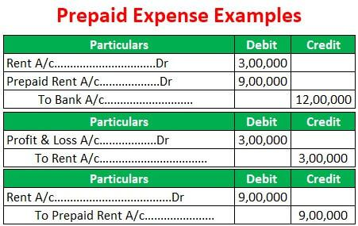

In accounting and finance, precise understanding of specific terms and concepts is essential for accurate financial reporting and effective analysis. This clarity facilitates the correct interpretation and management of financial activities, impacting the broader spectrum of business operations and decision-making. This article focuses on demystifying the concept of prepaid expenses, key accounting terms, and algorithmic trading. Prepaid expenses involve payments made for services or goods to be utilized in the future, reflecting their initial recording as assets. Correctly managing these expenses using principles like the Generally Accepted Accounting Principles (GAAP) ensures that financial statements accurately reflect a company’s financial position. Meanwhile, algorithmic trading embodies the integration of finance and technology, utilizing computer algorithms to execute trades with precision and speed, minimizing human errors. Mastery of these concepts is not only crucial for ensuring compliance but also for leveraging technology to enhance efficiency, thereby influencing strategic business decisions and maintaining competitiveness in the financial landscape.

## Table of Contents



## What is a Prepaid Expense?

A prepaid expense involves payments made in advance for goods or services that will be utilized in a future period. These expenditures, often considered current assets, are initially recorded on the balance sheet because they represent a future economic benefit to the organization. As the benefit associated with the prepaid expense is realized over time, these costs are then expensed on the income statement.

For instance, when a company pays an annual insurance premium at the beginning of the year, this upfront payment is not recorded as an immediate expense. Instead, it is logged as an asset under prepaid expenses. Each month, a portion of this prepaid amount is transferred from the asset account to the insurance expense account to accurately reflect the cost incurred during that period. This process aligns with the accrual basis of accounting, ensuring that the expenses are matched with the revenues they help generate.

Common examples of prepaid expenses include insurance premiums, where companies pay in advance for coverage over a specified term. Lease payments are another example, where rent may be paid before the corresponding month of occupancy. Similarly, subscriptions, whether for software, publications, or professional services, often require advance payments for future benefits. These transactions are all considered prepaid expenses and follow a systematic approach to ensure accuracy in financial reporting.

## Understanding Prepaid Expenses

Prepaid expenses are an integral part of accounting practices, classified under current assets due to their nature of providing future economic benefits. Their appropriate recording and amortization are crucial for adhering to Generally Accepted Accounting Principles (GAAP). GAAP mandates that prepaid expenses be recorded as assets on the balance sheet when payment is made. As the prepaid item is used or consumed, the asset is gradually expensed on the income statement, thereby aligning with the matching principle.

The matching principle is a fundamental accounting concept which ensures that expenses are recorded in the same period as the revenues they help generate. This alignment is essential for providing an accurate financial picture of a company’s performance. For instance, if a company pays a one-year insurance premium of $12,000, the initial entry would be to debit 'Prepaid Insurance' and credit 'Cash' by $12,000. As each month elapses, $1,000 would be moved from 'Prepaid Insurance' to 'Insurance Expense', thereby matching the expense with each month's revenue.

Mathematically, the monthly expense for a prepaid item can be calculated as follows:

$$
\text{Monthly Expense} = \frac{\text{Total Prepaid Expense}}{\text{Number of Beneficial Months}}
$$

In Python, an amortization schedule for a prepaid expense can be generated using a simple loop, which helps automate the matching of expenses with corresponding revenue periods:

```python
def amortize_prepaid_expense(total_amount, months):
    monthly_expense = total_amount / months
    amortization_schedule = {}
    for month in range(1, months + 1):
        amortization_schedule[f"Month {month}"] = monthly_expense
    return amortization_schedule

# Example usage
total_prepaid = 12000  # total prepaid expense
beneficial_months = 12
schedule = amortize_prepaid_expense(total_prepaid, beneficial_months)
print(schedule)
```

In the above script, the `amortize_prepaid_expense` function calculates and provides an amortization schedule, distributing the total prepaid expense evenly over the specified beneficial life span. This procedure ensures compliance with GAAP by systematically attributing the expense over its relevant periods.

Accurate classification and amortization of prepaid expenses also impact financial reporting, acting as a reliable indicator of a company’s short-term financial health and [liquidity](/wiki/liquidity-risk-premium). They assure stakeholders that the business effectively manages its upfront payments, converting them judiciously to expenses in coordination with revenue periods, thereby maintaining financial integrity and transparency.

## Accounting for Prepaid Expenses

Under the accrual accounting method, prepaid expenses reflect payments made for goods or services to be received in the future, and these payments are not immediately expensed. Instead, they are initially recorded as assets on the balance sheet and subsequently amortized over the benefit period through systematic and rational allocation.

Prepaid expenses appear as assets in the financial records, as they provide future economic benefits to the business. The journal entry for a prepaid expense initially involves debiting the prepaid expense account and crediting cash or accounts payable, reflecting that a payment has been made for future benefits. Over time, as the benefit is realized, subsequent journal entries adjust the accounts: the prepaid expense account is credited, and the expense account is debited. This gradual adjustment aligns with the matching principle, ensuring expenses are recognized in the same period as the revenues they help generate.

For instance, considering a prepaid insurance premium of $1,200 for a year, the initial entry would be:

```plaintext
Debit: Prepaid Insurance   $1,200 
Credit: Cash               $1,200 
```

As each month passes and insurance coverage is utilized, an adjusting entry at month-end would be:

```plaintext
Debit: Insurance Expense   $100  
Credit: Prepaid Insurance  $100  
```

This adjustment reflects the monthly expense recognition over a twelve-month period, adhering to GAAP standards and providing a clearer picture of financial performance.

Thorough records and meticulous documentation are essential for audit purposes. These records ensure transparency and accuracy, reflecting the financial position accurately in accordance with regulatory standards. Businesses should regularly review and adjust prepaid accounts to ensure all entries correspond appropriately to the financial periods they pertain to, thereby supporting reliable financial reporting.

## Prepaid Expenses and Financial Ratios

Prepaid expenses, categorized under current assets on the balance sheet, play a significant role in influencing a company's liquidity ratios, particularly the current ratio. By definition, the current ratio is calculated as:

$$
\text{Current Ratio} = \frac{\text{Current Assets}}{\text{Current Liabilities}}
$$

When prepaid expenses are recorded, they increase the total current assets, thereby potentially improving the current ratio. This increase suggests that the company may appear more capable of meeting its short-term obligations compared to a situation where prepaid expenses are not accounted for.

However, despite being part of current assets, prepaid expenses do not influence the quick ratio. The quick ratio is expressed as:

$$
\text{Quick Ratio} = \frac{\text{Current Assets} - \text{Inventory} - \text{Prepaid Expenses}}{\text{Current Liabilities}}
$$

This ratio excludes prepaid expenses because they cannot be easily converted into cash within a short period, thus not contributing to the company's immediate liquidity. As such, prepaid expenses' exclusion helps provide a more stringent measure of a company's ability to meet its short-term liabilities without relying on the sale of inventory or future economic benefits from prepaid expenditures.

Accurate accounting for prepaid expenses is essential for comprehensive financial ratio analysis. Over- or underestimating these figures could lead to misleading insights into a business's financial health. Hence, adherence to generally accepted accounting principles (GAAP) in recognizing and amortizing these expenses ensures that financial statements reflect a true and fair view of the company's liquidity position. This precision in financial reporting aids stakeholders in making informed decisions regarding the firm's operational effectiveness and financial stability.

## Algorithmic Trading: A Brief Overview

Algorithmic trading employs sophisticated computer algorithms to automate the execution of trades based on predefined criteria, such as timing, price, [volume](/wiki/volume-trading-strategy), and other complex mathematical models. This approach leverages computational power to conduct high-speed trading operations, enabling traders to capitalize on market opportunities with minimal delay. The main advantage of [algorithmic trading](/wiki/algorithmic-trading) is its ability to analyze vast data sets and execute orders at speeds unattainable by human traders, thus reducing latency and minimizing the impact of market fluctuations.

The two primary types of algorithmic trading are high-frequency trading ([HFT](/wiki/high-frequency-trading-strategies)) and low-frequency trading (LFT). High-frequency trading focuses on executing a large number of trades within very short time frames, often milliseconds or microseconds. This strategy seeks to profit from minute price discrepancies and rapid market movements. Conversely, low-frequency trading involves fewer trades over longer periods, utilizing algorithms to optimize trade execution by predicting broader market trends.

Algorithmic trading strategies encompass several methodologies, including market-making, trend-following, statistical [arbitrage](/wiki/arbitrage), and sentiment-based trading. Market-making strategies involve placing both buy and sell limit orders around the current market price to capture the bid-ask spread. Trend-following strategies rely on algorithms to identify and follow persistent market trends, entering trades in the direction of the trend. Statistical arbitrage exploits pricing inefficiencies between related financial instruments, utilizing statistical models to identify and capitalize on these discrepancies. Sentiment-based trading analyzes market sentiment through news, social media, and other sources to determine trading positions.

Financial professionals seeking to excel in algorithmic trading require a deep understanding of both finance and technology. Proficiency in programming languages such as Python and R is essential, as these are commonly used in developing trading algorithms. Python, with its extensive libraries like Pandas for data manipulation and analysis, and NumPy for numerical computations, is particularly popular in this field.

Consider this basic Python example of implementing a simple moving average crossover strategy:

```python
import pandas as pd

# Load historical data into a DataFrame
data = pd.read_csv('historical_data.csv')

# Calculate simple moving averages
data['SMA20'] = data['Close'].rolling(window=20).mean()
data['SMA50'] = data['Close'].rolling(window=50).mean()

# Generate buy/sell signals
data['Signal'] = 0
data.loc[data['SMA20'] > data['SMA50'], 'Signal'] = 1
data.loc[data['SMA20'] < data['SMA50'], 'Signal'] = -1

# Extract trading signals
buy_signals = data[data['Signal'] == 1]
sell_signals = data[data['Signal'] == -1]
```

In this example, the algorithm calculates the 20-day and 50-day simple moving averages of a stock's closing price. A "buy" signal is generated when the 20-day SMA crosses above the 50-day SMA, indicating an upward trend, while a "sell" signal is triggered when the 20-day SMA crosses below the 50-day SMA, suggesting a downtrend.

In summary, algorithmic trading has transformed modern financial markets by incorporating advanced technological solutions for more efficient trading processes. Mastery of both algorithmic methodologies and applicable technologies is imperative for finance professionals to navigate and leverage this evolving landscape effectively.

## Conclusion

Mastering the concepts of prepaid expenses and understanding their implications on algorithmic trading are essential components for sound financial management. Prepaid expenses, though seemingly simple, play an integral role in accurately representing a company's financial status. Proper accounting for these items ensures compliance with frameworks like the Generally Accepted Accounting Principles (GAAP), enhancing the transparency and reliability of financial statements. This, in turn, aids stakeholders in making informed decisions based on comprehensive and accurate data.

Algorithmic trading, on the other hand, showcases the intersection between financial expertise and technology. By employing algorithms, firms can execute trading strategies with increased efficiency, speed, and precision. This technological advancement not only reduces human error but also allows businesses to respond swiftly to market changes, maintaining competitiveness in dynamic trading environments.

Embracing both meticulous record-keeping of prepaid expenses and the technological advantages of algorithmic trading can offer significant benefits to businesses. These practices help in optimizing resource allocation and improving overall financial health. Moreover, staying abreast of evolving financial practices and continually updating technological skills ensures that businesses are well-positioned in an ever-changing financial landscape. Continuous learning and adaptation are imperative for businesses to maintain a robust competitive edge in the complexities of modern finance.

## References & Further Reading

[1]: ["Understanding Prepaid Expenses"](https://www.investopedia.com/terms/p/prepaidexpense.asp) on Investopedia.

[2]: ["Generally Accepted Accounting Principles (GAAP): A Guide"](https://www.forbes.com/advisor/business/generally-accepted-accounting-principles-gaap-guide/) by CFA Institute.

[3]: ["Advances in Financial Machine Learning"](https://www.amazon.com/Advances-Financial-Machine-Learning-Marcos/dp/1119482089) by Marcos Lopez de Prado.

[4]: ["Algorithmic Trading and DMA: An Introduction to Direct Access Trading Strategies"](https://www.amazon.com/Algorithmic-Trading-DMA-introduction-strategies/dp/0956399207) by Barry Johnson.

[5]: ["Machine Learning for Algorithmic Trading"](https://github.com/PacktPublishing/Machine-Learning-for-Algorithmic-Trading-Second-Edition) by Stefan Jansen.

[6]: ["Quantitative Trading: How to Build Your Own Algorithmic Trading Business"](https://www.amazon.com/Quantitative-Trading-Build-Algorithmic-Business/dp/0470284889) by Ernest P. Chan.

[7]: Hull, J. C. (2018). ["Options, Futures, and Other Derivatives."](https://www.semanticscholar.org/paper/Options%2C-Futures%2C-and-Other-Derivatives-Hull/89bdee500c8623864fc9eb7a471546aa713acc44)

[8]: Fabozzi, F. J., & Focardi, S. M. (2014). ["Quantitative Equity Investing: Techniques and Strategies."](https://www.semanticscholar.org/paper/Quantitative-Equity-Investing%3A-Techniques-and-Fabozzi-Focardi/1c49a2a53919f7e65cb96f16691b8ff726fd3cd7)

[9]: Pineda, D. & Iyer, R. (2021). ["Comprehensive Guide on Prepaid Expenses Accounting."](https://www.financestrategists.com/accounting/adjusting-entries/adjusting-entry-for-prepaid-expenses/) Workiva Blog.