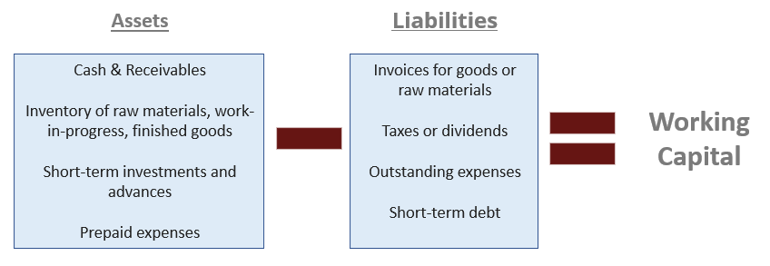

Understanding the interplay between various accounting and financial concepts is crucial for both individual and organizational financial success. This article explores critical concepts, including working capital, prepaid expenses, and algorithmic trading. By addressing their definitions, significance, and interconnections, the article aims to provide readers with insights into efficient financial management and strategic business decision-making.

Working capital is a vital indicator of a company's short-term financial health, representing the difference between current assets and current liabilities. It plays a key role in assessing operational efficiency and the ability to meet short-term obligations. Components of working capital, such as cash, accounts receivable, inventory, and short-term liabilities like debts and payables, are essential for maintaining liquidity and ensuring smooth business operations.



Prepaid expenses, classified as current assets, involve payments made for goods or services to be received in the future. These expenses influence the calculation of working capital and are significant in financial accounting. Examples include insurance premiums, rent, and subscriptions, which are recorded as assets and gradually expensed over time. Proper management and accounting of these expenses ensure accurate financial statements and adherence to accounting standards.

Algorithmic trading leverages computer programs to automate trading activities, enhancing speed and precision. Traders can execute transactions based on predefined criteria, such as price and timing, reducing human error. This method is particularly effective in high-frequency trading, where rapid execution is crucial for seizing market opportunities. Algorithmic trading illustrates the intersection of finance and technology, emphasizing the need for technical and financial expertise.

By examining these topics, readers will gain comprehensive insights into both foundational knowledge and practical applications. The content is structured to cater to various audiences interested in finance, from beginners to professionals. Mastering these concepts can significantly enhance financial efficiency, providing a solid foundation for sound strategic decisions and improved business resilience. Incorporating technology-driven solutions, such as algorithmic trading, can offer a competitive edge in the dynamic financial environment. Continuous learning and adaptation of these principles and tools are imperative for thriving in modern financial landscapes.

## Table of Contents

## A Look at Working Capital

Working capital represents the differential between a company's current assets and current liabilities. This metric serves as a fundamental indicator of an organization's short-term financial health and its ability to meet immediate obligations. Understanding working capital is crucial for assessing a company's operational efficiency. A positive working capital indicates that a company has sufficient resources to cover its short-term debts, whereas negative working capital may signal financial distress.

The calculation of working capital is straightforward:

$$
\text{Working Capital} = \text{Current Assets} - \text{Current Liabilities}
$$

### Key Components

1. **Current Assets**: These are assets that are expected to be converted into cash, sold, or consumed within a year or an operating cycle, whichever is longer. Key components include:
   - **Cash and Cash Equivalents**: Immediate money and short-term investments.
   - **Accounts Receivable**: Money owed to a company by its customers from sales made on credit.
   - **Inventory**: Raw materials, work-in-progress goods, and finished products that are ready or will be ready for sale.

2. **Current Liabilities**: These are obligations that a company is expected to settle within the same time frame as its current assets. They include:
   - **Accounts Payable**: Money a company owes to its suppliers for goods and services purchased on credit.
   - **Short-term Debts**: Loans and other forms of credit that are due for repayment within one year.

### Importance of Working Capital Management

Efficient management of working capital is vital for maintaining [liquidity](/wiki/liquidity-risk-premium) and ensuring smooth business operations. Companies need adequate working capital to finance their day-to-day activities and to seize investment opportunities without incurring unnecessary debt. Effective working capital management involves managing the time taken to convert assets into cash and balancing the timing of cash inflows and outflows to ensure that liabilities can be settled as they come due. 

Businesses often adopt various strategies to improve working capital, such as:
- **Negotiating better payment terms with suppliers to extend accounts payable without incurring late fees or interest**.
- **Incentivizing early payments from customers to reduce accounts receivable**.
- **Optimizing inventory levels to free up cash while avoiding stockouts**.

Overall, sound working capital management fosters improved financial performance and operational fluidity, facilitating a company's ability to thrive in competitive environments.

## A Closer Look at Prepaid Expenses

Prepaid expenses represent payments made for goods or services to be received in the future and are categorized as current assets on the balance sheet. These expenses are pivotal in financial accounting as they directly affect the calculation of working capital by potentially increasing the current assets portion. Prepaid expenses are initially recorded as assets because the service or product will be utilized in the future, reflecting that the benefit of the payment extends beyond the current accounting period. Common examples include insurance premiums, rent, and subscriptions. These payments are initially logged as assets and subsequently expensed as they are consumed over time, aligning the financial reporting with the period they benefit.

In accounting, the treatment of prepaid expenses involves transferring them from an asset account to an expense account over time. This aligns with the matching principle, which dictates that expenses should be recorded in the same period as the revenues they help to generate. For example, if a company pays $12,000 upfront for a one-year subscription, it would initially record it as an asset and expense $1,000 each month over the [course](/wiki/best-algorithmic-trading-courses) of the year.

Mathematically, the monthly expense recognition of prepaid expenses can be expressed as:
$$
\text{Monthly Expense} = \frac{\text{Total Prepaid Expense}}{\text{Number of Months}}
$$

Proper management of prepaid expenses involves ensuring they are accurately recorded and gradually moved into the expense section as the services or goods are delivered or utilized. This process ensures financial statements accurately reflect the company's current financial status, thus upholding valid reporting and compliance with accounting standards, such as the Generally Accepted Accounting Principles (GAAP) or International Financial Reporting Standards (IFRS). 

Automated accounting software is often used to track these transactions, ensuring that prepaid expenses are systematically amortized, thus reducing the risk of human error. Through accurate management and accounting practices, businesses can ensure their financial statements accurately portray their financial position, which is essential for stakeholders' decision-making.

## How Algorithms Are Transforming Trading

Algorithmic trading utilizes sophisticated computer algorithms to execute trade orders at speeds and frequencies that human traders cannot match. By leveraging computational power, traders can automate complex strategies based on predefined criteria such as asset price movements, timing, and [volume](/wiki/volume-trading-strategy). This automation enhances precision and reduces human error, subsequently improving the efficiency and accuracy of trading operations.

A fundamental aspect of [algorithmic trading](/wiki/algorithmic-trading) is its application within high-frequency trading ([HFT](/wiki/high-frequency-trading-strategies)). HFT strategies focus on the rapid execution of trades to capitalize on minute price discrepancies in the market. Given their reliance on speed, these strategies are particularly well-suited to algorithmic trading, which can process vast amounts of data and execute orders in fractions of a second. 

Algorithmic trading is inherently data-driven and demands both technical skills and financial expertise. Successful strategies often utilize mathematical models and statistical analysis to predict market trends and determine optimal trading opportunities. One popular technique involves the use of moving averages — commonly simple moving averages (SMA) or exponential moving averages (EMA) — to identify potential buy or sell signals. For instance, a strategy might involve buying an asset when its short-term moving average crosses above its long-term moving average and selling it when the reverse occurs.

The intersection of finance and technology is vividly illustrated in algorithmic trading, underscoring the need for algorithm development skills and a solid understanding of financial markets. For those venturing into algorithmic trading, proficiency in programming languages such as Python is advantageous. Python libraries such as NumPy and pandas are instrumental for data analysis, while libraries like PyAlgoTrade and Zipline specifically support [backtesting](/wiki/backtesting) and implementing trading strategies.

```python
import pandas as pd
import numpy as np

# Example of calculating a simple moving average (SMA)
def simple_moving_average(data, window_size):
    return data.rolling(window=window_size).mean()

# Sample price data
price_data = pd.Series([100, 102, 101, 105, 110, 108, 107, 111, 113, 115])

# Calculate a 3-period SMA
sma_3 = simple_moving_average(price_data, 3)
print(sma_3)
```

As financial markets grow increasingly complex, the dynamic between traditional financial analysis and cutting-edge technology continues to evolve, with algorithmic trading at the forefront of this transition. By combining data science methodologies with robust trading knowledge, traders and financial institutions can gain a competitive edge in today's fast-paced market environment.

## Integrating Working Capital Management with Algo Trading

Efficient management of working capital is a cornerstone for the effective implementation of algorithmic trading strategies. Working capital, defined as the difference between current assets and current liabilities, provides a snapshot of a company's short-term financial health and its ability to cover immediate obligations. By maintaining optimal liquidity and operational flexibility, organizations can leverage algorithmic trading to maximize their financial strategies.

The integration of financial data related to working capital components, such as cash, accounts receivable, and inventory, into algorithmic trading models can significantly enhance decision-making processes. These models utilize algorithms to analyze vast amounts of financial data rapidly, identifying patterns and executing trades based on predefined criteria. The availability of accurate, real-time financial data on working capital can thus optimize trading models, allowing for more informed and strategic decisions.

Algorithmic trading strategies can be particularly beneficial for improving cash flow and resource allocation. For example, companies can develop algorithms that trigger sales of excess inventory or adjust receivable collection strategies based on market conditions and liquidity requirements. By using algorithms to automate these processes, firms can increase operational efficiency and focus on strategic growth initiatives rather than day-to-day cash management.

Moreover, the synergy between sound working capital management and algorithmic trading technologies has the potential to significantly enhance financial performance. Companies adopting both practices can achieve better resource allocation, reduce costs associated with human errors, and capitalize on timely market opportunities. The technological sophistication of algorithmic trading, when paired with a robust understanding of working capital management, equips organizations to not only survive but thrive in the fast-paced financial markets.

In conclusion, integrating working capital management with algorithmic trading offers considerable benefits. It allows for the proactive management of liquidity, improved cash flow, and more strategic use of resources. As financial markets become increasingly complex and competitive, the alignment of these two fields is not merely advantageous but essential for sustaining and improving business performance.

## Conclusion

Mastering the dynamics of working capital, prepaid expenses, and algorithmic trading can significantly enhance financial efficiency. Working capital management involves optimizing the difference between current assets and current liabilities, a crucial [factor](/wiki/factor-investing) for ensuring liquidity and operational success. By effectively managing working capital, businesses can improve cash flow and meet short-term obligations with ease.

Prepaid expenses, being payments made in advance for goods or services to be received, play a vital role in accurate financial reporting. Proper management ensures that financial statements accurately reflect a company's financial position, aiding in strategic decision-making. Accurate accounting of these expenses not only aligns with standard practices but also enhances clarity and business resilience.

Algorithmic trading, by automating trading activities through computer programs, brings speed and precision to financial markets. Leveraging technology enables traders to execute transactions based on predefined criteria, minimizing human error and making high-frequency trading more effective. This technological integration provides a competitive edge in the fast-paced financial environment by optimizing decision-making processes and increasing operational flexibility.

Incorporating technology-driven solutions, such as algorithmic trading, complements robust financial management practices. This synergy allows businesses to optimize their financial strategies and enhances resource allocation. To thrive in modern financial landscapes, continuous learning and adaptation of these principles and tools are essential.

In conclusion, accurate financial management practices lead to better strategic decisions and enhance business resilience. The integration of technology, alongside sound financial principles, equips organizations to navigate and excel in today's rapidly evolving financial world.

## References & Further Reading

[1]: ["Financial Intelligence: A Manager's Guide to Knowing What the Numbers Really Mean"](https://www.amazon.com/Financial-Intelligence-Revised-Managers-Knowing/dp/1422144119) by Karen Berman and Joe Knight

[2]: Brigham, E. F., & Houston, J. F. (2013). ["Fundamentals of Financial Management."](https://books.google.com/books/about/Fundamentals_of_Financial_Management.html?id=9uUXEAAAQBAJ) Cengage Learning.

[3]: ["Trading and Exchanges: Market Microstructure for Practitioners"](https://www.amazon.com/Trading-Exchanges-Market-Microstructure-Practitioners/dp/0195144708) by Larry Harris

[4]: Lo, A. W., & MacKinlay, A. C. (1990). ["Data-Snooping Biases in Tests of Financial Asset Pricing Models."](https://www.nber.org/papers/w3001) The Review of Financial Studies, 3(3), 431-467.

[5]: ["Technical Analysis of the Financial Markets: A Comprehensive Guide to Trading Methods and Applications"](https://www.amazon.com/Technical-Analysis-Financial-Markets-Comprehensive/dp/0735200661) by John J. Murphy