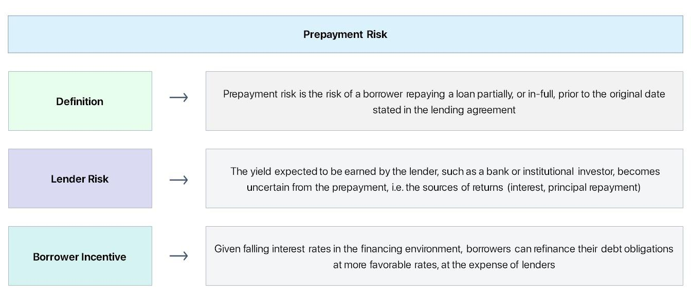

## Table of Contents

## What is prepayment risk?

Prepayment risk is the chance that someone will pay off a loan earlier than expected. This often happens with mortgages, where homeowners might refinance or sell their home and pay off the loan early. When loans are paid off early, it can affect investors who were counting on a steady stream of payments over time. For example, if you invest in a mortgage-backed security, you might expect to receive regular interest payments, but if homeowners pay off their mortgages early, you might get your money back sooner than planned, which can be a problem if you were relying on that income.

This risk is particularly important for investors in mortgage-backed securities because these investments are based on pools of home loans. If interest rates drop, more homeowners might refinance their mortgages at the lower rate, leading to more prepayments. This means investors might have to reinvest their money at these lower rates, which could reduce their overall returns. On the other hand, if interest rates rise, fewer people might refinance, and the expected prepayments might not happen, leaving investors with less money than they anticipated. Managing prepayment risk is crucial for maintaining a stable investment strategy.

## How does prepayment risk affect investors?

Prepayment risk can really shake things up for investors. Imagine you've put your money into a bunch of home loans, expecting to get a steady flow of interest payments over time. If homeowners decide to pay off their loans early, maybe because they refinanced at a lower rate or sold their house, you get your money back sooner than you planned. This can be a problem because you were counting on that regular income, and now you have to find somewhere else to put your money, which might not give you as good a return.

This risk is a big deal, especially when interest rates change. If rates go down, more people might refinance their homes, leading to a lot of prepayments. You end up with a pile of cash that you need to reinvest, but now you're stuck with lower interest rates, which means less money for you in the long run. On the flip side, if rates go up, fewer people might refinance, and you might not get the prepayments you were expecting, leaving you short on cash. It's a tricky balance, and investors need to keep an eye on prepayment risk to make sure their investment plans stay on track.

## What are common causes of prepayment?

One common cause of prepayment is when interest rates drop. When this happens, homeowners can refinance their mortgages at a lower rate, which means they can save money on their monthly payments. If they do this, they might pay off their old mortgage early, which is a prepayment. Another reason is when people sell their homes. If someone sells their house, they usually have to pay off their mortgage, which means the loan gets paid back sooner than expected.

Another cause of prepayment can be when homeowners come into extra money. This could be from an inheritance, a bonus at work, or winning the lottery. If they use this extra money to pay down their mortgage, that's also a prepayment. Sometimes, people just want to get rid of their debt faster, so they make extra payments on their loan, leading to prepayment.

## Can you explain the difference between prepayment risk and default risk?

Prepayment risk and default risk are two different worries that people who invest in loans, like mortgages, have to think about. Prepayment risk is when someone pays off their loan earlier than expected. This can happen if they refinance their home at a lower [interest rate](/wiki/interest-rate-trading-strategies) or if they sell their house. When loans get paid off early, investors who were expecting to get regular payments might suddenly get their money back and have to find a new place to invest it, which might not be as good.

Default risk, on the other hand, is when someone can't pay back their loan at all. This happens if a homeowner loses their job or faces other money problems and can't make their mortgage payments. When someone defaults, it's bad for investors because they might not get all their money back. So, while prepayment risk is about getting your money back too soon, default risk is about not getting your money back at all. Both risks can mess up an investor's plans, but they do it in different ways.

## How is prepayment risk measured in financial markets?

Prepayment risk is measured in financial markets using something called the prepayment speed. This is a way to guess how fast people might pay off their loans early. One common way to measure this is by using the Public Securities Association (PSA) model. The PSA model uses a standard called the "PSA benchmark" to predict how many loans will be paid off early each month. If the prepayment speed is higher than expected, it means more people are paying off their loans early, which can be a problem for investors.

Another way to measure prepayment risk is by looking at the Constant Prepayment Rate (CPR). The CPR is a percentage that shows how much of the loan balance is expected to be paid off early each year. If the CPR goes up, it means more prepayments are happening, and investors need to be ready for their money to come back sooner than planned. Both the PSA model and the CPR help investors understand and manage the risks that come with early loan payoffs.

## What are some strategies to mitigate prepayment risk?

One way to lower prepayment risk is by choosing loans that are less likely to be paid off early. For example, investors might pick loans with prepayment penalties, which make it more expensive for people to pay off their loans early. Another strategy is to invest in loans that have a longer time before they can be refinanced. This gives the investor a better chance of getting the regular payments they expect.

Another approach is to spread out investments across many different loans. This is called diversification. If some loans get paid off early, it won't hurt the investor as much because they have other loans that are still paying on time. Also, investors can use financial tools like interest rate swaps or options to protect themselves. These tools can help make up for the money they might lose if loans are paid off earlier than planned.

## How does prepayment risk impact mortgage-backed securities?

Prepayment risk can really mess things up for people who invest in mortgage-backed securities (MBS). These securities are made up of a bunch of home loans put together, and investors buy them to get a steady stream of payments. But if homeowners start paying off their loans early, maybe because they refinanced at a lower interest rate or sold their homes, it means the investors get their money back sooner than they expected. This can be a problem because they were counting on those regular payments to keep their investment plan on track.

To deal with this, investors have to find new places to put their money, but if interest rates have gone down, they might not be able to get as good a return on their new investments. It's like planning a long trip and then having to change your plans halfway through because you got to your destination too early. Managing prepayment risk is really important for people investing in MBS to make sure their financial plans stay stable and they don't lose out on the money they were expecting.

## Can you provide examples of prepayment risk in real estate?

Imagine you own a bunch of home loans, and you expect to get regular payments from the homeowners. But then, interest rates drop, and a lot of homeowners decide to refinance their homes at the new, lower rate. When they do this, they pay off their old loans early, which means you get your money back sooner than you planned. Now, you have to find somewhere else to put your money, but the new interest rates are lower, so you might not make as much money as you hoped.

Another example is when people sell their homes. If a homeowner sells their house, they usually have to pay off their mortgage right away. This means you, as an investor, get your money back before you expected it. If you were counting on those regular payments to keep your investment plan going smoothly, this can throw a wrench in things. You need to find a new place for your money, and if the market has changed, it might not be as good a deal as before.

## What role does interest rate environment play in prepayment risk?

The interest rate environment is really important when it comes to prepayment risk. When interest rates go down, it becomes cheaper for people to borrow money. Homeowners might decide to refinance their mortgages at these lower rates to save money on their monthly payments. If they do this, they pay off their old loans early, which means investors get their money back sooner than they planned. This can be a problem because the investors were counting on getting regular payments over time, and now they have to find a new place to put their money, which might not give them as good a return.

On the other hand, when interest rates go up, it becomes more expensive to borrow money. Fewer homeowners will want to refinance their mortgages because it won't save them money. This means there will be fewer prepayments, and investors might not get their money back as soon as they expected. This can also be a problem because investors might have been planning on using that money for something else. So, the interest rate environment can really mess with prepayment risk, making it hard for investors to keep their plans on track.

## How do prepayment models work and what are their limitations?

Prepayment models are tools that help investors guess how fast people might pay off their loans early. These models look at things like past data, current interest rates, and how the economy is doing to make their guesses. One common model is the Public Securities Association (PSA) model, which uses a standard called the "PSA benchmark" to predict how many loans will be paid off early each month. Another model is the Constant Prepayment Rate (CPR), which gives a yearly percentage of how much of the loan balance might be paid off early. By using these models, investors can try to plan better for when they might get their money back and adjust their investment strategies.

But, prepayment models have some problems. They are based on guesses and past data, so they can't predict the future perfectly. If something unexpected happens, like a big change in interest rates or a new housing policy, the models might not work well. Also, these models often assume that everyone behaves the same way, but in real life, people make different choices based on their own situations. So, while prepayment models can be helpful, investors need to remember that they are just tools and not perfect predictions. They should use them along with other information to make the best decisions they can.

## What are the historical trends of prepayment risk and how have they evolved?

Historically, prepayment risk has been closely tied to changes in interest rates and the overall economy. In the 1980s and 1990s, when interest rates were high, prepayment risk was lower because fewer people wanted to refinance their loans. But when interest rates started to drop in the late 1990s and early 2000s, prepayment risk went up a lot. More homeowners refinanced their mortgages to take advantage of the lower rates, which meant investors got their money back sooner than they expected. This was a big deal for people investing in mortgage-backed securities, as they had to find new places to put their money at these lower rates.

Over time, the way people think about and manage prepayment risk has changed. In the 2000s, the housing market saw a boom, and with it, a lot of prepayments happened as people bought and sold homes more often. The 2008 financial crisis changed things again, as fewer people could afford to refinance or sell their homes, which lowered prepayment risk for a while. In recent years, with interest rates staying low for a long time, prepayment risk has been a constant worry for investors. They've had to come up with new ways to deal with it, like using more complex financial tools and spreading their investments across different types of loans to lessen the impact of early loan payoffs.

## How can advanced financial instruments like derivatives be used to hedge against prepayment risk?

Advanced financial instruments like derivatives can be used to hedge against prepayment risk by helping investors manage the uncertainty of getting their money back early. One common type of derivative used for this is an interest rate swap. With an interest rate swap, investors can exchange their variable interest payments for fixed ones. This means if loans get paid off early and they have to reinvest at lower rates, the swap can help make up for the money they might lose. It's like having a backup plan to keep their income steady even when things change.

Another way to use derivatives is with options, like interest rate caps or floors. An interest rate cap can protect investors from rates going too high, while a floor can protect them if rates drop too low. By buying these options, investors can set a limit on how much their returns can change because of prepayments. It's like putting a safety net under their investments, so they don't fall too far if homeowners pay off their loans earlier than expected. Using these tools can help investors feel more secure and better manage the ups and downs of prepayment risk.

## What are the implications of prepayment risk in mortgages?

Prepayment risk is a significant concern in the mortgage sector, primarily due to the opportunity for borrowers to refinance their loans. This risk becomes more pronounced when there is a decline in interest rates, as homeowners are incentivized to refinance existing mortgages at these lower rates. Consequently, this leads to the early repayment of mortgage-backed securities (MBS), which are bundles of home loans packaged and sold to investors.

When prepayment occurs, it disrupts the anticipated cash flow for investors. Mortgage-backed securities are structured with the expectation that payments will be made over a specified term. Early repayment means investors receive their principal back sooner than planned. This early return of capital compels investors to reinvest in the prevailing market conditions, which typically feature lower yields than those present at the time of the initial investment. As a result, the effective yield on these securities is reduced.

Moreover, the unexpected change in cash flow affects the price and stability of mortgage-backed securities. Increased unpredictability in cash flows due to refinancing leads to heightened price [volatility](/wiki/volatility-trading-strategies). Investors seeking stable and predictable returns may find MBS less attractive during periods of fluctuating interest rates. This phenomenon can discourage investment in these securities, impacting not only individual investors but also the broader financial market that relies on these instruments for [liquidity](/wiki/liquidity-risk-premium) and stability.

To quantify the impact of prepayment on MBS cash flows, consider the expected cash flow model. If $C_0$ is the original expected cash flow without prepayment, and $\Delta C$ represents the change due to prepayment, the actual cash flow received becomes $C_0 - \Delta C$. The variability of $\Delta C$ introduces uncertainty:

$$
\text{New Cash Flow} = C_0 - \Delta C
$$

In Python, analyzing such cash flow changes could be modeled with simulation techniques to forecast different prepayment scenarios:

```python
import numpy as np

def simulate_prepayment_risk(initial_cash_flow, prepayment_prob, iterations=10000):
    np.random.seed(0)
    changes = np.random.choice([0, 1], size=iterations, p=[1-prepayment_prob, prepayment_prob])
    cash_flows = initial_cash_flow - initial_cash_flow * changes
    return np.mean(cash_flows), np.std(cash_flows)

expected_cash_flow, cash_flow_variability = simulate_prepayment_risk(100000, prepayment_prob=0.1)
```

This script simulates the effect of prepayment on expected cash flow, providing insight into how early repayments might alter an investor's return profile. Understanding these dynamics helps investors manage their portfolios more effectively, mitigating prepayment risk's impact on their financial outcomes.

## References & Further Reading

[1]: Fabozzi, F. J. (Ed.). (2001). ["The Handbook of Mortgage-Backed Securities"](https://academic.oup.com/book/7943) (6th ed.). McGraw-Hill.

[2]: Gabaix, X., Krishnamurthy, A., & Vigneron, O. (2007). ["Limits of Arbitrage: Theory and Evidence from the Mortgage-Backed Securities Market."](https://pages.stern.nyu.edu/~xgabaix/papers/limitsOfArb.pdf) The Review of Financial Studies, 20(3), 1063-1098.

[3]: Brealey, R. A., Myers, S. C., & Allen, F. (2019). ["Principles of Corporate Finance"](https://www.mheducation.com/highered/product/Principles-of-Corporate-Finance-Brealey.html) (13th ed.). McGraw-Hill Education.

[4]: Sutton, J., & Breheny, P. (2017). ["Algorithmic Trading and the Use of Machine Learning & Bayesian Networks."](https://github.com/stefan-jansen/machine-learning-for-trading) Computational Management Science, 14(3), 233-263.

[5]: ["Fixed Income Securities: Tools for Today's Markets"](https://www.amazon.com/Fixed-Income-Securities-Markets-Finance/dp/1119835550) by Bruce Tuckman and Angel Serrat

[6]: ["Quantitative Credit Portfolio Management: Practical Innovations for Measuring and Controlling Liquidity, Spread, and Issuer Concentration Risk"](https://www.wiley.com/en-us/Quantitative+Credit+Portfolio+Management%3A+Practical+Innovations+for+Measuring+and+Controlling+Liquidity%2C+Spread%2C+and+Issuer+Concentration+Risk-p-9781118117699) by Arik Ben Dor, Lev Dynkin, and Jay Hyman

[7]: Vandell, K. D. (1995). ["How Ruthless is Mortgage Default? A Review and Synthesis of the Evidence."](https://www.jstor.org/stable/24832828) Journal of Housing Research, 6, 245-264.