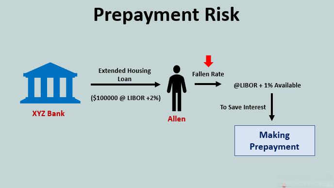

Prepayment risk is a critical concept within the financial sector that affects various investment instruments, notably mortgage-backed securities (MBS), bonds, and aspects of algorithmic trading. It represents the risk associated with the early repayment of the principal amount on fixed-income securities. This early repayment disrupts the expected cash flows and diminishes potential investment returns for stakeholders. As interest rates decline, the likelihood of prepayment increases, posing a significant consideration for investors holding these securities.

Investors must understand prepayment risk, as it affects their strategies and expected returns. In an environment where interest rates are falling, borrowers are more inclined to refinance their loans to benefit from lower rates. This refinancing results in the early return of principal, thereby forcing investors to reinvest in the current market at lower yields. Such predictability of cash flows can be crucial for effective portfolio management.



Throughout this article, prepayment risk will be thoroughly examined, assessing its significance and implications in the financial markets, particularly concerning its interplay with algorithmic trading practices. The article aims to provide a comprehensive understanding of how algorithmic models and strategies can be utilized to predict and manage this risk effectively. Furthermore, the discussion will address various strategies to mitigate prepayment risk, thereby optimizing investment outcomes in the face of market fluctuations and borrower behaviors.

## Table of Contents

## Understanding Prepayment Risk

Prepayment risk refers to the risk that a borrower may repay the principal of a loan ahead of schedule, affecting the anticipated returns for investors. This risk predominantly impacts fixed-income securities, including mortgage-backed securities (MBS) and callable bonds. These securities are designed to provide investors with a predictable stream of interest payments over time. However, when borrowers opt to repay their loans early, the expected cash flows are disrupted.

In a falling interest rate environment, borrowers are incentivized to refinance their existing debt at lower interest rates. This is due to the economic advantage of reducing their interest expenses. As a result, the frequency of prepayments increases, leading to potential challenges for investors. When the principal is returned earlier than planned, investors are often compelled to reinvest the returned principal at the current market interest rates, which are typically lower. This reinvestment at reduced rates can diminish the overall yield of the investment, a phenomenon known as reinvestment risk.

For example, let $YTM$ represent the yield to maturity of a bond. If an investor initially purchases a bond at a YTM of 5%, and then the bond is prepaid when the prevailing market YTM is 3%, the investor faces a reduction in expected returns. The investor is forced to invest the returned principal at the lower rate of 3%, thereby impacting the total investment yield.

Overall, understanding prepayment risk is crucial for investors seeking to optimize their investment strategies in fixed-income securities. It requires a thorough analysis of [interest rate](/wiki/interest-rate-trading-strategies) trends and borrower behavior, as these factors significantly influence the likelihood and impact of prepayments.

## Implications of Prepayment Risk in Mortgages

Prepayment risk is a significant concern in the mortgage sector, primarily due to the opportunity for borrowers to refinance their loans. This risk becomes more pronounced when there is a decline in interest rates, as homeowners are incentivized to refinance existing mortgages at these lower rates. Consequently, this leads to the early repayment of mortgage-backed securities (MBS), which are bundles of home loans packaged and sold to investors.

When prepayment occurs, it disrupts the anticipated cash flow for investors. Mortgage-backed securities are structured with the expectation that payments will be made over a specified term. Early repayment means investors receive their principal back sooner than planned. This early return of capital compels investors to reinvest in the prevailing market conditions, which typically feature lower yields than those present at the time of the initial investment. As a result, the effective yield on these securities is reduced.

Moreover, the unexpected change in cash flow affects the price and stability of mortgage-backed securities. Increased unpredictability in cash flows due to refinancing leads to heightened price [volatility](/wiki/volatility-trading-strategies). Investors seeking stable and predictable returns may find MBS less attractive during periods of fluctuating interest rates. This phenomenon can discourage investment in these securities, impacting not only individual investors but also the broader financial market that relies on these instruments for [liquidity](/wiki/liquidity-risk-premium) and stability.

To quantify the impact of prepayment on MBS cash flows, consider the expected cash flow model. If $C_0$ is the original expected cash flow without prepayment, and $\Delta C$ represents the change due to prepayment, the actual cash flow received becomes $C_0 - \Delta C$. The variability of $\Delta C$ introduces uncertainty:

$$
\text{New Cash Flow} = C_0 - \Delta C
$$

In Python, analyzing such cash flow changes could be modeled with simulation techniques to forecast different prepayment scenarios:

```python
import numpy as np

def simulate_prepayment_risk(initial_cash_flow, prepayment_prob, iterations=10000):
    np.random.seed(0)
    changes = np.random.choice([0, 1], size=iterations, p=[1-prepayment_prob, prepayment_prob])
    cash_flows = initial_cash_flow - initial_cash_flow * changes
    return np.mean(cash_flows), np.std(cash_flows)

expected_cash_flow, cash_flow_variability = simulate_prepayment_risk(100000, prepayment_prob=0.1)
```

This script simulates the effect of prepayment on expected cash flow, providing insight into how early repayments might alter an investor's return profile. Understanding these dynamics helps investors manage their portfolios more effectively, mitigating prepayment risk's impact on their financial outcomes.

## Prepayment Risk in Algorithmic Trading

Algorithmic trading platforms utilize sophisticated data analytics and [machine learning](/wiki/machine-learning) techniques to predict prepayment behaviors more accurately. This predictive capability enables traders to take strategic positions in securities that may be affected by potential prepayment events, thereby optimizing trading strategies and improving returns on investment.

By incorporating a range of market indicators, algorithmic models assess interest rate trends, borrower profiles, and other relevant factors to predict prepayment risk. For example, machine learning models can be trained using historical data to identify patterns and correlations that influence borrower behavior. These models often include features such as loan duration, interest rate shifts, and economic conditions to create robust, predictive analytics that forecast prepayment activities.

To illustrate, here is a hypothetical Python code snippet leveraging a simple machine learning model for prepayment prediction:

```python
import pandas as pd
from sklearn.model_selection import train_test_split
from sklearn.ensemble import RandomForestClassifier
from sklearn.metrics import accuracy_score

# Load prepayment data
data = pd.read_csv('prepayment_data.csv')

# Preprocessing: Select features and target
features = data[['interest_rate', 'loan_duration', 'credit_score', 'economic_indicator']]
target = data['prepaid']

# Split the data
X_train, X_test, y_train, y_test = train_test_split(features, target, test_size=0.2, random_state=42)

# Initialize Random Forest model
model = RandomForestClassifier(n_estimators=100, random_state=42)

# Train the model
model.fit(X_train, y_train)

# Predict and evaluate
predictions = model.predict(X_test)
accuracy = accuracy_score(y_test, predictions)
print(f'Prediction Accuracy: {accuracy * 100:.2f}%')
```

This script represents a fundamental approach to developing a prepayment prediction model. It demonstrates the process of building a Random Forest classifier that considers variables such as interest rates and credit scores, which are crucial for understanding prepayment tendencies.

Moreover, [algorithmic trading](/wiki/algorithmic-trading) systems can continuously update and refine these predictive models as new data becomes available. This adaptability allows platforms to anticipate prepayment events with increasing accuracy over time. By effectively predicting these events, traders can optimize portfolio management, align with market dynamics, and potentially achieve higher returns.

Overall, the intersection of algorithmic trading and prepayment risk management represents a significant advancement in investment strategies, providing professionals with the tools necessary to respond promptly and strategically to changing financial landscapes.

## Strategies for Managing Prepayment Risk

Investors can employ several effective strategies to manage prepayment risk, thereby optimizing their investment outcomes in fixed-income securities.

### Interest Rate Swaps

Interest rate swaps are instrumental in hedging against interest rate fluctuations associated with prepayment risk. By engaging in an interest rate swap, an investor can exchange a fixed interest rate for a floating rate, or vice versa, depending on the anticipated movement of market rates. This exchange can stabilize cash flows and mitigate the impact of unexpected prepayments that occur when interest rates decline. For example, in a scenario where market interest rates are expected to fall, an investor holding fixed-income securities might enter a swap to pay a fixed rate and receive a floating rate. This swap offsets potential losses caused by the early repayment of the principal.

### Portfolio Diversification

Diversification is another crucial strategy in managing prepayment risk. By holding a varied portfolio with assets that have different exposure to prepayment risk, investors can cushion the overall portfolio against the adverse effects of early principal returns. Diversification reduces idiosyncratic risk — the risk specific to a particular asset — and ensures that the impact of prepayment in one asset class does not disproportionately affect the entire portfolio. As different securities react differently to changes in interest rates and prepayment behaviors, a well-diversified portfolio balances the risk across multiple channels, thus stabilizing returns.

### Adjustable-Rate Mortgages (ARMs)

Adjustable-rate mortgages (ARMs) present an adaptive strategy to manage rapid refinancing risks associated with prepayment. ARMs offer interest rates that adjust periodically based on market conditions, contrasting with fixed-rate mortgages that remain constant over the loan term. This adjustment mechanism can decrease the incentive for borrowers to refinance when rates decline, as their mortgage rates would naturally adjust downward. Consequently, ARMs can serve as a natural hedge against prepayment risk by aligning mortgage rates more closely with prevailing market conditions.

In summary, through the strategic use of interest rate swaps, diversification of portfolios, and the inclusion of adjustable-rate mortgages, investors can effectively manage and mitigate prepayment risk. These strategies not only enhance the resilience of investment portfolios but also contribute to more predictable and stable financial outcomes.

## Case Studies and Real-World Applications

Mortgage-backed securities (MBS), particularly those issued by entities like Freddie Mac and Fannie Mae, offer valuable insights into managing prepayment risk. These government-sponsored enterprises (GSEs) issue securities backed by pools of residential mortgages, which are susceptible to prepayment due to fluctuating interest rates. When interest rates decrease, homeowners are incentivized to refinance their mortgages at lower rates, leading to a high incidence of prepayments. This can significantly affect the cash flow structure of MBS, compelling investors to receive their principal sooner than expected and reinvesting at contemporary, often lower, yields. Implementing strategies to anticipate and manage this risk has become crucial for investors.

One effective tool for managing prepayment risk in MBS is predictive analytics. By utilizing historical data, predictive models can be developed to forecast prepayment trends. These models consider variables such as interest rate changes, borrower credit characteristics, and historical prepayment rates to estimate future behaviors. Python programming is extensively used in developing such models, leveraging libraries like scikit-learn for machine learning tasks. The code snippet below illustrates a basic setup for a linear regression model that could be part of a broader predictive system for prepayments:

```python
from sklearn.linear_model import LinearRegression
import numpy as np

# Sample data: features might include historical interest rates, borrower characteristics, etc.
X = np.array([[3.5, 750], [2.9, 720], [4.0, 680], [3.0, 740]])  # Sample features
y = np.array([0.2, 0.25, 0.18, 0.22])  # Corresponding prepayment rates

# Instantiate and fit the model
model = LinearRegression()
model.fit(X, y)

# Predict prepayment rates for new data
new_data = np.array([[3.1, 730]])
predicted_prepayment = model.predict(new_data)
print(f"Predicted Prepayment Rate: {predicted_prepayment[0]:.4f}")
```

Callable bonds represent another instance wherein prepayment risk substantially influences investment decisions. These bonds include provisions allowing issuers to repay them before maturity, typically in environments where interest rates fall. This enables issuers to refinance debt at reduced costs, comparable to mortgage refinancing. Prepayment in callable bonds can detrimentally affect investors who are faced with the challenge of reinvesting in lower interest rate scenarios.

For investors connected with callable bonds, the utilization of option-adjusted spread (OAS) analysis can be beneficial. OAS quantifies the yield compensation for option-like qualities of callable bonds, adjusting for predicted prepayment risk and changing interest rates. Understanding these computations aids in determining the true return of callable bonds, underpinning informed decision-making.

Both mortgage-backed securities and callable bonds illustrate the critical importance of recognizing prepayment mechanisms and leveraging predictive analytics. Executing informed investment strategies, with an eye on historical prepayment trends and current economic signals, allows for the intelligent navigation of prepayment-associated challenges, optimizing portfolio performance.

## Conclusion

Prepayment risk is an inherent element of fixed-income investing, necessitating diligent analysis and strategic oversight. The premature return of principal, which typifies this risk, can significantly alter anticipated cash flow patterns for investors. However, employing advanced technologies, such as algorithmic trading and predictive analytics, can diminish the negative impact of prepayment risk. These tools analyze extensive datasets, enabling more accurate forecasts of market movements and borrower behaviors that influence prepayment. 

Moreover, adopting diversified investment strategies is essential. Diversification across different asset classes and within fixed-income securities themselves can help cushion the blow of prepayments. Investors are encouraged to keep abreast of shifts in interest rates and market dynamics, allowing for timely adjustments to their portfolios. This proactive approach can bolster financial outcomes by negating potential losses and capitalizing on market opportunities as they arise.

A thorough comprehension and management of prepayment risk are instrumental in safeguarding investment portfolios. Such vigilance ensures that investors can harness more stable and predictable returns, ultimately leading to more consistent financial growth.

## References & Further Reading

[1]: Fabozzi, F. J. (Ed.). (2001). ["The Handbook of Mortgage-Backed Securities"](https://academic.oup.com/book/7943) (6th ed.). McGraw-Hill.

[2]: Gabaix, X., Krishnamurthy, A., & Vigneron, O. (2007). ["Limits of Arbitrage: Theory and Evidence from the Mortgage-Backed Securities Market."](https://pages.stern.nyu.edu/~xgabaix/papers/limitsOfArb.pdf) The Review of Financial Studies, 20(3), 1063-1098.

[3]: Brealey, R. A., Myers, S. C., & Allen, F. (2019). ["Principles of Corporate Finance"](https://www.mheducation.com/highered/product/Principles-of-Corporate-Finance-Brealey.html) (13th ed.). McGraw-Hill Education.

[4]: Sutton, J., & Breheny, P. (2017). ["Algorithmic Trading and the Use of Machine Learning & Bayesian Networks."](https://github.com/stefan-jansen/machine-learning-for-trading) Computational Management Science, 14(3), 233-263.

[5]: ["Fixed Income Securities: Tools for Today's Markets"](https://www.amazon.com/Fixed-Income-Securities-Markets-Finance/dp/1119835550) by Bruce Tuckman and Angel Serrat

[6]: ["Quantitative Credit Portfolio Management: Practical Innovations for Measuring and Controlling Liquidity, Spread, and Issuer Concentration Risk"](https://www.wiley.com/en-us/Quantitative+Credit+Portfolio+Management%3A+Practical+Innovations+for+Measuring+and+Controlling+Liquidity%2C+Spread%2C+and+Issuer+Concentration+Risk-p-9781118117699) by Arik Ben Dor, Lev Dynkin, and Jay Hyman

[7]: Vandell, K. D. (1995). ["How Ruthless is Mortgage Default? A Review and Synthesis of the Evidence."](https://www.jstor.org/stable/24832828) Journal of Housing Research, 6, 245-264.