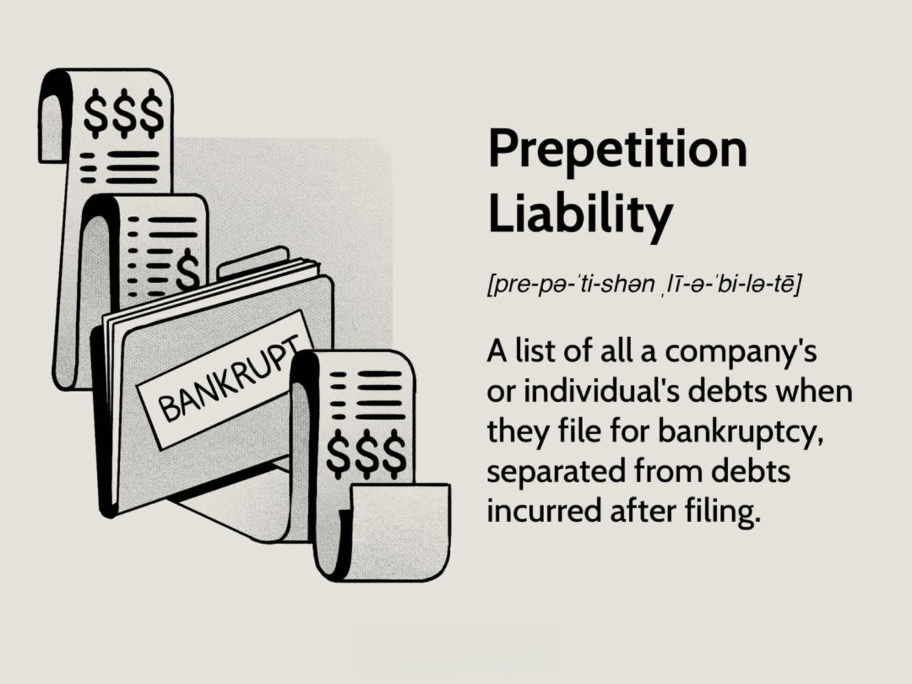

## Table of Contents

## What is prepetition liability?

Prepetition liability refers to the debts or obligations that a company has before it files for bankruptcy. When a company decides to go through bankruptcy, it's important to know about these liabilities because they can affect how the bankruptcy process goes. These liabilities can include things like loans, unpaid bills, or any other money the company owes to others before it filed for bankruptcy.

During bankruptcy, these prepetition liabilities are handled differently than debts that come up after the bankruptcy filing, which are called postpetition liabilities. The court looks at prepetition liabilities to figure out how to pay them back, if at all, based on the type of bankruptcy the company is filing for. This can be a complex process, but it's all about making sure the company can start fresh while being fair to its creditors.

## How does prepetition liability differ from postpetition liability?

Prepetition liability and postpetition liability are terms used in bankruptcy to describe when a company's debts were created. Prepetition liability refers to any debts or obligations a company had before it filed for bankruptcy. These could be loans, unpaid bills, or any other money the company owed before starting the bankruptcy process. When a company files for bankruptcy, these prepetition liabilities are important because they help determine how the company's assets will be distributed to pay off debts.

On the other hand, postpetition liability refers to any debts or obligations that a company takes on after it has filed for bankruptcy. These are new debts that come up during the bankruptcy process. The way these postpetition liabilities are handled can be different from prepetition liabilities. Usually, postpetition debts are given priority because they are seen as necessary for the company to keep operating during bankruptcy. This means the company might have to pay these new debts before dealing with the older, prepetition debts.

## What are common examples of prepetition liabilities?

Prepetition liabilities are debts a company has before it files for bankruptcy. Some common examples include unpaid loans from banks or other lenders. If a company borrowed money to buy equipment or expand its business, and hasn't paid it back yet, that's a prepetition liability. Another example is money owed to suppliers for goods or services the company received before filing for bankruptcy. If a company ordered materials but didn't pay the bill before going bankrupt, that's also a prepetition liability.

There are also other types of prepetition liabilities, like unpaid wages to employees. If a company hasn't paid its workers for work done before the bankruptcy filing, those wages are considered prepetition liabilities. Additionally, any unpaid taxes the company owes to the government before filing for bankruptcy fall into this category. These could be income taxes, sales taxes, or other types of taxes that were due but not paid.

Understanding these examples helps show how prepetition liabilities can come from many different parts of a company's operations. They are important because they affect how the company's assets are distributed during bankruptcy, and they help determine what the company needs to do to start fresh.

## Why is it important to understand prepetition liability in bankruptcy?

Understanding prepetition liability is important in bankruptcy because it helps everyone involved know what debts the company had before it filed for bankruptcy. This is key because these debts affect how the company's money and things it owns, like buildings or equipment, are shared out. If a company knows all its prepetition liabilities, it can plan better for how to pay them back or deal with them during the bankruptcy process. This helps the company start fresh and also makes sure that people or other businesses the company owes money to are treated fairly.

Also, knowing about prepetition liabilities helps the court decide how to handle the company's case. The court looks at these debts to figure out who should get paid first and how much they should get. This can be tricky because some debts might be more important than others. For example, unpaid wages to workers might be treated differently than money owed to a bank. By understanding prepetition liabilities, the court can make better decisions that help the company and its creditors move forward.

## How is prepetition liability treated in a Chapter 11 bankruptcy?

In a Chapter 11 bankruptcy, prepetition liability is treated as debts the company had before filing for bankruptcy. These debts are important because they help decide how the company's money and things it owns are shared out during the bankruptcy process. The company has to make a plan to pay back these debts, but it might not have to pay all of them right away or even at all. The court looks at these debts and decides what the company needs to do to start fresh while being fair to the people or businesses it owes money to.

The court puts prepetition liabilities into different groups based on how important they are. Some debts, like unpaid wages to workers or certain taxes, might be treated as more important than others, like money owed to banks. This means the company might have to pay these more important debts first. The company can also sometimes change the terms of its prepetition debts, like lowering the [interest rate](/wiki/interest-rate-trading-strategies) or spreading out the payments over a longer time. This helps the company keep running while it works through the bankruptcy process.

## What are the legal implications of prepetition liability for creditors?

When a company files for bankruptcy, prepetition liability means the debts it had before filing. For creditors, this is important because it affects what they might get back. If a creditor lent money to the company before it went bankrupt, they are a prepetition creditor. They have to wait and see how the bankruptcy court decides to handle their debt. The court looks at all the company's debts and decides who gets paid first and how much. This can be hard for creditors because they might not get all their money back, or they might have to wait a long time.

The legal implications for creditors depend on the type of debt they have. Some debts, like unpaid wages to workers or certain taxes, are treated as more important. This means these creditors might get paid before others. Other creditors, like banks that lent money, might have to wait longer or get less money. The company might also change the terms of its debts, like lowering the interest rate or spreading out payments. This can help the company keep running, but it might not be good for creditors who want their money back quickly. Understanding prepetition liability helps creditors know what to expect and how to plan during the bankruptcy process.

## How can a company manage its prepetition liabilities effectively?

When a company is dealing with prepetition liabilities, it's important to have a clear plan. First, the company should make a list of all its debts from before bankruptcy. This includes money owed to banks, suppliers, employees, and the government for taxes. Knowing exactly what the company owes helps it talk to creditors and maybe change the terms of the debts. The company might ask for more time to pay or to pay less interest. This can help the company keep running while it goes through bankruptcy.

Another way to manage prepetition liabilities is to work with a bankruptcy lawyer. The lawyer can help the company make a plan that the court will accept. This plan should say how the company will pay back its debts, starting with the most important ones like unpaid wages and certain taxes. The company might also sell some things it owns to pay off these debts. By working closely with the lawyer and following the court's rules, the company can handle its prepetition liabilities in a way that helps it start fresh after bankruptcy.

## What are the limitations of prepetition liability in terms of legal recourse?

When a company goes bankrupt, its prepetition liabilities are the debts it had before filing. These debts limit what creditors can do to get their money back. Creditors can't just sue the company to get paid right away because the bankruptcy court takes over and decides who gets paid and when. This means creditors might have to wait a long time or get less money than they expected. The court looks at all the debts and decides which ones are more important, like unpaid wages to workers or certain taxes, and these get paid first.

Creditors also can't take back things they sold to the company on credit, like equipment or supplies, if the company still has them. The bankruptcy process stops creditors from doing this, which is called an "automatic stay." This stay gives the company time to figure out how to pay back its debts without creditors taking things away. While this can help the company, it makes it harder for creditors to get their money back quickly. They have to follow the court's rules and wait for the company to come up with a plan to pay them.

## How does prepetition liability affect the reorganization plan in bankruptcy?

When a company files for bankruptcy, its prepetition liabilities are the debts it had before filing. These debts are important because they affect the reorganization plan the company makes. The reorganization plan is like a roadmap that shows how the company will pay back its debts and start fresh. The plan has to include all the prepetition liabilities, and the company needs to figure out how to pay them back. This can be hard because the company might not have enough money to pay everyone right away. The court looks at the plan and decides if it's fair and if it will work.

The court puts the prepetition liabilities into different groups based on how important they are. Some debts, like unpaid wages to workers or certain taxes, are treated as more important. This means the company has to pay these debts first. Other debts, like money owed to banks, might have to wait longer or get less money. The company might also change the terms of its debts, like lowering the interest rate or spreading out the payments over a longer time. This helps the company keep running while it works through the bankruptcy process. By understanding and managing its prepetition liabilities, the company can make a reorganization plan that helps it start fresh and be fair to its creditors.

## What role does prepetition liability play in the valuation of a distressed company?

Prepetition liability is important when figuring out how much a distressed company is worth. These are the debts the company had before it went bankrupt. When someone wants to buy or invest in a distressed company, they look at these debts to see how much money the company owes. This helps them decide if the company is a good deal or not. If the company has a lot of prepetition liabilities, it might be worth less because the buyer or investor will have to pay off those debts.

The valuation process also looks at how the company plans to deal with its prepetition liabilities. If the company has a good plan to pay back its debts, it might be seen as more valuable. But if the plan is not good, or if the debts are too big, the company might be worth less. Understanding prepetition liabilities helps everyone see the real value of the company and make better decisions about buying or investing in it.

## How do courts typically handle disputes over prepetition liabilities?

When there are disagreements about prepetition liabilities in bankruptcy, courts usually step in to sort things out. These disputes can happen when creditors and the company don't agree on how much money is owed or how the debts should be paid back. The court's job is to look at all the information and make a fair decision. They might hold meetings or hearings where both sides can explain their side of the story. The court will then decide how the company should handle those debts, making sure everyone gets treated fairly.

Sometimes, the court might need more information to make a good decision. They could ask for documents or other proof to see how much the company owes and to whom. The court might also look at the company's plan to pay back its debts and see if it's fair to everyone involved. By doing this, the court helps make sure that the company can start fresh after bankruptcy, while also making sure creditors get what they are owed as best as possible.

## What are the strategic considerations for a debtor regarding prepetition liabilities during bankruptcy proceedings?

When a company is going through bankruptcy, it needs to think carefully about its prepetition liabilities. These are the debts the company had before it filed for bankruptcy. One big thing the company needs to do is make a list of all these debts. This helps the company talk to the people it owes money to and maybe change the terms of the debts. The company might ask for more time to pay or to pay less interest. This can help the company keep running while it goes through bankruptcy. The company also needs to work with a bankruptcy lawyer to make a plan that the court will accept. This plan should say how the company will pay back its debts, starting with the most important ones like unpaid wages and certain taxes.

Another important thing for the company to think about is how its prepetition liabilities will affect its reorganization plan. The reorganization plan is like a roadmap that shows how the company will pay back its debts and start fresh. The company needs to figure out how to pay back all its prepetition liabilities, which can be hard because it might not have enough money to pay everyone right away. The court will look at the plan and decide if it's fair and if it will work. The company might also need to sell some things it owns to pay off these debts. By understanding and managing its prepetition liabilities well, the company can make a reorganization plan that helps it start fresh and be fair to its creditors.

## References & Further Reading

[1]: Bergstra, J., Bardenet, R., Bengio, Y., & Kégl, B. (2011). ["Algorithms for Hyper-Parameter Optimization."](https://dl.acm.org/doi/10.5555/2986459.2986743) Advances in Neural Information Processing Systems 24.

[2]: ["Advances in Financial Machine Learning"](https://www.amazon.com/Advances-Financial-Machine-Learning-Marcos/dp/1119482089) by Marcos Lopez de Prado

[3]: ["Evidence-Based Technical Analysis: Applying the Scientific Method and Statistical Inference to Trading Signals"](https://www.amazon.com/Evidence-Based-Technical-Analysis-Scientific-Statistical/dp/0470008741) by David Aronson

[4]: ["Machine Learning for Algorithmic Trading"](https://github.com/stefan-jansen/machine-learning-for-trading) by Stefan Jansen

[5]: ["Quantitative Trading: How to Build Your Own Algorithmic Trading Business"](https://www.amazon.com/Quantitative-Trading-Build-Algorithmic-Business/dp/1119800064) by Ernest P. Chan

[6]: Merton, R. C. (1974). ["On the Pricing of Corporate Debt: The Risk Structure of Interest Rates."](https://onlinelibrary.wiley.com/doi/10.1111/j.1540-6261.1974.tb03058.x) The Journal of Finance, 29(2), 449-470.

[7]: Brunnermeier, M. K., & Pedersen, L. H. (2009). ["Market Liquidity and Funding Liquidity."](https://www.jstor.org/stable/30225714) The Review of Financial Studies, 22(6), 2201-2238.

[8]: Schwarcz, S. L. (1996). ["Rethinking a Corporation's Obligations to Creditors."](https://papers.ssrn.com/sol3/papers.cfm?abstract_id=10099) Duke Law Journal, 46(6), 1183-1226.

[9]: Dev, A. (2008). ["Guide to Hedge Funds: What they are, what they do, their risks, their advantages."](https://archive.org/details/economistguideto0000cogg) by Phillip A. Griffiths