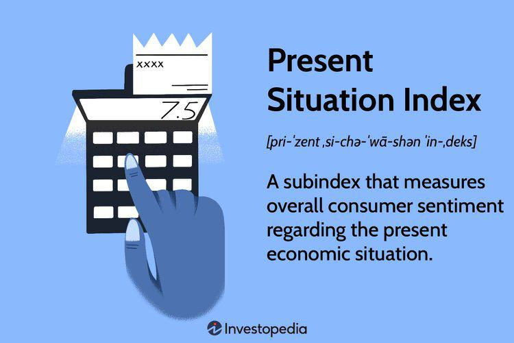

The Present Situation Index is a pivotal component of understanding consumer confidence, directly reflecting the prevailing economic sentiment. As an integral part of the broader suite of economic indicators, it is instrumental in assessing both the stability and the growth potential of an economy. At its core, the Present Situation Index evaluates how consumers perceive the current economic environment, particularly in terms of business conditions and employment prospects. This measure is critical not only for comprehending immediate economic climates but also for anticipating shifts that may influence policymaking and investment strategies.

Familiarity with the framework of the Present Situation Index is crucial for businesses, investors, and policymakers. For businesses, an understanding of current consumer sentiment can influence decisions about production, pricing, and market expansion. Investors, on the other hand, can use this real-time insight to adjust their portfolios to mitigate risks or capitalize on emerging opportunities. Policymakers may also rely on this index to devise strategies that bolster economic growth or address economic downturns.



Furthermore, the integration of such indices into algorithmic trading strategies represents a significant advancement in investment decision-making. Algorithmic trading, which relies on automated processes and models to execute trades, benefits from the up-to-the-minute data provided by the Present Situation Index. By embedding this index into their algorithms, traders and investors can optimize predictions of market movements and respond more swiftly to changes in consumer confidence. This article investigates into the dynamics of the Present Situation Index, elucidating its role in shaping consumer confidence and its broad implications within algorithmic trading.

## Table of Contents

## What is the Present Situation Index?

The Present Situation Index (PSI) is a measure that provides insights into consumer sentiment regarding the current economic landscape. It is a component of the broader Consumer Confidence Index, which is developed and published by the Conference Board, a global, independent business membership and research association. The PSI specifically focuses on consumers' evaluations of ongoing business conditions and the job market, effectively capturing the public's perception of the economy as of today.

The development of the Present Situation Index involves surveying a statistically significant sample of consumers. These surveys inquire about respondents' views on factors such as current business conditions and employment opportunities. The responses are then aggregated to generate an index number, which reflects overall consumer sentiment. A higher PSI indicates that consumers perceive economic conditions to be favorable, while a lower number suggests a more pessimistic outlook.

The importance of the PSI lies in its ability to offer real-time insights into the immediate economic climate from the consumer's perspective. Unlike other economic indicators that might reflect historical data, the PSI provides a contemporaneous snapshot of economic sentiment. This makes it particularly valuable for stakeholders looking to understand and forecast short-term economic trends. 

By monitoring shifts in the Present Situation Index, businesses, investors, and policymakers can gauge consumer confidence levels, which is a crucial driver of economic activity. For instance, a rising PSI could signal increased consumer spending and job market improvements, encouraging businesses to invest in growth and expansion initiatives. Conversely, a declining PSI might prompt caution and indicate potential economic headwinds. 

In summary, the Present Situation Index is an essential economic measure that evaluates consumers' attitudes towards current business and employment conditions, providing timely insights into the health of the economy as perceived by the general public.

## The Role of Economic Indicators

Economic indicators, such as the Present Situation Index, are essential tools for analyzing the overall economic climate. These indicators help in evaluating the current health and potential future activities of an economy, offering valuable insights that guide decision-making processes for various stakeholders.

Economic indicators are categorized into leading, lagging, and coincident indicators. Leading indicators, like stock market returns and manufacturing activity, can predict future economic trends. In contrast, lagging indicators, such as unemployment rates, confirm trends that are already established. The Present Situation Index, a coincident indicator, provides real-time information about the economy by gauging consumer perceptions of business conditions and the job market.

For businesses, economic indicators are crucial for strategy formulation and operational alignment. Companies use these indicators to anticipate market demand, manage inventory, and adjust pricing strategies. For instance, if the Present Situation Index suggests a robust economic environment with high consumer sentiment, businesses might consider expanding production or increasing marketing efforts to capitalize on expected consumer spending.

Investors, similarly, rely on economic indicators to make informed portfolio decisions. By analyzing indicators like the Present Situation Index, investors gain insights into consumer confidence and economic stability, which can impact asset prices and investment returns. A high reading on the Present Situation Index could imply a favorable economic environment, influencing investors to allocate more assets into equities, expecting corporate profitability and market growth.

Furthermore, policymakers utilize economic indicators to design fiscal and monetary policies. By understanding the current economic conditions, they can implement measures to stabilize or stimulate the economy as needed. For example, if the Present Situation Index highlights low consumer confidence and economic stagnation, policymakers might introduce stimulus packages or adjust interest rates to spur economic activity.

Incorporating economic indicators into [algorithmic trading](/wiki/algorithmic-trading) provides an advanced approach to navigating financial markets. Programmers and data scientists can develop algorithms that analyze current and historical data from indicators like the Present Situation Index to identify patterns and predict market movements. These algorithms can then execute trades more efficiently, responding quickly to changes in economic conditions.

Overall, the integration of the Present Situation Index and other economic indicators into decision-making processes enhances the ability of businesses, investors, and policymakers to navigate the complexities of economic cycles. This strategic approach enables stakeholders to adapt to changing conditions, optimize outcomes, and minimize risks.

## Consumer Confidence and Economic Insights

The Present Situation Index (PSI) serves as a vital component in understanding consumer confidence, reflecting current economic conditions through the perceptions of consumers. Consumer confidence is a crucial economic indicator because it directly impacts spending and investment behaviors, which are fundamental to economic stability and growth.

High consumer confidence typically indicates strong economic conditions. When consumers feel optimistic about their financial situation and the economy, they are more likely to increase their spending on goods and services. This increased consumer spending can lead to higher demand for products, encouraging businesses to expand, invest in new projects, and hire more employees. Consequently, this stimulates economic growth and can lead to a positive cycle of economic prosperity.

Conversely, low consumer confidence reflects consumer pessimism, often resulting in reduced spending and cautious investment behavior. During periods of low confidence, consumers are more inclined to save rather than spend, which can lead to decreased demand for goods and services. This reduced demand can force businesses to cut back on production, delay expansion plans, and potentially reduce their workforce, contributing to slower economic growth or even a recession.

Insights gained from the Present Situation Index are valuable for predicting economic trends, as fluctuations in consumer confidence can indicate forthcoming changes in the economy. Businesses can utilize these insights to adapt their strategies accordingly. For instance, during times of high consumer confidence, businesses might focus on scaling up production and increasing inventory, while during times of low confidence, they might concentrate on cost-cutting measures and improving operational efficiency.

Moreover, understanding consumer confidence can assist policymakers in designing and implementing economic policies that support economic stability and growth. By monitoring changes in the Present Situation Index and consumer confidence, policymakers can gauge the effectiveness of fiscal and monetary policies and make adjustments to address emerging economic challenges.

In summary, the Present Situation Index provides critical insights into consumer confidence, which is a powerful driver of economic activity. Recognizing and interpreting these insights allows stakeholders to anticipate economic shifts and tailor their strategies to optimize performance in varying economic climates.

## Algorithmic Trading and Economic Indicators

Algorithmic trading has revolutionized the financial markets by utilizing computer algorithms to execute trades at speeds and frequencies impossible for human traders. These sophisticated systems rely on a variety of data inputs, including real-time market data and economic indicators, to make informed trading decisions. One such vital economic indicator is the Present Situation Index (PSI), which reflects current consumer confidence and economic sentiment.

Incorporating the Present Situation Index into algorithmic trading models can significantly enhance their predictive accuracy regarding market movements. By integrating PSI data, algorithms can adjust trading strategies based on real-time shifts in economic conditions. For instance, a high PSI reading suggests robust consumer confidence, potentially driving higher market activity and increased stock prices. Conversely, a declining PSI might indicate economic pessimism, potentially signaling a bear market.

Python, the preferred language for many in algorithmic trading, allows for the seamless integration of the Present Situation Index. Here is a basic example of how one might incorporate PSI data into a trading algorithm:

```python
import pandas as pd

# Function to simulate fetching PSI data
def fetch_present_situation_index():
    # This would be replaced by actual data fetching code
    return 95.0  # Example value

# Example trading decision based on PSI
def trading_decision_based_on_psi(stock_data):
    psi = fetch_present_situation_index()

    # Example condition: Buy if PSI is above a threshold, sell if below
    buy_threshold = 100
    sell_threshold = 90

    if psi > buy_threshold:
        return "Buy"
    elif psi < sell_threshold:
        return "Sell"
    else:
        return "Hold"

# Simulate stock data (in practice, this would be real market data)
stock_data = pd.DataFrame({
    'Stock': ['AAPL', 'GOOGL', 'AMZN'],
    'Price': [150, 2800, 3400]
})

# Decision for each stock based on PSI
stock_decisions = stock_data['Stock'].apply(trading_decision_based_on_psi)
print(stock_decisions)
```

Algorithmic trading systems can capitalize on such programming logic to respond swiftly to changes in consumer confidence. This agility provides a significant advantage, allowing traders to preemptively adjust their positions in response to economic signals. The integration of diligent economic analysis with automated trading capabilities facilitates more effective capital allocation and risk management.

## Conclusion

Understanding and leveraging the Present Situation Index is critical for businesses, investors, and policymakers who seek to effectively navigate the complexities of economic cycles. As a key component of the Consumer Confidence Index, the Present Situation Index offers real-time insights into the current economic climate by reflecting consumer perceptions about business conditions and the job market. This information is invaluable for making informed decisions about market strategies and investments.

Incorporating the Present Situation Index into algorithmic trading algorithms enhances the ability to predict market movements and adjust strategies promptly in response to shifts in consumer confidence. Algorithmic trading systems benefit from this integration as they can analyze a broader set of real-time data inputs to execute trades with greater precision. For example, changes in consumer sentiment, as captured by the Present Situation Index, can trigger automated responses in trading models designed to capitalize on such fluctuations.

To make full use of this index, continuous monitoring and analysis are essential. Businesses that track the Present Situation Index are better equipped to align their strategies with current market realities, thereby optimizing their market positioning and competitiveness. For investors, continual assessment of consumer sentiment allows for more strategic portfolio management by capitalizing on market opportunities or mitigating risks influenced by economic dynamics.

Policymakers can also benefit from leveraging the insights provided by the Present Situation Index. By analyzing shifts in consumer sentiment, they can evaluate the efficacy of current economic policies and make data-driven adjustments. This responsiveness can lead to more effective policy development that supports economic stability and growth.

In conclusion, the Present Situation Index serves as a crucial tool in the arsenal of economic analysis. Its integration with algorithmic trading and strategic decision-making processes provides a sophisticated approach to understanding and navigating economic cycles. The continuous monitoring of consumer sentiment, as captured by this index, is paramount for devising adaptive financial strategies and fostering economic resilience.

## References & Further Reading

[1]: The Conference Board. (n.d.). ["Consumer Confidence Survey."](https://www.conference-board.org/topics/consumer-confidence/) The Conference Board.

[2]: Lopez de Prado, M. (2018). ["Advances in Financial Machine Learning."](https://www.amazon.com/Advances-Financial-Machine-Learning-Marcos/dp/1119482089) Wiley.

[3]: Aronson, D. (2006). ["Evidence-Based Technical Analysis: Applying the Scientific Method and Statistical Inference to Trading Signals."](https://www.amazon.com/Evidence-Based-Technical-Analysis-Scientific-Statistical/dp/0470008741) Wiley.

[4]: Jansen, S. (2020). ["Machine Learning for Algorithmic Trading."](https://github.com/stefan-jansen/machine-learning-for-trading) Packt Publishing.

[5]: Chan, E. P. (2008). ["Quantitative Trading: How to Build Your Own Algorithmic Trading Business."](https://github.com/ftvision/quant_trading_echan_book) Wiley.