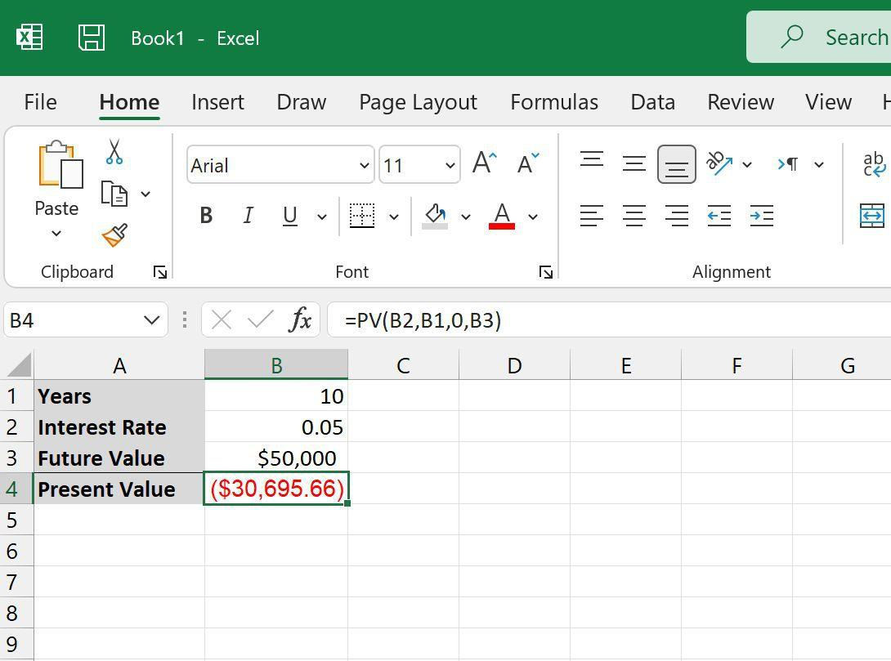

## Table of Contents

## What is present value and why is it important?

Present value is a way to figure out how much money you would have now if you were going to get some money in the future. It's like asking, "If someone promised to give me $100 next year, how much is that worth to me today?" To find the present value, you need to think about things like how long you have to wait and what interest rate you could earn if you had the money now. 

Understanding present value is important because it helps you make better choices about money. For example, if you are deciding between getting $100 now or $105 a year from now, present value can help you see which option is better. It's also used a lot in business to figure out if investing in a project or buying something is a good idea. By knowing the present value, you can compare different choices and pick the one that will be most valuable to you right now.

## How do you calculate present value manually?

To calculate present value manually, you need to know the future amount of money you will receive, the interest rate you could earn if you had the money now, and how many years you will have to wait. The formula you use is: Present Value = Future Value / (1 + Interest Rate)^Number of Years. Let's say you will get $100 in one year, and the interest rate is 5%. You would plug these numbers into the formula like this: Present Value = $100 / (1 + 0.05)^1. This works out to $100 / 1.05 = $95.24. So, $100 next year is worth $95.24 to you today.

It's important to understand that the [interest rate](/wiki/interest-rate-trading-strategies) and the number of years can change the present value a lot. If the interest rate is higher, the present value will be lower because you could earn more money if you had it now. If you have to wait longer to get the money, the present value will also be lower because you're giving up the chance to use that money for a longer time. For example, if you had to wait two years instead of one to get $100, and the interest rate was still 5%, the present value would be $100 / (1 + 0.05)^2 = $100 / 1.1025 = $90.70. So, waiting longer makes the money less valuable to you today.

## What are the basic Excel functions used for present value calculations?

In Excel, the main function for calculating present value is called PV. You use it like this: =PV(rate, nper, pmt, [fv], [type]). Here, "rate" is the interest rate per period, "nper" is the total number of periods, "pmt" is the payment made each period, "fv" is the future value (which you can leave out if it's zero), and "type" is when the payment is due (0 for end of period, 1 for beginning, and you can leave it out if it's 0). For example, if you want to find out the present value of $100 you'll get in one year with a 5% interest rate, you would use =PV(0.05, 1, 0, 100).

Another useful function is NPV, which stands for Net Present Value. It's used when you have a series of cash flows over time. The function looks like this: =NPV(rate, value1, [value2], ...). "Rate" is the discount rate over one period, and "value1", "value2", etc., are the cash flows for each period. For example, if you want to find the present value of $100 next year and $110 the year after that, with a 5% interest rate, you would use =NPV(0.05, 100, 110). Remember, NPV assumes the first cash flow happens at the end of the first period, so if you have an initial investment at the start, you need to add it outside the NPV function, like this: =-1000 + NPV(0.05, 100, 110, 120) if your initial investment is $1000.

## Can you explain the PV function in Excel and its syntax?

The PV function in Excel helps you figure out how much money you would have today if you were going to get some money in the future. It's called the Present Value function. The way you use it is by writing =PV(rate, nper, pmt, [fv], [type]) in a cell. Here, "rate" is the interest rate for each period, "nper" is how many periods you have to wait, "pmt" is any regular payment you make each period, "fv" is the future value of the money you'll get (you can leave it out if it's zero), and "type" is when you make the payment (0 if it's at the end of the period, 1 if it's at the beginning, and you can leave it out if it's 0).

For example, if you want to know the present value of $100 you'll get in one year with a 5% interest rate, you would type =PV(0.05, 1, 0, 100) into a cell. This tells Excel to use a 5% interest rate, wait for one year, and that you're not making any regular payments. The result will be around $95.24, which means $100 next year is worth $95.24 to you today. It's a handy tool for making decisions about money, like whether it's better to get money now or later.

## How do you use the NPV function in Excel for present value calculations?

The NPV function in Excel helps you find out the present value of money you'll get over time. It's called the Net Present Value function. You use it by typing =NPV(rate, value1, [value2], ...) into a cell. Here, "rate" is the interest rate for each period, and "value1", "value2", etc., are the amounts of money you'll get in each period. For example, if you want to know the present value of getting $100 next year and $110 the year after that with a 5% interest rate, you would type =NPV(0.05, 100, 110) into a cell. The result will tell you how much those future amounts are worth to you today.

The NPV function assumes that the first cash flow happens at the end of the first period. If you have an initial investment or payment at the start, you need to add it outside the NPV function. For example, if you invest $1000 now and then get $100 next year and $110 the year after that, with a 5% interest rate, you would type =-1000 + NPV(0.05, 100, 110) into a cell. This way, you're taking into account both the money you're spending now and the money you'll get later, all adjusted to today's value. It's a useful tool for deciding if an investment or project is worth it by comparing the present value of what you'll get to what you're spending.

## What is the difference between PV and NPV functions in Excel?

The PV function in Excel helps you find out how much a single amount of money you'll get in the future is worth to you today. You use it by typing =PV(rate, nper, pmt, [fv], [type]) into a cell. Here, "rate" is the interest rate per period, "nper" is how many periods you wait, "pmt" is any regular payment you make each period, "fv" is the future value you'll get, and "type" is when you make the payment. For example, if you'll get $100 in one year with a 5% interest rate, you type =PV(0.05, 1, 0, 100) and it tells you that $100 next year is worth about $95.24 today.

The NPV function in Excel, on the other hand, is used to find the present value of a series of cash flows over time. You use it by typing =NPV(rate, value1, [value2], ...) into a cell. Here, "rate" is the interest rate per period, and "value1", "value2", etc., are the amounts of money you'll get in each period. For example, if you'll get $100 next year and $110 the year after that with a 5% interest rate, you type =NPV(0.05, 100, 110). The NPV function assumes the first cash flow happens at the end of the first period, so if you have an initial investment at the start, you need to add it outside the function, like =-1000 + NPV(0.05, 100, 110) if you invest $1000 now.

In simple terms, PV is for figuring out the value of one future payment today, while NPV is for figuring out the value of multiple future payments today. Both functions help you make better money decisions by showing you what future money is worth right now.

## How can you adjust for different compounding periods in Excel present value calculations?

When you want to figure out the present value of money in Excel, you need to think about how often the interest is added, or compounded. If the interest is added more often, like monthly instead of yearly, the money grows faster. To adjust for this in Excel, you need to change the interest rate and the number of periods you use in the PV or NPV function. For example, if you have a yearly interest rate of 5% but it's compounded monthly, you would divide the yearly rate by 12 to get the monthly rate, which is about 0.4167%. Then, if you're looking at a one-year period, you would multiply the number of years by 12 to get 12 months.

Let's say you want to find the present value of $100 you'll get in one year with a 5% yearly interest rate, but it's compounded monthly. You would use the PV function like this: =PV(0.05/12, 12, 0, 100). This tells Excel to use a monthly interest rate of about 0.4167% and to wait for 12 periods (months). The result will be a bit less than if you used the yearly rate because the money is growing a little faster each month. This way, you can make sure your present value calculation is as accurate as possible by matching it to how often the interest is actually added.

## What are common errors to avoid when calculating present value in Excel?

When you're figuring out present value in Excel, one common mistake is using the wrong interest rate. Sometimes people forget to change the yearly rate to a monthly or daily rate if the interest is added more often than once a year. For example, if you have a 5% yearly rate but it's compounded monthly, you need to use 0.4167% (which is 5% divided by 12) in your formula. Another mistake is mixing up the number of periods. If you're using a monthly rate, you need to use the total number of months, not years. So for one year, you'd use 12 periods, not 1.

Another error to watch out for is forgetting to add or subtract initial investments when using the NPV function. The NPV function assumes the first cash flow happens at the end of the first period, so if you have money going out at the start, like an investment, you need to add it outside the NPV function. For example, if you invest $1000 now and then get money later, you'd type =-1000 + NPV(rate, value1, value2, ...). Also, make sure all the numbers you're using are in the same units. If you mix dollars with cents or years with months, your calculations will be off. Keeping everything consistent helps you get the right answer.

## How do you incorporate inflation into present value calculations in Excel?

When you want to figure out how much money you'll have in the future, you need to think about inflation. Inflation means that over time, the value of money goes down because prices go up. To include inflation in your present value calculations in Excel, you need to adjust the interest rate you use. You do this by taking the interest rate you expect to earn and subtracting the inflation rate. For example, if you expect to earn 5% interest but inflation is 2%, you would use a "real" interest rate of 3% (5% - 2%) in your PV or NPV function. So, if you're looking at the present value of $100 you'll get in one year, you would type =PV(0.03, 1, 0, 100) into Excel.

Including inflation in your calculations helps you see how much money you'll really have in the future after prices have gone up. If you don't adjust for inflation, you might think you'll have more money than you actually will. For example, if you don't adjust for inflation and use the full 5% interest rate instead of the real rate of 3%, the present value of $100 next year would be higher than it should be. By using the real interest rate, you get a more accurate idea of what that future money is worth to you today.

## Can you demonstrate how to calculate present value of an annuity in Excel?

An annuity is when you get the same amount of money every period, like every month or every year. To find out how much this series of payments is worth to you today, you can use the PV function in Excel. Let's say you'll get $100 every year for the next 5 years, and the interest rate is 5%. You would type =PV(0.05, 5, -100) into a cell. The minus sign in front of the 100 means it's money coming to you. This calculation will tell you the present value of getting $100 every year for 5 years, which turns out to be about $432.95.

If the payments are made at the beginning of each period instead of the end, you need to add a 1 at the end of the function. So, if you get $100 at the start of each year for 5 years with a 5% interest rate, you would type =PV(0.05, 5, -100, 0, 1). This changes the present value slightly because you're getting the money a bit earlier. The result would be about $454.60. By using the PV function this way, you can figure out what a series of future payments is worth to you right now, which helps you make better decisions about money.

## How do you use Excel to calculate present value for irregular cash flows?

To calculate the present value of irregular cash flows in Excel, you use the NPV function. Irregular cash flows mean you get different amounts of money at different times. For example, if you get $100 next year, $150 the year after that, and $200 the year after that, with a 5% interest rate, you would type =NPV(0.05, 100, 150, 200) into a cell. This tells Excel to figure out what those future amounts are worth to you today, considering the interest rate.

If you have an initial investment or payment at the start, you need to add it outside the NPV function. For example, if you invest $500 now and then get $100 next year, $150 the year after that, and $200 the year after that, with a 5% interest rate, you would type =-500 + NPV(0.05, 100, 150, 200). This way, you're taking into account both the money you're spending now and the different amounts you'll get later, all adjusted to today's value.

## What advanced techniques can be used to optimize present value calculations in large datasets in Excel?

When you have a lot of data to work with in Excel, using the right techniques can make your present value calculations faster and easier. One way to do this is by using Excel's Table feature. When you turn your data into a table, you can easily add new data and the formulas will automatically update. This means you don't have to change your formulas every time you add new cash flows. You can also use structured references in your formulas, which makes them easier to read and less likely to break if you move things around.

Another helpful technique is to use Excel's Data Validation to make sure your data is correct. For example, you can set rules to make sure the interest rate is a number between 0 and 1, or that the cash flows are positive numbers. This helps prevent mistakes that could mess up your calculations. Also, if you're working with really big datasets, using Excel's Power Query can help you clean and organize your data before you do your calculations. This way, you can make sure your data is in the right format and ready to use, which makes your present value calculations more accurate and efficient.

## What is Understanding Present Value (PV)?

Present Value (PV) represents the current worth of a sum of money or a stream of cash flows that is expected to be received in the future, discounted at a specific interest rate. This concept plays a central role in financial decision-making, enabling investors and analysts to assess how much future money is worth today. The core idea behind PV is rooted in the time value of money, a foundational principle in finance stating that a sum of money today is worth more than the same sum in the future due to its potential [earning](/wiki/earning-announcement) capacity. This principle is critical for evaluating investments since it allows investors to compare different investment opportunities by considering not only the amount of money but also the timing of receipts.

The present value is crucial in various financial contexts, including investment evaluation, loan analysis, bond pricing, and capital budgeting. By calculating the present value, investors can determine whether a particular investment is worthwhile, comparing the investment's cost to the present value of expected future cash flows.

The basic mathematical formula for calculating the present value is:

$$
PV = \frac{FV}{(1 + r)^n}
$$

Where:
- $PV$ is the present value.
- $FV$ represents the future value of the money or cash flows.
- $r$ is the interest rate or discount rate.
- $n$ denotes the number of periods until the cash flow occurs.

In this equation, the future value is divided by $(1 + r)^n$, which is the discount [factor](/wiki/factor-investing). This factor diminishes over time, reflecting the decreased worth of future money. The concept and calculation of present value are integral to financial analysis, allowing for the evaluation of the profitability and viability of investment opportunities. By applying PV, financial analysts can make informed decisions that align with their financial goals.

## What are the special considerations for using PV in Excel?

When using the Present Value (PV) function in Excel, specific considerations must be addressed to ensure the accuracy of calculations, especially regarding different compounding periods. Compounding periods can vary, and understanding how they affect the calculation is crucial.

### Adjustments for Different Compounding Periods

The compounding period refers to the frequency with which the interest is applied to the principal balance. The most common compounding periods include annual, semi-annual, quarterly, monthly, and daily. To accurately calculate the present value when these periods differ, it is necessary to adjust the annual interest rate accordingly.

#### Converting Annual Interest Rates

To convert an annual interest rate to match a non-annual compounding period, use the following formula:

$$
i_{\text{period}} = \left(1 + i_{\text{annual}}\right)^{\frac{1}{n}} - 1
$$

where:
- $i_{\text{period}}$ is the interest rate for the compounding period,
- $i_{\text{annual}}$ is the annual interest rate,
- $n$ is the number of compounding periods per year.

For example, to convert an annual rate of 6% to a monthly interest rate, divide the annual rate by 12:

$$
i_{\text{monthly}} = \left(1 + 0.06\right)^{\frac{1}{12}} - 1 \approx 0.004867
$$

This means the monthly interest rate is approximately 0.4867%.

In Excel, this conversion can be implemented using the formula:

```excel
=((1 + Annual_Rate)^(1/Compounding_Periods)) - 1
```

### Common Pitfalls and How to Avoid Them

Several mistakes are frequently made when calculating present value in Excel, primarily related to compounding periods:

1. **Mismatched Rates and Periods**: Using an annual rate directly with monthly or quarterly periods can lead to incorrect PV calculations. Always ensure that the interest rate matches the compounding period frequency.

2. **Incorrect NPER Values**: The number of periods (NPER) should align with the compounding period. For example, if making monthly investments over five years, NPER should be set to 60 (12 months x 5 years).

3. **Neglecting Periodic Interest Conversion**: Failing to adjust the interest rate to match the compounding period can significantly skew results. Always convert annual rates to the relevant compounding period using the aforementioned formula.

4. **Assuming Compounding Frequency as Payment Frequency**: These are not necessarily identical. Payments might be made annually while compounding occurs quarterly. Adjust inputs accordingly.

5. **Rounded Inputs**: Rounding intermediate interest rate conversions might lead to cumulative discrepancies in larger financial analyses. It is advisable to retain precision throughout calculations.

By paying close attention to these factors and ensuring proper adjustments, the use of the PV formula in Excel can yield precise and valuable financial insights. Proper mastery of this function enhances financial analysis, enabling professionals to make informed decisions backed by accurate data.

## References & Further Reading

[1]: ["Present Value Function (PV)"](https://support.microsoft.com/en-us/office/pv-function-23879d31-0e02-4321-be01-da16e8168cbd) Microsoft Support

[2]: ["The Excel Analyst's Guide to Access"](https://www.wiley.com/en-us/The+Excel+Analyst%27s+Guide+to+Access-p-9780470567012) by Michael Alexander

[3]: ["Financial Modeling in Excel For Dummies, 2nd Edition"](https://www.amazon.com/Financial-Modeling-Dummies-Danielle-Fairhurst/dp/1119844517) by Danielle Stein Fairhurst

[4]: ["Algorithmic Trading and DMA"](https://www.amazon.com/Algorithmic-Trading-DMA-introduction-strategies/dp/0956399207) by Barry Johnson 

[5]: Hull, J. C. (2012). ["Options, Futures, and Other Derivatives"](https://www.semanticscholar.org/paper/Options%2C-Futures%2C-and-Other-Derivatives-Hull/89bdee500c8623864fc9eb7a471546aa713acc44). Pearson Education. 

[6]: ["Excel 2019 Power Programming with VBA"](https://onlinelibrary.wiley.com/doi/book/10.1002/9781119583790) by Michael Alexander, Richard Kusleika, and John Walkenbach