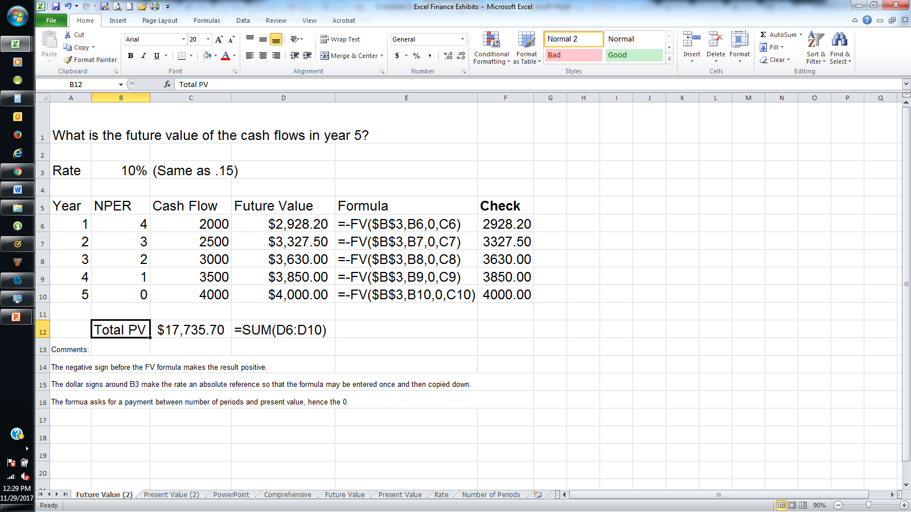

Financial formulas, especially those embedded within Excel, play a pivotal role in modern financial analysis and decision-making. By leveraging the computational power of Excel, financial professionals can efficiently evaluate investment opportunities and strategic financial plans. One of the fundamental concepts at the heart of these analyses is the calculation of present value (PV). Present value is a key financial metric that aids in understanding the value of future cash flows in today's terms, considering a specific rate of return. 

Calculating present value is of critical importance for financial analysis as it allows investors and analysts to assess the attractiveness of an investment. By quantifying the current worth of expected future cash inflows, stakeholders can make informed decisions about asset purchases, capital projects, and business ventures. In the context of algorithmic trading, the ability to swiftly and accurately determine the present value of potential trades ensures that strategies can be executed with efficiency and precision. Algo traders rely on PV calculations among other metrics to optimize decision-making and manage risk effectively.



Excel emerges as a powerful tool for automating such calculations due to its versatility and accessibility. With built-in financial functions, including the PV function, Excel enables users to perform complex analyses with relative ease. This automation streamlines the computational process, reduces human error, and allows users to focus on interpreting results and strategic planning. The seamless integration of these calculations into Excel's comprehensive suite of tools further enhances its capability as an essential asset for financial professionals, making it possible to conduct sophisticated financial modeling and analysis without the need for specialized software programming.

## Table of Contents

## Understanding Present Value (PV)

Present Value (PV) represents the current worth of a sum of money or a stream of cash flows that is expected to be received in the future, discounted at a specific interest rate. This concept plays a central role in financial decision-making, enabling investors and analysts to assess how much future money is worth today. The core idea behind PV is rooted in the time value of money, a foundational principle in finance stating that a sum of money today is worth more than the same sum in the future due to its potential earning capacity. This principle is critical for evaluating investments since it allows investors to compare different investment opportunities by considering not only the amount of money but also the timing of receipts.

The present value is crucial in various financial contexts, including investment evaluation, loan analysis, bond pricing, and capital budgeting. By calculating the present value, investors can determine whether a particular investment is worthwhile, comparing the investment's cost to the present value of expected future cash flows.

The basic mathematical formula for calculating the present value is:

$$
PV = \frac{FV}{(1 + r)^n}
$$

Where:
- $PV$ is the present value.
- $FV$ represents the future value of the money or cash flows.
- $r$ is the interest rate or discount rate.
- $n$ denotes the number of periods until the cash flow occurs.

In this equation, the future value is divided by $(1 + r)^n$, which is the discount [factor](/wiki/factor-investing). This factor diminishes over time, reflecting the decreased worth of future money. The concept and calculation of present value are integral to financial analysis, allowing for the evaluation of the profitability and viability of investment opportunities. By applying PV, financial analysts can make informed decisions that align with their financial goals.

## PV Formula Implementation in Excel

The Present Value (PV) formula in Excel is a widely-used function designed to calculate the current value of a series of future payments or cash flows. The formula is expressed as `=PV(rate, nper, pmt, [fv], [type])`, where each parameter serves a specific purpose in the calculation process.

### Parameters

1. **RATE**: This parameter represents the interest rate per period. It is crucial to ensure that this rate is consistent with the payment period. For instance, if you're evaluating monthly cash flows, the annual interest rate should be converted to a monthly rate by dividing it by 12. For example, an annual rate of 6% becomes 0.5% per month (0.06/12).

2. **NPER**: This denotes the total number of payment periods. For instance, if a cash flow occurs monthly over five years, the total number of periods (NPER) would be 60 (12 months times five years).

3. **PMT**: This is the payment made each period. This element remains constant throughout the investment or annuity period. In cases where cash flows differ each period, you will want to use the NPV (Net Present Value) function instead of PV.

4. **FV**: The future value or a cash balance you hope to attain after the final payment. In cases where FV is omitted, Excel assumes the default value of 0, assuming no balance remains after the last period.

5. **TYPE**: This indicates when the payments are due — either at the beginning (1) or at the end (0) of each period. The default value is 0, denoting payments made at the end of the period.

### Step-by-Step Guide to Using the PV Function in Excel

To effectively use Excel's PV function, follow these steps:

1. **Open Excel and Select a Cell**:
   Open your Excel spreadsheet and click on the cell where you want the PV result to appear.

2. **Activate the PV Function**:
   Navigate to the "Formulas" tab on the Ribbon, select "Financial" from the Function Library, and then select "PV" from the list of functions. This will open the "Function Arguments" dialog box for PV.

3. **Enter the Rate**:
   Input the [interest rate](/wiki/interest-rate-trading-strategies) per period in the "Rate" field. Ensure it's consistent with the period type you are using.

4. **Input the NPER**:
   Specify the total number of periods in the "Nper" field. This field requires the number of payment periods for your calculation.

5. **Specify the PMT**:
   Enter the periodic payment amount into the “Pmt” field. This amount should remain unchanged across all periods.

6. **Define the FV (If Applicable)**:
   If you have a specific future value target, enter it into the "Fv" field. Otherwise, you can leave this blank or set it to 0.

7. **Set the TYPE**:
   Determine when payments are made and enter 0 for payments at the end of the period or 1 for the beginning in the "Type" field.

8. **Execute**:
   Click "OK" to execute the function and display the result in the selected cell.

Employing this function within Excel can significantly streamline the task of present value calculations, rendering them more efficient and less prone to errors. Mastery of this and related financial formulas supports the execution of more sophisticated financial analyses and decision-making.

## Comparing NPV vs. PV in Excel

Net Present Value (NPV) and Present Value (PV) are essential concepts in financial analysis, yet they serve distinct purposes within investment evaluation. Present Value represents the current worth of a future cash flow or series of cash flows, factoring in a specific discount rate, which reflects the time value of money. In contrast, Net Present Value extends this concept by incorporating the initial cost of the investment, thereby offering a holistic perspective on an investment's profitability.

NPV is particularly advantageous for analyzing investments involving cash flows over multiple periods, where the timing and magnitude of returns vary. It calculates the difference between the present value of cash inflows and the present value of cash outflows. A positive NPV indicates that projected earnings, discounted to present value, surpass the initial costs, suggesting a potential profit. Conversely, a negative NPV implies that the investment would result in a net loss.

When using Excel to compute PV and NPV, different functions apply for each:

- **Present Value (PV)** function: 
  ```excel
  =PV(rate, nper, pmt, [fv], [type])
  ```
  - `rate`: Discount rate per period.
  - `nper`: Number of periods.
  - `pmt`: Payment made in each period (typically set to zero for lump-sum present value calculations).
  - `fv`: Future value or lump sum to be received after the last period.
  - `type`: (Optional) Indicates when payments are due. Use 0 for end of the period and 1 for the beginning.

- **Net Present Value (NPV)** function:
  ```excel
  =NPV(rate, value1, [value2], ...)
  ```
  - `rate`: Discount rate over one period.
  - `value1, value2, ...`: Series of cash flows occurring at regular intervals. The initial investment should be subtracted outside the function as it occurs at time zero.

### Example Calculation

For a clearer understanding, consider an example:

Suppose an investment costs $10,000 today and is expected to generate cash flows of $3,000, $4,000, and $5,000 over the next three years. With a discount rate of 10%, you would calculate PV and NPV as follows in Excel.

1. **Present Value** of each cash flow:
   - Year 1: `=PV(10%, 1, 0, 3000)` 
   - Year 2: `=PV(10%, 2, 0, 4000)`
   - Year 3: `=PV(10%, 3, 0, 5000)`

   Add these to find the total PV of the future cash flows.

2. **Net Present Value**:
   - `=NPV(10%, 3000, 4000, 5000) - 10000`

This NPV formula subtracts the initial investment from the sum of the discounted cash flows. If the NPV is positive, the investment could be deemed acceptable.

Understanding the distinctions between NPV and PV is crucial for accurate financial assessments. NPV factors in initial costs and offers a more comprehensive investment analysis, whereas PV focuses on determining the present worth of future cash flows without regard to initial expenditure. Using Excel to automate these calculations enhances efficiency and aids in swift decision-making.

## Practical Example of PV Calculation in Excel

To demonstrate a practical example of calculating the present value (PV) in Excel, let's consider a scenario involving a future cash stream to be discounted back to its present value. Suppose you expect to receive an annual cash flow of $5000 for the next five years, and the annual discount rate is 8%.

### Excel Inputs and Formulas

To perform this calculation in Excel, follow these detailed steps:

1. **Identify the Parameters:**
   - **Future Cash Stream (CF):** $5000 annually
   - **Discount Rate (Rate):** 8% or 0.08
   - **Number of Periods (Nper):** 5 years

2. **PV Calculation:**
   You can use the PV function in Excel, which is structured as `=PV(rate, nper, pmt, [fv], [type])`.

3. **Input the Values:**
   - **Rate:** Enter `0.08`
   - **Nper:** Enter `5`
   - **Pmt:** Enter `5000`
   - **Fv:** Leave it blank or enter `0` because we are calculating for a cash stream, not a single future value.
   - **Type:** Enter `0` to signify that payments are made at the end of the period.

4. **Excel Formula:** 
   In an Excel cell, input the formula:
   ```excel
   =PV(0.08, 5, 5000, 0, 0)
   ```

5. **Output in Excel:**
   After entering the formula, Excel will return the present value of these future cash flows, which would be approximately $19,971.46. This means that receiving $5000 annually for the next five years is equivalent to having about $19,971.46 today, considering an 8% discount rate.

### Financial Decision-Making Implications

Determining the present value of future cash flows is critical in financial analysis, particularly for investment evaluations. It helps investors and financial analysts determine the value of expected cash streams in today's terms, providing a basis to compare different investment opportunities or obligations.

- **Investment Evaluation:** By knowing the present value, one can decide if an investment's future returns justify its cost today.
- **Budget Planning:** Organizations can use PV calculations for budgeting by understanding how future financial obligations equate to today's dollars.
- **Loan Analysis:** It assists in assessing the attractiveness and affordability of loan payments stretched over time when discounted back to the present.

Using Excel for such calculations not only simplifies the complexity involved but also offers flexibility in modifying input variables as scenarios change, thus aiding dynamic financial decision-making. With Excel's functionality, you can perform these calculations efficiently, making the tool indispensable for finance professionals.

## Special Considerations for Using PV in Excel

When using the Present Value (PV) function in Excel, specific considerations must be addressed to ensure the accuracy of calculations, especially regarding different compounding periods. Compounding periods can vary, and understanding how they affect the calculation is crucial.

### Adjustments for Different Compounding Periods

The compounding period refers to the frequency with which the interest is applied to the principal balance. The most common compounding periods include annual, semi-annual, quarterly, monthly, and daily. To accurately calculate the present value when these periods differ, it is necessary to adjust the annual interest rate accordingly.

#### Converting Annual Interest Rates

To convert an annual interest rate to match a non-annual compounding period, use the following formula:

$$
i_{\text{period}} = \left(1 + i_{\text{annual}}\right)^{\frac{1}{n}} - 1
$$

where:
- $i_{\text{period}}$ is the interest rate for the compounding period,
- $i_{\text{annual}}$ is the annual interest rate,
- $n$ is the number of compounding periods per year.

For example, to convert an annual rate of 6% to a monthly interest rate, divide the annual rate by 12:

$$
i_{\text{monthly}} = \left(1 + 0.06\right)^{\frac{1}{12}} - 1 \approx 0.004867
$$

This means the monthly interest rate is approximately 0.4867%.

In Excel, this conversion can be implemented using the formula:

```excel
=((1 + Annual_Rate)^(1/Compounding_Periods)) - 1
```

### Common Pitfalls and How to Avoid Them

Several mistakes are frequently made when calculating present value in Excel, primarily related to compounding periods:

1. **Mismatched Rates and Periods**: Using an annual rate directly with monthly or quarterly periods can lead to incorrect PV calculations. Always ensure that the interest rate matches the compounding period frequency.

2. **Incorrect NPER Values**: The number of periods (NPER) should align with the compounding period. For example, if making monthly investments over five years, NPER should be set to 60 (12 months x 5 years).

3. **Neglecting Periodic Interest Conversion**: Failing to adjust the interest rate to match the compounding period can significantly skew results. Always convert annual rates to the relevant compounding period using the aforementioned formula.

4. **Assuming Compounding Frequency as Payment Frequency**: These are not necessarily identical. Payments might be made annually while compounding occurs quarterly. Adjust inputs accordingly.

5. **Rounded Inputs**: Rounding intermediate interest rate conversions might lead to cumulative discrepancies in larger financial analyses. It is advisable to retain precision throughout calculations.

By paying close attention to these factors and ensuring proper adjustments, the use of the PV formula in Excel can yield precise and valuable financial insights. Proper mastery of this function enhances financial analysis, enabling professionals to make informed decisions backed by accurate data.

## Algorithmic Trading and PV Calculations

Present Value (PV) calculations play a critical role in [algorithmic trading](/wiki/algorithmic-trading) strategies by aiding in the assessment of discounted future cash flows. This process informs traders about the current worth of expected future returns, helping to make informed trading decisions swiftly and with precision. Automating these calculations within algorithmic trading frameworks can significantly enhance decision-making efficacy by rapidly quantifying potential investments' value against their inherent risks and expected payoff.

### Integrating PV Calculations into Algorithmic Trading

Algorithmic trading leverages computational algorithms to execute trades based on predefined criteria. Incorporating PV calculations helps algorithms evaluate time-sensitive financial data, enabling strategies that capitalize on market inefficiencies or price discrepancies. Through automation, programs can continuously assess financial instruments in real-time, providing the agility necessary to respond instantaneously to market conditions.

Excel, with its robust calculation capabilities, serves as a valuable tool in automatically processing PV calculations within trading algorithms. For example, Excel can be employed to pre-calculate the present value of a series of future cash flows using the PV function, allowing algorithms to make instantaneous decisions without manual intervention.

### Benefits of Automating PV Calculations

1. **Speed and Efficiency**: Automating PV calculations reduces the processing time needed for each trade decision. This acceleration is paramount in rapidly changing markets where every millisecond can impact profitability.

2. **Accuracy and Precision**: Automation minimizes human errors in calculations, ensuring consistent and accurate results, crucial for maintaining trading strategy integrity.

3. **Scalability**: Automated systems can handle large data sets and multiple asset analyses simultaneously, facilitating expansive trading operations across diverse markets.

4. **Real-time Adjustments**: By continuously recalculating PV amid fluctuating interest rates and cash flows, algorithms remain attuned to current market dynamics, optimizing strategies dynamically.

### Using Excel with Other Tools for Trading Efficiency

Excel is often used in conjunction with various programming languages and trading platforms to enhance the effectiveness of algorithmic trading strategies:

- **Python Integration**: Python, known for its extensive library support for financial calculations and data handling, can be used alongside Excel. Libraries like `pandas` allow for efficient data manipulation, while `numpy` can expedite numerical computations. By leveraging Python scripts, traders can fetch, process, and input real-time data into Excel spreadsheets to automate PV and other financial calculations.

- **Excel and Financial APIs**: Integrations with APIs from financial platforms can feed real-time data into Excel, providing up-to-date inputs for PV calculations. By doing so, traders ensure their algorithms work with the most current market data.

- **Advanced Visualization**: Combining Excel's computational power with visualization tools like Power BI or Tableau provides intuitive displays of financial insights, facilitating quick comprehension and strategic planning.

In summary, automating present value calculations within an algorithmic trading framework enhances decision-making speed and accuracy. By utilizing Excel in conjunction with programming languages such as Python and financial APIs, traders can build robust systems capable of navigating the complexities of modern financial markets with precision and adaptability.

## Conclusion

Excel is an invaluable resource for executing various financial calculations, serving as a potent tool for professionals and enthusiasts alike. Its capabilities extend from individual financial planning to executing complex calculations supporting high-stakes financial analysis and algorithmic trading. One of the core competencies that significantly benefits from Excel's robust functionalities is the ability to calculate the Present Value (PV) efficiently.

Understanding and mastering PV calculations are fundamental for any financial analysis. The Present Value formula allows users to determine the current worth of cash flows received in the future, taking into account the time value of money. This calculation is crucial for making informed investment decisions, risk assessment, and strategic financial planning. Its integration is not only beneficial for evaluating traditional investments but also serves as a cornerstone for sophisticated algo trading strategies. By automating these calculations using Excel, financial analysts can ensure timely and precise decision-making processes, which is critical in fast-moving markets.

Enhancing your expertise in using Excel for PV calculations paves the way for leveraging its advanced financial analysis capabilities. The structured environment Excel provides facilitates learning and transparency, enabling users to dissect and understand the underlying components of financial formulas. As Excel continues to be a backbone for financial computations, ongoing education and practice are essential for keeping pace with evolving market needs and technological advancements.

To stay at the forefront, financial professionals and traders should prioritize continuous learning. Engaging with educational resources, participating in forums, and experimenting with Excel’s formula capabilities will enrich your knowledge and skill set. This ongoing engagement is vital to harness the full potential of Excel in conducting thorough and accurate financial analysis, ensuring you make informed decisions in your financial endeavors.

## FAQs

**FAQs**

1. **What is the Present Value (PV) function in Excel used for?**

   The Present Value (PV) function in Excel calculates the present value of an investment based on a series of future payments and a specified interest rate. It is particularly useful in evaluating the desirability of an investment or comparing the value of cash flows over time.

2. **How are the components of the PV formula in Excel defined?**

   - **Rate:** The interest rate for each period.
   - **Nper:** The total number of payment periods.
   - **Pmt:** The payment made each period; it cannot change over the life of the investment.
   - **Fv:** (Optional) The future value, or a cash balance you want to attain after the last payment is made.
   - **Type:** (Optional) The timing of the payment, where 0 is the end of the period and 1 is the beginning of the period.

3. **Can the PV function in Excel handle variable cash flows?**

   No, the PV function assumes constant payments (annuities). For variable cash flows, the Net Present Value (NPV) function is more appropriate, as it can handle different cash inflows and outflows across periods.

4. **How do I adjust for different compounding periods in Excel?**

   To adjust for different compounding periods, the interest rate needs to be divided by the number of compounding periods per year, and the total number of periods (nper) should be multiplied by the same number. For example, if interest is compounded monthly, the rate is divided by 12, and nper is multiplied by 12.

5. **What are common errors when using the PV function in Excel and how can they be avoided?**

   Common errors include incorrect rate or nper inputs, and confusion between present value calculations for annuities vs. variable cash flows. To avoid these, ensure that input data is consistent and understand the type of cash flow being evaluated.

6. **Can I use the PV function for calculating the present value of loan payments?**

   Yes, the PV function can be used to determine the present value of loan payments by considering the loan as an investment with outflows (payments). Use the loan interest rate as the rate parameter and specify payments as negative values.

7. **Where can I find more resources on using financial formulas in Excel?**

   Several resources are available for further learning:
   - Official Microsoft Excel Support: [Microsoft Office Support](https://support.microsoft.com/en-us/excel)
   - Investopedia's Guide on Present Value: [Investopedia](https://www.investopedia.com)
   - Khan Academy's Financial Calculations Tutorials: [Khan Academy](https://www.khanacademy.org/economics-finance-domain) 

These FAQs aim to address some of the common inquiries about using the Present Value function in Excel, providing clarity and additional resources for users looking to enhance their financial analysis skills.

## References & Further Reading

[1]: ["Present Value Function (PV)"](https://support.microsoft.com/en-us/office/pv-function-23879d31-0e02-4321-be01-da16e8168cbd) Microsoft Support

[2]: ["The Excel Analyst's Guide to Access"](https://www.wiley.com/en-us/The+Excel+Analyst%27s+Guide+to+Access-p-9780470567012) by Michael Alexander

[3]: ["Financial Modeling in Excel For Dummies, 2nd Edition"](https://www.amazon.com/Financial-Modeling-Dummies-Danielle-Fairhurst/dp/1119844517) by Danielle Stein Fairhurst

[4]: ["Algorithmic Trading and DMA"](https://www.amazon.com/Algorithmic-Trading-DMA-introduction-strategies/dp/0956399207) by Barry Johnson 

[5]: Hull, J. C. (2012). ["Options, Futures, and Other Derivatives"](https://www.semanticscholar.org/paper/Options%2C-Futures%2C-and-Other-Derivatives-Hull/89bdee500c8623864fc9eb7a471546aa713acc44). Pearson Education. 

[6]: ["Excel 2019 Power Programming with VBA"](https://onlinelibrary.wiley.com/doi/book/10.1002/9781119583790) by Michael Alexander, Richard Kusleika, and John Walkenbach