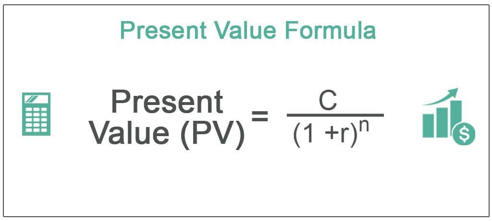

## Table of Contents

## What is present value?

Present value is a way to figure out how much money you would have now if you were going to get some money in the future. It's like looking at future money through a time machine to see what it's worth today. This is important because money today is usually worth more than the same amount of money in the future, mainly because you can use it now or invest it to earn more.

To find the present value, you need to know how much money you will get in the future and the interest rate, which shows how much money grows over time. You then use a formula to discount the future money back to today's value. This helps people and businesses make better decisions about investments, loans, and other financial choices by understanding the real value of money over time.

## Why is present value important in finance?

Present value is super important in finance because it helps people and businesses figure out if an investment or a project is worth doing. Imagine you have a choice between getting $100 today or $100 in a year. Most people would choose the money today because they could use it right away or put it in the bank to earn some interest. Present value puts a number on this idea, showing how much future money is worth right now. This helps everyone make smarter choices about where to put their money.

For example, if a company is thinking about starting a new project, they can use present value to see if the money they will make in the future from the project is worth more than what they have to spend now. If the present value of the future earnings is higher than the cost, then the project might be a good idea. This way, present value helps businesses decide which projects will make them the most money over time, and it helps people decide if loans, investments, or savings plans are good deals.

## What is the basic formula for calculating present value?

The basic formula for calculating present value is pretty simple. It's like this: Present Value = Future Value / (1 + Interest Rate)^Number of Periods. In this formula, "Future Value" is the amount of money you will get in the future, "Interest Rate" is how much money grows each period (like a year), and "Number of Periods" is how many of those periods you have to wait before you get the money.

Let's break it down with an example. If you're going to get $1,000 in 2 years and the interest rate is 5% per year, you can find out what that $1,000 is worth today. Plugging the numbers into the formula, it would look like this: Present Value = $1,000 / (1 + 0.05)^2. When you do the math, you find out that the present value is about $907.03. This means that getting $1,000 in 2 years is like having $907.03 today, if you use a 5% interest rate.

## How does the discount rate affect present value?

The discount rate is a big deal when you're figuring out present value. It's like the key that decides how much you shrink future money to see what it's worth now. If the discount rate goes up, the present value goes down. That's because a higher discount rate means you're expecting to earn more from your money over time, so future money seems less valuable today. Imagine you have a choice between getting $100 today or waiting a year to get more. If you think you can earn a lot by investing that $100 now, you'll want a bigger reward for waiting, which means the present value of the future money drops.

On the flip side, if the discount rate is low, the present value goes up. A lower discount rate means you're not expecting to earn as much from your money over time, so future money doesn't lose as much value when you bring it back to today. For example, if the discount rate is really low, getting $100 in a year might be almost as good as getting it now, because you're not missing out on big earnings by waiting. This is why the discount rate is so important—it helps you decide how much future money is really worth to you today.

## Can you explain the concept of time value of money in relation to present value?

The time value of money is a simple idea that says money today is worth more than the same amount of money in the future. This is because you can use money today to buy things, pay bills, or invest it to make more money. If you have $100 today, you could put it in the bank and earn some interest, so by next year, you might have more than $100. That's why people usually want money now instead of later.

Present value ties into the time value of money by helping you figure out how much future money is worth today. It uses a formula to "discount" future money back to the present, showing you what it's really worth now. For example, if someone promises to give you $100 in a year, present value can tell you that this $100 in the future is worth less than $100 today, because you could be earning interest on the money if you had it now. By understanding present value, you can make better choices about whether to take money now or wait for it later, based on what it's really worth to you today.

## What are some common applications of present value in business and personal finance?

In business, present value is often used to make big decisions about investments and projects. Companies use it to figure out if a project they're thinking about is worth the money they need to spend on it. They look at all the money the project might make in the future and use present value to see what that money is worth right now. If the present value of the future earnings is more than the cost of the project, then it might be a good idea to go ahead with it. This helps businesses choose projects that will make them the most money over time. For example, if a company is deciding whether to buy new equipment, they'll use present value to see if the money they'll save or earn from the equipment is worth more than what they have to spend on it.

In personal finance, present value helps people make smart choices about loans, savings, and investments. When you're thinking about taking out a loan, you can use present value to see if the money you'll get now is worth more than the money you'll have to pay back later, including interest. For savings and investments, present value can show you what your future earnings are worth today, helping you decide if it's a good deal. For instance, if you're looking at a savings plan that promises to give you a certain amount in the future, you can use present value to see if that future money is worth putting your money into the plan now. This way, present value helps people understand the real value of money over time and make better financial decisions.

## How do you calculate present value for a single cash flow?

To calculate the present value for a single cash flow, you need to know three things: the amount of money you'll get in the future (Future Value), the interest rate, and how long you have to wait to get that money (Number of Periods). The formula to use is: Present Value = Future Value / (1 + Interest Rate)^Number of Periods. Let's say you're going to get $1,000 in 2 years and the interest rate is 5% per year. You plug those numbers into the formula like this: Present Value = $1,000 / (1 + 0.05)^2. When you do the math, you find out that the present value is about $907.03. This means that getting $1,000 in 2 years is like having $907.03 today, if you use a 5% interest rate.

The interest rate, or discount rate, is really important in this calculation. If the interest rate goes up, the present value goes down. That's because a higher interest rate means you could earn more money if you had the cash today, so future money becomes less valuable. On the other hand, if the interest rate is low, the present value goes up because you're not missing out on as much by waiting for the money. Understanding how to calculate present value helps you make better choices about money, whether you're deciding on a loan, an investment, or a savings plan.

## How is present value calculated for an annuity?

Calculating the present value for an annuity is a bit different from a single cash flow because an annuity is a series of equal payments made at regular intervals. To find the present value of an annuity, you need to know the amount of each payment, the interest rate, and the number of periods over which the payments are made. The formula for the present value of an annuity is: Present Value = Payment Amount x [(1 - (1 / (1 + Interest Rate)^Number of Periods)) / Interest Rate]. This formula takes into account that each payment happens at a different time and discounts each one back to today's value.

Let's say you're going to get $100 every year for 5 years, and the interest rate is 5% per year. You would plug those numbers into the formula like this: Present Value = $100 x [(1 - (1 / (1 + 0.05)^5)) / 0.05]. When you do the math, you find out that the present value is about $432.95. This means that getting $100 every year for 5 years is like having $432.95 today, if you use a 5% interest rate. Understanding how to calculate the present value of an annuity helps you figure out if a series of future payments is worth more or less than a lump sum of money today.

## What is the difference between present value and net present value?

Present value is a way to figure out what money you'll get in the future is worth today. It's like looking at future money through a time machine to see its value now. You use a formula that takes into account the amount of money, the interest rate, and how long you have to wait for the money. For example, if someone promises to give you $100 in a year, present value helps you see how much that $100 is worth to you right now.

Net present value, or NPV, is a bit different because it looks at the whole picture of an investment or project. It's not just about one future payment but all the money coming in and going out over time. To find the net present value, you calculate the present value of all the future cash flows and then subtract the cost of the investment. If the net present value is positive, it means the investment is expected to make more money than it costs, which is a good sign. If it's negative, the investment might not be worth it. So, while present value focuses on the worth of future money today, net present value helps you decide if an investment is a smart choice by considering all the money involved.

## How do you adjust the present value formula for continuous compounding?

When you want to figure out the present value with continuous compounding, you use a different formula than the one for regular compounding. Continuous compounding means money grows all the time, not just at certain points like yearly or monthly. The formula for present value with continuous compounding is: Present Value = Future Value / e^(Interest Rate x Number of Periods). Here, "e" is a special number, about 2.71828, and you use it instead of (1 + Interest Rate) in the regular formula.

Let's say you're going to get $1,000 in 2 years and the interest rate is 5% per year with continuous compounding. You would plug those numbers into the formula like this: Present Value = $1,000 / e^(0.05 x 2). When you do the math, you find out that the present value is about $904.84. This means that getting $1,000 in 2 years with continuous compounding is like having $904.84 today, if you use a 5% interest rate.

## What are the limitations and assumptions when using the present value formula?

When using the present value formula, there are some important things to keep in mind. One big assumption is that the interest rate, or discount rate, stays the same over time. But in real life, interest rates can change, which can make the present value calculation less accurate. Another assumption is that the money you're going to get in the future is certain to happen. But life is full of surprises, and sometimes those future payments don't come through as expected. This means the present value might not be as reliable if there's a lot of risk or uncertainty involved.

Another limitation is that the present value formula doesn't take into account things like inflation, taxes, or other costs that can affect the value of money over time. Inflation makes money worth less in the future, so if you don't adjust for it, your present value might be too high. Taxes and other costs can also eat into the money you're expecting to get, making the present value less accurate. Understanding these limitations and assumptions can help you use the present value formula more wisely and make better financial decisions.

## How can present value be used in investment decision-making and valuation models?

Present value is a super helpful tool when you're deciding where to put your money or figuring out how much something is worth. Imagine you're thinking about buying a new business or investing in a project. You want to know if it's going to be worth the money you spend. That's where present value comes in. It helps you see what all the money you might make in the future from the investment is worth right now. If the present value of all that future money is more than what you have to spend today, then the investment might be a good idea. This way, present value helps you compare different investments and pick the ones that will make you the most money over time.

In valuation models, present value is used to figure out how much a company or an asset is worth. People who value businesses look at all the money the company is expected to make in the future and use present value to see what that money is worth today. This gives them a number that shows the company's value right now. It's like putting a price tag on the future earnings of the business. By using present value in these models, you can make better decisions about buying or selling a business, or even deciding how much to pay for stocks or other investments. This helps everyone from big investors to small business owners make smarter choices about where to put their money.

## What is Understanding Present Value?

Present value is a fundamental concept in finance that quantifies the current worth of a future sum of money or a series of cash flows, given a specified rate of return. Central to this concept is the time value of money, which posits that a given amount of money today holds greater value than the same sum in the future due to its potential [earning](/wiki/earning-announcement) capacity. This principle underpins many financial decisions, enabling investors and financial analysts to assess the worthiness of different investment opportunities.

The calculation of present value involves a process known as discounting, where future cash flows are adjusted to reflect their current value. This adjustment is necessary because the future receipt of cash is inherently less valuable than immediate access to the same amount, primarily due to inflation, risk, and opportunity costs associated with foregone interest or investment returns.

The present value is determined using a formula that incorporates key factors such as the discount rate, which is the rate of return that could be earned on an investment in the financial market with similar risk, and the number of periods until the cash flow is received. The present value formula is expressed as:

$$
PV = \frac{FV}{(1 + r)^n}
$$

Here, PV stands for present value, FV for future value, $r$ is the discount rate, and $n$ is the number of periods. This formula encapsulates the essence of discounting, allowing investors to translate future financial benefits into their present-day equivalents.

The choice of discount rate significantly influences the present value calculation. A higher discount rate reduces the present value of future cash flows, reflecting the increased opportunity cost of capital and the higher risk associated with the investment. Similarly, the span of time $n$ until the cash flow is realized affects the calculation; the further in the future a cash flow is expected, the lower its present value will be.

Understanding and calculating present value allows investors to objectively evaluate and compare various investment prospects, helping determine the most attractive options based on current valuations. This methodology is crucial in financial planning, acquisition analysis, and capital budgeting, providing a robust framework for making informed investment decisions.

## What is the Present Value Formula and how is it calculated?

The present value (PV) formula is a fundamental concept in finance, central to evaluating the value of future cash flows by accounting for the time value of money. The formula is represented as:

$$
PV = \frac{FV}{(1 + r)^n}
$$

Where:
- $PV$ denotes the present value.
- $FV$ stands for the future value of the cash flow.
- $r$ is the rate of return or discount rate.
- $n$ represents the number of periods.

This calculation plays a crucial role in financial decision-making. It helps investors and analysts assess the current worth of investments, facilitating informed choices concerning acquisitions, mergers, and other financial projects. By discounting the future value, investors can make apples-to-apples comparisons between different investment opportunities, accounting for variables like inflation, risk, and opportunity cost.

**Practical Examples**

Let's consider a basic example to illustrate the utility of the present value formula:

If an investor expects to receive $10,000 five years from now and the annual discount rate is 5%, the present value calculation will determine how much that future sum is worth today.

Using the formula:

$$
PV = \frac{10,000}{(1 + 0.05)^5}
$$

Calculate:

$$
PV = \frac{10,000}{(1.27628)} \approx 7,835.26
$$

This calculation signifies that receiving $10,000 in five years is equivalent to receiving approximately $7,835.26 today, given a 5% discount rate.

**Code Example**

For those familiar with programming, implementing this formula can be efficiently done using Python:

```python
def present_value(future_value, rate, periods):
    return future_value / (1 + rate) ** periods

# Example calculation
fv = 10000  # Future Value
r = 0.05    # Discount Rate
n = 5       # Number of Periods

pv = present_value(fv, r, n)
print(f"Present Value: ${pv:.2f}")
```

Running this script yields the present value as $7,835.26, corroborating the manual calculation.

In summary, the present value formula serves as a pivotal tool for financial analysis, enabling the valuation of future cash flows in today's terms. This approach aids investors in making strategic decisions that align with their financial goals, considering both risk and potential return.

## What is the role of present value in investment calculations?

Present value is fundamental to various investment calculations, notably in net present value (NPV) and discounted cash flow (DCF) analysis. Both approaches employ present value principles to evaluate investment prospects with an aim to optimize returns relative to risks.

Net present value (NPV) is a calculation that helps investors assess the profitability of an investment by determining the difference between the present value of cash inflows and the present value of cash outflows over a given time period. The formula for NPV is:

$$

NPV = \sum \left( \frac{C_t}{(1 + r)^t} \right) - C_0 
$$

Where:
- $C_t$ is the cash flow at time $t$,
- $r$ is the discount rate,
- and $C_0$ is the initial investment cost.

A positive NPV indicates that the projected earnings (adjusted for time and risk) exceed the anticipated costs, suggesting a potentially profitable investment.

Discounted cash flow (DCF) analysis, on the other hand, is used to estimate an investment's fair value by calculating the present value of expected future cash flows. This method allows investors to determine whether an investment is overvalued or undervalued based on its intrinsic worth. The DCF formula is similar to the NPV calculation:

$$

DCF = \sum \left( \frac{C_t}{(1 + r)^t} \right) 
$$

DCF analysis accounts for varying cash flows over time and the impact of both time and risk on the value of money, providing a holistic view of an investment's potential.

Both NPV and DCF rely heavily on the accuracy of the assumed discount rate, which should reflect the investment's risk profile and the cost of capital. By incorporating present value into these methodologies, investors are equipped to make strategic decisions, selecting projects and investments that are likely to offer the highest returns relative to their risk levels. 

These methods underscore the significance of present value in crafting robust investment strategies, ensuring that capital allocation is both efficient and effective in current and future market conditions.

## What are the benefits and limitations?

The application of the present value (PV) concept in financial calculations provides clarity and precision in estimating the worth of future cash flows. This accuracy is instrumental for investors and financial analysts when assessing investment opportunities and determining the value of financial instruments. Present value calculations enable decision-makers to consider the time value of money, effectively translating future cash flows into their current equivalents. This aspect allows for a more informed evaluation of investment prospects, enhancing the ability to make strategic financial decisions.

However, the present value method is not without its challenges. A significant limitation is its reliance on the accuracy of the discount rate used in calculations. The discount rate, which reflects the expected rate of return, plays a crucial role in determining the present value of future cash flows. Any errors in estimating this rate can lead to significant deviations, impacting the reliability of the present value assessment. Additionally, assumptions regarding future returns are often based on market conditions and economic forecasts, which are inherently uncertain. This uncertainty introduces risk into the valuation process, potentially affecting the validity of investment decisions.

Despite these limitations, present value remains a robust tool in finance. Its ability to provide insights into the potential profitability of investments and to guide strategic decision-making is highly valued among investors and financial professionals. By offering a systematic approach to evaluating future cash flows relative to current market conditions, present value calculations help navigate the complexities of investment analysis and portfolio management.

In practice, the formula used to calculate present value is: 

$$
PV = \frac{FV}{(1 + r)^n}
$$

Where $PV$ is the present value, $FV$ is the future value, $r$ is the discount rate, and $n$ represents the number of periods. This formula encapsulates the essence of the time value of money, facilitating calculations that consider both the duration and rate of return associated with future cash inflows. By incorporating these elements, present value analysis becomes a critical component of comprehensive financial evaluations, ensuring that investors are better equipped to maximize returns while managing risk effectively.

## References & Further Reading

[1]: ["Principles of Corporate Finance"](https://www.amazon.com/Principles-Corporate-Finance-Richard-Brealey/dp/1260013901) by Richard A. Brealey, Stewart C. Myers, and Franklin Allen

[2]: ["Financial Modeling"](https://www.investopedia.com/terms/f/financialmodeling.asp) by Simon Benninga

[3]: ["Algorithmic Trading and DMA: An introduction to direct access trading strategies"](https://archive.org/details/algorithmictradi0000john) by Barry Johnson

[4]: ["Valuation: Measuring and Managing the Value of Companies"](https://www.amazon.com/Valuation-Measuring-Managing-Companies-Finance/dp/1119610885) by McKinsey & Company Inc.

[5]: ["Investment Science"](https://www.amazon.com/Investment-Science-David-G-Luenberger/dp/0199740089) by David G. Luenberger