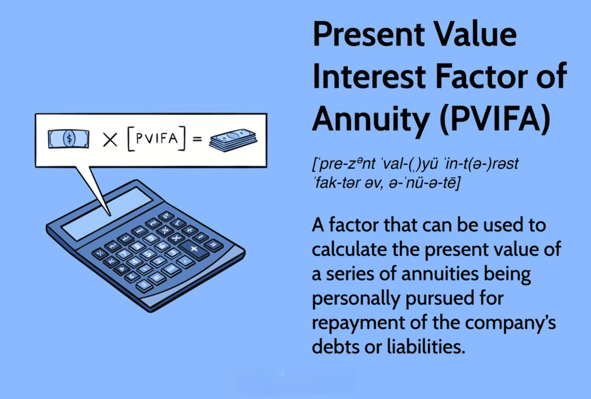

In today's dynamic financial environment, grasping the concept of the present value interest factor (PVIF) is essential for gaining a competitive advantage in algorithmic trading. PVIF is a pivotal financial concept that determines the current value of a future sum of money, accounting for the time value of money. This principle is crucial as it emphasizes that a dollar today is more valuable than a dollar in the future due to its potential earning capacity.

The significance of PVIF in algorithmic trading cannot be overstated. By enabling traders to estimate the present worth of future cash flows, PVIF empowers them to make informed investment decisions. Algorithmic trading, which relies heavily on quantitative data and financial models, benefits greatly from the precision and efficiency that PVIF calculations provide.



Furthermore, understanding PVIF is vital for evaluating the viability of investments in both the cryptocurrency and stock markets. With fluctuating interest rates and market volatility, PVIF serves as a reliable metric for assessing future returns and risks. This article will explore how PVIF is utilized in algorithmic trading, providing insights into its fundamental calculations, applications, and the role of interest factors in various financial markets. By mastering PVIF, traders can enhance their strategic approaches, ultimately optimizing returns and managing risks effectively.

## Table of Contents

## Understanding Present Value Interest Factor (PVIF)

The Present Value Interest Factor (PVIF) is a crucial financial formula that helps in determining the present value of a future amount of money. This concept is foundational to the time value of money, a financial principle stating that a dollar today holds more value than a dollar in the future due to its potential to earn returns. Understanding PVIF equips traders and investors with the ability to make informed decisions by quantifying the value of future cash flows in today's terms.

The formula to calculate the PVIF is expressed as:

$$
\text{PVIF} = \frac{1}{(1 + r)^t}
$$

In this equation, $r$ represents the [interest rate](/wiki/interest-rate-trading-strategies) per period, and $t$ denotes the number of periods until the future sum is received. This formula serves to discount a future sum to its present value by accounting for the compound interest effect over time.

Traders and investors utilize PVIF to accurately compare monetary values across varying timeframes and interest rates, a critical aspect for developing [algorithmic trading](/wiki/algorithmic-trading) strategies. By leveraging PVIF, traders can evaluate the present-worth of prospective investments objectively, ensuring that their decisions align with intended financial goals and market conditions. The calculation also allows for a standardized assessment framework, facilitating efficient strategy adjustments amid fluctuating market environments.

## The Role of PVIF in Algorithmic Trading

Algorithmic trading, often abbreviated as 'algo trading', is the practice of using computer algorithms to automate buy and sell decisions on financial markets. These algorithms are grounded in quantitative data, allowing traders to execute orders at speeds and frequencies impossible for human traders. A crucial aspect of these quantitative models is the incorporation of accurate financial metrics such as the Present Value Interest Factor (PVIF), which assists traders in evaluating the present worth of anticipated future cash flows.

PVIF is instrumental in algorithmic trading models because it provides a standardized approach to determining the present value of money expected in the future. By offering a method to discount future cash flows effectively, traders can make more informed and precise decisions regarding various investment opportunities. For instance, algorithmic trading strategies may use PVIF to assess the value of future stock dividends, bond coupons, or other financial derivatives to decide on the timing and magnitude of trades.

Utilizing PVIF tables further enhances the efficiency of trading algorithms. These tables allow traders to quickly determine the present value without engaging in elaborate calculations for each transaction. Suppose an algorithm predicts a future cash inflow from an asset and needs to assess its current value instantly. By employing PVIF tables, the algorithm can retrieve the relevant PVIF value based on the interest rate and time period, facilitating rapid computation of present value. This approach not only improves the speed of trading operations but also reduces the potential for errors in manual calculations, thereby optimizing trading performance.

To illustrate, consider a Python implementation where an algorithm computes the present value of an expected cash inflow using PVIF:

```python
def calculate_present_value(future_value, interest_rate, periods):
    # Calculate the Present Value Interest Factor
    pvif = 1 / (1 + interest_rate) ** periods
    # Compute the present value
    present_value = future_value * pvif
    return present_value

# Example usage:
future_cash_flow = 10000  # Future value in dollars
annual_interest_rate = 0.05  # Annual interest rate of 5%
time_periods = 5  # Number of periods in years

present_value = calculate_present_value(future_cash_flow, annual_interest_rate, time_periods)
print(f"The present value of the future cash flow is: ${present_value:.2f}")
```

In summary, incorporating PVIF into algorithmic trading strategies enables traders to navigate the complexities of financial markets with greater confidence and efficiency. The ability to swiftly compute present values aids in crafting more effective trading algorithms, ultimately enhancing decision-making processes in rapidly changing market environments.

## Calculating PVIF: A Practical Example

Consider a scenario where you expect to receive $10,000 in five years, with an annual interest rate of 5%. To determine the present value of this future sum, the Present Value Interest Factor (PVIF) formula is utilized:

$$
\text{PVIF} = \frac{1}{(1 + r)^t}
$$

where $r$ represents the interest rate (5% or 0.05), and $t$ denotes the number of periods (5 years). Plugging these values into the formula:

$$
\text{PVIF} = \frac{1}{(1 + 0.05)^5}
$$

Upon calculation, this results in a PVIF of approximately 0.7835. This indicates that receiving $10,000 in five years is financially equivalent to having about $7,835 today, when the interest is 5% annually. 

The significance of this calculation lies in its ability to inform investment decisions. By understanding the present value, investors can evaluate whether a future cash flow, when discounted back to its current value, stands up against other investment opportunities or immediate needs. Implementing these calculations aids in assessing the attractiveness of long-term investments versus immediate financial alternatives, providing a clear perspective on potential returns.

## Applications of PVIF in Markets

PVIF is an integral tool for evaluating a wide range of financial instruments, as it allows investors and traders to quantify the present value of expected future cash flows. This capability is particularly relevant in valuing annuities, bonds, and stocks, where future payments or income streams are a central consideration.

Annuities often involve a series of future payments, and calculating the present value of these cash flows provides a clear picture of the annuity's worth today. By applying the PVIF, the investor can determine whether the annuity's purchase price is reasonable compared to its potential payouts over time.

In bond valuation, PVIF assists in assessing the present value of future coupon payments and the principal repayment. Since the value of a bond is fundamentally linked to these future cash flows, PVIF calculations are critical for investors seeking to understand whether a bond's current market price aligns with its intrinsic value.

For stock markets, PVIF is used to evaluate expected future dividends, especially in dividend discount models (DDM). Investors apply PVIF to ascertain the present value of anticipated dividends, thus aiding in deciding whether a stock's current price is justified by its future income potential.

In real estate and fixed income investments, PVIF offers insights into whether the future cash flows from rental income or interest payments justify the present investment costs. This is particularly useful when considering long-term projects or investments where future cash flow estimates are crucial for making sound financial decisions.

Cryptocurrency markets, characterized by inherent [volatility](/wiki/volatility-trading-strategies), present unique challenges that make PVIF a valuable analytical tool. The fluctuating interest rates in these markets necessitate careful assessment of whether future returns sufficiently compensate for present investments. By applying PVIF, traders and investors can better gauge the impact of interest rate changes on the potential value of [cryptocurrency](/wiki/cryptocurrency) holdings, thereby enhancing their risk management and investment evaluation strategies.

## Conclusion

Mastering Present Value Interest Factor (PVIF) calculations is crucial for investors and traders seeking to make informed financial decisions by effectively acknowledging the time value of money. The concept of time value suggests that a specific amount of money today is more valuable than the same sum in the future due to its potential [earning](/wiki/earning-announcement) capacity. PVIF provides a straightforward method to calculate the present value of future cash flows, thus simplifying complex financial evaluations.

In algorithmic trading, which relies heavily on employing computer algorithms to automate trading strategies, PVIF emerges as a valuable tool. It allows traders to swiftly assess the current worth of future monetary transactions, presenting clear insights even amidst volatile and rapidly shifting market conditions. By focusing on the critical aspects of time and interest rates, PVIF ensures that decisions are not just based on current market values but also consider potential future gains.

The integration of PVIF into trading algorithms can significantly enhance strategic approaches for traders. It allows them to maximize returns while managing inherent risks effectively. By automating the PVIF calculation within an algorithm, traders can quickly evaluate different investment opportunities, ensuring that they allocate resources wisely. This automation not only facilitates more comprehensive financial assessments but also frees traders to focus on developing better strategies based on these precise evaluations. The utilization of PVIF in such contexts ensures that traders are always equipped to handle dynamic market environments with precision, making it an indispensable component of modern financial strategies.

## References & Further Reading

[1]: Bodie, Z., Kane, A., & Marcus, A. J. (2014). ["Investments."](https://www.mheducation.com/highered/product/investments-bodie-kane/M9781264412662.html) McGraw-Hill Education.

[2]: ["Discounted Cash Flow Analysis For Real Estate."](https://breakintocre.com/discounted-cash-flow-dcf-analysis-in-real-estate-explained/) Real Estate Mojo.

[3]: Fabozzi, F. J., Kolm, P. N., Pachamanova, D. A., & Focardi, S. M. (2010). ["Robust Portfolio Optimization and Management."](https://onlinelibrary.wiley.com/doi/book/10.1002/9781119202172) John Wiley & Sons.

[4]: "Present Value Interest Factor (PVIF) Definition." [Corporate Finance Institute](https://corporatefinanceinstitute.com/resources/financial-modeling/what-if-analysis/).

[5]: "Quantitative Finance Reading List." [QuantStart](https://www.quantstart.com/articles/Quantitative-Finance-Reading-List/).