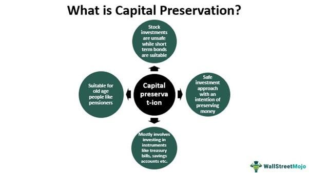

## Table of Contents

## What is the concept of preservation of capital?

Preservation of capital is a strategy in investing where the main goal is to keep the money you started with safe. Instead of trying to make a lot of money quickly, people who focus on preserving their capital want to make sure they don't lose their initial investment. This approach is often used by people who are close to retirement or those who can't afford to lose their money. They might choose investments that are less risky, like bonds or savings accounts, which usually offer smaller but more stable returns.

This strategy is important because it helps protect your money from big losses. If you lose a large part of your capital, it can be very hard to get it back. For example, if you lose 50% of your money, you would need to make a 100% return just to get back to where you started. By focusing on preserving capital, investors can avoid these big drops and keep their money safe over time. This can provide peace of mind and a stable financial future.

## Why is preservation of capital important for investors?

Preservation of capital is important for investors because it helps them keep their money safe. When you invest, there's always a chance you could lose some or all of your money. By focusing on preserving capital, investors choose safer investments that are less likely to lose value. This means they can avoid big losses and keep their initial investment intact. This is especially important for people who can't afford to lose their money, like those who are close to retirement or have limited funds.

Another reason preservation of capital is important is that it helps investors avoid the difficulty of recovering from big losses. If you lose a lot of your money, it can be really hard to get it back. For example, if you lose half of your money, you need to double what you have left just to break even. By choosing investments that focus on preserving capital, investors can avoid these big drops and keep their money stable over time. This can give them peace of mind and help them plan for a secure financial future.

## What are the basic strategies for preserving capital?

One basic strategy for preserving capital is to invest in low-risk assets. This means putting your money into things like savings accounts, certificates of deposit (CDs), and government bonds. These investments are less likely to lose value, which helps keep your money safe. For example, a savings account might not grow your money a lot, but it's very unlikely to lose money, making it a good choice for preserving capital.

Another strategy is to diversify your investments. This means spreading your money across different types of investments, like stocks, bonds, and real estate. If one investment goes down, the others might stay the same or go up, which can help protect your overall money. By not putting all your eggs in one basket, you reduce the risk of losing a big part of your capital all at once.

A third strategy is to use a conservative investment approach. This means being careful and not trying to make quick, big profits. Instead, you focus on steady, smaller gains over time. This might mean choosing funds that invest in stable companies or using strategies like dollar-cost averaging, where you invest a fixed amount of money at regular intervals. This approach helps keep your capital safe by avoiding the big swings that can come with riskier investments.

## How does inflation impact the preservation of capital?

Inflation can make it harder to preserve capital because it reduces the buying power of money over time. If you keep your money in a savings account that doesn't earn enough interest to keep up with inflation, the value of your money will go down. For example, if inflation is 3% a year and your savings account only gives you 1% interest, your money loses 2% of its value each year. This means that even though you haven't lost any money on paper, you can buy less with it as time goes on.

To fight inflation and still preserve your capital, you need to invest in things that can grow faster than inflation. This might mean choosing investments like bonds that pay more interest than the inflation rate or stocks that can grow over time. It's a balancing act because you want to keep your money safe, but you also need to make sure it's growing enough to keep up with rising prices. By understanding how inflation works and choosing the right investments, you can better protect your money's value.

## What are the common risks associated with capital preservation?

One common risk with capital preservation is that you might not earn enough money to keep up with inflation. If your money is in a savings account or a very safe investment, it might not grow fast enough. Over time, the things you want to buy will cost more because of inflation, but your money won't be worth as much. This means even though you didn't lose money, you can buy less with it.

Another risk is that you might miss out on bigger gains. If you only invest in very safe things, you might not make as much money as you could with riskier investments like stocks. While these safer investments protect your money, they might not grow it as much. This can be a problem if you need your money to grow over time, like for retirement.

Lastly, there's the risk of not being diversified enough. If you put all your money into one type of safe investment, like government bonds, and something unexpected happens to that investment, you could still lose money. Spreading your money across different types of investments can help, but it's still important to be careful and keep an eye on how all your investments are doing.

## How can diversification help in preserving capital?

Diversification helps in preserving capital by spreading your money across different types of investments. This means you're not putting all your money into one thing, like just stocks or just bonds. If one investment goes down, the others might stay the same or go up. This can help protect your overall money because you're not relying on just one thing to do well. For example, if you have money in stocks, bonds, and real estate, and the stock market goes down, your bonds and real estate might still be okay, which helps keep your money safe.

Another way diversification helps is by reducing the risk of big losses. If you only invest in one thing and it does badly, you could lose a lot of money. But if you have your money in different places, a bad performance in one area won't hurt as much because the others can help balance it out. This makes it easier to keep your money safe over time. By spreading your investments, you're giving yourself a better chance to preserve your capital and avoid big drops in value.

## What are the drawbacks of focusing solely on capital preservation?

Focusing only on keeping your money safe can mean you might not make as much money as you could. If you put all your money in very safe places like savings accounts or bonds, you might miss out on bigger gains from riskier investments like stocks. Over time, if you want your money to grow, especially for things like retirement, you might need to take some risks to get more money. So, by just trying to keep your money safe, you might end up with less money in the long run.

Another problem with focusing only on keeping your money safe is that you might not keep up with inflation. Inflation makes things cost more over time, and if your money isn't growing faster than inflation, it will be worth less. For example, if inflation is 3% a year and your savings account only gives you 1% interest, your money loses value every year. So, even though your money is safe, it won't be able to buy as much in the future. Balancing safety with some growth is important to make sure your money keeps its value over time.

## How do different asset classes affect capital preservation strategies?

Different types of investments, or asset classes, can affect how well you can keep your money safe. For example, cash and savings accounts are very safe because they don't lose value easily. They are good for keeping your money safe, but they usually don't grow much. Bonds, especially government bonds, are also pretty safe. They give you a steady income and are less likely to lose value than stocks. But, they might not grow as fast as you need to keep up with inflation.

On the other hand, stocks can grow a lot more than cash or bonds, but they are riskier. If the stock market goes down, you could lose money. So, if you want to keep your money safe, you might not want to put all your money in stocks. Real estate can also be a good way to keep your money safe because it usually goes up in value over time. But, it can be hard to turn into cash quickly if you need it. By understanding how different types of investments work, you can choose the right mix to keep your money safe while still trying to grow it a little.

## What role do interest rates play in the preservation of capital?

Interest rates play a big role in keeping your money safe. When you put your money in a savings account or buy a bond, the [interest rate](/wiki/interest-rate-trading-strategies) tells you how much extra money you'll get. If interest rates are high, you can earn more money from these safe investments. This means your money can grow even while staying safe. For example, if you have a savings account with a 3% interest rate, your money will grow a little bit every year, which helps it keep up with inflation.

But, if interest rates are low, it can be harder to keep your money safe. Low interest rates mean that safe investments like savings accounts and bonds won't give you much extra money. If the interest rate is lower than the rate of inflation, your money will lose value over time even though it's in a safe place. So, when interest rates are low, you might need to think about other ways to keep your money safe and still make it grow a little, like investing in a mix of different things.

## How can one measure the effectiveness of a capital preservation strategy?

To measure how well a capital preservation strategy is working, you can look at how much your money has grown or shrunk over time. If your goal is to keep your money safe, you want to see that you haven't lost any of it. You can check this by comparing the amount of money you started with to what you have now. If your money is the same or has grown a little, your strategy is working well. But if your money has gone down, you might need to change your approach.

Another way to measure the effectiveness is to see if your money is keeping up with inflation. Even if your money stays the same, if inflation is going up, your money can buy less over time. So, you want to make sure your investments are growing at least as fast as inflation. If they are, then your capital preservation strategy is doing a good job. If not, you might need to find investments that can grow a bit more to keep your money's value safe.

## What advanced techniques can be used to mitigate risks in capital preservation?

One advanced technique to keep your money safe is called hedging. Hedging means you use one investment to protect another. For example, if you own stocks, you can buy something called a put option. This gives you the right to sell your stocks at a certain price, even if the stock market goes down. This way, if your stocks lose value, the put option can help you not lose as much money. It's like having insurance for your investments, which can help keep your money safe.

Another technique is called asset allocation. This means you spread your money across different types of investments, like stocks, bonds, and real estate, but you do it in a smart way. You might put more money in safer investments like bonds when the stock market seems risky. Then, if the stock market goes down, your bonds can help keep your money safe. By changing where your money is based on what's happening in the market, you can lower the chance of losing a lot of money all at once. This helps you keep your money safe over time.

## How do global economic conditions influence capital preservation strategies?

Global economic conditions can really change how you keep your money safe. If the world economy is doing well, you might feel more comfortable putting some of your money into things like stocks, which can grow more but are riskier. But if the world economy is not doing well, like during a recession, you might want to keep your money in safer places like savings accounts or bonds. This is because when the economy is bad, stocks can lose a lot of value, and you want to make sure your money stays safe.

Also, things like interest rates and inflation around the world can affect how you keep your money safe. If interest rates are high in other countries, you might want to put some of your money there to get a better return. But if inflation is high in those countries, it might not be worth it because your money could lose value. By watching what's happening in the world economy, you can make better choices about where to put your money to keep it safe and maybe even help it grow a little.

## References & Further Reading

[1]: Maggioni, L., & Bergner, J. (2012). ["Liquidity Risk and Correlation Risk"](https://www.sciencedirect.com/science/article/pii/S1572308911000611) CFA Digest.

[2]: ["Quantitative Finance for Dummies"](https://www.amazon.com/Quantitative-Finance-Dummies-Steve-DPhil/dp/1118769465) by Steve Bell

[3]: Paltrinieri, A., & Juruś, P. (2018). ["Algorithmic Trading Strategies"](https://link.springer.com/article/10.1007/s10479-018-3019-4) in Grobys, K., & Kolari, J. (Eds.), *The Routledge Handbook of Financial Markets*.

[4]: Durbin, J. (2010). ["All about High-Frequency Trading"](https://www.mhebooklibrary.com/doi/book/10.1036/9780071743457) McGraw-Hill.

[5]: Fabozzi, F. J., Focardi, S. M., & Kolm, P. N. (2010). ["Quantitative Finance: A Framework for Creating Alpha"](https://www.amazon.com/Quantitative-Equity-Investing-Techniques-Strategies/dp/0470262478) Wiley.