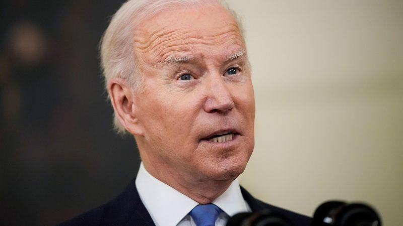

## Table of Contents

## Who is Joe Biden?

Joe Biden is the President of the United States. He was born on November 20, 1942, in Scranton, Pennsylvania. Before becoming President, he served as the Vice President under President Barack Obama from 2009 to 2017. He has been involved in politics for a long time and was a Senator for many years before becoming Vice President.

As President, Joe Biden focuses on issues like climate change, healthcare, and the economy. He wants to make sure everyone has access to good healthcare and that the country moves towards using more clean energy. He also works on creating jobs and helping the country recover from the effects of the COVID-19 pandemic.

## When did Joe Biden become President of the United States?

Joe Biden became the President of the United States on January 20, 2021. This was the day he was sworn into office during the inauguration ceremony in Washington, D.C. He took the oath of office and officially started his term as the 46th President of the United States.

Before becoming President, Joe Biden had a long career in politics. He was a Senator for many years and then served as Vice President under President Barack Obama. His experience in these roles helped him when he decided to run for President. On election day, November 3, 2020, he won the election and prepared to take over as President a few months later.

## What were Joe Biden's main campaign promises?

Joe Biden made several important promises during his campaign to become President. One of his main goals was to fight climate change. He wanted to make the United States use more clean energy and less fossil fuels. He also promised to create jobs, especially in the clean energy industry. Another big promise was to improve healthcare. He wanted to make sure everyone could get good healthcare, no matter how much money they had. He also talked about making healthcare more affordable for everyone.

Another key promise was to help the country recover from the effects of the COVID-19 pandemic. He wanted to make sure people could get vaccines and that the economy would get better. Biden also focused on education, promising to make college more affordable and to help students with their loans. He talked about fixing the immigration system and making it fairer. He also wanted to work on racial justice and equality, promising to fight against discrimination and to support communities that have been treated unfairly.

Overall, Joe Biden's campaign was about bringing people together and making life better for everyone. He wanted to focus on big issues like the environment, healthcare, the economy, and social justice. His promises were meant to help the country move forward and to make sure everyone had a chance to succeed.

## What are the key policies implemented during Joe Biden's presidency?

During Joe Biden's presidency, he has worked on many important policies to help the country. One of his main focuses has been fighting climate change. He passed a big law called the Inflation Reduction Act, which helps the United States use more clean energy and less fossil fuels. This law also helps create jobs in the clean energy industry. Another big policy was the American Rescue Plan, which helped the country recover from the COVID-19 pandemic. It gave money to people who needed it and helped businesses stay open. Biden also worked on making healthcare more affordable and accessible, especially for people who couldn't afford it before.

Another important area for Biden has been the economy. He wants to make sure everyone has a good job and can support their families. He passed the Infrastructure Investment and Jobs Act, which is about fixing roads, bridges, and other important things that help the economy grow. This law also creates jobs for people who build and repair these things. Biden also focused on education, making college more affordable and helping students with their loans. He has tried to make the tax system fairer, so that rich people pay more and everyone has a chance to succeed.

Lastly, Biden has worked on social issues like racial justice and immigration. He wants to make sure everyone is treated fairly, no matter their race or where they come from. He has tried to fix the immigration system to make it more fair and to help people who want to come to the United States. Biden also passed laws to help veterans and to support communities that have been treated unfairly in the past. His goal is to bring people together and make life better for everyone in the country.

## How has Joe Biden's administration handled the COVID-19 pandemic?

Joe Biden's administration has worked hard to handle the COVID-19 pandemic. One of the first things they did was to make sure everyone could get a vaccine. They set up vaccination centers all over the country and worked with states to make it easy for people to get their shots. They also made sure that vaccines were free for everyone, so money wouldn't stop people from getting protected. The administration also focused on giving out masks and other supplies to help people stay safe.

Another big part of their plan was to help the economy recover from the effects of the pandemic. They passed the American Rescue Plan, which gave money to people who lost their jobs and helped businesses stay open. This plan also helped schools reopen safely and made sure that people could get the healthcare they needed. The administration worked to keep people informed about the virus and how to stay safe, using clear and simple messages to reach everyone.

Overall, Joe Biden's administration tried to bring the country together to fight the virus. They worked with scientists and experts to make the best decisions and kept updating their plans as they learned more about the virus. Their goal was to save lives, help the economy, and make sure everyone had the support they needed during a very tough time.

## What significant legislation has been passed under Joe Biden's presidency?

Joe Biden's presidency has seen the passage of several important laws. One of the most significant is the American Rescue Plan, which was passed early in his term. This law helped the country recover from the COVID-19 pandemic by giving money to people who lost their jobs and helping businesses stay open. It also made sure schools could reopen safely and that people could get the healthcare they needed. The American Rescue Plan was a big step in helping the economy get back on track and supporting people during a tough time.

Another key piece of legislation is the Infrastructure Investment and Jobs Act. This law is about fixing roads, bridges, and other important things that help the country run smoothly. It also creates jobs for people who build and repair these things, which is good for the economy. The Infrastructure Act shows Biden's focus on making sure the country's basic needs are met and that everyone can benefit from a stronger economy.

Lastly, the Inflation Reduction Act is a major law that focuses on fighting climate change and making healthcare more affordable. It helps the United States use more clean energy and less fossil fuels, which is good for the environment. The law also helps create jobs in the clean energy industry and makes sure that people can get the healthcare they need without spending too much money. These laws show Biden's commitment to helping the country move forward and making life better for everyone.

## How has Joe Biden's foreign policy differed from his predecessor?

Joe Biden's foreign policy is different from his predecessor, Donald Trump, in many ways. Biden focuses on working with other countries and being part of international groups. He believes in talking and working together to solve problems. For example, he rejoined the Paris Climate Agreement, which is about fighting climate change with other countries. He also worked to make the relationship with allies like Europe and Asia stronger. Trump, on the other hand, often used a more aggressive approach and sometimes pulled out of international agreements, like the Paris Agreement.

Another big difference is how Biden handles conflicts and issues around the world. Biden wants to use diplomacy, which means talking and negotiating, to solve problems. He has tried to restart talks with Iran about their nuclear program and has worked on ending the war in Afghanistan. Trump, however, often used military action and threats to deal with these issues. Biden also focuses on human rights and democracy, trying to support these values in other countries. Trump's approach was more about putting America first and sometimes ignoring human rights concerns.

## What economic initiatives has Joe Biden introduced?

Joe Biden has introduced several economic initiatives to help the country grow and make life better for everyone. One of his big plans is the American Rescue Plan, which helped people and businesses during the COVID-19 pandemic. This plan gave money to people who lost their jobs and helped businesses stay open. It also made sure schools could reopen safely and that people could get the healthcare they needed. The American Rescue Plan was important because it helped the economy get back on track and supported people during a tough time.

Another important initiative is the Infrastructure Investment and Jobs Act. This law is about fixing roads, bridges, and other important things that help the country run smoothly. It also creates jobs for people who build and repair these things, which is good for the economy. The Infrastructure Act shows Biden's focus on making sure the country's basic needs are met and that everyone can benefit from a stronger economy. By investing in infrastructure, Biden wants to make sure the country is ready for the future and that everyone has a chance to succeed.

## How has Joe Biden's administration addressed climate change?

Joe Biden's administration has worked hard to fight climate change. One of the big things they did was pass the Inflation Reduction Act. This law helps the United States use more clean energy and less fossil fuels. It also helps create jobs in the clean energy industry. By doing this, Biden wants to make the air and water cleaner and help the planet. He also rejoined the Paris Climate Agreement, which is about working with other countries to stop climate change. This shows that Biden believes in working together to solve big problems.

Another way Biden's administration has addressed climate change is by making sure that people can get help to make their homes and businesses more energy-efficient. They have programs that give money to people who want to use less energy and save money on their bills. This is good for the environment and good for people's wallets. Biden also wants to make sure that everyone, no matter where they live, can benefit from these changes. He believes that fighting climate change is important for everyone's future.

## What challenges has Joe Biden faced during his presidency?

Joe Biden has faced many challenges during his time as President. One big challenge was dealing with the COVID-19 pandemic. When he became President, the virus was still a big problem. He had to make sure people could get vaccines and that the economy could recover. It was hard because people had different opinions about how to handle the virus. Some people didn't want to get vaccinated, and it was tough to get everyone to agree on what to do.

Another challenge was working with Congress to pass laws. Biden wanted to pass big plans to help the country, but it was hard to get everyone in Congress to agree. Sometimes, his plans got changed or didn't pass at all. This made it difficult to do everything he wanted to do. He also faced challenges with foreign policy, like dealing with Russia and China. These countries have different goals, and it's hard to work with them. Biden had to be careful to keep the country safe while trying to solve problems around the world.

## How has public opinion on Joe Biden's presidency evolved over time?

When Joe Biden first became President, many people were hopeful. They liked his plans to fight climate change, help the economy, and make healthcare better. A lot of people were happy that he wanted to bring the country together and work with other countries. At the beginning, his approval ratings were pretty good. People thought he was doing a good job handling the COVID-19 pandemic and getting vaccines to everyone.

Over time, public opinion on Joe Biden's presidency has changed. Some people started to feel that he wasn't moving fast enough on big issues like climate change and healthcare. Others were unhappy with how he handled things like the economy and foreign policy. His approval ratings went up and down as people saw different things happening. Some people still support him a lot, but others have become more critical. Overall, public opinion on Joe Biden's presidency is mixed, with different groups of people feeling different ways about what he's done.

## What are the long-term goals and visions of Joe Biden's administration?

Joe Biden's administration has big plans for the future. They want to fight climate change by using more clean energy and less fossil fuels. This means making the air and water cleaner and creating jobs in the clean energy industry. Biden also wants to make healthcare better and more affordable for everyone. He believes that everyone should be able to get the care they need without spending too much money. Another big goal is to help the economy grow and make sure everyone has a good job. By fixing roads, bridges, and other important things, Biden wants to make the country stronger and ready for the future.

Biden's vision also includes bringing people together and making sure everyone is treated fairly. He wants to work on racial justice and equality, making sure that no one is discriminated against because of their race or where they come from. He also wants to fix the immigration system to make it more fair and help people who want to come to the United States. Education is another important part of his plan. Biden wants to make college more affordable and help students with their loans. His long-term goal is to make life better for everyone in the country and to make sure that everyone has a chance to succeed.

## References & Further Reading

[1]: Bergstra, J., Bardenet, R., Bengio, Y., & Kégl, B. (2011). ["Algorithms for Hyper-Parameter Optimization."](https://dl.acm.org/doi/10.5555/2986459.2986743) Advances in Neural Information Processing Systems 24.

[2]: ["Advances in Financial Machine Learning"](https://www.amazon.com/Advances-Financial-Machine-Learning-Marcos/dp/1119482089) by Marcos Lopez de Prado

[3]: ["Evidence-Based Technical Analysis: Applying the Scientific Method and Statistical Inference to Trading Signals"](https://www.amazon.com/Evidence-Based-Technical-Analysis-Scientific-Statistical/dp/0470008741) by David Aronson

[4]: ["Machine Learning for Algorithmic Trading"](https://github.com/PacktPublishing/Machine-Learning-for-Algorithmic-Trading-Second-Edition) by Stefan Jansen

[5]: ["Quantitative Trading: How to Build Your Own Algorithmic Trading Business"](https://books.google.com/books/about/Quantitative_Trading.html?id=j70yEAAAQBAJ) by Ernest P. Chan