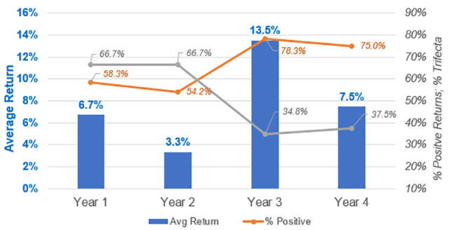

## Table of Contents

## What is a presidential election cycle?

A presidential election cycle is the period of time between one presidential election and the next. In the United States, this cycle happens every four years. During this time, people get ready for the election by choosing candidates, campaigning, and voting. The cycle includes many steps, like primary elections and debates, which help decide who will be the next president.

The cycle starts with people announcing they want to run for president. Then, they go through a process called primaries and caucuses, where voters in each state choose their favorite candidate. After that, the candidates who do well in the primaries go to a big meeting called the national convention. At the convention, the party officially picks its candidate. After the convention, there is a lot of campaigning until the final election day in November, when everyone votes for the president.

## How often do presidential elections occur?

Presidential elections happen every four years. This means that people vote for a new president or to keep the current one every four years.

The cycle starts right after one election ends. It includes a lot of steps like choosing candidates, campaigning, and voting. The whole process takes four years to complete before the next election happens.

## What are the key stages of a presidential election cycle?

A presidential election cycle starts right after the last election ends. It begins with people saying they want to run for president. These people are called candidates. They start campaigning to let people know about them and their ideas. This part of the cycle can last for a while as more and more people decide to run. Then, there are primary elections and caucuses. These are like smaller elections where people in each state vote for their favorite candidate from their political party. The candidates who do well in these primaries move on to the next stage.

The next big step is the national convention. This is where each political party officially picks their candidate for president. It's a big meeting where the party members come together and decide. After the convention, the chosen candidates start campaigning even harder. They travel around the country, talk to people, and try to get more votes. This campaigning goes on until the final election day in November. On that day, everyone votes, and the votes are counted to see who will be the next president. The whole cycle takes about four years from start to finish.

## What is the role of primary elections in the presidential cycle?

Primary elections are a big part of the presidential election cycle. They happen before the big final election. In primaries, people from each state vote for their favorite candidate from their political party. This helps the party figure out who is the most popular. The candidates who do well in these primaries get more support and move closer to becoming the party's official choice for president.

The primaries are important because they give voters a say in who will represent their party. They help narrow down the list of candidates. After the primaries, the top candidates go to a big meeting called the national convention. At the convention, the party officially picks their candidate based on how well they did in the primaries. So, primaries are a key step in deciding who will run for president in the final election.

## How does the Electoral College function in presidential elections?

The Electoral College is a special group of people who help choose the president of the United States. When people vote in the presidential election, they are actually voting for these electors, who are chosen by the political parties. Each state has a certain number of electors, which is based on how many senators and representatives the state has in Congress. For example, a state with more people will have more electors. After the people vote, the electors from the winning party in each state meet to cast their votes for president.

The total number of electors is 538, and a candidate needs at least 270 votes to win the election. Usually, the candidate who gets the most votes in a state wins all of that state's electoral votes. This is called the "winner-takes-all" system, but a few states split their votes differently. Sometimes, the person who gets the most votes from the people doesn't win the Electoral College, and this can lead to the president being someone different from who most people voted for. After the electors vote, their votes are sent to Congress, where they are counted, and the winner is announced.

## What are the differences between a caucus and a primary?

A caucus and a primary are both ways for people to choose their favorite candidate in a presidential election, but they work differently. In a primary, people go to a polling place and vote privately, just like in a regular election. They pick their candidate by filling out a ballot. Primaries can be open, where anyone can vote, or closed, where only people from a certain party can vote. This makes primaries a bit like a mini-election.

A caucus is more like a big meeting. People gather in a public place, like a school or a community center, and they talk about the candidates. They might even try to convince others to support their favorite. Then, they show their support by standing in different parts of the room or by writing down their choice. Caucuses can take a long time because of all the talking and organizing. They are usually run by the political parties, and only party members can take part. So, while primaries are more like voting, caucuses are more like a group discussion and decision.

## How do political parties influence the presidential election cycle?

Political parties play a big role in the presidential election cycle. They help choose who will run for president. First, they pick people who want to be candidates. These candidates then go through primary elections or caucuses, which the parties organize. The parties make the rules for these events and decide who can take part. After the primaries and caucuses, the parties hold big meetings called national conventions. At these conventions, the parties officially pick their candidate for president. So, the parties are in charge of the whole process of choosing who will represent them in the big election.

Once the parties have their candidates, they help them campaign. They give money, make ads, and organize events to help their candidate win. The parties also have a lot of supporters who work hard to get people to vote for their candidate. They talk to people, knock on doors, and use social media to spread their message. The parties also help their candidate get ready for debates and other important events. So, from start to finish, political parties are a big part of the presidential election cycle. They help decide who runs and do a lot to help them win.

## What impact do debates have on the presidential election cycle?

Debates are really important in the presidential election cycle. They give the candidates a chance to talk to a lot of people at once. During debates, candidates answer questions about what they believe and what they want to do if they become president. This helps voters learn more about the candidates and decide who they want to vote for. Debates also let candidates show how they think on their feet and how well they can explain their ideas. This can make a big difference in how people see them.

Debates can also change how the election is going. If a candidate does really well in a debate, more people might start supporting them. On the other hand, if a candidate does poorly, they might lose support. Debates get a lot of attention from the media, so what happens in them can be talked about for a long time. This can affect how people feel about the candidates and even change the results of the election. So, debates are a key part of the election cycle because they help voters make up their minds.

## How are campaign strategies developed and executed during the election cycle?

Campaign strategies during the presidential election cycle are carefully planned and carried out to help candidates win votes. The process starts early, often right after the last election ends. Campaign teams, made up of experts in areas like advertising, polling, and public relations, work together to figure out the best way to reach voters. They look at data about what people care about, what issues are important, and how different groups of people might vote. Based on this information, they create a plan that includes things like where the candidate should go, what they should say, and how to use TV, radio, and social media to get their message out.

Once the strategy is set, the campaign team starts to put it into action. They organize events like rallies and town halls where the candidate can meet voters face-to-face. They also make ads that show up on TV, online, and on the radio. These ads are designed to make the candidate look good and to explain their ideas in a way that people will understand and support. The team keeps track of how well the strategy is working by looking at polls and other feedback. If something isn't working, they might change their plan. The goal is to keep the candidate in the public eye and to convince as many people as possible to vote for them.

## What role does media play in shaping public opinion during presidential elections?

Media plays a big role in shaping what people think during presidential elections. It does this by showing news, ads, and stories about the candidates. TV, radio, newspapers, and the internet all help spread information. When the media talks about a candidate a lot, it can make people think that candidate is important. If the media shows a candidate doing well or saying smart things, more people might start to like them. On the other hand, if the media shows a candidate making mistakes or saying something bad, it can make people like them less.

The media also helps people learn about the issues that matter in the election. They do this by having debates, interviews, and news stories. When people see these, they can learn more about what the candidates believe and what they want to do if they win. This can help people decide who to vote for. The media can also make some issues seem more important than others by talking about them a lot. So, the media has a lot of power to shape what people think and feel about the election.

## How do voter turnout and demographics affect election outcomes?

Voter turnout and demographics play a big role in deciding who wins a presidential election. Voter turnout means how many people actually go out and vote. If a lot of people vote, it can make a big difference in the results. For example, if one group of people, like young people or people from a certain area, vote a lot more than usual, it can change who wins. This is because different groups of people often support different candidates. So, if more people from one group vote, their favorite candidate might get more votes and win.

Demographics are also important. Demographics are things like age, race, where people live, and how much money they make. Different groups of people often have different ideas about what's important and who they want to vote for. For example, older people might care about different things than younger people. People in cities might have different views than people in the countryside. When a candidate does well with certain groups, like getting a lot of votes from women or from people of a certain race, it can help them win. So, understanding who is voting and what they care about can really affect the outcome of an election.

## What are some historical trends and anomalies in presidential election cycles?

Over the years, presidential election cycles in the United States have shown some clear trends and some surprising anomalies. One big trend is that the economy often plays a big role in who wins. If the economy is doing well, the president's party usually has a better chance of winning again. Another trend is that voter turnout can change a lot from one election to another. Sometimes, more people vote when there's a lot of excitement about the candidates or big issues. Also, certain groups, like women or young people, might vote more in some elections than others, which can affect the results.

There have been some surprising anomalies too. One big one is when a candidate wins the popular vote but loses the election because of the Electoral College. This happened in 2000 with Al Gore and in 2016 with Hillary Clinton. Another anomaly is when a third-party candidate gets a lot of votes. This can split the vote and change who wins, like when Ross Perot ran in 1992. Sometimes, big events like wars or economic crises can also change how people vote in ways that are hard to predict. These trends and anomalies show how complex and interesting presidential election cycles can be.

## References & Further Reading

[1]: Hirsch, Y. ["Stock Trader's Almanac"](https://www.stocktradersalmanac.com/). A comprehensive guide with historical data and cyclical patterns of the stock market.

[2]: Allvine, F. C., & O'Neill, D. E. (1980). ["Stock Market Returns and the Presidential Election Cycle: Implications for Market Efficiency."](https://www.jstor.org/stable/4478384) Financial Analysts Journal, 36(5), 49-56.

[3]: Gartner, M. (1994). ["The Presidential Election and Stock Market Behavior: The Economists' Election Cycles."](https://www.investopedia.com/terms/p/presidentialelectioncycle.asp) Public Choice, 79(1/2), 111-115.

[4]: Niederhoffer, V., Gibbs, S., & Bullock, J. (1970). ["Presidential Pattern in Stock Market Prices."](https://www.jstor.org/stable/4470664) The Financial Analysts Journal, 26(3), 111-113.

[5]: Prado, M. L. (2018). ["Advances in Financial Machine Learning."](https://www.amazon.com/Advances-Financial-Machine-Learning-Marcos/dp/1119482089) John Wiley & Sons.

[6]: Bonn, I. (1999). ["Private Investors' Investment Horizons and Investment Approaches: An Empirical Study."](https://www.sciencedirect.com/science/article/pii/S0378426616300401) Financial Markets and Portfolio Management, 13(2), 153-168.