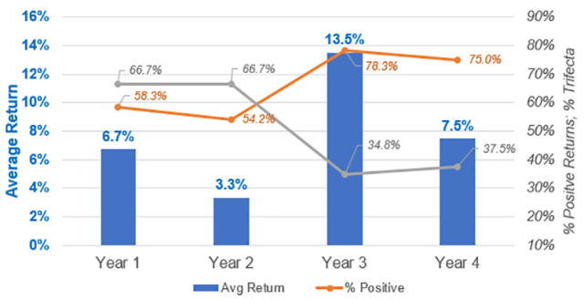

## Table of Contents

## What is the Presidential Election Cycle Theory?

The Presidential Election Cycle Theory is a financial idea that says stock market performance can be affected by the four-year cycle of U.S. presidential elections. It suggests that the market tends to do better in the years before an election and not as well in the years after an election. People think this happens because of how politicians act to get votes and make policies before and after elections.

In the year before an election, politicians often make decisions that help the economy to look good and win votes. This can lead to more spending and policies that boost the stock market. After the election, the new or re-elected president might make changes that could slow down the economy, causing the market to not do as well. While this theory can help explain some patterns in the stock market, it's not perfect and other things can also affect how the market behaves.

## Who developed the Presidential Election Cycle Theory?

The Presidential Election Cycle Theory was developed by a man named Yale Hirsch. He wrote about it in his book called the "Stock Trader's Almanac" in 1968. Yale Hirsch noticed that the stock market seemed to go up and down in a pattern that matched the four-year cycle of U.S. presidential elections. He thought this was because politicians did things to make the economy look good before elections to win votes.

Hirsch's theory says that the stock market usually does well in the year before a presidential election. This is because politicians want to show voters that the economy is doing well, so they might spend more money and make good policies. But after the election, the market might not do as well. This could be because the new or re-elected president might make changes that slow down the economy. Even though this theory can help explain some patterns in the stock market, it's not always right because other things can also affect how the market behaves.

## How does the Presidential Election Cycle affect the stock market?

The Presidential Election Cycle Theory says that the stock market can go up and down because of the four-year cycle of U.S. presidential elections. It suggests that the market usually does better in the year before an election. This happens because politicians want to make the economy look good to win votes. They might spend more money and make good policies that help the stock market grow.

After the election, the stock market might not do as well. This is because the new or re-elected president might make changes that slow down the economy. These changes can make the market go down. Even though this theory can help explain some patterns in the stock market, it's not always right. Other things can also affect how the market behaves, so it's not a perfect way to predict what will happen.

## What are the four phases of the Presidential Election Cycle?

The Presidential Election Cycle has four phases that happen over four years. The first phase is the year after the election. This is when the new or re-elected president might make changes that can slow down the economy. These changes can make the stock market go down. The second phase is the second year after the election. This year is often seen as a time when the market might still be feeling the effects of the changes made in the first year.

The third phase is the year before the next election. This is when politicians want to make the economy look good to win votes. They might spend more money and make good policies that help the stock market grow. This is usually the best time for the stock market in the cycle. The fourth phase is the election year itself. The market might do well at the start of the year because of the good policies from the year before. But as the election gets closer, the market can become unsure and might not do as well. Even though this cycle can help explain some patterns in the stock market, it's not always right because other things can also affect how the market behaves.

## Can you explain the Pre-Election Year in the cycle?

The Pre-Election Year is the third phase of the Presidential Election Cycle. It's the year before the next election, and it's usually the best time for the stock market in the cycle. Politicians want to make the economy look good to win votes, so they might spend more money and make good policies. These actions can help the stock market grow. People who invest in the stock market often see the Pre-Election Year as a time when they can make more money because the market tends to do well.

Even though the Pre-Election Year is usually good for the stock market, it's not always perfect. Other things can also affect how the market behaves. For example, big events around the world or changes in the economy can make the market go up or down. So, while the Pre-Election Year can help explain some patterns in the stock market, it's not a sure way to predict what will happen.

## How does the Election Year impact financial markets according to the theory?

The Election Year is the fourth phase of the Presidential Election Cycle. It's the year when the actual election happens. At the start of the Election Year, the stock market might do well because it's still feeling the good effects from the Pre-Election Year. Politicians have been spending money and making good policies to make the economy look strong, which can help the stock market grow.

But as the election gets closer, the stock market can become unsure. People might not know who will win the election or what changes the new or re-elected president will make. This uncertainty can make the market go down. Even though the Election Year can help explain some patterns in the stock market, it's not always right. Other things, like big events around the world or changes in the economy, can also affect how the market behaves.

## What typically happens in the stock market during the Post-Election Year?

The Post-Election Year is the first year after a presidential election. It's usually not a great time for the stock market. This is because the new or re-elected president might make changes that can slow down the economy. These changes can make the stock market go down. People who invest in the stock market often see the Post-Election Year as a time when they might lose money because the market tends to do worse.

Even though the Post-Election Year is usually tough for the stock market, it's not always the same. Other things can also affect how the market behaves. For example, big events around the world or changes in the economy can make the market go up or down. So, while the Post-Election Year can help explain some patterns in the stock market, it's not a sure way to predict what will happen.

## How reliable is the Presidential Election Cycle Theory in predicting market trends?

The Presidential Election Cycle Theory can help explain some patterns in the stock market, but it's not always reliable for predicting what will happen. The theory says that the market usually does well in the year before an election because politicians want to make the economy look good to win votes. They might spend more money and make good policies that help the stock market grow. But after the election, the new or re-elected president might make changes that slow down the economy, which can make the market go down.

Even though the theory can be useful, it's not perfect. Other things can also affect how the market behaves. For example, big events around the world or changes in the economy can make the market go up or down, no matter what year it is in the election cycle. So, while the Presidential Election Cycle Theory can give some ideas about what might happen, it's not a sure way to predict the future of the stock market.

## Are there any notable exceptions to the Presidential Election Cycle Theory?

The Presidential Election Cycle Theory says that the stock market usually does well in the year before an election and not as well in the year after. But there have been times when this didn't happen. For example, in 2008, which was an election year, the stock market crashed because of the financial crisis. This shows that big events can change how the market behaves, even if it's an election year.

Another time the theory didn't work was in 2017, the year after the election. The stock market did really well, even though it was supposed to be a bad year according to the theory. This happened because of good economic news and policies that helped the market grow. These examples show that while the Presidential Election Cycle Theory can help explain some patterns, it's not always right because other things can affect the stock market too.

## How can investors use the Presidential Election Cycle Theory to make investment decisions?

Investors can use the Presidential Election Cycle Theory to help plan when to buy or sell stocks. The theory says the stock market usually does well in the year before an election. So, investors might want to buy stocks during this time to make more money. They can look at how politicians are spending money and making policies to see if the economy will do well. This can help them decide if it's a good time to invest.

But the year after an election might not be as good for the stock market. The new or re-elected president might make changes that slow down the economy, which can make the stock market go down. So, investors might want to be careful and maybe sell some stocks during this time. Even though the theory can help, it's not always right. Big events or changes in the economy can affect the market too. So, investors should use the theory as one tool among many to make smart choices.

## What criticisms are commonly leveled against the Presidential Election Cycle Theory?

Some people say the Presidential Election Cycle Theory is not always right because other big things can affect the stock market more than elections. For example, a big event like a financial crisis or a war can make the market go up or down, no matter what year it is in the election cycle. Critics say the theory is too simple and doesn't think about all the other things that can change the market. They think it's risky to use the theory to make big decisions about investing because it might not be true all the time.

Another problem with the theory is that it looks at the past to guess the future. Just because the market did well before an election in the past doesn't mean it will happen again. The economy and politics can change a lot, so what worked before might not work now. Critics say investors should not just follow the theory but should also look at other information to make smart choices about their money.

## How does the Presidential Election Cycle Theory integrate with other economic theories and market analysis tools?

The Presidential Election Cycle Theory can work together with other economic theories and market analysis tools to help investors understand the stock market better. For example, investors might use the theory along with technical analysis, which looks at past stock prices and patterns to guess what might happen next. They could also use it with [fundamental analysis](/wiki/fundamental-analysis), which looks at a company's financial health and the overall economy to decide if a stock is a good buy. By combining the Presidential Election Cycle Theory with these other tools, investors can get a fuller picture of what might affect the market.

However, the theory is just one part of a bigger puzzle. Other economic theories like the business cycle theory, which says the economy goes through ups and downs, can also help explain why the market behaves the way it does. Market analysis tools like sentiment analysis, which looks at how people feel about the market, can give more clues about what might happen. While the Presidential Election Cycle Theory can be useful, investors should use it along with other theories and tools to make the best decisions about their money.

## References & Further Reading

Yale Hirsch’s "Stock Trader’s Almanac" is a pivotal resource for investors seeking to understand the Presidential Cycle Theory, offering historical analysis and context that remain influential in stock market evaluations. The almanac provides a comprehensive view of how political cycles can potentially influence market performance, proposing hypotheses validated and challenged by subsequent studies.

For investors and analysts looking for empirical data-driven insights, various studies and analyses conducted by financial institutions can offer validation or critique of the Presidential Cycle Theory. Institutions like the Federal Reserve Bank and financial research bodies often release white papers and reports that assess market trends with rigorous quantitative methods. These studies frequently utilize data from major stock indices, employing statistical techniques to discern patterns or anomalies across different presidential terms.

Algorithmic trading, a crucial element in modern financial markets, benefits from a solid understanding of market cycles. Advanced financial literature on this topic can provide deeper insights into designing and implementing strategies based on cyclical patterns. Books and research papers discuss the integration of cyclical theories—such as the Presidential Cycle—into algorithmic models using languages like Python. These resources often include case studies highlighting successful algorithmic applications and offer code snippets for strategies that adjust based on historical data.

To maintain a robust understanding of evolving market strategies, investors should consult reputable financial journals and industry expert publications. Publications like the "Journal of Finance," "Financial Analysts Journal," and reports from organizations like the CFA Institute provide peer-reviewed articles and analyses on both historical and predictive models, including how external factors may disrupt anticipated cycles. This continuous learning helps investors enhance their strategies, adapting to new datasets and trends.

Overall, a combination of historical literature, empirical analysis, algorithmic sophistication, and ongoing education forms a well-rounded approach to applying the Presidential Cycle Theory effectively in trading and investment decisions.

