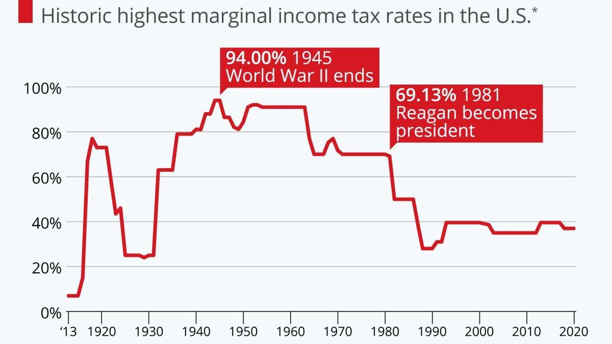

The analysis of the U.S. economy's evolution necessitates a detailed understanding of the key policies enacted by its Presidents. Presidential policies have significantly influenced federal income tax regulations, which in turn have shaped market dynamics and personal finance. The federal income tax system serves as a potent instrument for economic strategy, directly affecting financial behavior at both an individual and corporate level. Presidents throughout U.S. history, such as Franklin D. Roosevelt, Ronald Reagan, and George W. Bush, have left enduring legacies through tax reform, reflecting shifting economic priorities and political ideologies.

In recent years, technological advancements and policy frameworks have amplified the impact of algorithmic trading in the financial markets. Algorithmic trading, which utilizes complex algorithms and high-speed computations, has revolutionized the execution of trades by offering speed, precision, and the capacity to process vast data sets. Despite its benefits, the rise of algorithmic trading presents significant regulatory and ethical challenges, necessitating a closer examination of its interaction with federal tax policies.



This article explores the intersection of U.S. Presidential history, federal income tax reforms, and the evolution of algorithmic trading. By tracing historical shifts in taxation and technology, we can glean insights into the ongoing impact of past decisions on contemporary financial markets. As technology continues to advance, understanding the interconnectedness between tax policy and algorithmic trading will be essential for formulating effective future financial strategies. Analyzing these interconnections will aid in balancing innovation with the necessary regulations to maintain market stability and ensure fair practices.

## Table of Contents

## The History of U.S. Presidential Tax Policies

The role of U.S. Presidents in shaping tax policy can be traced back to the founding of the United States. Early tax measures, such as the Tariff Act of 1789, established revenue mechanisms necessary to support the nascent government. Over time, significant economic challenges and opportunities prompted a series of major tax reforms. Several Presidents have played crucial roles in these transformations, leaving lasting impacts on the tax system through landmark legislation.

In the 20th century, Franklin D. Roosevelt's New Deal policies fundamentally altered the U.S. tax landscape. In response to the Great Depression, Roosevelt introduced progressive income tax measures to redistribute wealth and provide necessary government funding for social programs. His Revenue Act of 1935 significantly increased taxes on higher incomes and corporate profits, marking a shift towards a more equitable taxation system as a means to support economic recovery and social welfare programs.

The latter half of the century witnessed a different approach under President Ronald Reagan. In the 1980s, Reagan's economic policies, often summarized by the term "Reaganomics," embraced supply-side economics with a focus on tax cuts to stimulate economic growth. The landmark Economic Recovery Tax Act of 1981 slashed individual income tax rates, reduced estate taxes, and introduced accelerated depreciation for businesses. These measures were intended to spur investment and expand economic activity, although they also led to increased federal deficits.

Entering the 21st century, President George W. Bush enacted significant tax policy changes during his tenure. Following the economic slowdown of the early 2000s and the September 11 terrorist attacks, Bush implemented a series of tax cuts known collectively as the "Bush tax cuts." These measures included the Economic Growth and Tax Relief Reconciliation Act (EGTRRA) of 2001 and the Jobs and Growth Tax Relief Reconciliation Act (JGTRRA) of 2003. The tax cuts lowered income tax rates, reduced capital gains taxes, and provided child tax credits, aiming to stimulate the economy through increased consumer spending and investment.

The evolution of U.S. tax policy reflects changing economic priorities and political ideologies over time. As Presidents respond to domestic and global economic conditions, their tax policies often embody the broader ideological battles over wealth distribution, economic growth, and government intervention. Franklin D. Roosevelt, Ronald Reagan, and George W. Bush stand out as key figures whose tax policies have significantly influenced the direction of federal income taxation in the U.S., reflecting broader economic and political shifts within the nation.

## Federal Income Tax and Market Dynamics

Federal income taxes have historically influenced economic behavior and the allocation of resources in the United States, affecting both individuals and corporations. The tax system's evolution reflects changes in government priorities and economic theories, often prompting adjustments that ripple through financial markets.

The structure and rates of federal income taxes directly impact individual financial decisions, such as saving, investing, and spending, while also guiding corporate strategies concerning investment and capital allocation. For instance, higher tax rates might discourage investment in riskier ventures, while lower or more favorable rates could stimulate economic activity by incentivizing investments.

Investment strategies and market trends are notably shaped by tax policies. For example, a tax cut could lead to increased disposable income, boosting consumer spending and stock market investments. Conversely, tax hikes might slow economic growth by reducing spending power and discouraging investment. These reactions are tightly correlated with the concepts of supply-side economics, which suggests that lower taxes boost economic growth by enhancing production and supply.

Supply-side economics has been a pivotal theory in the context of tax policy changes. Proponents argue that reducing taxes on businesses and entrepreneurs stimulates economic growth by increasing jobs, wages, and investment. A landmark experiment with supply-side economics was during Ronald Reagan's presidency, where tax reductions were aimed at invigorating the economy by enhancing goods and services supply, thus leading to theoretical predictions such as:

$$
GDP_{growth} = f(Tax_{rate\_reduction}, Investment\_increase, Consumption\_growth)
$$

Assessing the impact of tax policy changes involves analyzing market reactions and economic forecasts. For example, changes in tax policy can trigger fluctuations in stock markets as investors anticipate shifts in corporate earnings and economic prospects. Economists and market analysts use these policy shifts as indicators to predict future economic conditions, employing complex models to quantify expected outcomes.

In summary, federal income taxes remain a significant lever for shaping economic behavior, with its policies and rate structures considerably influencing personal and corporate financial strategies. The interplay between tax policy and market dynamics offers a lens through which to understand broader economic trends and the implications of governmental fiscal decisions.

## The Rise of Algorithmic Trading

Algorithmic trading has become a crucial component of modern financial markets, fundamentally transforming the methodology of trade execution. This progression is principally driven by the integration of advanced computational technology and the utilization of sophisticated algorithms. These algorithms facilitate trading with unmatched precision and speed, enabling the processing and analysis of vast datasets, which is essential for identifying profitable trading opportunities and executing high-frequency trades.

The foundational aspect of [algorithmic trading](/wiki/algorithmic-trading) lies in its ability to leverage computational power to make informed decisions swiftly. Typically, algorithms are engineered to follow a set of predefined rules or instructions to automate trading strategies. These strategies can range from simple execution algorithms, which aim to minimize market impact during large trades, to complex strategies based on [machine learning](/wiki/machine-learning) models capable of adapting to changing market conditions.

Algorithmic trading significantly enhances trade precision. By analyzing market conditions in real-time and executing trades milliseconds faster than human traders can, algorithms can capitalize on transient market inefficiencies. The speed advantage allows traders to exploit opportunities such as [arbitrage](/wiki/arbitrage) and statistical discrepancies in asset pricing, all while reducing transaction costs through optimized order sizes and timings.

Despite these contributions, algorithmic trading does not come without regulatory and ethical considerations. The rapid, automated nature of algorithmic trading can exacerbate market [volatility](/wiki/volatility-trading-strategies), as evidenced by events such as the 2010 Flash Crash, where automated high-frequency trading was implicated in the abrupt plummet of stock prices. Consequently, regulators worldwide have been compelled to examine and alter the regulatory framework surrounding algorithmic trading to prevent market abuses and systemic risks. This includes implementing circuit breakers, imposing minimum resting times for orders, and mandating increased transparency and reporting of algorithmic trading activities.

Furthermore, the ethical landscape presents challenges such as ensuring fair market access and preventing undue market manipulation. Algorithms equipped with exploitative behavior can disproportionately benefit entities with superior technological resources, thus raising concerns about equality and the integrity of financial markets.

The regulatory framework impacting algorithmic trading is intricately linked to broader financial and tax policies. Tax incentives or penalties can indirectly influence the prevalence and focus of algorithmic trading strategies. For example, capital gains tax rates may affect the holding period strategies of certain algorithms, while transaction taxes could limit the feasibility of high-frequency trading models.

In understanding algorithmic trading's ascent, examining its regulatory backdrop is imperative. This involves scrutinizing existing and proposed regulations aimed at curbing potential risks while fostering innovation within a balanced and fair market ecosystem. As the fusion of technology and finance continues to evolve, maintaining this balance between regulation and innovation remains a cardinal concern for policymakers and market participants alike.

## Interconnections Between Tax Policy and Algorithmic Trading

Tax policy has an indirect yet profound influence on algorithmic trading strategies by altering the broader market conditions and dictating investment behaviors. In recent years, shifts in tax policies have encouraged or deterred certain trading activities, highlighting the intricate relationship between fiscal measures and market dynamics. This section analyzes these interconnections by exploring how tax incentives and regulations shape the world of algorithmic trading.

### Influence of Tax Incentives on Algo Trading Platforms

Tax incentives or disincentives can significantly affect the behavior of trading entities. When tax rates are altered, the cost of capital changes, which can lead to shifts in portfolio rebalancing strategies employed by algorithmic traders. For instance, a reduction in the capital gains tax encourages more frequent trading since the after-tax return on short-term investments becomes more attractive. Conversely, higher tax rates on capital gains may lead traders to adopt longer holding periods to benefit from lower tax liabilities.

```python
def calculate_after_tax_return(capital_gain, tax_rate):
    return capital_gain * (1 - tax_rate)

# Example of impact: lower tax rate on short-term trades
capital_gain = 10000
tax_rate_short_term = 0.15  # Lower incentivized rate
tax_rate_long_term = 0.20  # Regular rate

after_tax_return_short = calculate_after_tax_return(capital_gain, tax_rate_short_term)
after_tax_return_long = calculate_after_tax_return(capital_gain, tax_rate_long_term)

after_tax_return_short, after_tax_return_long
```

### Presidential Decisions on Financial Regulations

Presidential decisions often set the tone for financial regulation, which indirectly impacts algorithmic trading. Regulatory frameworks established by executive orders or supported legislation can create an environment either conducive or challenging to algorithmic trading. For example, a focus on deregulating financial practices can spur the growth of algorithmic trading by reducing operational barriers and costs. Conversely, increased regulation may require traders to adapt algorithms to comply with new legal standards, impacting trading frequency and strategy complexity.

### Case Studies: Impact of Tax Reforms

Analyzing historical case studies helps illustrate how tax reforms have influenced trading patterns in financial markets. During the Reagan administration, the emphasis on supply-side economics and subsequent tax cuts created buoyant economic conditions, which saw increased investor confidence and activity on trading platforms, including emerging algorithmic systems. Similarly, the Tax Cuts and Jobs Act of 2017 under President Trump led to corporate tax reductions, which fostered increased market [liquidity](/wiki/liquidity-risk-premium) and volatility, both of which are pivotal for high-frequency trading algorithms.

### Dynamic Relationship in Financial Systems

The interaction between tax policy and algorithmic trading is a testament to the complexity of modern financial systems. As tax policies evolve, algorithmic traders must continually adapt their strategies to optimize returns under new fiscal conditions. This dynamic relationship underscores the need for algorithmic models that can simulate various tax scenarios and predict potential market outcomes. The ability to anticipate and react swiftly to tax policy changes can provide a competitive edge in the fast-paced world of algorithmic trading.

Overall, the intricate connections between tax policy and algorithmic trading highlight the importance of continuous assessment and adaptation of trading strategies in response to fiscal changes. As government policies evolve, so too must the algorithms that drive modern trading platforms, emphasizing the ongoing challenge of balancing innovation with regulation within financial markets.

## Conclusion

Reflecting on the historical influence of U.S. Presidents reveals the pivotal role tax policy plays in shaping the nation's economic landscape. Federal income tax reforms serve as a vital strategic tool within presidential policy-making, influencing not only immediate fiscal outcomes but also long-term market dynamics. These reforms have broad implications for resource allocation, investment decisions, and overall economic growth. As highlighted by landmark legislation from Presidents such as Franklin D. Roosevelt, Ronald Reagan, and George W. Bush, tax policy can be instrumental in responding to economic challenges and priorities, thereby guiding the [course](/wiki/best-algorithmic-trading-courses) of both domestic and international financial landscapes.

The emergence of algorithmic trading introduces an important new dimension to understanding and regulating financial markets. Driven by technological advancements, algorithmic trading offers significant benefits in terms of precision and efficiency, yet it also poses regulatory and ethical challenges that require careful oversight. The interconnectedness of tax policy and market dynamics necessitates a continuous analysis of how federal tax reforms can indirectly influence algorithmic trading strategies. For instance, tax incentives that alter market conditions and investment behaviors may inadvertently spur activity on algo trading platforms.

To effectively craft future financial policies, it is essential to maintain an ongoing observation and analysis of these complex interconnections. The ability of policymakers to predict and manage the impact of tax reforms on both traditional and innovative trading systems will be crucial. Furthermore, as both technology and policy continue to develop, striking a careful balance between fostering innovation and ensuring robust regulation will be necessary. This balance will not only promote a fair and equitable trading environment but also support sustainable economic progress in a rapidly evolving digital economy.

## References & Further Reading

[1]: ["The Revenue Act of 1935"](https://en.wikipedia.org/wiki/Revenue_Act_of_1935) - JSTOR analysis of the tax legislation under Franklin D. Roosevelt.

[2]: Friedman, M. (1982). ["Monetary Policy: Theory and Practice"](https://link.springer.com/chapter/10.1007/978-94-009-4432-9_2). Journal of Money, Credit and Banking.

[3]: Walker, F. J. (1988). ["The Origins of Supply-Side Economics"](https://fraser.stlouisfed.org/files/docs/publications/frbatlreview/pages/66482_1980-1984.pdf) - A historical overview of the economic theories underpinning the Reagan administration's tax policies.

[4]: Barber, B. M., & Odean, T. (2000). ["Trading Is Hazardous to Your Wealth: The Common Stock Investment Performance of Individual Investors"](https://faculty.haas.berkeley.edu/odean/Papers%20current%20versions/Individual_Investor_Performance_Final.pdf). The Quarterly Journal of Economics.

[5]: Hendershott, T., Jones, C. M., & Menkveld, A. J. (2011). ["Does Algorithmic Trading Improve Liquidity?"](https://onlinelibrary.wiley.com/doi/full/10.1111/j.1540-6261.2010.01624.x) The Review of Financial Studies.

[6]: Johnson, B., Menkveld, A. J., & Sarno, L. (2013). ["The Flash Crash: A New Deconstruction"](https://papers.ssrn.com/sol3/Delivery.cfm/SSRN_ID3096987_code49904.pdf?abstractid=2243520). Journal of Financial Markets.

[7]: Zingales, L. (2015). ["Does Finance Benefit Society?"](https://onlinelibrary.wiley.com/doi/abs/10.1111/jofi.12295) The Review of Financial Studies.

[8]: ["Algorithmic and High-Frequency Trading"](https://assets.cambridge.org/97811070/91146/frontmatter/9781107091146_frontmatter.pdf) by Álvaro Cartea, Sebastian Jaimungal, and José Penalva