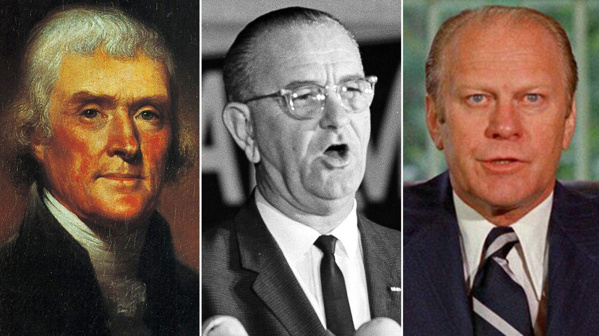

The topic of U.S. presidents who served multiple terms with different vice presidents is an intriguing aspect of political maneuvering that has had significant historical impacts. These instances reflect strategic decisions influenced by political alliances, health issues, and shifts in party dynamics. By examining these cases, we gain insights into the adaptive strategies within the highest office of the United States and how these decisions have shaped national and international policy directions.

Parallelly, the concept of the 4-year presidential election cycle reveals its significance in the field of algorithmic trading. This cycle suggests predictive patterns in stock market returns correlated with presidential terms, offering strategies for investors based on historical market behaviors. Understanding the cyclical nature of presidential terms allows investors to anticipate economic policy adjustments that often accompany new administrations, thereby optimizing investment strategies.



This article aims to explore the intersection of political maneuvers in selecting vice presidents and the application of the presidential cycle in financial markets. By analyzing both historical and present-day contexts, we can better understand how political decisions and economic strategies are intertwined, ultimately enhancing our comprehension of broader political and economic trends. This holistic view can inform both historical analysis and practical investment decisions, underscoring the importance of integrating political understanding with market insights.

## Table of Contents

## Historical Context: Presidents and Vice Presidents

The early electoral process in the United States created a system where the candidate receiving the second-highest number of electoral votes became the vice president. This electoral mechanism led to scenarios where the president did not have the vice president of their choosing, sometimes causing friction and inefficiency in administration. An early example of this outcome was during the presidency of John Adams, where his vice president, Thomas Jefferson, was from a different political faction. This discord highlighted the need for amendments to the electoral process.

Thomas Jefferson, who initially experienced being an opposition vice president under Adams, became a pivotal figure leading to the 12th Amendment. Implemented in 1804, the 12th Amendment revised the electoral process to allow separate balloting for the president and vice president, thereby streamlining party agenda alignment and minimizing internal government conflicts.

Franklin D. Roosevelt stands out in history for having three different vice presidents during his four-term presidency: John Nance Garner, Henry A. Wallace, and Harry S. Truman. Each change in vice president reflected significant political and party dynamics. For instance, internal disagreements over New Deal policies and other political strategies prompted the replacement of Garner with Wallace in 1941. Later, during the Democratic National Convention in 1944, Truman was selected to replace Wallace amid concerns over Wallace’s perceived political radicalism and Roosevelt's deteriorating health.

The rationale behind vice-presidential changes often involved the need for strategic political maneuvers and considerations of health. Abraham Lincoln, for instance, replaced his first vice president, Hannibal Hamlin, with Andrew Johnson when seeking re-election in 1864. This move was a calculated effort to bolster national unity during the Civil War by appealing to Unionists in the Southern states through Johnson, a Southern Democrat.

Such changes in vice-presidential offices had substantial impacts on national policies and shifts in governmental priorities. The appointment of Truman as vice president under Roosevelt became particularly consequential. Following Roosevelt's death in April 1945, Truman assumed the presidency and introduced pivotal policies that significantly shaped the post-war world, including the decision to utilize atomic weapons on Japan and the implementation of the Marshall Plan.

In summary, the evolution of the vice-presidential selection process reflects broader political strategizing and the health needs of presidents, often resulting in significant shifts within the U.S. governance framework and affecting national and international policies.

## Key Case Studies of Vice Presidential Changes

The selection of vice presidents across different terms by U.S. presidents has often been a strategic decision influenced by political, health, and regional considerations. This section examines key case studies involving Thomas Jefferson, Franklin Roosevelt, and Abraham Lincoln to understand the motivations and implications of their vice-presidential changes.

### Thomas Jefferson

Thomas Jefferson's presidency was marked by the inherent challenges of early U.S. electoral processes, where, prior to the 12th Amendment, the vice president was the candidate receiving the second-highest number of electoral votes. This resulted in Jefferson's first vice president, Aaron Burr, being more of a political adversary than an ally. The lack of cohesion between president and vice president under this system highlighted the need for constitutional reform, leading to the 12th Amendment, which allowed for separate balloting for president and vice president after Jefferson's term. The outcome improved political harmony in subsequent administrations by enabling presidents to choose running mates aligned with their policy vision and party goals.

### Franklin Roosevelt

Franklin D. Roosevelt's tenure is notable for his selection of three different vice presidents across his four terms. His first vice president, John Nance Garner, served during Roosevelt's initial two terms but was replaced due to ideological differences and Garner’s opposition to a third term for Roosevelt. This shift in vice-presidential choice reflected Roosevelt's focus on aligning his administration with supportive and dynamic political figures.

Roosevelt's replacement of Henry Wallace with Harry Truman in his fourth term had significant implications for U.S. economic and foreign policy. Wallace, who had served as vice president during Roosevelt's third term, was seen as too liberal and out of touch with mainstream sentiments within the Democratic Party. By choosing Truman, a moderate, Roosevelt sought to strengthen his reelection prospects and ensure continuity in leadership, as he was aware of his declining health. Truman's subsequent ascension to the presidency upon Roosevelt’s death critically impacted post-war policies, including the decision to use atomic weapons and the shaping of post-war international order.

### Abraham Lincoln

Abraham Lincoln exemplified strategic vice-presidential changes amidst the Civil War. Initially, Lincoln selected Hannibal Hamlin, a staunch abolitionist, as his vice president to balance the ticket and appeal to the Radical Republicans. As the war progressed, Lincoln aimed to foster national unity and chose a Southern Democrat, Andrew Johnson, as his running mate for his second term. Johnson's selection was intended to appeal to War Democrats and moderate Southerners, hoping to ease the post-war reconstruction process. However, the decision had mixed outcomes; Johnson's succession after Lincoln's assassination led to contentious Reconstruction policies that strained his relationship with the Republican-dominated Congress.

These historical case studies highlight the complex interplay of political strategy, regional considerations, and personal health in presidential decisions to change vice presidents. Such shifts often carried substantial implications for the administration's policy direction and the broader political landscape.

## The 4-year Presidential Cycle and Algo Trading

The 4-year presidential cycle is a concept that posits a correlation between U.S. presidential election cycles and stock market performance. This theory suggests that stock markets often exhibit predictable patterns depending on the stage of the presidential term. The cycle begins with the election year, where uncertainty often results in muted stock market returns. Post-election, the subsequent year usually sees policy stabilization, potentially leading to improved market performance. By the third year, economies may experience stimulus-driven growth as administrations seek favorable conditions for upcoming elections, often resulting in significant market gains. The fourth year is typically characterized by pre-election [volatility](/wiki/volatility-trading-strategies) as political campaigns introduce new uncertainties.

Investors leverage the presidential cycle by aligning their strategies with anticipated policy shifts. For instance, a new administration might prioritize certain sectors, such as renewable energy or defense, prompting investors to adjust their portfolios accordingly. Historically, these cycles have been tapped to forecast market trends, with patterns indicating the second half of a presidency often aligns with stronger equity markets.

Algorithmic trading plays a pivotal role in utilizing the data from these cycles. Algorithms can analyze historical data to identify patterns and develop predictive models. This analytical advantage allows for the creation of refined investment strategies that can adapt to the changing political and economic landscapes. Algorithms run simulations, incorporating variables like policy changes, market sentiment, and macroeconomic indicators to project market behavior over the presidential cycle.

For example, a Python-based algorithm could be programmed to backtest the performance of different sectors through several presidential cycles. Using libraries such as pandas for data analysis and matplotlib for visualization, traders can create models that simulate trading decisions based on historical performance during various phases of the presidential cycle. Here's a simplified example of how such a [backtesting](/wiki/backtesting) script might look:

```python
import pandas as pd
import numpy as np
import matplotlib.pyplot as plt

# Sample data loading
data = pd.read_csv('market_data.csv')
data['Date'] = pd.to_datetime(data['Date'])
data.set_index('Date', inplace=True)

# Define the cycle phases
def presidential_cycle_phase(year):
    election_year = year % 4 == 0
    pre_election_year = year % 4 == 3
    midterm_year = year % 4 == 2
    post_election_year = year % 4 == 1

    if election_year:
        return 'Election Year'
    elif pre_election_year:
        return 'Pre-Election Year'
    elif midterm_year:
        return 'Midterm Year'
    elif post_election_year:
        return 'Post-Election Year'

data['Year'] = data.index.year
data['Cycle Phase'] = data['Year'].apply(presidential_cycle_phase)

# Calculate average returns per cycle phase
average_returns = data.groupby('Cycle Phase')['Return'].mean()

# Plotting the results
average_returns.plot.bar(title='Average Stock Returns by Presidential Cycle Phase')
plt.xlabel('Presidential Cycle Phase')
plt.ylabel('Average Return')
plt.show()
```
This type of analysis includes various financial metrics and historical trends, offering insights that can guide tactical investment strategies. As [algorithmic trading](/wiki/algorithmic-trading) systems evolve, they refine these strategies by integrating [machine learning](/wiki/machine-learning) techniques, further enhancing their ability to anticipate nuanced market moves driven by political cycles.

## Applying the Presidential Cycle in Investment Strategy

The application of the presidential cycle in investment strategies involves specifying how stock market trends tend to align with the four-year U.S. presidential election cycle. Investors and traders use these recurring patterns to inform their decision-making processes, often employing algorithmic trading techniques to enhance precision and scalability.

The presidential cycle theory posits that stock market returns are generally weakest in the first two years of a presidency and strongest in the last two, attributed to anticipated policy adjustments and fiscal expansions near election periods. Algorithmic trading leverages this theory by processing large datasets to detect and exploit such cyclical trends. The hallmark of their effectiveness lies in backtesting strategies using historical data.

### Backtesting Framework

To backtest investment strategies revolving around the presidential cycle, one can use Python due to its robust libraries for financial analysis, such as pandas for handling data, NumPy for numerical processing, and [backtrader](/wiki/backtrader) for simulating trades. Here's a basic framework:

```python
import pandas as pd
import numpy as np
import backtrader as bt

# Load historical data
stock_data = pd.read_csv('historical_stock_data.csv')

# Define a Trading Strategy
class PresidentialCycleStrategy(bt.Strategy):
    def __init__(self):
        self.data_close = self.datas[0].close

    def next(self):
        year = self.datetime.date(0).year
        cycle_position = (year - 2000) % 4 

        # Simple cycle-based rule: different positions based on the year of the cycle
        if cycle_position == 3:  # Election year
            if self.position.size == 0:
                self.buy(size=100)
        elif cycle_position == 0:  # Post-election year
            if self.position.size > 0:
                self.sell(size=100)

# Run the strategy
cerebro = bt.Cerebro()
cerebro.addstrategy(PresidentialCycleStrategy)
cerebro.adddata(bt.feeds.PandasData(dataname=stock_data))
cerebro.broker.set_cash(10000)
cerebro.run()
print(f'Final Portfolio Value: {cerebro.broker.getvalue()}')
```

This simplified strategy involves adjusting market positions based on the year within the presidential cycle, demonstrating the concept's application.

### Integration of Machine Learning

Incorporating machine learning enhances strategy adaptability by processing near real-time data and reacting to unexpected market events. Algorithms can be trained to recognize complex patterns and correlations beyond manual recognition, optimizing strategies in response to live data streams. Machine learning models such as Random Forests or Neural Networks can incorporate not only historical price movements but also factors like political developments and economic indicators. 

For instance, a Random Forest model could be trained using labeled datasets that include stock returns and political variables (e.g., policy changes) to predict the probability of market movements:

```python
from sklearn.ensemble import RandomForestClassifier
from sklearn.model_selection import train_test_split
from sklearn.metrics import accuracy_score

# Load dataset with political and economic features
data = pd.read_csv('market_data_with_political_features.csv')
features = data.drop('market_movement', axis=1)
labels = data['market_movement']

X_train, X_test, y_train, y_test = train_test_split(features, labels, test_size=0.3)

# Train Random Forest model
model = RandomForestClassifier(n_estimators=100)
model.fit(X_train, y_train)

# Evaluate model
predictions = model.predict(X_test)
print(f'Model Accuracy: {accuracy_score(y_test, predictions)}')
```

By combining historical cycles with real-time predictive models, traders can develop strategies that are both informed by historical patterns and flexible enough to adjust to real-time data, maximizing the efficacy of presidential cycle-based investment approaches. However, it's pivotal to complement such strategies with other analytical frameworks to mitigate the risk introduced by external shocks and uncertainties.

## Challenges and Considerations

When considering trading strategies based on the presidential cycle, it is crucial to acknowledge the limitations and risks associated with relying solely on historical political patterns. The presidential cycle theory posits that stock market returns exhibit specific patterns across the four-year term of a U.S. president. However, this approach can be undermined by various unpredictable external factors. Geopolitical events, such as international conflicts or shifts in trade agreements, can significantly disrupt expected market trends. Economic recessions, often influenced by variables beyond political control, can also skew historical patterns, thereby limiting the reliability of the presidential cycle as a singular predictive tool.

Given these limitations, investors should emphasize the importance of a diversified strategy. A robust trading approach integrates not only historical cycles but also technical and [fundamental analysis](/wiki/fundamental-analysis) and prudent risk management. Technical analysis helps traders identify patterns and price movements, while fundamental analysis assesses economic factors and market conditions that can impact asset values. By balancing these methodologies, traders can refine their strategies to be more resilient to unforeseen market shifts.

It's also essential to recognize that political and economic policies can have varied impacts on different market sectors. For instance, a new administration's energy policy might benefit renewable energy sectors while simultaneously posing challenges for traditional fossil fuel industries. Thus, aligning investment choices with anticipated policy directions is critical. Investors should analyze potential policy changes within the presidential term and consider how these could affect specific sectors they are invested in.

To accommodate these variables within an investment strategy, market participants can utilize tools like machine learning and algorithmic trading. Algorithms can be designed to adapt to real-time data, integrating both technical indicators and broader economic signals. For example, using Python, traders can construct models that dynamically adjust to new information:

```python
import pandas as pd
from sklearn.ensemble import RandomForestRegressor

# Load market data
data = pd.read_csv('market_data.csv')
features = data[['sector_performance', 'economic_indicators', 'policy_changes']]
target = data['market_return']

# Create and train model
model = RandomForestRegressor(n_estimators=100)
model.fit(features, target)

# Predict future market performance
predictions = model.predict(features)
```

In this approach, machine learning models such as RandomForest can capture complex interactions between economic indicators and market returns, offering more nuanced predictions than those based on the presidential cycle alone. Ultimately, a comprehensive, multi-faceted investment strategy that incorporates diverse data sources and analytical techniques will enhance the robustness and adaptability of trading strategies in the face of political and economic uncertainties.

## Conclusion

Understanding presidential term dynamics is crucial not only in the context of political history but also in stock market investment. Analyzing the shifts in vice-presidential choices across multiple terms reveals insights into political strategy, adaptability, and the evolving landscape of national policies. Such historical events underscore the importance of strategic decision-making and its far-reaching impacts.

In the domain of stock market investment, the presidential cycle theory offers intriguing patterns that investors and traders can potentially exploit. By anticipating economic policy adjustments and administrative changes during different presidential phases, market participants might improve their prediction of stock market trends. Algorithmic trading, which capitalizes on these patterns using historical data, can offer significant advantages in crafting refined investment strategies.

However, the utility of the presidential cycle in algorithmic trading is not without its limitations. Over-reliance on this cycle can lead to systematic risk, particularly when unexpected geopolitical or economic changes occur. These events can significantly disrupt anticipated market patterns, rendering simplistic reliance on the cycle inadequate.

Therefore, adopting a balanced investment approach is critical. This balance involves integrating the presidential cycle insights with a broader array of analytical tools, including technical and fundamental analysis, alongside rigorous risk management protocols. By acknowledging the uncertain variances in political and economic policy impacts across different sectors, investors can align their choices more effectively with projected policy directions. Utilizing machine learning and advanced data analytics can further augment this strategy by adapting to real-time market fluctuations.

In conclusion, while understanding the intricacies of presidential term dynamics offers valuable knowledge, the true benefit lies in applying these insights thoughtfully within a comprehensive, multi-faceted investment framework. This approach ensures a resilient strategy that withstands political fluctuations and maximizes market opportunities.

## References & Further Reading

1. **Stock Trader's Almanac by Yale Hirsch** - This seminal work provides comprehensive insights into market patterns related to the U.S. presidential election cycle. It is an essential reference for understanding historical market performance and its potential implications on current investment strategies.

2. **"The Presidential Term: is the Third Year the Best in the Market?" by Colleen Templeton** - This academic study analyzes stock market data across different presidential terms, focusing specifically on the third year as a potentially favorable period for returns. The research includes statistical analyses that support the presidential cycle theory.

3. **"The Presidential Election Cycle in U.S. Stock Market Returns" by James D. Hamilton and Richard K. S. Ong** published in the Journal of Finance - This paper explores the relationship between U.S. presidential elections and stock market returns, providing empirical evidence and discussing potential economic policies' effects on market behavior.

4. **"An Overview of Algorithmic Trading: Data, Technology, and Strategy" by Rishi K. Narang** - While not focused exclusively on the presidential cycle, this book offers a broad coverage of algorithmic trading strategies that incorporate various cycles, including the four-year election cycle.

5. **Federal Reserve Bank of San Francisco's Economic Letter "Does the Presidential Election Cycle Affect the Stock Market?" by Michael Bauer and Felipe I. Schwartzman** - This publication provides an in-depth analysis of the economic factors influencing market trends during different presidency phases, offering insights into how investors might use this information.

6. **"Political Cycles and Stock Returns" by Narayan Y. Naik, Pradeep K. Yadav, and Pab Jot Singh Mann** in the Economic Journal - This research investigates how political cycles, including the U.S. presidential cycle, impact stock returns, supporting the notion that macro political events are significant for market participants.

7. **Python for Data Analysis by Wes McKinney** - This book is a practical guide to performing data analysis using Python, equipped with techniques useful for backtesting investment strategies based on historical data, such as the presidential cycle.

8. **"Algorithmic Trading: Winning Strategies and Their Rationale" by Ernie Chan** - This book provides strategies for algorithmic trading that can be adapted to the cycles in political and economic indicators like the presidential cycle, emphasizing the importance of data-driven decision-making.

