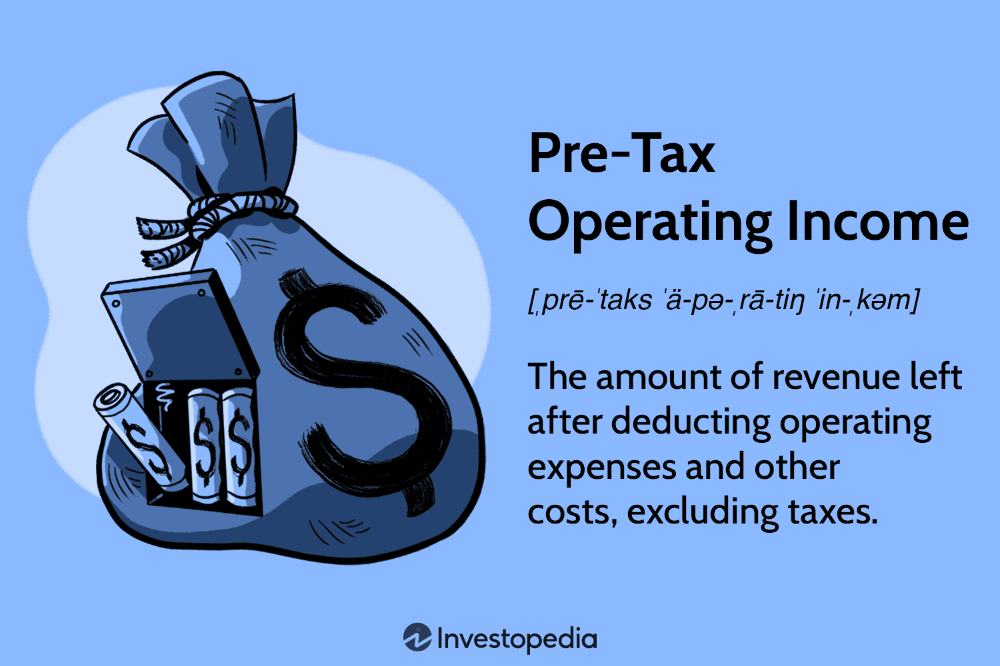

Understanding key financial metrics is essential for informed decision-making in business finance. One such metric, Pretax Operating Income (PTOI), plays a crucial role in evaluating a company's operating efficiency by excluding taxes and non-core income items. PTOI illuminates a firm’s fundamental operational effectiveness, allowing stakeholders to focus on core business performance without the distortion of tax strategies or irregular income.

The advent of algorithmic trading has further amplified the importance of precise and transparent financial metrics like PTOI. Algorithmic trading, which employs computer algorithms to execute trades with speed and precision, seeks metrics that provide clear insights into a company’s intrinsic value and operational efficiency. As this form of trading gains momentum, business professionals and investors increasingly rely on PTOI to make data-driven investment decisions, harnessing these calculations to enhance the accuracy and effectiveness of their trading strategies.

This article examines the ways PTOI integrates seamlessly with algorithmic trading strategies to optimize financial outcomes. By leveraging PTOI alongside algorithmic models, investors and financial professionals can gain a competitive advantage in the market, aligning their approaches to reflect the true performance of businesses. As such, the synergy of PTOI and algorithmic trading is transforming the landscape of modern finance, enabling a more strategic, data-centric approach to investing.

## Table of Contents

## Understanding Pretax Operating Income (PTOI)

Pretax Operating Income (PTOI) represents a company's ability to generate revenue from its fundamental activities before accounting for tax obligations. It offers a clear view of the operational effectiveness of a business by focusing solely on core business operations and excluding extraneous financial factors. The calculation of PTOI can be expressed through the formula:

$$
\text{PTOI} = \text{Gross Revenue} - \text{Operating Expenses} - \text{Depreciation}
$$

This straightforward calculation allows stakeholders to assess the pure performance of a company's business model without the influence of tax strategies or non-operational income streams. By isolating these factors, PTOI serves as a crucial benchmark for comparing the operational health of companies, offering a level playing field that is unaffected by variations in tax policies or differing capital structures.

Furthermore, PTOI aids in transparency by providing stakeholders with a clear indicator of profitability derived from the company's main activities. This indicator is particularly valuable for investors and analysts, as it focuses on the intrinsic ability of the company to generate earnings from its core operations. Comparing PTOI across companies can highlight differences in operational efficiency and business strategy execution, facilitating more informed investment and management decisions.

## Role of PTOI in Financial Analysis

Pretax Operating Income (PTOI) holds significant importance in financial analysis for assessing a firm's operational efficiency and profitability. By focusing solely on a company's core operations, PTOI provides a transparent metric free from the distortions of tax obligations and nonrecurring items. As such, it gives investors and analysts a more accurate representation of a company's performance in its primary business activities, unlike net income, which may be influenced by various taxes and exceptional financial events.

In financial evaluations, PTOI serves as a valuable tool for comparing the operational health of companies within the same industry or sector. It allows stakeholders to benchmark firms against each other, regardless of their tax planning strategies or capital structures. This comparison is instrumental for making informed investment decisions and understanding the competitive landscape.

The use of PTOI extends to analyzing the true cost associated with running a business. By stripping away extraneous financial elements, PTOI highlights operational efficiencies and inefficiencies, guiding strategic decisions aimed at optimizing processes. Stakeholders can gauge whether the core business is generating sufficient income to sustain operations or if there are areas necessitating improvement.

Furthermore, PTOI assists in strategic decision-making by enabling a clearer view of potential operational adjustments without the interference of tax considerations or extraordinary financial gains and losses. This focus assists management and investors in making decisions centered on enhancing operational processes and maximizing profitability through consistent and comparative insights.

## Algorithmic Trading and It’s Growing Influence

Algorithmic trading, commonly known as algo trading, is a process where computer programs execute trading decisions at speeds and frequencies that are beyond human capability. This approach leverages sophisticated mathematical models and the analysis of historical market data to identify and implement trades effectively and efficiently.

Algo trading utilizes algorithms, which are essentially sets of rules, to make split-second decisions. These algorithms can analyze multiple market variables simultaneously to uncover patterns and trends that may not be immediately apparent to human traders. By doing so, [algorithmic trading](/wiki/algorithmic-trading) seeks to exploit market inefficiencies to generate profits.

A significant advantage of algo trading is its capacity to minimize human errors and biases. Human traders are prone to emotional decision-making, especially in volatile markets. Algorithms, on the other hand, make decisions based solely on data-driven insights, ensuring precision and consistency. This objectivity often results in more accurate investment strategies, as algorithms are not subject to the fatigue or stress that can affect human decision-making.

Furthermore, the widespread adoption of algo trading reflects a growing recognition among financial professionals of its strategic benefits. Many institutional investors and hedge funds now rely heavily on these automated systems to maintain a competitive edge in increasingly sophisticated financial markets. The ability to process vast quantities of data swiftly and execute trades at optimal prices gives firms leveraging algo trading a distinct advantage over those relying solely on traditional methods.

In conclusion, algorithmic trading's influence is surging as it continuously evolves with advances in technology and data analytics. By replacing subjective human judgment with rule-based systems, it ensures that trading decisions remain grounded in empirical evidence, thereby enhancing the overall efficiency and effectiveness of financial operations.

## Integrating PTOI into Algorithmic Trading Strategies

Integrating Pretax Operating Income (PTOI) into algorithmic trading strategies involves leveraging this financial metric to enhance trading models' effectiveness. PTOI serves as an indicator of a company's capacity to generate core income before tax considerations, providing a fundamental insight into its operating efficiency. This intrinsic value-centric metric enables algorithmic trading systems to refine stock selection and trading strategies.

By incorporating PTOI, algorithmic models can filter firms suggesting stronger operational performance may warrant more favorable trading positions. This filtering process helps algorithms focus on inherently robust companies while sidestepping potential investment traps posed by companies with misleading net incomes inflated by non-recurring transactions or tax-related adjustments.

Additionally, PTOI aids in refining algorithms by removing anomalies. When financial models include non-core income or one-time expenses, they may produce skewed insights. Excluding these elements through PTOI integration results in a clearer picture of a firm’s steady-state performance, allowing algorithms to form predictions on more stable and recurring income data.

Investors can harness PTOI to build trading algorithms aligned more closely with a company's intrinsic business values. By rooting trading decisions in an operationally efficient income metric, algo strategies can emphasize long-term business strength rather than short-term financial engineering. This shift can lead to more aligned investment choices, potentially improving the resilience of trading systems to market fluctuations.

Incorporating PTOI requires not only understanding its pivotal role in evaluating company performance but also skills in data cleaning and algorithmic design. Analysts and developers need to ensure PTOI data is accurately calculated and free from noise to maintain the reliability of the trading systems employing it. Integrating PTOI in algorithmic trading thus holds promise for better-aligned strategies focused on sustainable financial health.

## Benefits and Challenges of PTOI in Algo Trading

Leveraging Pretax Operating Income (PTOI) in algorithmic trading provides considerable advantages in enhancing the precision of financial analysis and crafting well-informed investment strategies. When algorithmic trading systems incorporate PTOI, they can more effectively distinguish between companies based on their core operational efficiencies, leading to more accurate predictions of a company’s income-generating potential.

One of the primary benefits of algo trading is its objective, data-driven nature, which significantly reduces emotional biases in decision-making. This leads to more consistent investment results, as algorithms systematically execute trades based on predefined criteria devoid of human emotions such as greed or fear. By using PTOI as a key metric, trading algorithms can focus specifically on the core operational health of companies, ensuring that trading decisions are based on stable, fundamental indicators rather than transient financial variables.

However, one of the challenges in integrating PTOI within algorithmic trading is ensuring the accuracy of the data used. Since PTOI calculations rely on precise and timely financial data, discrepancies or outdated information can significantly affect the reliability of trading models. As financial markets are highly dynamic, algorithms must be constantly updated to incorporate the latest market data, requiring robust data management and processing systems.

Moreover, market conditions can fluctuate rapidly, necessitating algorithms that are adaptable and capable of evolving with changing market dynamics. Algorithms must be flexible enough to integrate new insights and adjust trading strategies accordingly. This requires constant monitoring and fine-tuning to maintain optimal performance.

Regulatory and compliance issues also pose significant barriers to the full integration of PTOI metrics within algorithmic trading systems. Financial markets are subject to stringent regulations, and any trading strategy must adhere to these legal frameworks. Compliance with these regulations is crucial to avoid legal repercussions and to ensure the ethical deployment of trading strategies. Consequently, developers and traders must be vigilant in ensuring that their algorithms operate transparently and within legal boundaries, particularly when utilizing metrics like PTOI that might involve complex accounting interpretations.

In summary, while the incorporation of PTOI in algorithmic trading systems offers substantial benefits in terms of improved financial analysis and more consistent trading outcomes, it also presents several challenges. Data accuracy, algorithm adaptability, and regulatory compliance are critical factors that must be addressed to successfully leverage PTOI in trading strategies.

## Conclusion

The integration of Pretax Operating Income (PTOI) within algorithmic trading systems has become increasingly important as financial markets evolve. By focusing on core business performance metrics like PTOI, traders and investors can develop more precise and effective algo trading strategies. These data-driven approaches have the potential to significantly enhance both the profitability and the operational efficiency of trading activities.

Incorporating PTOI insights into algorithmic trading offers stakeholders the opportunity to align their strategies more closely with intrinsic business values. By filtering companies based on operational efficiency, algorithms can better adjust to market dynamics, offering a strategic advantage. This is increasingly relevant as algorithmic trading systems become more sophisticated, relying heavily on robust data to fine-tune decision-making processes.

Looking ahead, the future of algorithmic trading is likely to focus even more on data accuracy and the use of advanced financial metrics. Ensuring that PTOI calculations are precise and adapting algorithms to market changes will be critical in improving investment outcomes. As such, stakeholders in the financial markets should consider integrating PTOI with advanced algo trading techniques to optimize financial strategies and achieve superior results.

## References & Further Reading

[1]: ["Advances in Financial Machine Learning"](https://www.amazon.com/Advances-Financial-Machine-Learning-Marcos/dp/1119482089) by Marcos Lopez de Prado

[2]: ["Evidence-Based Technical Analysis: Applying the Scientific Method and Statistical Inference to Trading Signals"](https://www.amazon.com/Evidence-Based-Technical-Analysis-Scientific-Statistical/dp/0470008741) by David Aronson

[3]: ["Machine Learning for Algorithmic Trading"](https://github.com/stefan-jansen/machine-learning-for-trading) by Stefan Jansen

[4]: ["Quantitative Trading: How to Build Your Own Algorithmic Trading Business"](https://www.amazon.com/Quantitative-Trading-Build-Algorithmic-Business/dp/1119800064) by Ernest P. Chan

[5]: Bergstra, J., Bardenet, R., Bengio, Y., & Kégl, B. (2011). ["Algorithms for Hyper-Parameter Optimization."](https://dl.acm.org/doi/10.5555/2986459.2986743) Advances in Neural Information Processing Systems 24.