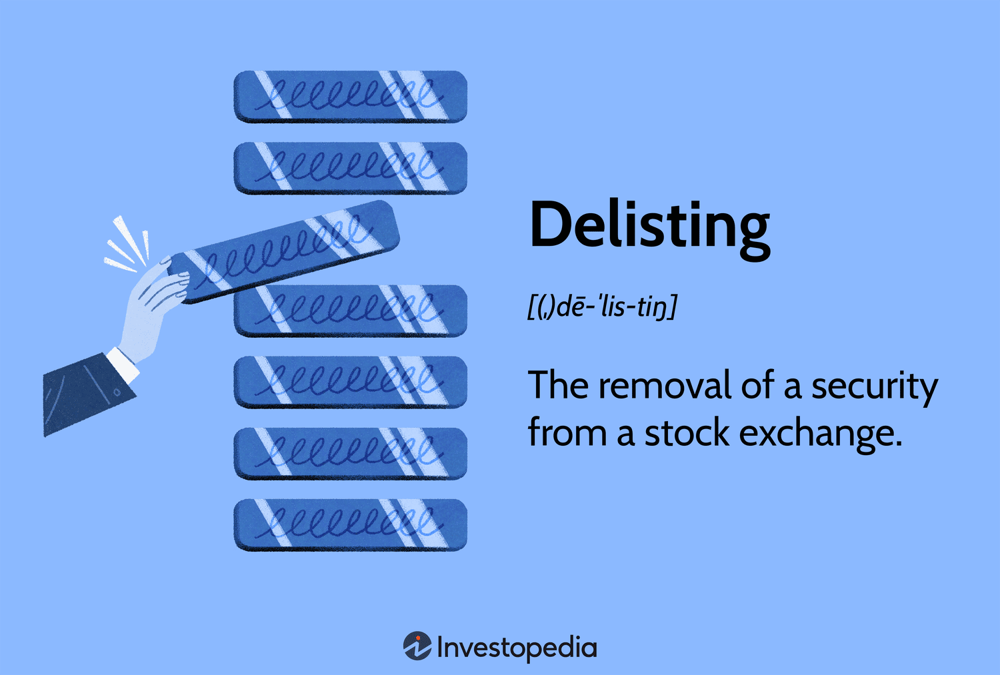

## Table of Contents

## What does it mean for a company to be delisted from Nasdaq?

When a company is delisted from Nasdaq, it means that the company's stock is no longer traded on the Nasdaq stock exchange. This can happen for several reasons, such as the company failing to meet Nasdaq's listing requirements, which include minimum standards for share price, market capitalization, and financial reporting. If a company does not meet these standards, Nasdaq may decide to remove it from the exchange.

Being delisted can have serious consequences for a company. It can make it harder for the company to raise money because investors might see it as a sign that the company is struggling. The stock might then be traded on a smaller, less prestigious exchange, or it might only be traded over-the-counter, which is less visible to investors. This can lead to a drop in the stock's value and make it more difficult for the company to attract new investors.

## What are the common reasons a company might face delisting from Nasdaq?

A company might face delisting from Nasdaq if it does not meet the exchange's rules. One common reason is if the stock price stays below $1 for too long. Nasdaq wants stocks to have a certain value, so if a company's stock price is too low, it might get delisted. Another reason is if the company does not have enough shareholders or if the total value of the company, called market capitalization, is too low. Nasdaq has rules about how many shareholders a company should have and how big the company should be.

Another reason for delisting is if the company does not follow the rules about reporting its financial information. Nasdaq requires companies to regularly share details about their money situation, like how much profit they are making or losing. If a company does not do this on time or if it does not do it correctly, Nasdaq might delist it. Also, if a company goes bankrupt or is involved in serious legal problems, it might be delisted because these issues can make the company too risky for the exchange.

## How can a company monitor its compliance with Nasdaq listing requirements?

A company can monitor its compliance with Nasdaq listing requirements by keeping a close eye on its stock price, market capitalization, and the number of shareholders. They need to make sure their stock price stays above $1 for a certain period of time. If it drops below that, they need to take action to bring it back up. They also need to check that they have enough shareholders and that the total value of the company, or market capitalization, meets Nasdaq's standards. This involves regularly reviewing financial reports and shareholder data to ensure they meet the minimum requirements set by Nasdaq.

Another important way to monitor compliance is by making sure the company follows Nasdaq's rules on financial reporting. This means submitting accurate and timely reports about the company's financial situation. If the company misses deadlines or submits incorrect information, it could face delisting. The company should have a team that regularly checks these reports before they are sent to Nasdaq. Staying in touch with Nasdaq and responding quickly to any warnings or notices from the exchange can also help the company stay compliant and avoid delisting.

## What are the minimum bid price requirements for staying listed on Nasdaq?

To stay listed on Nasdaq, a company's stock must have a minimum bid price of at least $1 per share. This means that the lowest price someone is willing to pay for the stock should be $1 or more. If the stock price stays below $1 for 30 consecutive business days, Nasdaq will send the company a notice. The company then has 180 calendar days to get the stock price back above $1 for at least 10 consecutive business days.

If the company can't meet this requirement within the first 180 days, but it meets other Nasdaq standards like market value of publicly held shares, it might get another 180 days to fix the price. If the stock price still doesn't go above $1 after this extra time, the company could be delisted from Nasdaq. Keeping the stock price above $1 is important for a company to stay on the exchange.

## How can a company address a deficiency in its minimum bid price?

If a company's stock price drops below $1 for 30 business days in a row, Nasdaq will send them a notice. The company then has 180 days to fix this problem. One way to do this is by doing a reverse stock split. This means the company can combine several shares into one share, which makes the price of each share go up. For example, if they do a 1-for-10 reverse split, 10 shares at $0.50 each would become 1 share at $5.00. Another way is to try to make the company look more attractive to investors. They can do this by showing good news about the company, like new products or better earnings, which might make more people want to buy the stock and push the price up.

If the company can't get the stock price above $1 within the first 180 days but meets other Nasdaq rules, like having enough value in the shares that the public owns, they might get another 180 days to fix it. During this extra time, the company needs to keep working on making the stock price go up. If they still can't do it after the extra time, Nasdaq might take the company off the exchange. So, it's really important for the company to keep an eye on its stock price and take action quickly if it starts to drop too low.

## What steps should a company take if it receives a non-compliance notice from Nasdaq?

If a company gets a non-compliance notice from Nasdaq, it means they need to fix something to stay listed on the exchange. The first thing the company should do is to read the notice carefully to understand what the problem is. Usually, the notice will say what rule the company broke and how long they have to fix it. The company should then tell its investors about the notice, because being open with them is important. Next, the company needs to make a plan to solve the problem. They might need to talk to their lawyers, financial advisors, or other experts to figure out the best way to do this.

One common problem is if the stock price is too low. To fix this, the company might do a reverse stock split, which means they combine several shares into one to make the price go up. Or, they can try to make the company more attractive to investors by sharing good news about new products or better earnings. The company needs to keep an eye on its progress and make sure it's doing what it needs to do to meet Nasdaq's rules again. If they can't fix the problem in time, they might get another chance if they meet other Nasdaq rules. But if they still can't fix it, they could be taken off the exchange, which is bad for the company.

## How does a company execute a reverse stock split to prevent delisting?

To execute a reverse stock split and prevent delisting, a company first needs to decide on the ratio of the split. For example, if they choose a 1-for-10 reverse split, every 10 shares an investor owns will become 1 share. The company then needs to get approval from its board of directors and sometimes from its shareholders. After getting the approvals, the company will file the necessary paperwork with the Securities and Exchange Commission (SEC) and Nasdaq to make the reverse split official.

Once everything is approved, the company announces the reverse split to its shareholders and the public. On the date of the split, the stock price will go up because the number of shares goes down. For instance, if the stock was trading at $0.50 per share before a 1-for-10 split, it would be trading at $5.00 per share after the split. This helps the company meet Nasdaq's minimum bid price requirement of $1 per share. The company needs to make sure the new stock price stays above $1 for at least 10 consecutive business days within the 180-day compliance period to avoid delisting.

## What are the financial reporting requirements to maintain a Nasdaq listing?

To stay listed on Nasdaq, a company needs to follow strict rules about sharing its financial information. They have to send regular reports to Nasdaq, like quarterly and annual financial statements. These reports need to be sent on time and must be correct. If a company misses a deadline or sends wrong information, Nasdaq might send them a warning. The company then has to fix the problem quickly to avoid being taken off the exchange.

The main reports a company needs to send are the quarterly report, called the 10-Q, and the annual report, called the 10-K. The 10-Q has to be sent within 40 days after the end of each of the first three quarters of the year. The 10-K has to be sent within 90 days after the end of the year. These reports tell investors how the company is doing financially. If a company does not follow these rules, it could be in trouble and might be delisted from Nasdaq.

## How can a company improve its corporate governance to avoid delisting risks?

A company can improve its corporate governance to avoid delisting risks by making sure its board of directors is strong and independent. The board should have people who are not connected to the company in a way that could affect their decisions. These independent directors can help make sure the company follows all the rules and does what's best for everyone. The company should also have clear rules about how decisions are made and how the board works. This helps keep everything fair and open, which can make investors trust the company more.

Another way to improve corporate governance is by having good systems for reporting and checking financial information. The company should have a team that makes sure all financial reports are correct and sent on time. This can help avoid problems that might lead to a delisting notice from Nasdaq. The company should also talk to its investors regularly and be open about its plans and how it's doing. This can help keep investors happy and less likely to sell their shares, which can help keep the stock price up and avoid delisting risks.

## What role does market capitalization play in Nasdaq listing standards?

Market capitalization, or market cap, is really important for a company to stay listed on Nasdaq. It's like the total value of the company, figured out by taking the stock price and multiplying it by the number of shares out there. Nasdaq has rules about how big a company's market cap needs to be. If a company's market cap gets too small, Nasdaq might send them a warning. The company then has to find a way to make its market cap bigger again, or it could be taken off the exchange.

To keep their market cap up, companies might try to make more money or find new ways to grow. They could also try to get more people to buy their stock, which can make the stock price go up. Keeping a good market cap is important because it shows investors that the company is doing well and is worth investing in. If a company's market cap stays too low for too long, it might not be able to stay on Nasdaq, which can make it harder for the company to get money and grow.

## How can a company appeal a delisting decision by Nasdaq?

If a company gets a notice from Nasdaq saying it might be taken off the exchange, it can ask for a hearing to appeal the decision. The company needs to ask for this hearing within a certain time, usually seven days after getting the notice. At the hearing, the company can explain why it should stay listed and show what it's doing to fix the problems. A group of people from Nasdaq will listen and decide if the company can stay on the exchange or not.

The company should get ready for the hearing by putting together all the information and plans it has to meet Nasdaq's rules again. This might include showing how it will bring the stock price up or how it will make sure its financial reports are on time and correct. If the Nasdaq group agrees with the company's plan, they might give the company more time to fix things. If the company can't convince Nasdaq, it might still be taken off the exchange, but at least it had a chance to explain its side.

## What long-term strategies can a company implement to ensure continued compliance with Nasdaq listing standards?

A company can keep following Nasdaq's rules by always checking its stock price and making sure it stays above $1. If it starts to go down, the company can do things like telling people about good news or new products to make more people want to buy the stock. They should also make sure they have enough shareholders and that the company's total value, or market cap, is big enough. This means they need to keep making money and growing the business. By watching these things closely and acting fast if there's a problem, the company can stay on Nasdaq.

Another important thing is to always send correct and on-time financial reports to Nasdaq. The company should have a good team that checks these reports before they are sent out. They should also keep their board of directors strong and make sure the board follows clear rules. Talking to investors regularly and being open about the company's plans and how it's doing can also help. By doing all these things, the company can avoid problems and keep its spot on Nasdaq for a long time.

## What is the impact of delisting on algorithmic trading?

Stock delisting can significantly impact algorithmic trading strategies, especially those focused on Nasdaq-listed stocks. Algorithmic trading, which relies on pre-set rules and algorithms to execute trades, is particularly sensitive to changes in market conditions, such as liquidity and volatility. Delisting events typically lead to a reduction in the liquidity of the affected stock, as trading usually moves over-the-counter (OTC), where fewer buyers and sellers are available compared to a major exchange like Nasdaq. This reduced liquidity can hinder the execution of trades at desired prices, which is crucial for high-frequency trading algorithms that operate on tight margins.

Moreover, delisting can introduce increased volatility in the stock's price. The uncertainty surrounding a company's future post-delisting often leads to erratic price movements as remaining investors react to limited information. For algorithmic traders, this unpredictability necessitates adjustments in their models to manage the higher risk. For instance, the measures of volatility, which many trading algorithms use to determine position sizes or stop-loss levels, might need recalibration. Volatility ($\sigma$) typically influences risk management as follows:

$$
Position \ Size = \frac{Target \ Risk}{\sigma \times \text{Price}}
$$

When $\sigma$ increases due to delisting, the position size may need reduction to maintain the target risk level.

Adapting algorithmic models to handle the challenges posed by delisted stocks involves several strategies. One approach could be the incorporation of more robust risk management parameters to accommodate higher volatility and lower liquidity. Algorithms could be designed to dynamically adjust position sizes based on real-time liquidity and volatility metrics. 

Furthermore, traders could integrate news sentiment analysis into their algorithms to better anticipate liquidity and volatility shifts induced by corporate news related to potential delisting. Analyzing sentiment data from financial news and social media can provide insights into market perceptions and future price movements. Python's natural language processing libraries, such as NLTK or Spacy, can be used for this purpose. Here is a basic example:

```python
from nltk.sentiment import SentimentIntensityAnalyzer

text_data = "The company has received a delisting notice, impacting future trading opportunities."
analyzer = SentimentIntensityAnalyzer()
sentiment_score = analyzer.polarity_scores(text_data)
print(sentiment_score)  # Outputs sentiment metrics which can inform trading decisions
```

Overall, delisting poses significant challenges for algorithmic trading strategies by affecting key market variables like liquidity and volatility. Developing adaptable algorithmic models that can swiftly respond to these variables is crucial for mitigating the negative impacts of delisting events. Additionally, by integrating advanced data analysis methods, trading algorithms can enhance their predictive power and decision-making efficacy in these altered market conditions.

## References & Further Reading

[1]: Harris, L. (2003). ["Trading & Exchanges: Market Microstructure for Practitioners"](https://academic.oup.com/book/52292). Oxford University Press.

[2]: Engle, R. F., & Russel, J. R. (1998). ["Autoregressive Conditional Duration: A New Model for Irregularly Spaced Transaction Data."](https://www.semanticscholar.org/paper/Autoregressive-Conditional-Duration%3A-A-New-Model-Engle-Russell/8025c69bcea22b062cd8fc589ce41f44e4c33fad) The Review of Financial Studies, 12(2), 529-566.

[3]: Jones, C. M. (2013). ["What Do We Know About High-Frequency Trading?"](https://www.researchgate.net/publication/256053439_What_Do_We_Know_About_High-Frequency_Trading) The Review of Financial Studies, 27(8), 2268–2308.

[4]: Hasbrouck, J. (2007). ["Empirical Market Microstructure: The Institutions, Economics, and Econometrics of Securities Trading"](https://academic.oup.com/book/52241). Oxford University Press.

[5]: O'Hara, M. (1995). ["Market Microstructure Theory"](https://openlibrary.org/books/OL1103097M/Market_microstructure_theory). Blackwell Publishers.

[6]: Hendershott, T., Jones, C. M., & Menkveld, A. J. (2011). ["Does Algorithmic Trading Improve Liquidity?"](https://onlinelibrary.wiley.com/doi/full/10.1111/j.1540-6261.2010.01624.x) Journal of Finance, 66(1), 1-33.

[7]: Pastor, Ĺ., & Stambaugh, R. F. (2003). ["Liquidity Risk and Expected Stock Returns."](https://www.cis.upenn.edu/~mkearns/finread/pastor.pdf) Journal of Political Economy, 111(3), 642-685.

[8]: Menkveld, A. J. (2013). ["High Frequency Trading and the New Market Makers."](https://papers.ssrn.com/sol3/papers.cfm?abstract_id=1722924) The Review of Financial Studies, 27(8), 2211-2256.