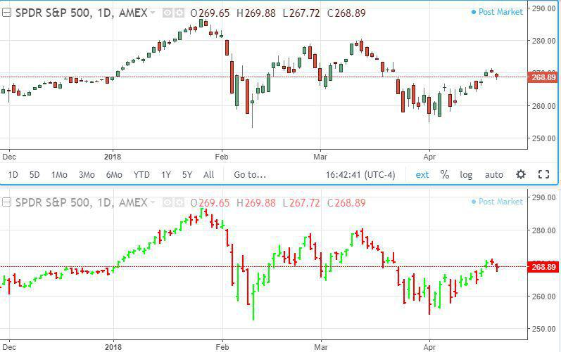

The world of trading is vast and complex, characterized by a diverse array of strategies and tools designed to help traders make informed decisions. At the core of these tools are candlestick patterns, price quotes, and the concept of the previous close, which hold particular importance in the context of algorithmic trading. Candlestick patterns offer a historical price perspective, providing insights into potential market movements by visually representing market sentiment over a specific period. These patterns, like the Hammer and Bullish Engulfing, serve as indicators of market trends and potential reversals, offering traders cues for action.

Price quotes, on the other hand, deliver real-time information about the current demand and supply dynamics by showing the latest market price of a security. Consisting of bid and ask prices, they are crucial for executing trades efficiently by allowing traders to assess the immediate market conditions and decide on optimal entry or exit points. Understanding the intricacies of reading and interpreting these quotes is essential for success.



The concept of the 'previous close' refers to the last quoted price at the end of a trading session, acting as a baseline for assessing the current day’s price performance. This metric is vital for evaluating price trends and helps traders make strategic decisions by offering a point of comparison against intraday movements.

In algorithmic trading, these elements are integrated to automate trade executions based on predefined criteria, aiming to enhance the precision and profitability of trading strategies. The ability to analyze historical patterns, current market prices, and previous session data plays a significant role in crafting algorithms that can respond dynamically to the market environment.

As the trading landscape evolves with advancements in technology, the understanding and application of candlestick patterns, price quotes, and previous close metrics remain foundational to successful trading strategies, particularly for algorithmic traders seeking to capitalize on market opportunities.

## Table of Contents

## Understanding Candlestick Patterns

Candlestick patterns are visual tools that represent price movements within financial markets, serving as essential indicators for traders seeking to comprehend potential market trends. Originating from Japanese rice merchants in the 18th century, these patterns have evolved into pivotal elements for technical analysts, who use them to predict future price movements grounded on historical behavior.

At their core, candlestick patterns consist of a body and wicks (or shadows). The body displays the opening and closing prices of a given time period, while the wicks reflect the highest and lowest prices during the same period. A pattern is formed when a series of these candlesticks are aligned, each providing valuable data regarding market sentiment.

Several candlestick patterns are widely recognized for their reliability in signaling market trends. The Hammer pattern, typically found at the bottom of a downtrend, signifies a potential bullish reversal. It is characterized by a small body, a long lower wick, and little to no upper wick, indicating that despite selling pressure pushing the price lower, buying pressure brought it back near the opening price by the close.

Another significant pattern is the Bullish Engulfing. This pattern appears in a downtrend and consists of a smaller red candlestick followed by a larger green candlestick that completely engulfs the previous one. This formation suggests a shift in [momentum](/wiki/momentum) from sellers to buyers, signaling a potential reversal to an upward trend.

The Morning Star is a multi-candlestick pattern that signals the end of a downtrend and the start of an uptrend. It comprises three candles: a long bearish candle, a short-bodied candle indicating indecision, and a long bullish candle. The transition from red to green suggests a shift in control from sellers to buyers, thus signifying potential price increases.

These patterns can be powerful when used correctly, but it is crucial to consider them within the broader context of trading strategies. They are not infallible predictors; rather, they serve as tools to support traders' decisions by offering potential clues about market sentiment and upcoming price moves. Nonetheless, when combined with additional analysis and indicators, candlestick patterns can significantly aid traders in optimizing their trading strategies.

## The Role of Price Quotes in Trading

Price quotes play a crucial role in trading by offering real-time information about the market price of securities. They capture the current demand and supply dynamics, enabling traders to make informed decisions. A typical price quote includes two essential components: the bid price and the ask price. The bid price represents the highest price a buyer is willing to pay for a security, while the ask price is the lowest price a seller is willing to accept. The difference between these two prices is known as the bid-ask spread, which can be an indicator of the [liquidity](/wiki/liquidity-risk-premium) and [volatility](/wiki/volatility-trading-strategies) of the security.

Understanding and interpreting price quotes accurately is vital for executing timely and efficient trades. Traders rely on these quotes to determine the optimal entry and [exit](/wiki/exit-strategy) points for their transactions. For instance, a narrow bid-ask spread often suggests a highly liquid market with intense competition among traders, possibly resulting in quicker fills and less slippage. Conversely, a wide spread signals a less liquid market, which might pose challenges in executing trades at the desired prices. 

To highlight the importance of price quotes, consider the following Python code snippet that demonstrates how to access and interpret live price quotes using a trading API:

```python
import requests

# Example function to get a price quote using a fictional trading API
def get_price_quote(symbol):
    response = requests.get(f'https://api.tradingplatform.com/quote/{symbol}')
    data = response.json()
    bid_price = data['bidPrice']
    ask_price = data['askPrice']
    return bid_price, ask_price

# Retrieve and display the price quote for a given security
symbol = 'AAPL'
bid, ask = get_price_quote(symbol)
print(f"Bid Price: {bid}, Ask Price: {ask}, Spread: {ask - bid}")
```

This example illustrates fetching the bid and ask prices for a specific security using a fictional trading platform API. By regularly accessing such data, traders can effectively monitor market conditions and adjust their strategies accordingly. Hence, mastering the art of reading and comprehending price quotes is indispensable for successful trading endeavors.

## Decoding 'Previous Close'

The 'previous close' is a fundamental concept in financial markets, representing the closing price of a security from the preceding trading session. This metric is primarily utilized as a benchmark to evaluate a security's performance over the next trading period. It serves as a starting point for calculating daily price changes, percentage variations, and other momentum indicators crucial for both retail and institutional traders.

For traders, the significance of the previous close lies in its ability to provide insight into market sentiment and potential price action. As an essential component of technical analysis, it helps traders to identify trends and make predictions about future market movements. For example, a security opening significantly higher than its previous close might indicate bullish market sentiment, whereas an opening price lower than the previous close might signal bearish tendencies. This can be mathematically represented as:

$$
\text{Price Change} = \text{Open Price} - \text{Previous Close}
$$

A positive price change could suggest buying interest, while a negative change might indicate selling pressure.

In strategic planning for the current trading session, traders often compare the previous close with pre-market data, including overnight news and foreign market performances. This approach allows them to form hypotheses about the subsequent price movements and volatility, which can be crucial for intraday trading strategies. Additionally, many traders use the previous close as a key reference point in technical indicators like moving averages and Bollinger Bands, further enhancing their analysis framework.

Utilizing the previous close in conjunction with these analytical tools allows traders to better understand market dynamics and execute strategies that are informed by historical price data. This consideration is particularly important in today’s algorithm-driven trading environments, where rapid decision-making based on comprehensive data analysis is essential for success.

## Integrating Candlestick Patterns and Price Quotes in Algo Trading

Algorithmic trading, often referred to as algo trading, leverages automated systems to execute trades based on pre-set criteria. This approach seeks to capitalize on market patterns and efficiencies far beyond what manual trading can achieve. A crucial part of this automated trading involves integrating candlestick patterns and price quotes, which are foundational in anticipating market shifts and implementing strategic trade executions.

Candlestick patterns provide visual insights into historical price movements, revealing potential upcoming market trends. These patterns, such as Doji, Hammer, or Evening Star, offer valuable predictive capabilities that can be encoded into trading algorithms. By identifying these patterns, algorithms can determine optimal entry and exit points, enhancing decision-making processes.

Price quotes are equally vital in algo trading as they reflect real-time supply and demand conditions. Quotes include bid and ask prices, which are indispensable for ensuring trades are executed at desired prices. Integrating real-time quote data within algorithms allows for dynamic adjustments based on current market conditions, thereby improving the responsiveness and effectiveness of trades.

To successfully integrate these elements, traders need to develop algorithms that can efficiently process and respond to pattern recognition and pricing data. Here's a simple Python example illustrating how a basic algorithm might incorporate candlestick patterns and price quote data:

```python
import pandas as pd

def identify_hammer(candles):
    # A simple logic to identify a Hammer pattern
    for index, candle in candles.iterrows():
        if candle['open'] > candle['close'] and \
           (candle['high'] - max(candle['open'], candle['close'])) >= 2*(min(candle['open'], candle['close']) - candle['low']):
            return True
    return False

def execute_trade(current_price, pattern_detected):
    if pattern_detected:
        # execute a buy order for simplicity
        print(f'Executing trade at current price: {current_price}')

# Sample candlestick data
candlestick_data = pd.DataFrame({
    'open': [10, 10.5, 10.3],
    'high': [10.7, 10.6, 10.4],
    'low': [9.8, 10.2, 10.0],
    'close': [10.2, 10.1, 10.3]
})

# Continuous monitoring
pattern_detected = identify_hammer(candlestick_data)
current_market_price = 10.3  # Example price quote

execute_trade(current_market_price, pattern_detected)
```

In this scenario, the algorithm assesses a basic Hammer pattern within candlestick data and uses a placeholder for current market pricing. Upon identifying the pattern, it executes a trade at the quoted price. While this example is rudimentary, it underscores the core mechanism of how algorithms incorporate these elements to strategically trade.

The integration of candlestick patterns and price quotes empowers algorithmic traders to enhance their trading accuracy and profitability. By automating the detection of market signals and executing trades based on real-time data, traders can improve their operational efficiency and capitalize on fleeting opportunities with precision. Ultimately, leveraging these elements in algo trading frameworks helps navigate the complexities of financial markets more adeptly.

## Algorithmic Strategies Utilizing Candlestick Patterns

Developing a robust [algorithmic trading](/wiki/algorithmic-trading) strategy involves leveraging candlestick patterns due to their ability to provide predictive insights into market trends. These patterns aid in identifying potential price reversals or continuations, which can inform the timing and nature of trades. The process begins with a thorough understanding of various candlestick patterns and their implications in different market conditions.

For instance, the Hammer pattern, which typically indicates a potential reversal from a bearish to a bullish market, can be utilized in algorithmic trading to detect buying opportunities. When a Hammer is identified, the algorithm can initiate a buy signal, expecting the market to rise. Conversely, the Bearish Engulfing pattern suggests a potential turn from a bullish to a bearish market. This pattern can signal to the algorithm to initiate a sell order, anticipating a downturn in market prices.

Here's a simplified example of how an algorithm can be set up to recognize these patterns using Python:

```python
def identify_hammer(candlestick):
    # Check if hammer conditions are met
    body_length = abs(candlestick['open'] - candlestick['close'])
    lower_wick = candlestick['low'] - min(candlestick['open'], candlestick['close'])
    upper_wick = max(candlestick['open'], candlestick['close']) - candlestick['high']
    return lower_wick > 2 * body_length and upper_wick < body_length

def identify_bearish_engulfing(previous_candle, current_candle):
    # Check if bearish engulfing conditions are satisfied
    return (previous_candle['close'] > previous_candle['open'] and
            current_candle['open'] > current_candle['close'] and
            current_candle['open'] > previous_candle['close'] and
            current_candle['close'] < previous_candle['open'])

# Example of usage:
candlestick_data = [
    {'open': 100, 'close': 105, 'high': 108, 'low': 95},  # Previous candlestick
    {'open': 106, 'close': 101, 'high': 107, 'low': 100}  # Current candlestick
]

if identify_hammer(candlestick_data[1]):
    print("Hammer pattern identified. Consider buying.")
elif identify_bearish_engulfing(candlestick_data[0], candlestick_data[1]):
    print("Bearish Engulfing pattern identified. Consider selling.")

```

Continuous testing, known as optimization, is vital to ensure these strategies remain relevant and profitable. Markets are dynamic, and historical data may not always predict future performance. Therefore, [backtesting](/wiki/backtesting) strategies on vast historical data sets can help fine-tune algorithms to align with current market conditions. This ongoing process of testing, tweaking, and validating is essential to manage risk effectively and enhance the predictive accuracy of the trading algorithm.

Incorporating additional technical indicators alongside candlestick patterns can further refine the strategy. Momentum indicators, moving averages, or trend lines can provide additional confirmation signals, reducing false positives or negatives in trade execution. This multi-faceted approach supports the creation of a nuanced and adaptable algorithmic trading strategy, crucial for navigating the complexities of the financial markets.

## The Importance of Backtesting in Algo Trading

Backtesting is an essential component of algorithmic trading, providing a mechanism through which traders can evaluate and enhance their trading strategies by simulating them on historical market data. This process forms the foundation for assessing the viability and potential profitability of strategies before deploying them in live market conditions.

The backtesting process involves running a trading algorithm using historical data to analyze how the strategy would have performed in the past. This helps traders identify both strengths and potential vulnerabilities in their approach, allowing them to address issues before risking real capital. For example, an algorithmic strategy that relies on candlestick patterns—like the Hammer or Bullish Engulfing—can be evaluated on historical data to determine how effectively these patterns predicted actual price movements.

A critical aspect of backtesting is its ability to measure risk and reward metrics. Key statistical measures such as the Sharpe Ratio, maximum drawdown, and profit [factor](/wiki/factor-investing) can be computed to offer insights into the risk-adjusted performance of the strategy. The Sharpe Ratio, for instance, is given by:

$$
\text{Sharpe Ratio} = \frac{E[R_p - R_f]}{\sigma_p}
$$

where $E[R_p - R_f]$ is the expected return of the portfolio minus the risk-free rate, and $\sigma_p$ is the standard deviation of the portfolio return. By analyzing such metrics, traders can make informed decisions on the risk management aspects of their strategies.

Backtesting also plays a crucial role in strategy optimization. Through iterative testing and refinement, traders can adjust parameters and conditions to improve strategy outcomes. For instance, a strategy incorporating previous close data might initially underperform due to the volatility inherent in specific market conditions. However, by tweaking variables and testing against a broad historical dataset, traders can optimize the algorithm for better results.

Moreover, integrating [machine learning](/wiki/machine-learning) techniques into backtesting can further enhance strategy development. Machine learning algorithms can process large datasets efficiently, identifying patterns and correlations that might not be apparent through traditional analysis techniques. This capability is particularly useful in refining strategies that involve complex indicators, such as candlestick patterns and previous close metrics.

Python, a preferred language for backtesting in the trading community due to its powerful libraries and ease of use, can be leveraged effectively. Libraries like `pandas` for data manipulation, `numpy` for numerical operations, and `Backtrader` or `Zipline` for strategy testing and analysis simplify the backtesting process. Here’s a simplified example of how a backtesting framework might be structured using Python:

```python
import backtrader as bt

class CandlestickStrategy(bt.Strategy):
    def __init__(self):
        self.dataclose = self.datas[0].close

    def next(self):
        if self.dataclose[0] > self.dataclose[-1]:
            self.buy()
        elif self.dataclose[0] < self.dataclose[-1]:
            self.sell()

data = bt.feeds.YahooFinanceData(dataname='AAPL', fromdate=datetime(2020, 1, 1), todate=datetime(2021, 1, 1))
cerebro = bt.Cerebro()
cerebro.adddata(data)
cerebro.addstrategy(CandlestickStrategy)
cerebro.run()
```

This code snippet demonstrates the instantiation of a simple backtesting setup employing a basic strategy based on closing price movements. Such frameworks can be scaled and customized to test more sophisticated strategies involving complex indicators and conditions.

In summary, backtesting is indispensable for algorithmic traders aiming to thoroughly validate their strategies, optimize performance, and mitigate risk. Through careful analysis and adjustment based on historical data, traders can improve their strategies, ensuring readiness for the dynamic conditions of live financial markets.

## Conclusion

In the fast-paced world of trading, the utilization of tools such as candlestick patterns, price quotes, and previous close metrics is vital for enhancing decision-making processes. These tools provide traders with critical insights, enabling them to better understand market dynamics and potential price movements. For algorithmic traders, integrating these elements into trading strategies is indispensable to effectively capitalize on market opportunities.

Candlestick patterns offer visual cues about market sentiment and potential reversal points, serving as essential indicators of future price actions. When combined with the real-time information provided by price quotes and historical data from previous close figures, traders gain a comprehensive view of market activity. This multifaceted approach allows algorithmic systems to make informed buy or sell decisions with increased accuracy and timing.

As technology continues to evolve, the ability to understand and implement these tools efficiently becomes more crucial. Advanced data analytics, machine learning, and high-speed computing are reshaping trading methodologies, allowing for the development of sophisticated algorithms that can react swiftly to market changes. These innovations not only enhance the ability to execute profitable trades but also help in managing risks effectively.

In summary, a robust grasp of candlestick patterns, price quotes, and previous close metrics, coupled with cutting-edge technology, remains central to achieving success in the trading arena. By leveraging these tools, traders can enhance their strategic capabilities, ultimately improving their competitiveness and profitability in an ever-evolving financial landscape.

## References & Further Reading

[1]: Bergstra, J., Bardenet, R., Bengio, Y., & Kégl, B. (2011). ["Algorithms for Hyper-Parameter Optimization."](https://dl.acm.org/doi/10.5555/2986459.2986743) Advances in Neural Information Processing Systems 24.

[2]: ["Advances in Financial Machine Learning"](https://www.amazon.com/Advances-Financial-Machine-Learning-Marcos/dp/1119482089) by Marcos Lopez de Prado

[3]: ["Evidence-Based Technical Analysis: Applying the Scientific Method and Statistical Inference to Trading Signals"](https://www.amazon.com/Evidence-Based-Technical-Analysis-Scientific-Statistical/dp/0470008741) by David Aronson

[4]: ["Machine Learning for Algorithmic Trading"](https://github.com/stefan-jansen/machine-learning-for-trading) by Stefan Jansen

[5]: ["Quantitative Trading: How to Build Your Own Algorithmic Trading Business"](https://www.amazon.com/Quantitative-Trading-Build-Algorithmic-Business/dp/1119800064) by Ernest P. Chan