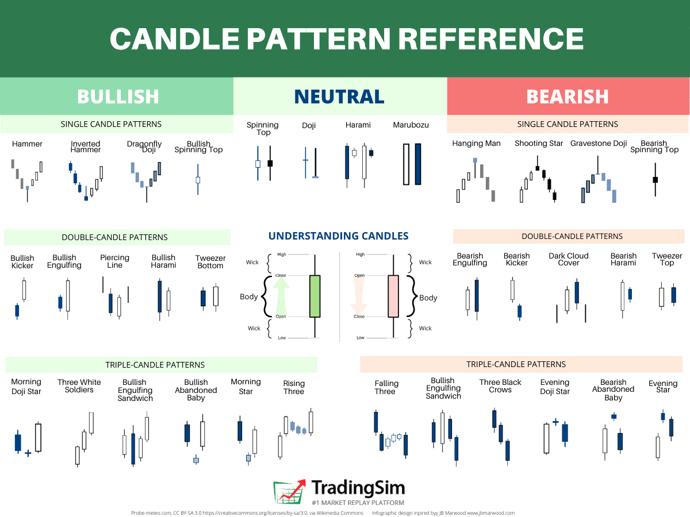

## Table of Contents

## What is the 'Previous Close' in stock market terminology?

The 'Previous Close' in stock market terminology refers to the last trading price of a stock at the end of the previous trading day. It is the price at which a stock finished trading when the market closed the day before. This figure is important because it serves as a benchmark to compare with the current day's trading activity.

Knowing the Previous Close helps investors and traders understand how the stock's price has changed from one day to the next. For example, if a stock's Previous Close was $50 and it opens at $52 the next day, it shows that the stock's value has increased. This information can be useful for making decisions about buying or selling stocks.

## How is the 'Previous Close' price determined?

The 'Previous Close' price is set when the stock market stops trading for the day. This happens at a specific time, like 4 PM for many major stock exchanges. When the market closes, the last price at which a stock was traded becomes the 'Previous Close' price. This means if someone bought or sold a stock right before the market closed, that price is what we call the 'Previous Close'.

This price is important because it gives everyone a starting point for the next day. When the market opens again, people can see if the stock's price has gone up or down compared to the 'Previous Close'. For example, if a stock's 'Previous Close' was $100 and it opens at $102 the next day, you know the stock's value increased overnight. This helps people decide whether to buy or sell the stock.

## Why is the 'Previous Close' important for investors and traders?

The 'Previous Close' is important for investors and traders because it helps them see how a stock's price changed from one day to the next. When the market opens, they can compare the current price to the 'Previous Close' to know if the stock went up or down. This information helps them decide if they should buy or sell the stock. For example, if a stock's 'Previous Close' was $50 and it opens at $52, they might think the stock is doing well and want to buy it.

Knowing the 'Previous Close' also helps investors and traders understand the stock's performance over time. They can look at the 'Previous Close' prices from many days to see trends. This can help them make smarter choices about when to buy or sell. For instance, if a stock's 'Previous Close' has been going up steadily for a few days, they might decide it's a good time to buy because the stock seems to be getting more valuable.

## What are candlestick patterns and how do they relate to 'Previous Close' prices?

Candlestick patterns are a way to show how a stock's price moved during a day using a special kind of chart. Each "candlestick" on the chart shows the opening price, the closing price, the highest price, and the lowest price of the stock for that day. The body of the candlestick is the part between the opening and closing prices. If the closing price is higher than the opening price, the body is usually colored white or green. If the closing price is lower than the opening price, the body is usually colored black or red. The thin lines above and below the body are called "wicks" or "shadows" and show the highest and lowest prices during the day.

The 'Previous Close' price is important for understanding candlestick patterns because it helps you see how the stock's price changed from the end of one day to the start of the next. When you look at a candlestick chart, you can compare the opening price of the new day to the 'Previous Close' price of the last day. This comparison can tell you if the stock's price went up or down overnight. For example, if the 'Previous Close' was $50 and the new day's opening price is $52, the candlestick for the new day will start at $52, showing that the stock's value increased since the market closed the day before. By looking at these patterns, investors and traders can make better guesses about what might happen to the stock's price next.

## Can you explain the basic types of candlestick patterns?

Candlestick patterns are shapes that show how a stock's price moved during a day. There are many types, but some basic ones are the bullish and bearish patterns. A bullish pattern means the stock's price is going up, and it often has a white or green body. A common bullish pattern is the "bullish engulfing," where a small black or red candlestick is followed by a larger white or green one that completely covers it. This shows that buyers took control and pushed the price up. Another bullish pattern is the "hammer," which has a small body and a long lower wick, showing that the price dropped but then came back up, suggesting buyers are strong.

On the other hand, a bearish pattern means the stock's price is going down, and it often has a black or red body. A common bearish pattern is the "bearish engulfing," where a small white or green candlestick is followed by a larger black or red one that completely covers it. This shows that sellers took control and pushed the price down. Another bearish pattern is the "shooting star," which has a small body and a long upper wick, showing that the price went up but then fell back down, suggesting sellers are strong.

These patterns help investors and traders guess what might happen next with the stock's price. By looking at the shapes and colors of the candlesticks, they can see if buyers or sellers are in control and make decisions about buying or selling the stock. For example, seeing a bullish engulfing pattern might make someone think it's a good time to buy, while a bearish engulfing pattern might make them think it's a good time to sell.

## How do candlestick patterns help in predicting future price movements?

Candlestick patterns help predict future price movements by showing how buyers and sellers are acting. Each candlestick on a chart tells a story about what happened to a stock's price during a day. By looking at these patterns, you can see if the buyers or sellers are in control. For example, if you see a pattern like a "bullish engulfing," where a small red candlestick is followed by a big green one, it means buyers suddenly became strong and pushed the price up. This might mean the price could keep going up in the next few days.

On the other hand, patterns like a "bearish engulfing," where a small green candlestick is followed by a big red one, show that sellers took over and pushed the price down. This could mean the price might keep falling. By understanding these patterns, investors and traders can make guesses about what might happen next. They can decide whether it's a good time to buy or sell based on these clues from the candlesticks. While no one can predict the future perfectly, candlestick patterns give a useful way to see trends and make smarter choices.

## What role does the 'Previous Close' play in analyzing candlestick patterns?

The 'Previous Close' is important when looking at candlestick patterns because it helps you see how the stock's price changed from one day to the next. When you start a new day, you can compare the opening price of that day to the 'Previous Close' price. This tells you if the stock went up or down overnight. For example, if the 'Previous Close' was $50 and the new day's opening price is $52, the candlestick for the new day will start at $52, showing that the stock's value increased since the market closed the day before. This change can affect the shape and color of the candlestick, which helps you understand what might happen next.

By knowing the 'Previous Close,' you can better understand the candlestick patterns and what they mean. For instance, if you see a bullish pattern like a "bullish engulfing," where a small red candlestick is followed by a big green one, and the opening price is higher than the 'Previous Close,' it shows that buyers are strong and the price might keep going up. On the other hand, if you see a bearish pattern like a "bearish engulfing," where a small green candlestick is followed by a big red one, and the opening price is lower than the 'Previous Close,' it shows that sellers are in control and the price might keep falling. The 'Previous Close' gives you a starting point to see how the stock's price moved and helps you make guesses about future price movements based on the candlestick patterns.

## How can traders use the 'Previous Close' and candlestick patterns to make trading decisions?

Traders can use the 'Previous Close' and candlestick patterns to make better trading decisions by looking at how a stock's price changed from one day to the next. When the market opens, traders compare the current opening price to the 'Previous Close' price. If the opening price is higher, it means the stock's value went up overnight. This information helps them understand if the stock is doing well or not. By seeing this change, traders can decide if it's a good time to buy or sell. For example, if a stock's 'Previous Close' was $50 and it opens at $52, a trader might think the stock is gaining value and decide to buy it.

Candlestick patterns also help traders by showing them how buyers and sellers are acting. Each candlestick tells a story about what happened to the stock's price during the day. If a trader sees a bullish pattern like a "bullish engulfing," where a small red candlestick is followed by a big green one, it means buyers are strong and the price might keep going up. This could be a signal to buy the stock. On the other hand, if they see a bearish pattern like a "bearish engulfing," where a small green candlestick is followed by a big red one, it means sellers are in control and the price might keep falling. This could be a signal to sell the stock. By combining the information from the 'Previous Close' and candlestick patterns, traders can make more informed decisions about when to buy or sell.

## What are some common strategies that incorporate 'Previous Close' and candlestick patterns?

One common strategy that uses the 'Previous Close' and candlestick patterns is called the "Gap and Go" strategy. Traders look at the 'Previous Close' price and compare it to the next day's opening price. If there is a big gap up from the 'Previous Close' to the opening price, and the first candlestick of the day is a strong bullish pattern like a "bullish engulfing," traders might decide to buy the stock right away. They think the stock will keep going up because the gap and the bullish pattern show that buyers are very strong. This strategy helps traders catch the start of a big move in the stock's price.

Another strategy is the "Reversal Strategy." Traders use the 'Previous Close' to see if the stock's price is going up or down. If they see a bearish pattern like a "bearish engulfing" after a few days of the stock going up, and the opening price is lower than the 'Previous Close,' they might think the stock is about to go down. So, they could sell the stock or even "short" it, which means they bet on the price going down. This strategy helps traders make money when they think the stock's price is going to change direction. By using the 'Previous Close' and looking at candlestick patterns, traders can make smart guesses about what might happen next and decide when to buy or sell.

## How does the accuracy of candlestick pattern predictions vary with different time frames?

The accuracy of candlestick pattern predictions can change depending on how long each candlestick represents. If you look at candlesticks that show price movements over a short time, like one day or one hour, the predictions might not be as accurate. This is because short-term price changes can be affected by many things, like news or small events, which can make the patterns less reliable. For example, a "bullish engulfing" pattern seen on a one-hour chart might not mean the price will keep going up if something unexpected happens later that day.

On the other hand, when you use candlesticks that show price movements over a longer time, like one week or one month, the predictions can be more accurate. This is because longer time frames can show bigger trends and are less affected by short-term events. For example, a "bearish engulfing" pattern on a weekly chart might be a stronger sign that the price will go down over the next few weeks. Traders often find that looking at longer time frames helps them make better guesses about what might happen next with the stock's price.

## What advanced techniques can be used to refine predictions based on 'Previous Close' and candlestick patterns?

One advanced technique to refine predictions using the 'Previous Close' and candlestick patterns is to combine them with other technical indicators, like moving averages or the Relative Strength Index (RSI). For example, if you see a bullish engulfing pattern and the stock's price is above its 50-day moving average, it might be a stronger sign that the price will keep going up. The moving average can show you if the stock is in a long-term uptrend, making the bullish pattern more reliable. Similarly, if the RSI is not overbought (meaning it's below 70), it suggests there's still room for the price to rise, adding more confidence to your prediction.

Another technique is to use multiple time frames to confirm your predictions. You can look at candlestick patterns on different charts, like daily, weekly, and monthly. If you see the same pattern on all these charts, like a bearish engulfing pattern, it's a stronger sign that the price might go down. This is called "multi-time frame analysis." By checking the patterns across different time frames, you can get a better idea of the overall trend and make more accurate predictions. For example, if a bearish engulfing pattern on a daily chart is confirmed by a similar pattern on a weekly chart, you might feel more confident about selling the stock or shorting it.

## How do market conditions and volatility affect the reliability of 'Previous Close' and candlestick pattern analysis?

Market conditions and volatility can make it harder to use the 'Previous Close' and candlestick patterns to predict what will happen next with a stock's price. When the market is very up and down, or volatile, the prices can change a lot in a short time. This can make the patterns less reliable because they might not show the real trend of the stock. For example, if there's a big news event, like a company announcing bad news, the stock's price might drop suddenly, making a bearish pattern appear even if the stock was doing well before. So, traders need to be careful and not rely too much on these patterns when the market is very volatile.

Also, the overall mood of the market, like whether it's going up or down, can affect how well the 'Previous Close' and candlestick patterns work. If everyone is feeling good and buying stocks, a bullish pattern might be a strong sign that the price will keep going up. But if the market is feeling bad and everyone is selling, even a bullish pattern might not mean much because the overall trend is down. Traders should always look at the bigger picture of the market and use other tools along with the 'Previous Close' and candlestick patterns to make better guesses about what might happen next.

## What does 'Previous Close' mean?

The 'previous close' is a fundamental concept in financial markets, representing the closing price of a security from the preceding trading session. This metric is primarily utilized as a benchmark to evaluate a security's performance over the next trading period. It serves as a starting point for calculating daily price changes, percentage variations, and other momentum indicators crucial for both retail and institutional traders.

For traders, the significance of the previous close lies in its ability to provide insight into market sentiment and potential price action. As an essential component of technical analysis, it helps traders to identify trends and make predictions about future market movements. For example, a security opening significantly higher than its previous close might indicate bullish market sentiment, whereas an opening price lower than the previous close might signal bearish tendencies. This can be mathematically represented as:

$$
\text{Price Change} = \text{Open Price} - \text{Previous Close}
$$

A positive price change could suggest buying interest, while a negative change might indicate selling pressure.

In strategic planning for the current trading session, traders often compare the previous close with pre-market data, including overnight news and foreign market performances. This approach allows them to form hypotheses about the subsequent price movements and volatility, which can be crucial for intraday trading strategies. Additionally, many traders use the previous close as a key reference point in technical indicators like moving averages and Bollinger Bands, further enhancing their analysis framework.

Utilizing the previous close in conjunction with these analytical tools allows traders to better understand market dynamics and execute strategies that are informed by historical price data. This consideration is particularly important in today’s algorithm-driven trading environments, where rapid decision-making based on comprehensive data analysis is essential for success.

## What is the Importance of Backtesting in Algo Trading?

Backtesting is an essential component of algorithmic trading, providing a mechanism through which traders can evaluate and enhance their trading strategies by simulating them on historical market data. This process forms the foundation for assessing the viability and potential profitability of strategies before deploying them in live market conditions.

The backtesting process involves running a trading algorithm using historical data to analyze how the strategy would have performed in the past. This helps traders identify both strengths and potential vulnerabilities in their approach, allowing them to address issues before risking real capital. For example, an algorithmic strategy that relies on candlestick patterns—like the Hammer or Bullish Engulfing—can be evaluated on historical data to determine how effectively these patterns predicted actual price movements.

A critical aspect of backtesting is its ability to measure risk and reward metrics. Key statistical measures such as the Sharpe Ratio, maximum drawdown, and profit [factor](/wiki/factor-investing) can be computed to offer insights into the risk-adjusted performance of the strategy. The Sharpe Ratio, for instance, is given by:

$$
\text{Sharpe Ratio} = \frac{E[R_p - R_f]}{\sigma_p}
$$

where $E[R_p - R_f]$ is the expected return of the portfolio minus the risk-free rate, and $\sigma_p$ is the standard deviation of the portfolio return. By analyzing such metrics, traders can make informed decisions on the risk management aspects of their strategies.

Backtesting also plays a crucial role in strategy optimization. Through iterative testing and refinement, traders can adjust parameters and conditions to improve strategy outcomes. For instance, a strategy incorporating previous close data might initially underperform due to the volatility inherent in specific market conditions. However, by tweaking variables and testing against a broad historical dataset, traders can optimize the algorithm for better results.

Moreover, integrating [machine learning](/wiki/machine-learning) techniques into backtesting can further enhance strategy development. Machine learning algorithms can process large datasets efficiently, identifying patterns and correlations that might not be apparent through traditional analysis techniques. This capability is particularly useful in refining strategies that involve complex indicators, such as candlestick patterns and previous close metrics.

Python, a preferred language for backtesting in the trading community due to its powerful libraries and ease of use, can be leveraged effectively. Libraries like `pandas` for data manipulation, `numpy` for numerical operations, and `Backtrader` or `Zipline` for strategy testing and analysis simplify the backtesting process. Here’s a simplified example of how a backtesting framework might be structured using Python:

```python
import backtrader as bt

class CandlestickStrategy(bt.Strategy):
    def __init__(self):
        self.dataclose = self.datas[0].close

    def next(self):
        if self.dataclose[0] > self.dataclose[-1]:
            self.buy()
        elif self.dataclose[0] < self.dataclose[-1]:
            self.sell()

data = bt.feeds.YahooFinanceData(dataname='AAPL', fromdate=datetime(2020, 1, 1), todate=datetime(2021, 1, 1))
cerebro = bt.Cerebro()
cerebro.adddata(data)
cerebro.addstrategy(CandlestickStrategy)
cerebro.run()
```

This code snippet demonstrates the instantiation of a simple backtesting setup employing a basic strategy based on closing price movements. Such frameworks can be scaled and customized to test more sophisticated strategies involving complex indicators and conditions.

In summary, backtesting is indispensable for algorithmic traders aiming to thoroughly validate their strategies, optimize performance, and mitigate risk. Through careful analysis and adjustment based on historical data, traders can improve their strategies, ensuring readiness for the dynamic conditions of live financial markets.

## References & Further Reading

[1]: Bergstra, J., Bardenet, R., Bengio, Y., & Kégl, B. (2011). ["Algorithms for Hyper-Parameter Optimization."](https://dl.acm.org/doi/10.5555/2986459.2986743) Advances in Neural Information Processing Systems 24.

[2]: ["Advances in Financial Machine Learning"](https://www.amazon.com/Advances-Financial-Machine-Learning-Marcos/dp/1119482089) by Marcos Lopez de Prado

[3]: ["Evidence-Based Technical Analysis: Applying the Scientific Method and Statistical Inference to Trading Signals"](https://www.amazon.com/Evidence-Based-Technical-Analysis-Scientific-Statistical/dp/0470008741) by David Aronson

[4]: ["Machine Learning for Algorithmic Trading"](https://github.com/stefan-jansen/machine-learning-for-trading) by Stefan Jansen

[5]: ["Quantitative Trading: How to Build Your Own Algorithmic Trading Business"](https://www.amazon.com/Quantitative-Trading-Build-Algorithmic-Business/dp/1119800064) by Ernest P. Chan