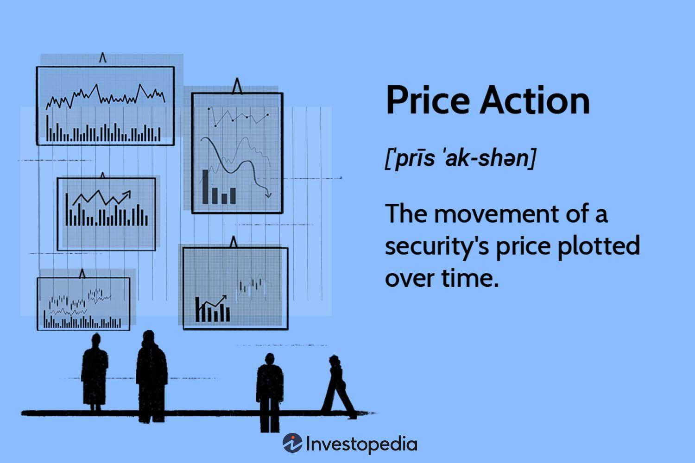

## Table of Contents

## What is price action in stock trading?

Price action in stock trading refers to the movement of a stock's price over time, shown on a chart. Traders look at these movements to make decisions about buying or selling stocks. They pay attention to patterns and trends in the price to predict where the price might go next. It's like trying to read the story of the stock just by looking at how its price has changed.

Using price action, traders can spot important levels where the price might change direction, like support and resistance levels. Support is where the price often stops falling and starts to rise again, while resistance is where the price often stops rising and starts to fall. By understanding these levels, traders can make better guesses about when to buy or sell. It's a simple yet powerful way to trade without needing lots of complicated tools or indicators.

## Why is price action important for traders?

Price action is important for traders because it shows them what the market is doing right now. By looking at the price movements on a chart, traders can see if a stock is going up, going down, or staying the same. This helps them decide when to buy or sell. For example, if a trader sees that a stock's price keeps bouncing back from a certain low point, they might decide to buy when the price gets close to that point again, hoping it will go up.

Understanding price action also helps traders spot patterns that can tell them what might happen next. These patterns, like support and resistance levels, can show where the price might change direction. If traders can predict these changes, they can make smarter trades. For instance, if a stock's price always struggles to go above a certain high point, a trader might decide to sell when the price gets close to that point, expecting it to fall back down. This way, price action helps traders make decisions based on what they see happening in the market.

## How can beginners start reading price action?

To start reading price action, beginners should first look at a simple price chart of a stock. This chart shows how the price has moved over time. They should focus on the highs and lows of the price. If the price keeps going up and then falling back to the same low point, that low point is called a support level. If the price keeps going up to the same high point and then falling, that high point is called a resistance level. By watching these levels, beginners can start to see where the price might change direction.

Next, beginners should practice spotting patterns in the price movements. For example, if the price makes a series of higher highs and higher lows, it might be in an uptrend, which means the price is generally going up. If it makes lower highs and lower lows, it might be in a downtrend, meaning the price is generally going down. By looking at these trends and patterns, beginners can start to predict where the price might go next. It's like learning a new language, but instead of words, you're learning to read the story the price is telling.

## What are the key elements of price action analysis?

The key elements of price action analysis include looking at the highs and lows of a stock's price. Traders watch these points to find support and resistance levels. Support is where the price often stops falling and starts to go up again. Resistance is where the price often stops rising and starts to fall. By finding these levels, traders can guess where the price might change direction next.

Another important element is spotting trends and patterns in the price movements. An uptrend happens when the price makes higher highs and higher lows, meaning the price is generally going up. A downtrend happens when the price makes lower highs and lower lows, meaning the price is generally going down. Traders look for these trends to decide when to buy or sell. They also watch for patterns like triangles or head and shoulders, which can give clues about future price movements.

Using these elements, traders can make better decisions without needing complicated tools. They just need to read the story the price is telling on the chart. By understanding support, resistance, trends, and patterns, traders can predict where the price might go next and trade more confidently.

## Can you explain common price action patterns?

Common price action patterns include the head and shoulders, double tops and bottoms, and triangles. The head and shoulders pattern looks like three peaks, with the middle one being the highest (the head) and the other two (the shoulders) being lower. This pattern usually means the price might start going down after it. Double tops and bottoms happen when the price reaches the same high or low twice before changing direction. A double top means the price might go down, and a double bottom means the price might go up. Triangles form when the price moves between two lines that get closer together over time. There are ascending triangles, descending triangles, and symmetrical triangles. These can show that the price might break out soon, either going up or down.

Another common pattern is the flag and pennant. A flag pattern looks like a small rectangle that comes after a big move in the price. It's like the price is taking a short break before moving more in the same direction. A pennant looks like a small triangle and also shows that the price might keep going the same way after a short pause. These patterns help traders guess where the price might go next. By watching for these shapes on the chart, traders can make better decisions about buying or selling stocks.

## How does price action differ from technical analysis?

Price action and technical analysis both help traders understand how a stock's price might move, but they do it in different ways. Price action focuses just on the price itself. Traders look at the highs and lows of the price on a chart to see patterns and trends. They try to predict where the price might go next by watching how it moves without using any other tools. It's like reading the story of the stock's price directly from the chart.

Technical analysis, on the other hand, uses more than just the price. It includes other things like moving averages, volume, and different indicators. These tools help traders see the bigger picture and make more detailed predictions about the price. While price action is simpler and focuses only on the price, technical analysis can be more complex because it uses many different pieces of information to help traders make decisions.

## What role does volume play in price action trading?

Volume plays an important role in price action trading because it shows how many people are buying or selling a stock. When the price moves up or down with a lot of volume, it means many traders agree with that move. This can make the price movement stronger and more likely to keep going in that direction. For example, if the price goes up and the volume is high, it's a good sign that more people want to buy the stock, which might push the price even higher.

On the other hand, if the price moves but the volume is low, it might mean that not many traders are interested in that move. This can make the price movement weaker and less likely to last. For example, if the price goes up but the volume is low, it might not go much higher because not many people are buying. By looking at volume along with price action, traders can get a better idea of how strong a price move is and make smarter decisions about buying or selling.

## How can traders use price action to set entry and exit points?

Traders can use price action to set entry points by looking for signs that the price might start going up or down. For example, if the price keeps bouncing off a certain low point, that's a support level. When the price gets close to that support level again, it might be a good time to buy, hoping it will go up. If the price keeps hitting a certain high point and then falling, that's a resistance level. When the price gets close to that resistance level, it might be a good time to sell, expecting it to go down.

To set exit points, traders watch for signs that the price might change direction. If they bought a stock and it reaches a new high, they might decide to sell to take their profit. If the price starts to fall back to a support level after going up, they might sell to avoid losing money. By watching the price action closely, traders can decide when to get out of a trade, either to lock in profits or to cut losses.

## What are some advanced price action strategies?

Advanced price action strategies involve looking at more detailed patterns and using them to make better guesses about where the price might go next. One strategy is called the "inside bar," which happens when a smaller price bar is completely inside the range of the previous bar. This can show that the market is taking a break and might be ready for a big move. Traders can use this pattern to enter a trade in the direction of the overall trend. For example, if the market is going up and they see an inside bar, they might buy when the price breaks out above the high of the inside bar, hoping the upward trend will continue.

Another advanced strategy is the "fakeout" or "false breakout," where the price looks like it's going to break through a support or resistance level but then quickly reverses. Traders can use this to their advantage by waiting for a fakeout and then entering a trade in the opposite direction. For example, if the price seems to break above a resistance level but then falls back down, a trader might sell, expecting the price to keep going down. By understanding these more complex patterns, traders can make more accurate predictions and improve their trading results.

## How can price action be integrated with other trading indicators?

Price action can be integrated with other trading indicators to make better trading decisions. One way to do this is by using moving averages, which show the average price of a stock over a certain time. Traders can look at the price action to see if the price is above or below the moving average. If the price is above the moving average and the price action shows an uptrend, it might be a good time to buy. If the price is below the moving average and the price action shows a downtrend, it might be a good time to sell. By combining price action with moving averages, traders get a clearer picture of the market's direction.

Another way to integrate price action with other indicators is by using the Relative Strength Index (RSI), which shows if a stock is overbought or oversold. When the RSI is high, it means the stock might be overbought and ready to fall. When the RSI is low, it means the stock might be oversold and ready to rise. Traders can use price action to confirm these signals. For example, if the RSI is high and the price action shows the price hitting a resistance level, it might be a good time to sell. If the RSI is low and the price action shows the price hitting a support level, it might be a good time to buy. By looking at both price action and the RSI, traders can make more confident trades.

## What are the common pitfalls to avoid in price action trading?

One common pitfall in price action trading is overcomplicating things. Sometimes traders try to find too many patterns or signals in the price movements. They might see things that aren't really there, which can lead to bad trades. It's important to keep it simple and focus on clear support and resistance levels, and strong trends. By sticking to the basics, traders can avoid making decisions based on false signals.

Another pitfall is not using enough patience. Price action trading often requires waiting for the right moment to enter or exit a trade. Some traders get impatient and jump into trades too early or exit too soon. This can result in missed opportunities or unnecessary losses. It's better to wait for the price to confirm a pattern or trend before making a move. By being patient, traders can increase their chances of making successful trades.

## How can one backtest and refine a price action trading strategy?

To backtest a price action trading strategy, you need to look at old price charts and see how your strategy would have worked in the past. You can do this by going through the charts day by day, or you can use a computer program that does it for you. When you backtest, you pretend to buy and sell based on your strategy's rules. You keep track of how much money you would have made or lost. This helps you see if your strategy is good or if it needs changes.

After [backtesting](/wiki/backtesting), you can refine your strategy by making small changes and testing them again. Maybe you find that your strategy works better if you wait a little longer before entering a trade, or if you use a different way to set your exit points. Each time you make a change, you backtest again to see if it helps. By doing this over and over, you can make your strategy better and more likely to work well in the future.

## What are the key tools and techniques for price action analysis?

Effective price action trading involves the adept use of various tools to analyze stock patterns and anticipate future price movements. Among these tools, candlestick charts hold a vital place due to their ability to depict the open, high, low, and close (OHLC) values of a stock within a given timeframe. The visual representation offered by candlesticks helps traders to identify patterns and trends, such as doji, hammer, and shooting star patterns, which signal potential reversals or continuations in the market.

Trend lines are another fundamental tool utilized in price action analysis. These lines connect a series of prices on a chart to highlight the general direction in which a stock is moving. An upward trend line drawn at the troughs of rising prices typically signifies a bullish market, whereas a downward trend line at the peaks of falling prices suggests a bearish market. Traders often rely on these lines to determine entry and [exit](/wiki/exit-strategy) points in their trades.

Volume analysis plays a crucial role in validating potential price moves. High trading [volume](/wiki/volume-trading-strategy) often implies strong investor interest and can confirm the strength of a price movement, whereas low volume might indicate a lack of conviction in the market. For instance, a [breakout](/wiki/breakout-trading) from a chart pattern accompanied by a surge in volume is considered more reliable than a breakout on low volume.

Fibonacci retracements and moving averages are widely used to identify support and resistance zones. Fibonacci retracement levels are horizontal lines that indicate potential reversal levels on a chart by using the Fibonacci sequence ratios (23.6%, 38.2%, 61.8%, etc.). These levels help traders anticipate potential areas where the price may reverse or stall. Here is a simple calculation of Fibonacci retracement levels in Python:

```python
def fibonacci_levels(high, low):
    diff = high - low
    levels = {
        "23.6%": high - diff * 0.236,
        "38.2%": high - diff * 0.382,
        "61.8%": high - diff * 0.618
    }
    return levels

# Example usage
high_price = 100
low_price = 50
levels = fibonacci_levels(high_price, low_price)
print(levels)
```

Moving averages, on the other hand, smooth out price data by creating a constantly updated average price. The simple moving average (SMA) is calculated by adding recent closing prices and dividing by the number of periods:

$$
\text{SMA} = \frac{\sum \text{Closing Prices}}{\text{Number of periods}}
$$

Traders use moving averages such as the 50-day and 200-day SMA to track long-term trends, providing dynamic support and resistance levels that adapt to the latest market conditions.

By effectively combining these tools, traders can enhance their ability to interpret market dynamics and make informed trading decisions based on price action.

## References & Further Reading

[1]: Bergstra, J., Bardenet, R., Bengio, Y., & Kégl, B. (2011). ["Algorithms for Hyper-Parameter Optimization."](https://papers.nips.cc/paper/4443-algorithms-for-hyper-parameter-optimization) Advances in Neural Information Processing Systems 24.

[2]: ["Advances in Financial Machine Learning"](https://www.amazon.com/Advances-Financial-Machine-Learning-Marcos/dp/1119482089) by Marcos Lopez de Prado

[3]: ["Evidence-Based Technical Analysis: Applying the Scientific Method and Statistical Inference to Trading Signals"](https://www.amazon.com/Evidence-Based-Technical-Analysis-Scientific-Statistical/dp/0470008741) by David Aronson

[4]: ["Machine Learning for Algorithmic Trading"](https://github.com/PacktPublishing/Machine-Learning-for-Algorithmic-Trading-Second-Edition) by Stefan Jansen

[5]: ["Quantitative Trading: How to Build Your Own Algorithmic Trading Business"](https://books.google.com/books/about/Quantitative_Trading.html?id=j70yEAAAQBAJ) by Ernest P. Chan