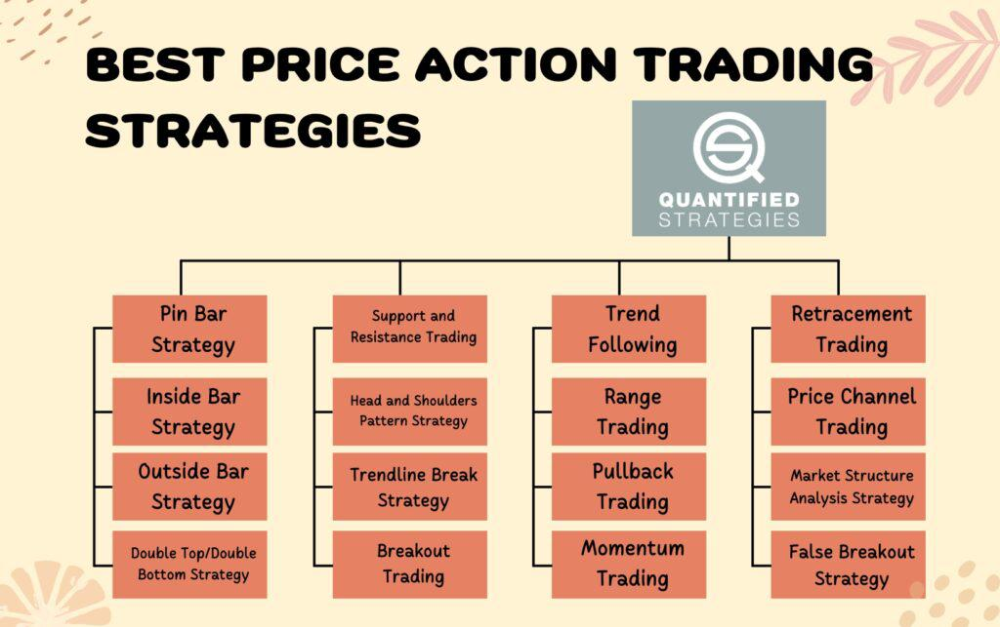

In the rapidly evolving world of financial markets, trading strategies are continuously being refined to optimize success. Among the myriad of approaches, price action and algorithmic trading have risen to prominence among traders seeking to enhance their trading performance. Price action trading involves analyzing historical price movement without relying heavily on technical indicators, allowing traders to identify potential opportunities based on patterns and trends. On the other hand, algorithmic trading leverages computer algorithms to execute trades automatically, based on pre-set criteria, bringing speed and precision to the trading process.

This article examines the intricate relationship between price action strategies and algorithmic trading. As traders endeavor to combine these methodologies, the potential for enhanced trading efficacy becomes apparent. Through the integration of the intuitive insights gained from price action and the efficiency offered by algorithmic systems, traders can better navigate market complexities. By understanding these strategies, traders are equipped with the necessary tools to address the challenges of a dynamic financial marketplace, enabling informed decision-making and the ability to capitalize on both short-term and long-term trends.

We will explore how the strengths of price action and algorithmic trading can be harmonized to improve trading outcomes, while also addressing the challenges and considerations inherent in their combination. Understanding the nuances of these strategies not only provides a competitive edge but also forms the foundation for continuous adaptation and optimization in the ever-shifting landscape of financial markets.

## Table of Contents

## Understanding Price Action in Financial Markets

Price action in financial markets refers to the analysis of a security's price movement over time. This method is centered on studying historical price data, eschewing the use of traditional technical indicators like moving averages or oscillators. Instead, traders focus on raw price movements to discern patterns and trends, providing a direct insight into market sentiment and potential future price movements.

Key elements of price action analysis include the identification of support and resistance levels. Support is often considered a price level where a downtrend can be expected to pause due to a concentration of demand, while resistance is a point where an uptrend typically ends due to a concentration of selling interest. Identifying these levels is crucial for traders, as they often represent areas where the price direction could change, providing entry or exit points for trades.

Another fundamental concept in price action includes candlestick patterns. Originating from Japanese rice trading in the 18th century, candlestick patterns present an informative snapshot of price movements over a specified time period. Common patterns such as the "Doji," "Hammer," and "Engulfing" provide insights into potential reversals or continuations in market trends. For instance, the "Hammer" can indicate a potential reversal from a bearish to a bullish trend, while an "Engulfing" pattern can signal the continuation of the current trend.

Chart patterns, such as the "Head and Shoulders," "Triangles," and "Ranges," further enhance a trader's ability to forecast price direction. These patterns help traders hypothesize about market sentiment and predict future movements based on historical precedents. For example, a "Head and Shoulders" pattern could suggest an imminent trend reversal.

Traders leveraging price action strategies aim to make more informed decisions regarding future price directions by interpreting these movements. The methodology hinges on understanding the psychology of market participants as reflected in price patterns, allowing traders to anticipate potential shifts in supply and demand dynamics.

By concentrating on these foundational elements, traders can develop a keen ability to interpret market data beyond the scope of conventional technical analysis tools, offering potential advantages in dynamic trading environments. However, while price action provides significant benefits through direct market insights, it also requires a refined understanding and experience to interpret patterns accurately, underscoring the importance of continual learning and adaptation in trading strategies.

## Exploring Algorithmic Trading

Algorithmic trading, commonly referred to as algo trading, employs computer algorithms to execute trades based on pre-defined criteria. This method is distinguished by its capability to process and analyze vast amounts of market data in real-time, enabling rapid decision-making and execution of trades. By minimizing human intervention, algo trading reduces the influence of emotional biases, which can often skew trading decisions.

One of the main advantages of [algorithmic trading](/wiki/algorithmic-trading) is the ability to backtest strategies using historical data. This process involves running the algorithms on past market data to evaluate their potential effectiveness before applying them in live trading. Backtesting provides traders with insights into the strengths and weaknesses of their strategies, allowing for refinement and optimization.

Algo trading encompasses a variety of strategies, each tailored to exploit different market inefficiencies. Trend-following strategies, for example, aim to capitalize on existing market trends by identifying and riding the [momentum](/wiki/momentum) until a reversal occurs. These strategies typically rely on technical indicators to ascertain entry and [exit](/wiki/exit-strategy) points, such as moving averages or the Relative Strength Index (RSI).

Arbitrage strategies, on the other hand, seek to profit from price discrepancies between related instruments. These might involve buying and selling the same asset on different exchanges or exploiting the price difference between derivative and underlying instruments. The speed at which algo trading operates makes it particularly effective for [arbitrage](/wiki/arbitrage), as these opportunities often exist for only a brief period.

Market-making strategies are another common form of algorithmic trading. These entail providing [liquidity](/wiki/liquidity-risk-premium) to a market by simultaneously placing buy and sell orders around the market price. Market makers profit from the spread between the bid and ask prices, and their consistent presence helps stabilize the market by reducing [volatility](/wiki/volatility-trading-strategies) and improving price continuity.

Traders utilizing algorithmic strategies employ various programming languages, with Python being a popular choice due to its extensive libraries for financial analysis, such as pandas, NumPy, and scikit-learn. The implementation of algorithms may involve complex models and sometimes [machine learning](/wiki/machine-learning) techniques to predict market movements.

The impact of algo trading on modern financial markets is significant. It contributes to increased trading volumes, enhanced market liquidity, and tighter spreads. However, it also raises concerns regarding market stability, as high-frequency trades can exacerbate volatility and contribute to events like flash crashes. Regulatory bodies continue to monitor and impose frameworks to ensure that algorithmic trading does not undermine market integrity.

Overall, algorithmic trading is a powerful tool in the financial industry, enabling traders to systematically engage with markets and leverage sophisticated strategies to optimize their trading outcomes.

## Combining Price Action and Algo Trading Strategies

Blending price action with algorithmic trading creates a unique synergy that can enhance market analysis and execution. This approach combines the intuitive and interpretative strengths of human traders with the precision and speed of algorithms. By leveraging the best of both worlds, traders can potentially increase the effectiveness of their trading strategies.

Integrating human intuition into algorithmic systems involves encoding traditional price action techniques, such as candlestick pattern recognition, into automated scripts. For instance, a trader might develop an algorithm that identifies bullish engulfing patterns, a popular price action signal, and then automatically triggers buy orders based on this recognition. Such automation reduces the time needed for manual analysis and execution, allowing traders to react swiftly to market conditions.

The synthesis of these methods offers a plethora of benefits. Primarily, the capacity to automate price action strategies supports the elimination of emotional bias, which often affects manual traders. Algorithms can systematically execute trades based on predetermined criteria, ensuring consistent application of strategies without succumbing to psychological pitfalls. Moreover, algorithms can process vast amounts of market data much faster than human traders, identifying trading opportunities that might be overlooked manually.

For a case study, consider a trading firm that incorporates an automated system for candlestick recognition within a larger algorithmic framework. This system could be programmed to operate on historical data to backtest the effectiveness of different price action patterns across various market conditions. By doing so, traders could refine their strategies, optimizing for improved performance and consistency.

However, the challenges of merging these methodologies should not be underestimated. One significant issue is ensuring accurate data interpretation. While price action is inherently subjective, translating it into algorithmic language necessitates precise definitions and criteria that may not capture the nuanced insights of experienced traders. Furthermore, strategy optimization requires continuous refinement and adaptation to shifting market dynamics, which can be resource-intensive.

Another challenge involves managing the computational complexity inherent in combining these approaches. High-frequency trading algorithms require robust infrastructure and hardware to function effectively, raising the barrier to entry for smaller traders. Additionally, potential technical malfunctions, such as erroneous data inputs or coding errors, pose risks that must be mitigated through rigorous testing and validation.

In conclusion, combining price action with algorithmic trading offers substantial potential for traders seeking a comprehensive approach to market engagement. While the benefits are compelling, successful implementation requires attention to the challenges of integration and strategy optimization, ensuring that both intuitive insights and computational power are harnessed effectively.

## Benefits and Challenges of Price Action and Algo Trading

Combining price action and algorithmic trading strategies presents a dynamic approach to addressing market changes efficiently. A key advantage of this integration is the ability to utilize data-driven decisions, which enable traders to react swiftly to fluctuating market conditions. Price action provides traders with valuable insights into psychological market behaviors, offering a qualitative aspect that highlights patterns such as support and resistance levels, and candlestick formations. These elements help traders gauge market sentiment and potential price reversals or continuations.

On the other hand, algorithmic trading contributes quantitative capabilities, offering precision and analytical power. Algorithms can process vast amounts of data rapidly, executing trades based on predefined criteria, which reduces the influence of human emotions in decision-making processes. This enhances efficiency and allows traders to implement complex strategies across multiple markets simultaneously.

Despite their benefits, these strategies also present challenges. Continuous monitoring and strategy refinement are necessary to adapt to evolving market landscapes. Market conditions can change due to economic reports, geopolitical events, or shifts in investor sentiment, which may render existing algorithms or price action setups ineffective. Therefore, traders must regularly update and backtest their strategies to ensure continued relevance and efficacy.

Additionally, the potential for technical malfunctions in algorithmic systems cannot be ignored. Algorithms are reliant on technology and infrastructure, and any disruptions, such as hardware failures, software bugs, or data feed issues, can result in significant trading losses. Traders must implement robust risk management protocols and ensure their systems have redundancies to mitigate these risks.

Overall, the combination of price action and algorithmic trading allows for a balanced approach, leveraging the intuitive understanding of market psychology with the computational strength of algorithms. While this strategy can significantly enhance a trader's edge, it requires careful implementation, ongoing analysis, and a proactive approach to strategy development and risk management.

## Essential Tools and Resources for Traders

Successful trading with price action and algorithmic strategies hinges on the effective use of specialized tools and resources. Charting software forms the foundation of many trading strategies, offering real-time data visualization that enables traders to identify trends and patterns crucial for price action analysis. Leading charting tools such as TradingView and MetaTrader provide customizable indicators and drawing tools that help traders pinpoint support and resistance levels, candlestick formations, and other price action signals.

Backtesting tools are indispensable for algorithmic traders, allowing them to simulate trades using historical data to validate the reliability of their strategies. Python libraries like Backtrader and QuantConnect's cloud-based platform offer comprehensive environments for coding, [backtesting](/wiki/backtesting), and implementing algorithms. These resources empower traders to refine their methods, ensuring strategies are robust and effective before deploying them in live markets.

Reliable data feeds are crucial for maintaining the accuracy and reliability of both price action and algorithmic strategies. Platforms such as Bloomberg Terminal and Yahoo Finance API deliver real-time market data that traders rely upon to make informed decisions. Accurate data is essential to calculate indicators, backtest algorithms, and monitor active trading positions.

Trading platforms supporting customizable algorithms and robust analytical capabilities enable traders to execute complex strategies efficiently. [Interactive Brokers](/wiki/interactive-brokers-api) and NinjaTrader facilitate algorithmic trading by providing API access for custom scripts alongside advanced charting and analysis tools. These platforms cater to traders seeking a seamless integration of algorithmic and discretionary strategies.

Educational resources and community engagement play a vital role in enhancing trading expertise. Websites like Investopedia offer extensive educational content, while forums like Elite Trader provide platforms for sharing insights and discussing strategies with peers. Mentoring programs and webinars hosted by seasoned traders can also accelerate learning, offering personalized guidance and real-world trading insights.

By effectively leveraging these tools and resources, traders can enhance their ability to execute well-informed strategies, optimize their decision-making processes, and ultimately improve their trading performance in the increasingly competitive financial markets.

## Conclusion

The integration of price action and algorithmic trading offers a significant advantage in the financial markets by combining intuitive analysis with data-driven precision. Understanding the unique features and limits of each approach enables traders to craft strategies that leverage both human insights and technological efficiencies. The financial markets are marked by dynamic changes, necessitating continuous adaptation and strategy optimization. This necessity for agility in response underscores the value of blending price action's real-time analysis of market sentiment with the robust execution capabilities of algorithmic systems.

As the trading landscape advances, traditional methods are increasingly complemented by technological innovations, providing traders with more sophisticated tools. This convergence is likely to define future trading by offering improved analytical capabilities, more efficient order executions, and adaptable strategies that cater to an ever-evolving market environment.

We hope this article has shed light on the interplay between price action and algorithmic trading, motivating further exploration into these powerful methods. The combination of traditional analysis and cutting-edge technology represents a promising frontier in trading strategies, potentially providing traders with a more comprehensive understanding of market dynamics and opportunities.

## References & Further Reading

[1]: Bergstra, J., Bardenet, R., Bengio, Y., & Kégl, B. (2011). ["Algorithms for Hyper-Parameter Optimization."](https://papers.nips.cc/paper/4443-algorithms-for-hyper-parameter-optimization) Advances in Neural Information Processing Systems 24.

[2]: ["Advances in Financial Machine Learning"](https://www.amazon.com/Advances-Financial-Machine-Learning-Marcos/dp/1119482089) by Marcos Lopez de Prado

[3]: ["Evidence-Based Technical Analysis: Applying the Scientific Method and Statistical Inference to Trading Signals"](https://www.amazon.com/Evidence-Based-Technical-Analysis-Scientific-Statistical/dp/0470008741) by David Aronson

[4]: ["Machine Learning for Algorithmic Trading"](https://github.com/PacktPublishing/Machine-Learning-for-Algorithmic-Trading-Second-Edition) by Stefan Jansen

[5]: ["Quantitative Trading: How to Build Your Own Algorithmic Trading Business"](https://www.amazon.com/Quantitative-Trading-Build-Algorithmic-Business/dp/1119800064) by Ernest P. Chan