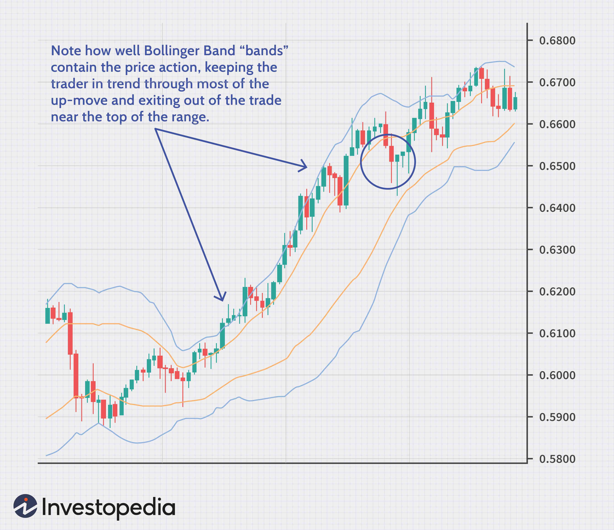

In financial markets, pricing strategies play a pivotal role for traders at all levels of expertise. Whether it is setting initial prices, making real-time adjustments, or executing complex trades, understanding these strategies is vital. Two key components that have gained prominence in enhancing pricing effectiveness are price bands and algorithmic trading.

Price bands, also known as price limits, are used to establish a range within which prices can fluctuate. This mechanism prevents extreme volatility by setting upper and lower bounds on prices, allowing market participants to engage in trading within a controlled environment. Price bands are particularly crucial during initial public offerings (IPOs) where they facilitate the discovery of an equitable market price, balancing demand and supply dynamics.



Algorithmic trading involves the use of computer algorithms to automate trading strategies. These algorithms can process vast amounts of data and execute trades with high speed and precision. They minimize human error and are designed to capitalize on market inefficiencies by implementing strategies such as arbitrage, trend following, and statistical analysis. This technological advancement provides traders with an edge in market analysis and execution.

Integrating price bands with algorithmic trading can further refine market strategies. Algorithms can be programmed to respond to price band thresholds, automating decision-making processes based on real-time market data. This combination enhances the ability to predict market movements and execute trades with improved accuracy.

Understanding these processes equips traders with the knowledge to navigate the complexities of financial markets. As these strategies evolve, they offer powerful tools for informed decision-making, enabling traders to optimize their market approach and achieve better outcomes. By leveraging both foundational pricing mechanisms and advanced algorithmic systems, traders can maintain a competitive edge in an ever-changing market landscape.

## Table of Contents

## Understanding Price Bands

Price bands are a crucial mechanism in financial markets, designed to establish a range of acceptable prices for a security. By setting an upper and lower limit, price bands create a structured environment where buyers can place bids within these bounds, facilitating orderly trading and price discovery. This mechanism is particularly significant in initial public offerings (IPOs), where it plays a pivotal role in determining the optimal price for new securities entering the market.

In the context of IPOs, price bands assist in the process known as book building. During book building, investors submit bids indicating the number of shares they wish to purchase and the price they are willing to pay within the given price band. This process helps underwriters gauge the demand for an issue and adjust the final offering price accordingly. By analyzing the bids collected, underwriters can set a final price that reflects the true market demand, thereby reducing the risk of underpricing or overpricing the stock. 

To understand how price bands are established, one must consider various factors such as market conditions, company valuation, and investor sentiment. Underwriters typically conduct thorough analyses to determine an appropriate price band that balances the interests of both the issuing company and potential investors. The width of the price band—defined as the difference between the upper and lower limits—can indicate the level of uncertainty or risk associated with the offering. A wider band may suggest higher [volatility](/wiki/volatility-trading-strategies) or less information available about the company, whereas a narrower band might reflect greater confidence in the valuation.

Consider the example of a technology company launching an IPO with a price band set between $40 and $50 per share. During the book-building process, the company receives bids totaling 1 million shares at $42, 2 million shares at $45, and 1.5 million shares at $48. The underwriters can use this information to determine that setting the final price at $45 might satisfy both the demand from investors and the funding needs of the company, ensuring a successful market debut.

Various case studies further illustrate the application of price bands in diverse market scenarios:

1. **Emerging Markets**: In economies where capital markets are still developing, price bands help stabilize transactions by mitigating extreme price fluctuations. They provide a buffer against speculative activities that might otherwise destabilize nascent markets.

2. **High-Volatility Environments**: In highly volatile markets, price bands can prevent excessive price movements caused by transient factors. For example, during times of economic uncertainty, price bands can serve as guardrails, ensuring that prices do not drop or spike precipitously due to panic selling or speculative buying.

3. **Regulatory Frameworks**: Some regulatory bodies impose mandatory price bands as part of their market oversight functions. This can be particularly relevant for stocks that are susceptible to manipulation or in markets that are prone to systemic risks.

By examining these examples, traders can gain a deeper appreciation of how price bands function across different scenarios. Understanding the nuances of how these bands are set and adjusted can provide traders with strategic insights, allowing them to make informed decisions and optimize their trading strategies within the constraints of the price band system.

## Algorithmic Trading: Revolutionizing Market Strategies

Algorithmic trading, often referred to as algo trading, utilizes computer algorithms to execute trading strategies with remarkable speed and accuracy. These algorithms process vast amounts of market data to make informed trading decisions within fractions of a second, significantly reducing human error and intervention.

In algo trading, the algorithms are designed to execute trades based on preconfigured parameters set by traders or financial engineers. These parameters may include specific price points, timing, or complex conditions involving a mix of market signals. By automating the trade execution process, algorithms help in minimizing manual errors and can react instantly to changing market conditions.

Among the myriad of strategies employed through [algorithmic trading](/wiki/algorithmic-trading), [arbitrage](/wiki/arbitrage) plays a critical role. Arbitrage strategies exploit price discrepancies in different markets or instruments. For example, if a stock is priced lower on one exchange compared to another, an algorithm can buy the stock on the cheaper exchange and sell it on the pricier one, capturing the price difference as profit. This strategy requires rapid execution speed and precision, characteristics ideally suited for algorithms.

Trend following is another prevalent approach in algorithmic trading. Under this strategy, algorithms identify and capitalize on sustained market trends. For example, if a stock's price is consistently rising, an algorithm might initiate a buy order, anticipating further upward movements. Trend-following strategies often utilize techniques such as moving averages to identify potential trends and confirm entry and [exit](/wiki/exit-strategy) points.

Statistical arbitrage, on the other hand, involves complex quantitative models that identify statistical mispricings between securities. This strategy requires a rigorous understanding of correlation, co-integration, and statistical relationships among multiple assets. Algorithms trained with historical data constantly analyze these relationships, making numerous trades that individually might yield small profits but can accumulate significantly over time.

Formulating, testing, and optimizing algorithms for trading requires a methodical approach. Initially, algorithms are developed based on historical data analysis and [backtesting](/wiki/backtesting). Backtesting involves simulating an algorithm's performance using historical data to evaluate its potential effectiveness. This is crucial to identify strengths and weaknesses before live deployment. Optimization involves refining the algorithm parameters, often through techniques like [machine learning](/wiki/machine-learning), to enhance its predictive accuracy and performance.

Algorithmic trading provides distinct advantages over traditional trading methods. The automation allows for high-frequency trading, enabling the execution of thousands of trades in seconds across multiple markets. This ensures traders can capitalize on fleeting opportunities, impossible for manual trading. Furthermore, algorithms can manage complex portfolios and execute multi-leg trades with precision that human traders cannot match.

However, it's important to note some challenges. Algorithms must be resilient to rapidly changing market conditions and adjusted to avoid overfitting—a scenario where the algorithm is too closely tailored to historical data and potentially ineffective in the real market environment.

In conclusion, algorithmic trading revolutionizes market strategies by enabling faster, more accurate trade executions. By incorporating sophisticated strategies like arbitrage, [trend following](/wiki/trend-following), and [statistical arbitrage](/wiki/statistical-arbitrage), it offers traders a superior edge in exploiting market inefficiencies effectively and efficiently.

## Integrating Price Bands in Algorithmic Strategies

Algorithmic trading, characterized by high-speed transactions and data-driven decision-making, can be effectively augmented by incorporating price band strategies. Price bands, which define upper and lower limits for asset prices, offer a framework for developing algorithms that respond dynamically to market conditions. By integrating these bands into algorithmic strategies, traders can automate responses to fluctuations, thereby optimizing trading outcomes.

Algorithms designed to utilize price band thresholds can adjust trading parameters in real-time, executing buy or sell orders when prices approach the set boundaries. For instance, a trader might configure an algorithm to automatically initiate a purchase when an asset's price approaches the lower bound of the price band, assuming potential for growth. Conversely, the algorithm can be set to sell when prices near the upper threshold, capturing gains before a market downturn.

This integration of price bands can significantly enhance predictive accuracy. For example, algorithms can incorporate moving averages or Bollinger Bands—a type of price band—to predict future market trends based on historical volatility. By using these bands, algorithms can identify [breakout](/wiki/breakout-trading) signals, where assets surpass typical range bounds, indicating a potential trend shift.

Consider the Python pseudocode for an algorithm utilizing price bands:

```python
import pandas as pd
import numpy as np

def price_band_strategy(prices, lower_band, upper_band):
    signals = np.zeros(len(prices))
    for i in range(1, len(prices)):
        if prices[i] <= lower_band[i]:
            signals[i] = 1  # signal to buy
        elif prices[i] >= upper_band[i]:
            signals[i] = -1  # signal to sell
    return signals

# Example usage
prices = pd.Series([...])  # Series of asset prices
lower_band = prices.rolling(window=20).mean() - 2 * prices.rolling(window=20).std()
upper_band = prices.rolling(window=20).mean() + 2 * prices.rolling(window=20).std()

signals = price_band_strategy(prices, lower_band, upper_band)
```

This pseudocode demonstrates how algorithms can be programmed to react to price bands, making it possible to automate trading decisions based on live data feeds. The signals array can be used to trigger order executions depending on the current market price relative to the calculated bands.

Furthermore, practical applications of price band-algorithm integration can be observed in high-frequency trading environments. For instance, during the initial public offering (IPO) process, algorithms can utilize price bands to manage bid-ask spreads effectively, ensuring optimal positioning within the set price range and minimizing slippage.

Industry examples highlight the effectiveness of combining price bands with algorithmic trading. Notably, hedge funds and trading firms have implemented these strategies to ensure they are capitalizing on precise entry and exit points within volatile markets. This integration not only enhances trade executions but also bolsters risk management by providing a structured approach to market signals.

In conclusion, integrating price bands into algorithmic trading strategies fosters a robust framework for automating and optimizing trades. By reacting to price band thresholds, traders can anticipate market shifts and refine their trading algorithms for superior performance. As technology evolves, further exploration and implementation of these integrated strategies will be crucial for maintaining a competitive edge in increasingly complex financial markets.

## Case Studies and Real-World Applications

In exploring the real-world applications of price band and algorithmic trading strategies, several case studies illustrate their practical implementation and effectiveness in diverse financial markets. These examples serve as critical learning points for traders seeking to understand and apply these strategies in dynamic trading environments.

One notable case involves the use of price bands in initial public offerings (IPOs), particularly seen in the Indian stock market. During the IPO of a major telecommunications company in 2020, price bands were crucial in facilitating price discovery amidst considerable investor interest. The company set a price band of INR 72-75 per share, balancing demand and helping to gauge market sentiment. This approach highlighted how effectively establishing price bands could enhance the IPO process by allowing accurate valuation and efficient allocation of shares. The outcome underscored the importance of flexibility in band setting, tailoring bounds to reflect prevailing market conditions and investor appetite.

Algorithmic trading has also been successfully applied in equity markets, demonstrated by high-frequency trading ([HFT](/wiki/high-frequency-trading-strategies)) firms. One such firm employed statistical arbitrage strategies, using complex algorithms to exploit pricing inefficiencies across thousands of stocks. By continuously analyzing large volumes of data, the firm was able to execute trades at breakneck speeds, gaining marginal profits that aggregated significantly over time. The adaptation to rapidly changing market conditions required ongoing optimization of algorithms to account for factors like market volatility and [liquidity](/wiki/liquidity-risk-premium), showing the critical need for constant algorithm refinement.

A more recent example involves the integration of price bands into algorithmic trading by a well-known trading desk specializing in currency markets. The desk developed algorithms designed to monitor currency exchanges for breaches of pre-set price bands. By automatically executing trades when certain thresholds were met, they enhanced trade execution efficiency and reduced the impact of price swings. This integration exemplified how leveraging such strategies could lead to improved market predictions and response times.

However, not all implementations have been successful, as seen in a case involving a mid-sized trading firm that over-relied on historical data for algorithm development. Their algorithm was overly optimized for past volatility patterns, leading to significant losses when an unexpected market event disrupted the anticipated price movements. This highlighted a critical lesson: while algorithms can be powerful, they must be flexible and robust enough to handle unforeseen market disruptions.

These case studies reveal both the benefits and challenges of employing price band and algorithmic trading strategies. Successful adaptation to real market conditions requires an iterative approach, where continuous monitoring and refinement of strategies are paramount. By learning from both successes and failures, traders can effectively tailor their strategies, enhancing their ability to respond to complex and evolving market dynamics.

## Challenges and Considerations

While price band strategies and algorithmic trading offer significant advantages in optimizing trading operations, they also come with a set of challenges and considerations that traders must navigate.

One of the primary challenges in algorithmic trading is the risk of overfitting algorithms to historical data. Overfitting occurs when a model is tailored too closely to a specific dataset, including noise and anomalies, rather than capturing the underlying market dynamics. This can result in models that perform well on past data but poorly in real-time trading scenarios. Traders need to utilize robust validation techniques and incorporate cross-validation methods to ensure that algorithms generalize well to unseen market conditions. Python, a popular language for algorithmic trading, offers various libraries such as Scikit-learn that support these validation techniques. For example, using cross-validation:

```python
from sklearn.model_selection import cross_val_score
from sklearn.ensemble import RandomForestClassifier

# assuming X_train, y_train are defined
model = RandomForestClassifier()
scores = cross_val_score(model, X_train, y_train, cv=5)
print("Cross-validation scores:", scores)
```

Market volatility presents another challenge. Algorithms must adapt to rapidly changing conditions to mitigate the risk of losses during periods of high volatility. A potential solution involves designing adaptive algorithms that adjust their strategies based on real-time volatility measures, such as the implied volatility index (VIX).

Regulatory considerations and ethical concerns are also essential aspects of algorithmic trading. Regulatory bodies across the globe, such as the U.S. Securities and Exchange Commission (SEC) and the European Securities and Markets Authority (ESMA), have established guidelines and rules to ensure fairness and transparency in financial markets. Traders must comply with these regulations, such as those pertaining to market manipulation and insider trading, to avoid legal repercussions. Furthermore, ethical concerns, including the potential for creating undue market volatility or exploiting small market participants, should guide the development of algorithms.

To ensure compliance and maintain ethical standards, traders should implement robust monitoring and auditing processes. This includes establishing clear documentation of algorithmic strategies and maintaining logs of trading decisions. Such practices not only facilitate regulatory compliance but also promote transparency and trust in automated trading systems.

Looking to the future, emerging technologies and trends are poised to further reshape algorithmic trading. Advances in machine learning and [artificial intelligence](/wiki/ai-artificial-intelligence) (AI) continue to offer new avenues for developing sophisticated trading models that can learn and adapt more effectively. Quantum computing, although in its early stages, holds the promise of performing complex calculations at unprecedented speeds, potentially revolutionizing problem-solving in trading and financial modeling. Traders who stay attuned to these technological innovations and incorporate them into their strategies may gain a competitive edge in the rapidly evolving market landscape.

## Conclusion

The integration of price band strategies and algorithmic trading constitutes a transformative progression in market strategies. These methodologies equip traders with a comprehensive toolkit designed to refine market analysis and bolster execution precision. Price bands provide a structured framework within which transactions occur, offering stability in volatile environments and facilitating effective price discovery, especially in procedures such as initial public offerings (IPOs).

Algorithmic trading, with its reliance on complex algorithms, ensures that trades are executed with unmatched speed and accuracy. By blending price band strategies with algorithmic prowess, traders can harness data-driven decisions based on predefined parameters, thus minimizing human error and enhancing operational efficiency. For instance, an algorithm might be programmed to execute trades automatically when prices penetrate established upper or lower bands, ensuring timely responses to market conditions.

A key insight from exploring these strategies is the imperative for continuous adaptation and innovation. As financial markets evolve, so too must the strategies employed by traders. It is vital to integrate historical market understanding with modern technological advancements. This dual approach not only optimizes current trading techniques but also prepares traders for future market scenarios.

Additionally, staying abreast of emerging trends and constantly updating algorithmic models is crucial for maintaining a competitive edge. The intersection of big data, machine learning, and financial markets is creating new paradigms of trading strategies. Thus, the future of trading will be characterized by traders who blend historical insights with cutting-edge technology, fostering an environment where informed decisions lead to substantial gains.

Ultimately, the strategic use of price bands alongside algorithmic solutions signals a new era in financial trading, one where innovative approaches and traditional concepts coexist to create robust market strategies.

## References & Further Reading

[1]: Bergstra, J., Bardenet, R., Bengio, Y., & Kégl, B. (2011). ["Algorithms for Hyper-Parameter Optimization."](https://dl.acm.org/doi/10.5555/2986459.2986743) Advances in Neural Information Processing Systems 24.

[2]: ["Advances in Financial Machine Learning"](https://www.amazon.com/Advances-Financial-Machine-Learning-Marcos/dp/1119482089) by Marcos Lopez de Prado

[3]: ["Evidence-Based Technical Analysis: Applying the Scientific Method and Statistical Inference to Trading Signals"](https://www.amazon.com/Evidence-Based-Technical-Analysis-Scientific-Statistical/dp/0470008741) by David Aronson

[4]: ["Machine Learning for Algorithmic Trading"](https://github.com/stefan-jansen/machine-learning-for-trading) by Stefan Jansen

[5]: ["Quantitative Trading: How to Build Your Own Algorithmic Trading Business"](https://www.amazon.com/Quantitative-Trading-Build-Algorithmic-Business/dp/1119800064) by Ernest P. Chan