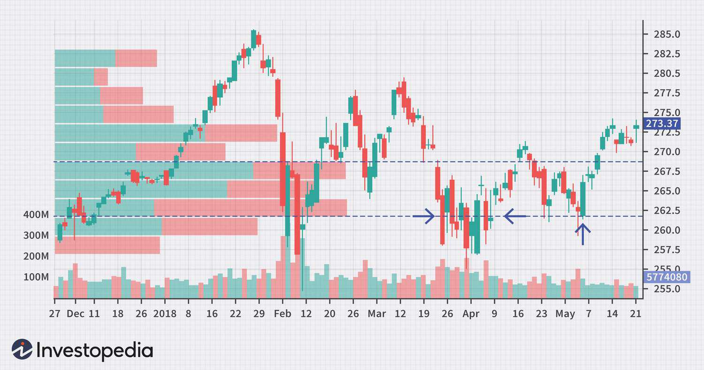

The world of stock market trading is vast and complex, featuring myriad tools and strategies that underpin informed decision-making processes. One such essential tool is the Price by Volume (PBV) chart, a staple in the domain of technical analysis. PBV charts provide a unique perspective by offering a graphical representation of the volume of shares traded at varying price levels, making them indispensable for traders seeking to understand market dynamics beyond traditional price-focused charts.

The concept of PBV charts revolves around illustrating the relationship between price levels and corresponding traded volumes. This visualization aids traders in identifying significant price levels where buying or selling interest might concentrate, thus serving as invaluable insights for making strategic trading decisions. By pinpointing key areas of support and resistance, PBV charts contribute to more informed trading strategies, helping traders optimize their entry and exit points.



Further enhancing their utility, PBV charts are increasingly integrated into algorithmic trading, or algo trading, strategies. These strategies leverage complex algorithms to automate trading based on pre-determined criteria, including volume data gleaned from PBV charts. The ability to incorporate trading volume into decision-making algorithms allows for improved risk management and the exploitation of high-probability trade setups.

This article will explore the construction and functionality of PBV charts, emphasizing their critical role in technical analysis and algorithmic trading. Our objective is to provide a comprehensive understanding of these charts, highlighting their importance and applications within the trading landscape. By developing a nuanced appreciation for PBV charts, traders can enhance their market analysis and gain a competitive edge in today's dynamic trading environment.

## Table of Contents

## What is a Price by Volume (PBV) Chart?

A Price by Volume (PBV) chart is a visualization tool used in technical analysis to display the volume of shares traded at various price levels. This chart typically appears as a horizontal histogram aligned with the security's price chart on the Y-axis. The PBV chart's horizontal bars represent trading volume, with longer bars indicating higher trading activity at particular price levels. 

The significance of PBV charts lies in their ability to highlight key support and resistance areas, which are essential in trading decisions. Support levels are price points where a security tends to stop falling due to a concentration of buying activities, while resistance levels are where selling activity halts further upward price movement. By analyzing these levels, traders can better guide their entry and exit strategies.

Furthermore, PBV charts provide insights into market participants' buying and selling interests at different price points. This information is crucial for understanding market sentiment and predicting potential price movements. For example, if a stock experiences high trading [volume](/wiki/volume-trading-strategy) at a specific price level, it might indicate strong institutional interest or a possible reversal point.

In practical trading scenarios, a proficient understanding of PBV charts can significantly impact trade timing and positioning. Recognizing the accumulation of volume at particular price levels aids traders in anticipating future price direction and in executing more informed and strategic trades.

## How PBV Charts are Constructed

Price by Volume (PBV) charts are constructed by plotting the total number of shares traded at various price levels within a specified timeframe. This visual representation helps traders identify significant trading activity, offering valuable insights into market dynamics.

The construction of PBV charts involves integrating trading volume with price data to highlight where substantial volume has occurred. This integration allows traders to easily spot price levels with high trading interest, which may serve as potential support or resistance points. The combination of price and volume data provides a comprehensive overview of the market participation at each price level.

A key feature of PBV charts is their ability to differentiate between buying and selling volumes. This is often achieved by color-coding the chart bars, such as using one color for buying volume and another for selling volume. This distinction provides a deeper understanding of market behavior by illustrating the balance between supply and demand at various price levels.

The vertical bars on a PBV chart represent the volume of trades executed at each price point. These bars emphasize areas of concentrated trading activity, highlighting zones of interest where traders might expect significant price action. Identifying these zones is crucial for developing trading strategies, as they often precede market movements such as breakouts or reversals.

For traders aiming to discern market patterns, PBV charts offer vital visual cues. By analyzing the distribution of volume along the price axis, traders can identify patterns that are likely to impact future market movements. This information is instrumental in assessing market sentiment and making informed trading decisions.

Overall, the construction of PBV charts harnesses the intersection of price and volume data to provide traders with a powerful tool for market analysis. By understanding the structure and implications of these charts, traders can better anticipate market behavior and enhance their trading strategies.

## Applications of PBV Charts in Stock Market Analysis

Price by Volume (PBV) charts offer valuable insights for technical traders looking to identify support and resistance zones within stock market analysis. These charts visually display the volume of shares traded at specific price levels, providing traders with essential information to make informed decisions. 

PBV charts aid in pinpointing entry and [exit](/wiki/exit-strategy) points by highlighting areas where substantial trading volume has occurred historically. For instance, a high volume at a particular price level often signifies strong interest from buyers or sellers, implying that price could face resistance or support at these levels. This understanding helps traders decide when to enter or exit a position, optimizing the timing of their trades.

Moreover, traders use PBV charts to gauge market sentiment by observing spikes in trading volume at specific price ranges. A volume spike may indicate a strong conviction by market participants about the asset's future price direction. For example, significant volume at a new high could suggest bullish sentiment, while increased volume at lows may indicate a potential reversal or strong support.

By carefully analyzing PBV charts, traders can also predict potential areas of price consolidation or [breakout](/wiki/breakout-trading). Consolidation zones, where prices trade within a narrow range with high volume, suggest that market participants are accumulating positions, ready for a potential breakout. Conversely, a breakout through a high-volume price level could signify a strong [momentum](/wiki/momentum) move, providing an opportunity for trend-following strategies.

PBV charts are most effective when used alongside other technical analysis tools, such as moving averages, Relative Strength Index (RSI), or Bollinger Bands, to enhance the accuracy of predictions. By correlating volume data with price movements and other indicators, traders can validate potential signals and increase the probability of successful trades.

In summary, the application of PBV charts in stock market analysis is a powerful method for understanding market dynamics and making informed trading decisions. Through their ability to provide clear visualizations of volume activities at key price levels, these charts are an indispensable tool for technical traders seeking to enhance their market analysis and trading strategies.

## Incorporating PBV Charts into Algorithmic Trading

Algorithmic trading, or algo trading, involves deploying computer programs to execute trades swiftly and in large volumes. One of the significant benefits of [algorithmic trading](/wiki/algorithmic-trading) is its ability to incorporate complex data sets, such as Price by Volume (PBV) charts, to enhance trading decisions. Integrating PBV charts into algo trading facilitates automated decision-making grounded in historical trading volume data.

This integration begins by programming algorithms to monitor PBV data, seeking price levels where significant historical trading activity has occurred. The ability to pinpoint these levels is crucial, as they often signify zones of support or resistance. When prices approach these levels, the algorithm can be programmed to automatically trigger buy or sell orders based on predefined strategies.

For example, consider a simplified Python algorithm that utilizes PBV data:

```python
def trigger_trade(current_price, pbv_data, threshold=10000):
    # pbv_data is a dictionary with price levels as keys and volume as values
    for price_level, volume in pbv_data.items():
        if volume >= threshold:
            if abs(current_price - price_level) < 0.05 * price_level:
                execute_trade(price_level)

def execute_trade(price):
    # Function to execute a trade (buy/sell)
    print(f"Trade executed at price level: {price}")
```

This code snippet demonstrates how an algorithm might be structured to execute trades when current prices approach significant historical volume levels, as determined by PBV data.

Incorporating PBV charts into algo trading is highly beneficial for risk management, allowing traders to engage in high-probability setups with greater confidence. By catering to historical volume trends, algos are better equipped to anticipate where price movements might encounter resistance or support, thus reducing the likelihood of unfavorable trades.

Empirical evidence and case studies reinforce the value of integrating PBV data into trading algorithms. These studies indicate that traders who harness PBV chart insights alongside algorithmic strategies often experience enhanced execution speed and improved profitability metrics. Information derived from PBV charts can serve as a robust foundation that, when coupled with automated execution, results in a notable competitive advantage in the fast-paced market environment.

## Benefits and Limitations of Using PBV Charts

The primary benefit of Price by Volume (PBV) charts is their capacity to visually convey market sentiment through volume distribution at different price levels. By illustrating where significant trading volumes have occurred, these charts enable traders to more accurately identify support and resistance areas. These zones are crucial for strategic trading, as they often indicate where the price is likely to pause or reverse. For instance, a substantial volume at a particular price level implies strong buying or selling interest, suggesting that the price might find support or resistance at that level.

Moreover, PBV charts provide clarity on market conditions by displaying the volume at each price point, helping traders assess whether a trend is supported by substantial activity. For example, if a price breakout is accompanied by high volume, it is more likely to be sustainable. This insight is invaluable for making critical trading decisions, such as determining entry and exit points.

However, a significant limitation of PBV charts is the potential for data to become stale over time if it is not continuously updated. Market dynamics can change rapidly, and historical volume data might not always reflect current conditions. Traders relying solely on outdated PBV data risk basing their decisions on irrelevant information.

To mitigate this limitation, it is essential for traders to combine PBV analysis with other technical indicators and market data to construct a more comprehensive view. Indicators such as moving averages, relative strength index (RSI), or Fibonacci retracement levels can complement PBV charts, offering additional perspectives on market trends and momentum. This integrated approach enhances the robustness of trading strategies, reducing the likelihood of errors associated with relying on a single source of data.

Understanding these strengths and drawbacks of PBV charts is vital for traders aiming to make balanced and informed strategic decisions. By leveraging the insights provided by PBV analysis while being cautious of its limitations, traders can better navigate the complexities of stock market trading, ultimately aiming to enhance their decision-making processes.

## Conclusion

Price by Volume (PBV) charts are valuable analytical tools that offer critical insights for both technical traders and those employing algorithmic trading strategies. Their primary benefit lies in the ability to visually represent the distribution of trading volume across various price levels, making them essential for identifying potential trade setups. This visualization helps traders see where significant buying and selling activities have occurred, thus highlighting key areas of support and resistance that could impact future price movements.

Understanding the construction and application of PBV charts allows traders to enrich their market analysis with sophisticated insights. By recognizing where trading activities are concentrated, traders can better anticipate market behavior and align their strategies accordingly. This capability is particularly important in making well-timed decisions regarding entry and exit points in volatile market conditions.

While PBV charts stand out for their unique advantages, their true potential is unlocked when used alongside other technical analysis tools. Pairing PBV data with indicators such as moving averages or relative strength index (RSI) can provide a more holistic view of market scenarios. This integrated approach not only reinforces the reliability of trading signals but also minimizes risk, ensuring a balanced strategy.

In today's fast-paced financial markets, adopting PBV charts can offer a competitive edge that enhances trading performance. As traders strive for more informed and strategic decisions, these charts serve as an essential resource. Ultimately, leveraging PBV charts can lead to more precise market predictions and, potentially, more profitable trades. By incorporating these tools into their analytical repertoire, traders are better positioned to navigate the complexities of modern trading environments.

## References & Further Reading

[1]: Arnuk, S., & Saluzzi, J. (2012). ["Broken Markets: How High Frequency Trading and Predatory Practices on Wall Street are Destroying Investor Confidence and Your Portfolio"](https://ptgmedia.pearsoncmg.com/images/9780132875240/samplepages/0132875241.pdf). FT Press.

[2]: Sebastien Bossu, & Philippe Henrotte (2014). ["An Introduction to Equity Derivatives: Theory and Practice"](https://onlinelibrary.wiley.com/doi/book/10.1002/9781118673522) (3rd ed.). Wiley.

[3]: Murphy, J. J. (1999). ["Technical Analysis of the Financial Markets: A Comprehensive Guide to Trading Methods and Applications"](https://archive.org/details/technicalanalysi0000murp). New York Institute of Finance.

[4]: Kaufman, P. J. (2013). ["Trading Systems and Methods"](https://www.amazon.com/Trading-Systems-Methods-Website-Wiley/dp/1118043561) (5th ed.). Wiley.

[5]: Kirkpatrick, C. D., & Dahlquist, J. R. (2011). ["Technical Analysis: The Complete Resource for Financial Market Technicians"](https://ptgmedia.pearsoncmg.com/images/9780134137049/samplepages/9780134137049.pdf) (2nd ed.). FT Press.