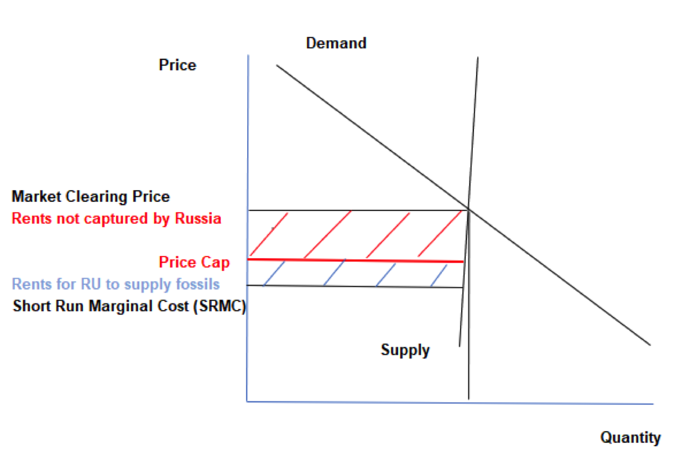

Price-cap regulation is a pivotal economic policy tool designed to control the pricing behavior of natural monopoly industries, primarily in sectors like utilities. Originally developed in the United Kingdom, this regulatory approach permits utility companies to adjust prices within specified limits over a regulatory period, primarily considering factors such as inflation and potential efficiency gains. This mechanism aims to protect consumers from excessive prices while allowing firms to maintain profitability and encourage operational efficiency. The application of price-cap regulation has systematically evolved to balance consumer interests and the economic viability of utility providers, making it a vital aspect of economic policy.

Simultaneously, the financial markets have experienced a transformation driven by algorithmic trading, a process that uses computer algorithms to automate the trading process. This method enhances trading efficiency and speed by executing large volumes of trades based on pre-determined criteria, such as timing, price, or volume. Algorithmic trading contributes significantly to modern financial markets by increasing liquidity and potentially reducing transaction costs, yet it also presents certain risks, including market disruptions and flash crashes.



The intersection of economic policies like price-cap regulation and algorithmic trading highlights critical considerations for regulators and market participants. Both regimes aim to enhance efficiency – price-cap regulation in economic terms within utility sectors and algorithmic trading in terms of market operations. However, they present unique challenges that may culminate in new regulatory paradigms. Algorithmic trading, with its complexity and speed, can be impacted by economic policy shifts, such as price-cap regulations, especially when these shifts influence sectors underlying financial assets.

A pressing necessity arises to maintain equilibrium between regulation and market efficiency, acknowledging that overly stringent regulations can stifle innovation and market fluidity. Conversely, lax regulations could lead to market exploitation and inefficiencies. This delicate balance requires continuously updating policy frameworks to align with technological advancements and industry practices, ensuring markets remain fair and transparent for all participants. This discussion sets the stage for exploring the nuanced integration of price-cap regulation with algorithmic trading strategies, their implications, and evolving regulatory landscapes.

## Table of Contents

## Understanding Price-Cap Regulation

Price-cap regulation is a form of economic regulation designed to control the prices that utility companies can charge consumers. It originated in the United Kingdom during the 1980s, primarily targeting the utility sector, which includes services like water, electricity, and telecommunications. The main objective of this regulatory framework is to protect consumers from excessively high prices while ensuring that utility providers still have the incentive to maintain and improve their services.

The mechanism of setting price caps involves the consideration of several economic factors, primarily efficiency improvements and inflation rates. The formula typically used is known as the RPI-X model, where RPI stands for the Retail Price Index, a measure of inflation, and X represents the expected efficiency savings that the utility is required to achieve. This can be mathematically expressed as:

$$
\text{Allowed Price Increase} = \text{RPI} - X
$$

In this formula, the cap thus increases with inflation as measured by RPI but is simultaneously reduced by the X [factor](/wiki/factor-investing) to encourage firms to find efficiency gains.

Price-cap regulation can be contrasted with other regulatory methods such as rate of return regulation and revenue cap regulation. Rate of return regulation allows utilities to set prices that ensure a predetermined rate of return on their investments, potentially leading to inefficiencies as companies may not seek cost reductions. Revenue cap regulation, on the other hand, focuses on limiting the total revenue that a utility can earn, compared to price caps which specifically target price levels.

The goals of price-cap regulation are dual: protecting consumer interests by capping prices amidst inflationary pressures, while providing utility providers the opportunity to earn profits through efficiency gains. This regulatory model incentivizes companies to reduce operating costs, as they can retain any profits arising from efficiency improvements beyond the X factor. By balancing the needs of consumers and service providers, price-cap regulation seeks to foster an environment where utility services remain affordable without compromising service quality or stifling the financial viability of providers.

## Implications of Price-Cap Regulation on Industry

Price-cap regulation serves as a compelling economic policy tool designed to ensure that utility companies operate efficiently while keeping costs in check for consumers. The mechanism fundamentally aims to set a price limit that utility providers can charge, while potentially allowing them to benefit from efficiencies and productivity gains. This regulatory framework introduces a structure that encourages utility companies to enhance operational efficiencies, thereby fostering a competitive environment that can drive down costs and improve services.

### Encouragement of Efficiency

By setting a cap on prices, utility companies are incentivized to reduce their operational costs to maximize profit margins. The formula generally used in price-cap regulation to determine the cap is:

$$
P_t = P_{t-1} (1 + RPI - X)
$$

where $P_t$ is the new price cap, $P_{t-1}$ is the previous price cap, RPI represents the retail price index (an indicator of inflation), and X signifies the expected efficiency savings. This formula encourages companies to innovate and find cost-effective solutions to improve service delivery, thus boosting efficiency.

### Limitations and Negative Impacts

While the regulatory intent is to promote efficiency, price-cap regulations can inadvertently lead to certain adverse effects. One significant limitation is the potential reduction in capital expenditures. The pressure to keep prices low might lead companies to cut back on investments in infrastructure and technology, which can subsequently have long-term ramifications on service quality and sustainability. 

Additionally, this form of regulation may occasionally lead to a deterioration of service quality, as companies might limit spending on maintenance and upgrades to stay within the financial constraints imposed by the price cap. A consistent decline in service quality could ultimately lead to consumer dissatisfaction and a possible decrease in market trust.

### Balancing Regulation and Competition

Regulators face the intricate task of encouraging a balanced market environment that curtails anti-competitive pricing practices without stifling the operational capacity and innovation of utility companies. They must carefully calibrate the X factor in the price-cap formula to ensure it promotes efficiency without being overly stringent. This balance prevents dominant players from using the regulations to engage in predatory pricing, therefore preserving fair market competition.

### Telecom Industry Examples

In the telecom industry, price-cap regulation has played a critical role in managing consumer prices and industry practices. For instance, during the regulation's implementation in the UK telecom sector, companies responded by enhancing operational efficiencies and investing in technology upgrades once the regulations aided in stabilizing consumer prices. This had the effect of promoting better service offerings at competitive prices.

In the United States, the transition from rate-of-return regulation to price-cap regulation in the telecommunications sector marked a significant shift. The breakup of AT&T in 1984 followed by the introduction of price caps allowed for more competition and innovation, leading to the growth of mobile and internet services. These examples underscore the effect of price-cap regulation in compelling telecom companies to innovate while controlling consumer prices.

Ultimately, while price-cap regulation has significantly contributed to improvements in efficiency among utility providers, the negative impacts, such as potential declines in quality of service, need vigilant oversight. Regulators must maintain a delicate balance to ensure that these regulations fulfill their consumer protection mandate without adversely affecting the industry's long-term sustainability and innovation potential.

## Overview of Algorithmic Trading

Algorithmic trading, also known as algo trading or automated trading, employs complex algorithms to execute trading strategies at high speed and frequency. These algorithms analyze a vast array of market data and execute orders based on predefined criteria, optimizing decision-making processes in financial markets. As financial markets became more sophisticated, the rapid processing capabilities of [algorithmic trading](/wiki/algorithmic-trading) have become vital in ensuring market [liquidity](/wiki/liquidity-risk-premium) and efficiency.

The significance of algorithmic trading in today's financial ecosystem is profound. It significantly enhances trading speed and efficiency, as algorithms can process a large [volume](/wiki/volume-trading-strategy) of data and execute trades much faster than human traders. This efficiency is crucial in volatile markets where speed is a competitive advantage, providing traders with the ability to capitalize on minute price fluctuations. For example, High-Frequency Trading ([HFT](/wiki/high-frequency-trading-strategies)), a subset of algorithmic trading, can execute thousands of orders in seconds, significantly impacting the liquidity and pricing dynamics in financial markets.

However, algorithmic trading is not without risks. The most prominent concern is market disruption, highlighted by incidents like the "Flash Crash" of May 6, 2010, where the Dow Jones Industrial Average plunged about 1,000 points within minutes. Such events underscore the risk of algorithms interacting in unpredictable ways, potentially creating feedback loops that amplify [volatility](/wiki/volatility-trading-strategies). Other risks include over-reliance on technology, which can lead to systemic risks if the algorithms fail or are exploited maliciously.

In response to these risks, regulatory bodies across the globe have introduced frameworks to monitor and control algorithmic trading activities. In the United States, the Securities and Exchange Commission (SEC) and the Commodity Futures Trading Commission (CFTC) have established rules that require algorithmic traders to register and adhere to specific standards of conduct. The European Union's Markets in Financial Instruments Directive II (MiFID II) mandates transparency and imposes stringent risk controls on algorithmic trading platforms. Likewise, the Financial Conduct Authority (FCA) in the UK requires firms to ensure that their trading algorithms are thoroughly tested and monitored.

These regulatory measures aim to enhance the resilience of financial markets, ensuring that algorithmic trading contributes positively to market efficiency while mitigating the potential for significant disruptions. As technology continues to evolve, regulatory frameworks must adapt to balance innovation with the need for market stability and fairness.

## Regulatory Challenges in Algorithmic Trading

Algorithmic trading, driven by sophisticated algorithms operating at high speeds, represents a significant challenge for regulatory bodies. The rapid evolution of technology and the dynamic nature of financial markets pose substantial hurdles for regulators striving to ensure stability and market integrity. Key regulatory challenges and measures arise in different geographical and jurisdictional contexts, including the UK, EU, and US.

### Regulatory Frameworks

In the UK, the Financial Conduct Authority (FCA) is responsible for regulating algorithmic trading. The FCA emphasizes maintaining market integrity through robust supervision and promotes transparency in trading activities. The EU's framework is shaped significantly by the Markets in Financial Instruments Directive II (MiFID II) and its Markets in Financial Instruments Regulation (MiFIR), which impose stringent requirements on algorithmic traders. Key provisions under MiFID II/MiFIR include the mandatory registration of algorithmic trading firms, testing of algorithms to minimize risks, and the deployment of kill switches to halt trading activities instantaneously if needed.

In the US, the Securities and Exchange Commission (SEC) and the Commodity Futures Trading Commission (CFTC) lead regulatory efforts. The Dodd-Frank Wall Street Reform and Consumer Protection Act of 2010 laid much of the groundwork for current regulations. These bodies emphasize market stability and transparency, requiring algorithmic trading firms to maintain risk management controls and detailed audit trails.

### Market Stabilization Mechanisms

Circuit breakers serve as crucial tools in stabilizing volatile markets caused by algorithmic trading activities. These are pre-defined thresholds set to temporarily halt trading when extreme price movements occur, preventing panic selling and allowing market participants to assess information and react accordingly. For instance, the New York Stock Exchange (NYSE) maintains three levels of circuit breakers, which trigger halts at varying percent drops in the S&P 500 index (e.g., 7%, 13%, and 20%).

### Liability and Enforcement Measures

Ensuring compliance with regulatory standards necessitates clear liability frameworks and robust enforcement mechanisms. In cases of algorithmic misconduct, regulators face challenges in holding the right entities accountable due to the automatic and complex nature of trading algorithms. Financial penalties and sanctions are typically enforced to deter violations, while regulators also stipulate comprehensive record-keeping and reporting requirements.

To reinforce compliance, advanced monitoring systems employing [machine learning](/wiki/machine-learning) and data analytics are increasingly utilized to detect unusual trading patterns indicative of manipulative practices. The integration of such technologies aids in proactive regulation and the prompt identification of potential threats to market integrity.

In summary, regulatory bodies across different jurisdictions confront numerous challenges in supervising algorithmic trading. The rapid pace of technological advancements, coupled with complex trading strategies, demands that regulators continuously adapt their frameworks and tools to safeguard market stability and ensure faithful adherence to regulations.

## Synergy Between Price-Cap Regulation and Algorithmic Trading

Price-cap regulations, traditionally employed to control prices in the utility sectors, can significantly influence algorithmic trading strategies. In markets where price caps are implemented, algorithms designed for trading must adapt dynamically to a landscape where maximum price thresholds limit price fluctuations. This adaptation not only requires precision in trading algorithms but also opens opportunities for enhancing efficiency through compliance optimization.

Algorithms can be programmed to recognize regulatory price caps as key constraints, considering these limits in real-time trading decisions. By incorporating regulatory price caps into their decision-making processes, algorithmic traders can minimize the risk of executing trades that violate regulatory standards, potentially avoiding penalties or legal actions. An important aspect of algorithms under price-cap regulations is their ability to optimize price compliance. This typically involves the development of models that predict price movements within the boundaries of set caps and adjust trading strategies to maximize profitability within these constraints.

Advancements in machine learning (ML) further facilitate regulatory efficiency by delivering predictive analytics that allow algorithms to anticipate market movements and adjust accordingly. Machine learning models can process vast amounts of historical and real-time data to identify patterns that might indicate an approaching price cap breach, allowing traders to adjust their strategies preemptively. These models can also aid in detecting market manipulations or anomalies that may arise from attempts to circumvent regulatory controls.

Python, with libraries such as scikit-learn and TensorFlow, provides tools for developing such ML models. For instance, a Python snippet using linear regression to predict price cap approach could look like this:

```python
from sklearn.linear_model import LinearRegression
import numpy as np

# Example data for simplicity
prices = np.array([[10], [20], [15], [25], [30]])
time = np.array([1, 2, 3, 4, 5])

model = LinearRegression()
model.fit(time.reshape(-1, 1), prices)

# Predict future price
future_time = np.array([[6]])
predicted_price = model.predict(future_time.reshape(-1, 1))
print(f"Predicted price for the next time unit: {predicted_price}")
```

Using such predictive models aligns trading activities with regulatory guidelines while actively seeking profitability within those constraints, thus merging compliance with market strategies.

These economic policies exert a substantial impact on market fairness and transparency. By setting explicit limits, price-cap regulations prevent excessive pricing tactics, promoting an equitable trading environment. The integration of algorithmic trading within this framework ensures that efficiency isn't compromised by compliance, leading to markets that are both competitive and fair.

In conclusion, the interaction between price-cap regulations and algorithmic trading presents challenges and opportunities. Algorithms equipped with advanced ML capabilities can optimize compliance, leading to greater market efficiency without sacrificing transparency or fairness. As technologies evolve, these synergistic relationships are expected to deepen, necessitating continued research and policy innovation to ensure economic policies align with technological advancements.

## Case Studies and Examples

### Case Studies and Examples

The intersection of price-cap regulation and algorithmic trading presents intriguing scenarios on how regulatory frameworks can potentially drive market behavior and efficiency. Below are significant case studies and examples that illustrate these interactions.

#### Integration of Price-Cap Regulations with Algorithmic Trading Strategies

The utility and telecom sectors provide exemplary cases where price-cap regulations have influenced algorithmic trading strategies. In these industries, price caps are often set with considerations for inflation and efficiency improvements. For algorithmic trading, integrating these price-cap structures involves developing models that can predict and adapt to changes in regulatory prices. This integration ensures that trading strategies remain optimal under tight regulatory guidelines.

A notable example is the energy market, where algorithmic models are employed to forecast electricity prices within capped limits, effectively creating strategies that mitigate risks associated with regulatory price changes. These algorithms use historical data, current demand, and market trends to model price behavior, ensuring trades are aligned with regulatory pricing structures.

#### Impact of the Breakup of AT&T

The divestiture of AT&T in 1984 serves as a landmark case of how significant regulatory changes, particularly the introduction of price-cap regulations, reshape industries. Post-breakup, the telecommunications industry underwent massive regulatory transformations, which included the implementation of price-cap regulations to promote competition and prevent monopolistic practices.

Price-cap regulation played a crucial role in this transition by limiting how telecommunications companies priced their services, thus encouraging efficiency and customer-focused innovation. Algorithmic trading strategies leveraged this regulatory framework by adapting trading models to account for new pricing dynamics and competitive behavior induced by the breakup. This adaptability helped telecommunications companies optimize their investments and market strategies under the newly regulated environment.

#### Regulatory Interventions in Controlling Volatility

Regulatory frameworks have played significant roles in addressing market volatility induced by algorithmic trading. An example is the introduction of circuit breakers and other emergency mechanisms that stabilize markets during extreme fluctuations. In the 2010 Flash Crash, algorithmic trading was partly responsible for rapidly amplifying market volatility. In response, regulatory bodies like the U.S. Securities and Exchange Commission (SEC) introduced measures to prevent such occurrences.

These interventions include implementing stricter risk management protocols for high-frequency traders and introducing market-wide circuit breakers that pause trading during excessive market swings. This regulatory approach aims to tame the speed and volume advantages of algorithmic traders, ensuring markets retain fairness and integrity.

In conclusion, these case studies highlight the dynamic interaction between regulatory frameworks and advanced trading technologies. As algorithmic trading continues to evolve, the integration with price-cap regulations will remain crucial to maintaining market stability and efficiency.

## Conclusion

In this article, we explored the intricate relationship between price-cap regulation and algorithmic trading, pivotal to enhancing the efficiency and fairness of modern financial markets. Price-cap regulation, with its origins in the utility sector, plays a crucial role in protecting consumers and ensuring profitability for providers. It aims to balance the interests of various stakeholders, promoting efficiency while maintaining service quality. Algorithmic trading, on the other hand, represents the forefront of technological innovation in financial markets, enabling faster and more efficient trading. However, it also poses significant risks, such as market volatility and disruptions.

The importance of balancing regulation with technological advancements in finance cannot be overstated. Effective regulation, such as price-cap frameworks, ensures that the benefits of technology are realized without compromising market stability and fairness. These regulations can mitigate risks associated with algorithmic trading by fostering an environment where technological innovations coexist with robust oversight mechanisms.

For sustainable and efficient market practices to emerge, future policy development must focus on integrating regulatory principles with the rapidly evolving technological landscape. Research should emphasize creating adaptive regulatory models that can respond to technological changes in real time. Additionally, further exploration into the synergy between machine learning techniques and regulatory compliance could lead to enhanced market transparency and efficiency. Developing a comprehensive understanding of the intersection between regulatory frameworks and technological advancements will be crucial for crafting policies that support both market integrity and innovation.

## References & Further Reading

[1]: Littlechild, S. C. (1983). ["Regulation of British Telecommunications' Profitability."] (Department of Industry, UK Government).

[2]: Ofgem. (2013). ["Price Controls Explained."](https://www.ofgem.gov.uk/sites/default/files/docs/2013/03/price_control_explained_march13_web.pdf)

[3]: Harris, L. (2003). ["Trading and Exchanges: Market Microstructure for Practitioners."](https://academic.oup.com/book/52292) Oxford University Press.

[4]: SEC & CFTC. (2010). ["Findings Regarding the Market Events of May 6, 2010,"](https://www.sec.gov/news/studies/2010/marketevents-report.pdf) Report of the Staffs of the CFTC and SEC to the Joint Advisory Committee on Emerging Regulatory Issues.

[5]: MiFID II. (2014). ["Markets in Financial Instruments Directive."](https://eur-lex.europa.eu/legal-content/EN/TXT/?uri=celex%3A32014L0065)

[6]: Litan, R. E., & Singer, H. (1997). ["The Private Sector: Regulations, Deregulations, and the Telecommunications Act of 1996."](https://books.google.com/books/about/The_Need_for_Speed.html?id=kmX0tR_pWG0C) Brookings Papers on Economic Activity.