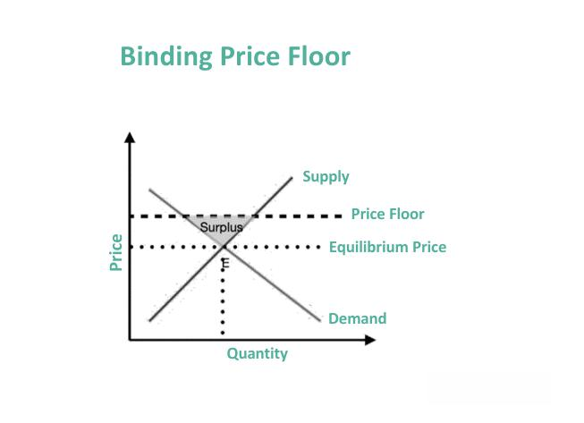

In today's rapidly evolving economic landscape, the interplay between price ceilings, market regulation, and the emerging prevalence of algorithmic trading presents a multifaceted dynamic. Price ceilings, as a form of government intervention, are intended to prevent prices of essential goods and services from reaching levels that are prohibitively expensive for average consumers. This regulation is crucial as it seeks to balance affordability with access, often being implemented during periods of economic distress to stabilize markets.

The influence of price ceilings on market dynamics cannot be understated, as they have significant implications for both short-term consumer welfare and the long-term efficiency of markets. While price ceilings can provide immediate relief by curtailing exorbitant price increases, they also have the potential to lead to unintended market distortions. These distortions may manifest in the form of shortages, a reduction in the quality of goods, and inefficiencies that ripple through the economic system.



Moreover, the advancement of algorithmic trading adds another layer of complexity to the discussion on market regulation. Algorithmic trading, characterized by the use of complex algorithms to facilitate rapid trading decisions, has revolutionized financial markets by enhancing efficiency and liquidity. Yet, its integration into markets governed by price ceilings necessitates a re-evaluation of existing regulatory frameworks. The symbiotic relationship between technology-driven trading and regulatory policies requires careful consideration to ensure markets remain both fair and efficient.

This article aims to provide a comprehensive exploration of these interrelated issues, illuminating how government interventions like price ceilings can steer market behaviors and set the stage for ongoing debates about the balance between regulation and technological innovation. The discourse on algorithmic trading's role in regulated environments will further enrich the understanding of how emerging technologies necessitate adaptive approaches to traditional economic frameworks. Through this exploration, readers will gain insight into the complex interdependencies at play and the need for nuanced strategies to address evolving market dynamics.

## Table of Contents

## What is a Price Ceiling?

A price ceiling is a regulatory mechanism enacted by governments to control the maximum price that can be charged for a product or service. The primary objective of such regulation is to ensure that essential goods remain accessible and affordable to the general population, particularly under circumstances where market forces might drive prices to excessively high levels. Price ceilings are typically set below the equilibrium price, which is the point where the quantity supplied equals the quantity demanded in a perfectly competitive market.

The imposition of a price ceiling is often motivated by the need to protect consumers from prices that might be deemed unfair or burdensome, especially for necessary items like food, housing, and healthcare. For instance, rent control is a classic example of a price ceiling, where limitations are placed on the amount landlords can charge tenants, aiming to make housing affordable for low and middle-income families.

There are different types of price ceilings based on their application and scope. A binding price ceiling, for example, is set below the market equilibrium price and results in a shortage of the product, as the quantity demanded exceeds the quantity supplied. This often leads to longer wait times, poor service quality, or black markets where the product is sold at higher prices. Conversely, a non-binding price ceiling is set above the equilibrium price, having little to no effect on the market as the ceiling doesn't constrain the naturally occurring market price.

One historical example of a price ceiling is the regulation of gasoline prices in the United States during the 1970s oil crisis, where price ceilings led to long queues at gas stations and eventual shortages. Such interventions illustrate the delicate balance needed when implementing price ceilings because while they aim to protect consumers, they can also lead to unintended market distortions, such as deadweight loss. Deadweight loss refers to the reduction in economic efficiency that occurs when market equilibrium is not achieved, typically because of external interventions like price ceilings.

In essence, while price ceilings aim to make essential goods more affordable and accessible, their implementation must be carefully managed and supplemented by other measures to mitigate potential negative outcomes, such as market shortages and quality reductions.

## Economic Impacts of Price Ceilings

Price ceilings, while beneficial for consumers in the short term by keeping costs low, can have several adverse economic consequences that manifest over time. These government-imposed price limits are primarily intended to make essential goods and services more affordable by capping the maximum price that can be charged. However, this intervention often disrupts the natural balance of supply and demand, leading to various market inefficiencies.

One of the most immediate impacts of price ceilings is the creation of shortages. When prices are artificially kept below the market equilibrium, the quantity demanded by consumers increases, while suppliers are discouraged from producing more due to reduced profitability. This imbalance results in a shortage, where the demand for a product far exceeds its supply, leaving many consumers unable to obtain the good or service at the capped price.

Another consequence of price ceilings is the potential degradation of product quality. With limited revenue potential due to capped prices, producers may resort to cutting corners to maintain profitability. This could involve using cheaper materials, reducing the features or amenities offered, or decreasing the level of customer service. As a result, consumers may face a decline in quality, which paradoxically contradicts the original intent of price ceilings to protect consumer interests.

Additionally, price ceilings can lead to market inefficiencies. Economists describe these inefficiencies using the concept of deadweight loss. Deadweight loss refers to the loss of economic welfare that occurs when the equilibrium in a market is disturbed. In the context of a price ceiling, the deadweight loss is the total of lost consumer and producer surplus that arises from the restricted supply of the good. Mathematically, deadweight loss can be represented as the reduction in the total net benefits to consumers and producers combined.

To visualize this, consider a simple demand and supply model where the price ceiling $P_c$ is set below the market equilibrium price $P_e$. The deadweight loss can be calculated as the area of the triangle formed between the supply and demand curves, delimited by the quantity supplied at $P_c$ and the equilibrium quantity. 

Here is a Python snippet to calculate and plot this deadweight loss in a simplified model:

```python
import numpy as np
import matplotlib.pyplot as plt

# Define demand and supply functions
def demand(price):
    return 100 - 10 * price

def supply(price):
    return 20 + 10 * price

# Equilibrium price and quantity
equilibrium_price = 4
equilibrium_quantity = demand(equilibrium_price)

# Price ceiling
price_ceiling = 3

# Quantity at price ceiling
quantity_supplied_ceiling = supply(price_ceiling)

# Define prices and quantities for plotting
prices = np.linspace(0, 10, 200)
quantities_demand = demand(prices)
quantities_supply = supply(prices)

plt.figure(figsize=(8, 6))
plt.plot(quantities_demand, prices, label='Demand')
plt.plot(quantities_supply, prices, label='Supply')
plt.axhline(price_ceiling, color='red', linestyle='--', label='Price Ceiling')
plt.fill_betweenx(prices, quantities_supply, quantities_demand, where=(prices < equilibrium_price), color='grey', alpha=0.5)

plt.plot([equilibrium_quantity, equilibrium_quantity], [0, equilibrium_price], 'k--')
plt.plot([quantity_supplied_ceiling, quantity_supplied_ceiling], [0, price_ceiling], 'k--')

plt.text(25, 5, 'Deadweight Loss', fontsize=12, ha='center', color='black')

plt.title('Price Ceiling and Deadweight Loss')
plt.xlabel('Quantity')
plt.ylabel('Price')
plt.legend()
plt.grid(True)
plt.show()
```

Through this illustration, we see how artificial constraints like price ceilings disrupt market equilibrium, leading to inefficiencies characterized by deadweight loss. These inefficiencies represent lost welfare in the market, where the full advantages of voluntary exchange and competition are not realized.

While price ceilings aim to protect consumers, they can inadvertently lead to unfavorable outcomes such as shortages, reduced incentives for quality production, and the introduction of black markets where goods are sold at higher prices. Thus, understanding these economic impacts helps highlight the complexities and unintended consequences of price ceilings in regulated markets.

## Market Regulation and Its Necessity

Market regulation plays a critical role in ensuring fair pricing and protecting consumers. It acts as a framework within which economic activities are conducted, aiming to correct market failures and ensure equitable access to essential goods and services. Both price ceilings and price floors are tools used by governments to regulate markets, each with distinct impacts on consumers and suppliers.

Price ceilings are designed to prevent prices from reaching levels that could make essential goods unaffordable. For example, rent control is a common price ceiling used to keep housing accessible for lower-income populations. However, while such regulations aim to increase affordability, they can lead to unintended consequences like shortages and reduced investment in housing maintenance or development, as landlords may find the controlled prices unprofitable compared to market rates.

Conversely, price floors are imposed to ensure that prices do not fall below a level where producers can sustain their operations. A classic example of a price floor is the minimum wage, which intends to guarantee that workers earn a living wage. However, if set too high, minimum wages can lead to increased unemployment as businesses may not afford to hire as many workers, preferring automation or cutting jobs to manage costs.

Balancing the impacts of price ceilings and floors involves considering both consumer affordability and supplier sustainability. An imbalance can lead to either consumer exploitation or supplier insolvency, causing long-term market inefficiencies. 

In healthcare, regulation ensures that life-saving drugs remain accessible despite the high costs associated with their research and development. Governments may impose price controls on essential medicines to prevent monopolistic pricing strategies by pharmaceutical companies. However, this needs to be carefully managed to avoid reducing incentives for innovation and the development of new treatments.

Ultimately, the necessity of market regulation lies in its ability to manage these competing interests, providing a structured approach to maintaining equilibrium within markets. Effective regulation not only protects consumers but also ensures that suppliers can operate sustainably, thus fostering a stable economic environment.

## The Rise of Algorithmic Trading

Algorithmic trading refers to the use of computer algorithms to automate trading strategies in financial markets. This approach allows traders to execute orders at speeds and frequencies impossible for human traders. By using predefined rules and mathematical models, [algorithmic trading](/wiki/algorithmic-trading) can swiftly process large volumes of data to optimize trading decisions. Its significance in modern financial markets is rooted in its ability to increase efficiency, reduce transaction costs, and provide [liquidity](/wiki/liquidity-risk-premium).

The influence of algorithmic trading on price ceilings and regulatory measures is profound. Price ceilings are intended to prevent prices from reaching levels considered unfair to consumers. However, the rapid execution and complex strategies of algorithmic trading can sometimes undermine these regulations. For instance, algorithms can be programmed to detect regulatory anomalies, such as a delayed price ceiling enforcement, and exploit these gaps for profit, potentially destabilizing the market.

Artificial intelligence (AI) and [machine learning](/wiki/machine-learning) further enhance the capabilities of algorithmic trading, particularly through high-frequency trading ([HFT](/wiki/high-frequency-trading-strategies)). HFT uses powerful algorithms to execute a large number of orders in fractions of a second, making microsecond advantages critical for success. AI can analyze vast datasets to identify patterns and predict market movements, allowing traders to make informed decisions with minimal human intervention.

While AI and machine learning can significantly improve market efficiency by providing better price discovery and tighter spreads, they also pose risks. The high speed and automation involved can lead to market disruptions if not properly managed. Flash crashes, events where asset prices plummet rapidly and recover just as quickly, often involve high-frequency trading strategies. These incidents highlight the potential for AI-driven algorithms to exacerbate [volatility](/wiki/volatility-trading-strategies) and challenge existing regulatory frameworks.

In summary, algorithmic trading, powered by AI and machine learning, has transformed financial markets by enhancing trading efficiency and liquidity. However, its capacity to influence regulatory measures like price ceilings necessitates ongoing evaluation of its role and impact on market stability.

## Interaction between Price Ceilings and Algorithmic Trading

Price ceilings, as regulatory instruments, can substantially affect market dynamics, particularly in the context of algorithmic trading. Algorithmic trading, defined by the use of complex algorithms and rapid execution of trades, is sensitive to market constraints like price ceilings, which often mandate adjustments in trading strategies. 

When a price ceiling is implemented, it effectively limits the maximum price at which a good or service can be sold, which can lead to a myriad of market responses. For algorithmic traders, this imposes a constraint that necessitates recalibration of their models. Algorithms designed to predict prices based on supply and demand dynamics must adapt to the imposed price cap, potentially requiring enhanced machine learning techniques to accommodate the altered market conditions.

Conversely, algorithmic trading can influence the maintenance of price ceilings. The speed and efficiency of these algorithms can be harnessed to monitor and maintain compliance with price ceilings. For instance, algorithms can swiftly identify and alert regulatory bodies of transactions attempting to circumvent the imposed price limits by executing trades at non-standard hours or through decentralized platforms.

However, the high-speed nature of algorithmic trading can also pose challenges to regulatory frameworks. The ability of algorithms to execute trades in milliseconds can make the enforcement of price ceilings more complex, as regulators may struggle to verify and control such rapid trading activities. This issue raises concerns about market fairness and the potential for algorithms to exploit loopholes within the regulatory system.

Case studies illustrate the intersection of automated trading and regulated markets. Consider the events of the "Flash Crash" on May 6, 2010, when major US stock indices plummeted in minutes due to algorithmic trading strategies reacting to cascading stop orders and other pricing triggers. Although not directly related to price ceilings, this event underscored how automated trading could disrupt market stability and complicate regulatory measures. Conversely, in markets where price ceilings were in place, algorithmic trading firms have reported needing to overhaul their trading models to comply, showcasing the adaptability yet potential limitations of high-frequency trading in regulated environments.

In conclusion, the interplay between price ceilings and algorithmic trading highlights both the utility and the complexity of employing such trading strategies within regulated markets. While technology can aid in enforcing regulatory measures, it also necessitates continuous evolution of these frameworks to address technological advancements in trading.

## Conclusion

Price ceilings, when implemented effectively, can enhance affordability and consumer access to essential goods, marking a notable advantage in situations where high market prices could lead to disenfranchisement. However, from an economic efficiency standpoint, these interventions often precipitate challenges such as shortages and a reduction in product quality. This scenario arises because price ceilings disrupt the natural equilibrium, leading to a misallocation of resources—often described as deadweight loss. Therefore, while price ceilings address immediate affordability, they may compromise the long-term efficiency and self-regulation mechanisms of markets.

Emerging technologies, particularly algorithmic trading, introduce a crucial need to reassess these traditional market constraints. With their ability to process high volumes of data and execute trades at an exceptional speed, algorithms offer insights into market trends that could both support and undermine regulatory frameworks like price ceilings. High-frequency trading, a subset of algorithmic trading, exemplifies how technological advancements can optimize market efficiency by swiftly rectifying imbalances. Yet, this same capability can also challenge regulatory measures by exploiting pricing discrepancies faster than they can be regulated.

As we look to the future, the intersection of government interventions and technology presents a complex landscape for optimizing market functioning. The balance lies in leveraging technological capabilities to enhance transparency and enforcement without stifling innovation. This could involve using technology to improve regulatory compliance and monitoring or devising flexible regulatory frameworks that can adapt to rapid technological changes. Policymakers must strike a harmonious balance whereby technological progress and regulatory integrity both thrive, thereby ensuring fairness and efficiency in modern markets.

## FAQs

### What exactly is a price ceiling, and when is it typically implemented?

A price ceiling is a regulatory measure imposed by the government to cap the maximum price charged for goods or services. It is typically implemented to ensure affordability of essential commodities, such as housing, utilities, and food, especially during crises or in markets where natural supply and demand dynamics could lead to excessively high prices. By limiting how high prices can go, price ceilings aim to protect consumers, particularly those from lower-income brackets, from price gouging and cost escalation.

### How do price ceilings compare to price floors in terms of economic impact?

Price ceilings and price floors are both mechanisms for market intervention, but they work in opposite directions. While a price ceiling is an upper limit, a price floor sets a minimum price for goods or services. 

- **Economic Impact of Price Ceilings**: They can make goods more affordable in the short term, but often lead to negative outcomes such as shortages, as suppliers find it less profitable to produce or sell at the capped price. This can result in a reduced supply of goods, deterioration in product quality, and the emergence of black markets where goods are traded illicitly at higher prices.

- **Economic Impact of Price Floors**: These ensure that producers receive a fair minimum price, often used in the labor market as a minimum wage or in agriculture to guarantee farmers' income. However, they can lead to surplus supply, as producers might be willing to supply more than what consumers are ready to purchase at the floor price, leading to excess goods.

The economic impacts of these interventions can be analyzed with the concept of deadweight loss, which represents the loss of economic efficiency when the equilibrium outcome is not achievable due to these constraints.

### What role does algorithmic trading play in regulated markets?

Algorithmic trading, which utilizes computer programs to execute trades at high speed and [volume](/wiki/volume-trading-strategy), plays a transformative role in modern financial markets. Its ability to quickly analyze market conditions and execute strategies has implications for regulated markets, especially where price ceilings exist.

- **Influence on Price Ceilings**: Algorithmic trading can adapt to and exploit regulatory environments like price ceilings by adjusting trading strategies to navigate restricted price movements. For instance, algorithms might be designed to take advantage of price inconsistencies near the ceiling limit.

- **Regulatory Challenge**: The speed and complexity of algorithmic trades pose challenges for market regulators in monitoring and enforcing compliance. This makes it imperative for regulatory frameworks to evolve, ensuring they can address potential market disruptions or manipulations caused by algorithmic trades.

Overall, while algorithmic trading can enhance market efficiency by providing liquidity and reducing transaction costs, its interaction with price controls necessitates vigilant regulatory oversight to maintain fair and orderly markets.

## References & Further Reading

[1]: ["Price Ceilings and Floors"](https://openstax.org/books/principles-economics-3e/pages/3-4-price-ceilings-and-price-floors) from Khan Academy.

[2]: Freeman, S. D. (1993). "Price Ceilings: The Theory, the Policy, and the Practice." Journal of Management and Marketing Research.

[3]: ["Algorithmic and High-Frequency Trading"](https://www.cambridge.org/us/universitypress/subjects/mathematics/mathematical-finance/algorithmic-and-high-frequency-trading) by Álvaro Cartea, Sebastian Jaimungal, and José Penalva.

[4]: Harris, L. (2003). "Trading and Exchanges: Market Microstructure for Practitioners." Oxford University Press.

[5]: Goolsbee, A., Levitt, S., & Syverson, C. (2019). "Price Ceilings and Price Floors." In "Microeconomics" (2nd Edition). Worth Publishers.

[6]: ["Algorithmic Trading: Winning Strategies and Their Rationale"](https://www.wiley.com/en-us/Algorithmic+Trading%3A+Winning+Strategies+and+Their+Rationale-p-9781118460146) by Ernie Chan.

[7]: ["The Little Book of Economics: How the Economy Works in the Real World"](https://www.amazon.com/Little-Book-Economics-Economy-Works/dp/1118391578) by Greg Ip.

[8]: Knight, Frank H. (1951). "The Economic Organization." Harper & Row.

[9]: Golub, A. (2020). "The Physics of Markets: A Complete Modeling and Forecasting Guide." Academic Press.

